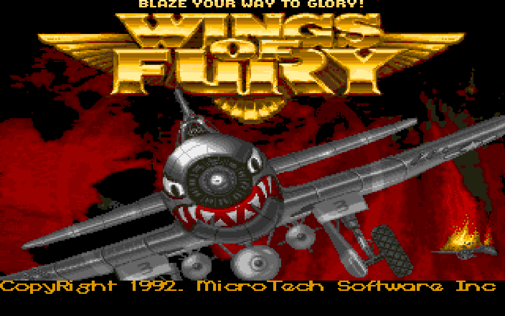

# Wings of Fury

*Broderbund's 1990 Amiga classic, brought back as a single HTML file: not emulated, not remade, but ported routine by routine from the original 68000 executable, and held to the original tick for tick.*



Open `dist/wof.html` and you are on the carrier's deck in 1944: the original's artwork, its sound effects and its music, in your browser, nothing to install. Under the hood there is no Amiga emulator. The game's own logic was taken out of the executable's machine code and rewritten in C, one routine at a time, and runs as WebAssembly; a small JavaScript shell gives it a screen, a sound chip and a keyboard.

What makes it faithful is the method, not just the care. The original executable itself ran headless under emulation beside the port, and the two were compared after every logic tick and every drawn frame, over more than sixty scripted missions on all fifteen maps, through whole campaigns, saved games and the demo: the same game state, byte for byte; the same drawing calls with the same palettes; the same sound sample started on the same channel at the same moment. The flight model runs on the Amiga's own floating-point arithmetic, bit for bit. The speed is the one measured on a real PAL Amiga. The enemy pilots, the ships' gunners, the soldiers running for the dug-outs do exactly what they did in 1990, down to a bug the game always had. What was changed on purpose fits in one short list: the keys a browser allows, menus that take a tap where the original wanted a held stick, and a remembered preference for the stick's sense.

The picture is as pixel-identical as a modern screen allows: the drawing routines are the original's, ported and held to a model of the Amiga's blitter, and what they draw is shown in the Amiga's own pixel aspect, every pixel crisp, at whatever size your window has. In a way it is better than the disk in an emulator: no emulator in between, no disk to boot, no settings to get right, just the game as it was, at the browser's full frame rate, with the sound and the music played by the original's own sound engine and music player, ported with the rest.

It is a retro preservation project, and a case study in how one can be done today: the tools, the notes, the disassembly and the tests that hold the port to the original are all in this repository, and a book about the way is on its way in `book/`.

## Play

Open `dist/wof.html` in Chrome, Firefox or Safari. It runs from the file itself and loads nothing from anywhere. The keys are on its help screen, which is up at the start and comes back with H; any key starts the sound and the game. Safari keeps the keyboard in its address bar for a page opened from a file, so there click into the page once first.

## Build and verify

### Prerequisites

- A POSIX shell with `git`: macOS, Linux, or Windows with WSL or Git Bash. The project was developed and is tested on macOS.
- Python 3.11 as `python3`. Everything else the build needs is pinned in `requirements.txt` and installed into `.venv` by the setup, the WebAssembly compiler (zig, as the `ziglang` package) among it; no system compiler is needed for the page.
- The Kickstart 1.3 ROM image, which you place yourself (next). It is not in the repository.
- For the tests only: Node, Google Chrome and Firefox, and macOS, because the native library the tests load is built with Apple clang as a `.dylib`. On another system the page builds and the suite does not.

### The Kickstart ROM

The image the project uses is Kickstart 1.3, revision 34.5, the A500 and A2000 image (exec 34.2 of 28 October 1987), 262,144 bytes, MD5 `82a21c1890cae844b3df741f2762d48d`, SHA-1 `891e9a547772fe0c6c19b610baf8bc4ea7fcb785`. Cloanto's Amiga Forever sells this image, a real Amiga 500 with Kickstart 1.3 gives it too, and a web search for the exact version named above finds further sources. It goes to `original/kick.rom`; the setup checks it, and so does `python tools/rom.py` at any later time. The build takes the system font topaz 8 and the keyboard's key conversion from it, and the test suite runs the original executable's own routines against it.

### Build

```
git clone https://github.com/sy2002/wof-wasm.git
cd wof-wasm
cp /path/to/your/kick.rom original/kick.rom
sh tools/setup.sh
source .venv/bin/activate
```

The setup makes `.venv` from `requirements.txt`, says what is missing, checks the ROM and builds `dist/wof.html`. Without the ROM it stops with a message that says what is needed and where to get it. That is the whole build. The last line activates the environment, which every command below assumes; later builds are then `python tools/build.py` (`--native` adds the test library, `--debug` keeps the core's debug information in the page).

### Verify

The tests run in two phases, the second after the first and never beside it:

```
python -m pytest tests/ --slow -m "not page" -n 8 --dist loadgroup
python -m pytest tests/ --slow -m page
```

The first phase, the emulator tests over eight cores, takes about an hour, and the second, the page tests in the two browsers, about twenty minutes. Without the ROM every test but a handful skips, with the same message as its reason. `re/notes/testing.md` has the details.

## Where things are

- `SPEC.md`: the specification, the porting rules and the milestones.
- `src/`: the C core. `web/`: the shell in JavaScript. `tools/`: the build, the disassembler, the headless original and the 68000 oracle. `tests/`: the suite.
- `re/`: the annotated disassembly (`re/Wings.lst`, `re/songplay.lst`), the names, the function inventory, and the notes on every subsystem (`re/notes/`).
- `ref/sheets/`: contact sheets of the game's artwork.
- `original/`: the disk image, the files extracted from it and the manual's text, plus the ROM you place.
- `dist/wof.html`: the built game.

## Licence

The code and the tools of this repository (`src/`, `web/`, `tools/`, `tests/`, the build) are free software under the GNU General Public License, version 3 or later (`LICENSE`). The prose, that is `SPEC.md`, the notes in `re/notes/` and the book in `book/`, is under Creative Commons Attribution-ShareAlike 4.0 International (`LICENSE-CC-BY-SA-4.0`).

The game data is covered by neither: everything under `original/` (the disk image, the files extracted from it, the manual's text), the disassembly listings `re/Wings.lst` and `re/songplay.lst`, which reproduce the executable's code, the contact sheets in `ref/sheets/`, and the game data embedded in `dist/wof.html`. Wings of Fury is the work of its authors and publisher (Broderbund, 1990); it is kept here for preservation, and no right to it is granted. The Kickstart ROM is not in the repository at all (above).
