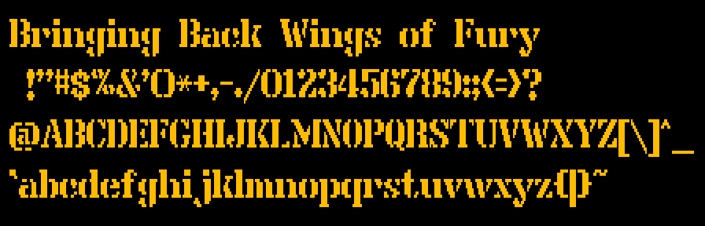

# Bringing Back Wings of Fury

A 1990 Amiga game ported to the browser, and how we know it is faithful
{ .subtitle }

/// caption
The title screen, drawn by the port from the game's own data, as a PAL display shows it.
///

A book about how a 1990 Amiga game was ported, routine by routine, to the browser, and how one knows the port is faithful; then what is inside the game and how it uses the Amiga; then the code, the tools and how to build it. The game itself is [one page further](play.md), playable.

## Preface

Wings of Fury is Broderbund's Amiga game of 1990, in which you fly a Hellcat off a carrier against islands, ships and enemy aircraft. This book is about bringing it back: making it playable again, today, on any computer with a browser, and playable as it was.

Retro preservation has two established ways of keeping an old computer's games playable. An [emulator](glossary.md#emulator) imitates the old computer in a program, and an [FPGA recreation](glossary.md#fpga-recreation) rebuilds it in programmable hardware; both keep the machine, and the game comes with it, unchanged. A [remake](glossary.md#remake) goes the other way: a new program written from watching the old one, so that what it does is what its makers saw the original do. The port takes a third way. We took the game's own logic out of its program, [routine](glossary.md#routine) by routine, rewrote it in C, read every picture, map, sound and table from the original disk, and held each part to the original by comparison. [Chapter 1](part-1/faithful.md) calls that a [faithful port](glossary.md#faithful-port) and pins down what the word promises. The result is one HTML file: a double click, and the game is there, with nothing to install and nothing fetched from anywhere.

Keeping one game instead of the machine has a gain of its own. The game's logic becomes source code that carries, beside each routine, the address of the original it was ported from; its workings are written down in notes; and the evidence that it behaves as the original does lies beside it, in a suite of tests. That is a kind of preservation that keeping the machine does not give, the game made readable, and it is why the port exists.

The book exists because the way the port was made is worth telling. It is a case study in how such a port can be made today: by a human owner who directed the work, and by [sessions](glossary.md#session) of an AI coding assistant that did the rest, arranged so that the instruments decide. The instruments are the tests and the two emulations that run the original beside the port, one routine at a time or the whole game ([chapters 5 to 8](part-1/oracle.md)): whether a part of the port is right is theirs to say, not anyone's reading of the [listing](glossary.md#listing), the original's instructions written out. How that was arranged, and how one knows that the result is faithful, is [Part I](part-1/faithful.md).

"We", in this book, is the project: its owner and those sessions. The project's owner set the goal, a faithful port in one file with the logic taken from the executable, and made the decisions that shaped it, from the keys to what was left out and whether to publish. The owner gave what no instrument could: the eye that judged the [fades](glossary.md#fade), the ear that heard every sound and every song, a real [PAL](glossary.md#pal) Amiga that confirmed which way the stick climbs, after a reading of the program had it wrong, and a film of its screen that measured how often the game draws a picture in a quiet scene. And the owner played the port and found things no test had found.

The rest was done by sessions of an AI coding assistant, Claude Code: the reading of the program, the port itself, the tools and the instruments, the tests, the notes, and this book. Chapter 10 tells how that worked as a whole. One session led, the [controller](glossary.md#controller), and the others took their tasks from it, each starting from the repository and writing back what it learnt, since nothing could live only in a conversation: that is ["Who we were"](part-1/making.md#who-we-were). ["An honest account"](part-1/making.md#an-honest-account) sets what the sessions did beside what only the owner could do, and ["The same method for this book"](part-1/making.md#the-same-method-for-this-book) shows each chapter here beginning as a sheet of sourced claims, checked by a session that had no part in the draft, with the owner's read as the last gate.

The sessions also got things wrong: in reading the program, in the instruments and in the tests. [Chapter 9](part-1/wrong.md) tells the mistakes that mattered and what caught them, for all but one an instrument, a reading of what the code really calls, or the owner's eyes, ears and keyboard. They are told because they are part of the method: a reading is a claim until the running original confirms it.

The book is not a diary of the work, not a guide to playing the game and not a history of the Amiga, which appears only as far as the port needed it; the appendices give the game's [keys](keys.md).

The port is a record that can be checked rather than trusted. The source, the notes with what was observed and what was only read, the tests, the sessions' handbook and the history of every change are in the repository, [`github.com/sy2002/wof-wasm`](repo:). Playing needs nothing: the page is complete. Whoever builds the port brings one thing, the Amiga's [Kickstart](glossary.md#kickstart) ROM, which is not ours to give: the build takes the system font and the key table from it, and the tests run the original's floating point on it. The comparison with the original needs a Mac as well; [chapter 25](part-3/build.md) shows the way.

## How to read this book

### Who it is for

The book is written for three readers. If you have played Amiga games and programmed a little, but have never read [68000](glossary.md#68000) assembly or opened this repository, it is written first for you, to be read for pleasure, a chapter at a sitting. If you want to do the same for another game, it gives you the method, the instruments and the code, linked into the source. If you maintain the repository, human or AI, the notes in [`re/notes/`](repo:re/notes/) are your reference, and the book points you to them.

### The ways through

The book has three parts: Part I, From the disk to a faithful game; Part II, The game inside; Part III, The code, the tools and the build. Chapter 2, the Amiga in twenty minutes, lets Part I stand on its own.

| If you want | Read | You get |
|---|---|---|
| the whole story | the 25 chapters in order | what a faithful port is, how this one was made and held, how the game works and how to build it |
| the method | Part I, chapters 1 to 10 | faithful defined, the instruments, the mistakes and what caught them, the way the work was arranged |
| to port another game | Parts I and III, chapters 1 to 10 and 21 to 25 | the method, the code, the tools and the build, with the links into the source |
| the game inside | chapter 2, then Part II, chapters 11 to 20 | how the game draws, flies, fights, sounds and keeps its campaign, and its quirks |
| to maintain the port | the notes in [`re/notes/`](repo:re/notes/) | the reference, to which the book points |

Part II reads best in order, its chapters building on one another; the glossary carries the terms a chapter takes from earlier ones. A chapter is meant for one sitting of about twenty minutes. It opens with what you will understand by its end, closes with what it hands to the next, and ends with further reading, in the repository and beyond.

### What a page holds

A term appears in bold where it is introduced, with its definition in one line, and the bold is a link to its entry in the [glossary](glossary.md). The entry says where you first meet the term and which chapter defines it, which file of the repository holds the detail, and, where a good page exists, where to read more elsewhere. A term used before its chapter is a plain link, often with a short gloss.

The book's one kind of sidebar, *For the developer*, carries the deeper detail and the place in the source. You can skip it: no chapter needs the source to be understood.

The code excerpts, the book's listings (not the original's listing, which the glossary names), are taken from the real sources when the book is built, never retyped, and the book's check holds them to the code. An excerpt's first line names its source: a file and its lines, the whole file, or a range of addresses. A ported routine is shown as the original's assembly beside the port's C. If you do not read assembly, skip them: no chapter needs them.

The figures are rendered from the game's own data by the port's library and the project's tools; the diagrams are drawn for the black ground every figure is shown on. Where numbers cluster, a box titled *The figures* holds the numbers.

Every file of the repository the book names is a link to it on GitHub, checked at every build. The appendices are the glossary, the [keys](keys.md), the [routine inventory](routines.md) and the [licence and the game data](licence.md). Two pages let you look into the game's data, the [shape browser](browser.md) and the [map viewer](maps.md); they need the site served, and say so when opened as files.

The titles of the pages and of their sections are set in the game's own font, made into a web font from the game's data:

/// caption
The game's own font, every character it has, drawn by the port from the game's data.
///

### The conventions

- [Hexadecimal](glossary.md#hexadecimal) numbers are in code font, as `0x010228`, and addresses are those of the port's [fixed load layout](glossary.md#fixed-load-layout), so that an address in the book is the address in the listing.
- Keys are named by their position where layouts put different letters on them, such as the key left of 1, because the port reads a key's position, as the Amiga did.
- The game's manual is cited by its page, as the repository's text of it, [`original/manual.txt`](repo:original/manual.txt), counts the pages.
- The machine is a PAL Amiga, the European standard, since the disk comes from a PAL country and the port was compared with a PAL machine.
- "We" is the project; "you" is you.
- A count that grows with the suite of tests is rounded in the prose and exact in the chapter's fact sheet under [`book/facts/`](repo:book/facts/), which names the [commit](glossary.md#commit-version-control) it counted at.
- A claim carries how it was found: an instrument, such as the [oracle](glossary.md#oracle) or the [headless original](glossary.md#headless-original), a test, a reading.
