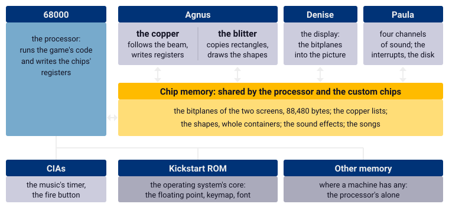
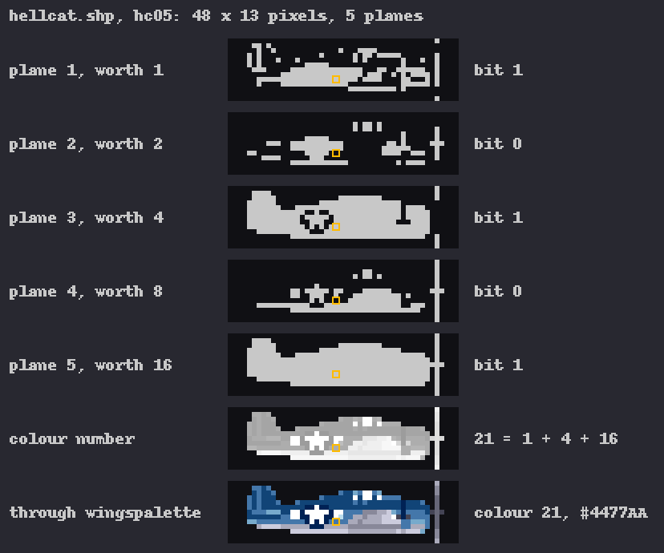
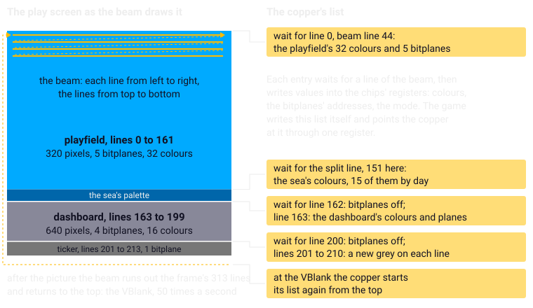
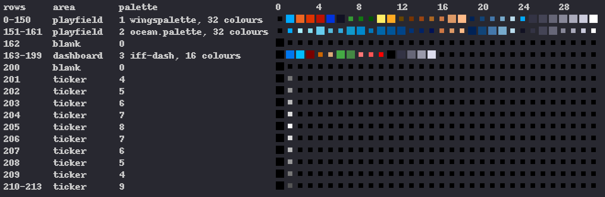
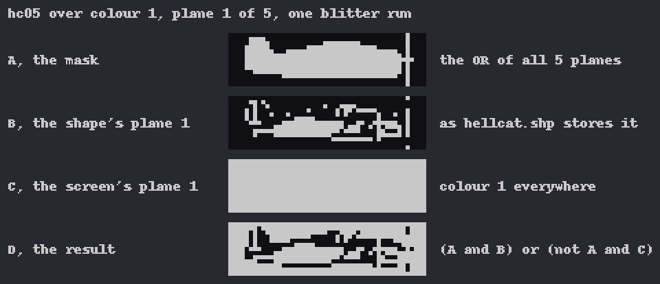
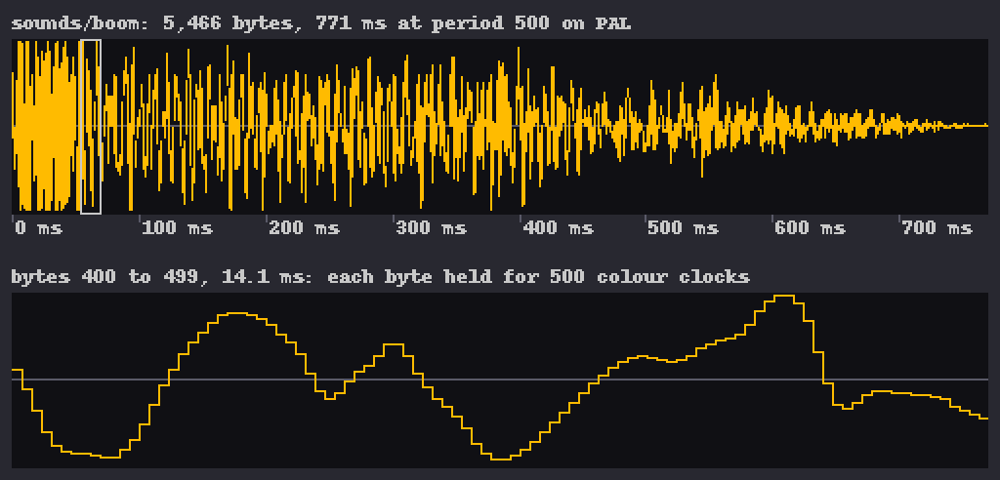
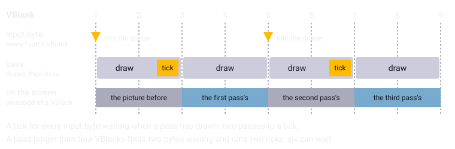

Chapter 2
{ .chapter-kicker }

# The Amiga in twenty minutes

Wings of Fury was written for one machine: its manual asks for an Amiga 500, 1000 or 2000 with at least 512 KB of memory and a joystick (page 2). This chapter is a short tour of that machine for a reader who has never programmed it. By its end you will know how the 68000's machine code looks on the page; what chip memory, bitplanes, the copper, the blitter and Paula are, and what this game does with each; why the VBlank is the game's beat; and which few services of the operating system it uses. Every topic goes only as far as the port needed it, and most sections close with what the port does instead; the deep dives come in Part II.

## The machine in one picture

An Amiga is a processor surrounded by chips of its own. The processor is the [**68000**](../glossary.md#68000), Motorola's chip that runs the program, one instruction after another. Around it sit the [**custom chips**](../glossary.md#custom-chips): the Amiga's own chips for the picture, the drawing and the sound, which, once told what to do, work without the processor. A processor of the 68000's speed could not draw the picture, play the sound and run the game at once; the chips take the picture and the sound off it. There are three. Agnus holds the copper and the blitter, Denise turns the picture's data into the signal for the screen, and Paula plays the sound and also serves the disk drive, the serial port and the interrupts. An [**interrupt**](../glossary.md#interrupt) is a signal from the hardware that makes the processor put aside what it is doing, run a short routine, and carry on where it was.

A program tells a custom chip what to do through its [**registers**](../glossary.md#register): small named stores inside a processor or a chip. A custom chip's registers sit at fixed addresses from `0xDFF000` on, a number in [**hexadecimal**](../glossary.md#hexadecimal), base 16, which this book marks with `0x`; a value written to one of them sets the chip to work. The game writes the registers directly: those of the copper, the blitter, the sound and the interrupts. It reads few: the sound's interrupt bits, a flag saying whether the blitter is busy, and the two the port must answer for, the joystick's directions and the position of the beam that draws the picture.



/// caption
The chips around chip memory, and what the game keeps where.
///

The [**CIAs**](../glossary.md#cia) are the Amiga's two interface chips, which serve its ports and carry timers; the game reads the fire button from one, and its music player takes a timer. The heart of the operating system, AmigaOS, is called [**Kickstart**](../glossary.md#kickstart): the Amiga 500 and 2000 carry it in their ROM, the memory that cannot be changed, and the 1000 loads it from a disk when it is switched on (the manual, page 2). Among much else it holds the fast floating point of chapter 1, the table that turns keys into characters, and the system's font.

## The 68000

The 68000 runs at about seven million cycles a second on a PAL Amiga. It computes in sixteen registers of its own, which a listing writes as the box shows. Memory is a long row of bytes, each with its address; an instruction moves a value between memory and a register, or computes with registers: it adds, multiplies, compares or jumps.

/// figures
| In the 68000 | Written in a listing |
|---|---|
| Eight data registers, 32 bits each | `d0` to `d7` |
| Eight address registers, 32 bits each | `a0` to `a7` |
| The stack pointer, where routines keep arguments and return addresses | `a7` |
| A byte, a word, a long: 8, 16, 32 bits | `.b`, `.w`, `.l` after the name |
///

The instructions are themselves numbers in memory. That is [**machine code**](../glossary.md#machine-code): the program as the processor reads it, bytes that encode one instruction after another. Written out for people, each instruction becomes a line of [**assembly language**](../glossary.md#assembly-language): a short name for the operation followed by its operands, such as `move.w` or `rts`.

The [listing](../glossary.md#listing), written out by the disassembler, the tool that turns the bytes back into assembly language (chapter 4 tells how), shows the two side by side. Here is a whole routine of the game, `rand_beam`, the only source of chance chapter 1 told of:

```wingslst
--8<-- "generated/listings/asm/rand_beam.lst"
```

Each instruction's line gives its address, its bytes of machine code, the instruction, and after a semicolon the name of a variable it touches; a `$` marks hexadecimal, as in Motorola's assemblers. Read from the top, the routine loads the word `rand_seed_const` into D0; multiplies it by `0x1AFB`, which gives a 32-bit product; adds `0x1FCCD`; reads the word at address `0xDFF006` into D1; combines the two with an exclusive or; stores the result in `rand_state`; and returns, the result left in D0 for the caller.

The fourth instruction is the one the port cares about. Address `0xDFF006` is not memory but a register of the custom chips, `VHPOSR`, which holds the beam's position: the line it is drawing, in its low eight bits, and its place on that line. The "seed" of the first instruction is a constant that changes only when a demo is recorded or played back, so the multiply and the add always give the same number, and nothing the game runs reads `rand_state` back. An unused ordinary generator beside it, with the same two constants, feeds each result back in; `rand_beam` reads the constant where that one reads its last result. The beam alone is the chance, which is why chance in this game is a matter of timing. The port answers that one read from its reproducible stream.

The operand `-$46ec(a4)` is a variable found at an offset from the address in A4, which chapter 3 explains. `rand_beam` was written by hand in assembly language. The 223 routines compiled from C, the game's own and those of its C library, look different in the listing, as chapter 4 shows.

## Chip memory

[**Chip memory**](../glossary.md#chip-memory) is the memory the custom chips can reach: they read and write it by themselves, without the processor. Memory a machine has beyond it, if any, only the processor reaches. So whatever a custom chip has to see must be in chip memory, and a program asks the operating system for it by a flag. Among what the game keeps there are its two screens' pictures, the lists for the copper and a scratch buffer for the blitter, all explained below; every [shape container](../glossary.md#shape-container), a file holding many shapes, loaded whole; the eight sound effects; and the music's songs, voices and sound samples. What only the processor reads, such as the table of pointers through which the game finds a shape by its number, goes into ordinary memory.

In the port all of it lives in one arena, a block of memory reserved once, from which the core hands out what the original asked for: it has no operating system or C library to ask. A browser has no chip memory and needs none: the port draws and mixes the sound in its own code.

## Bitplanes

The Amiga does not store a picture as one number per pixel. It stores it as [**bitplanes**](../glossary.md#bitplane): one bit of every pixel's colour number, kept as a picture of its own. A program chooses a screen's number of planes, each costing memory and the chips' time to read it. A picture of 32 colours has five: plane 1 holds the lowest bit of every pixel's colour number, worth 1, plane 2 the next, worth 2, and so on to plane 5, worth 16. To show a pixel, the display takes its bit from each plane and puts the five together into a number from 0 to 31, and that number goes through the [palette](../glossary.md#palette), 32 colour registers each set to one of 4,096 colours.

One of the game's own shapes shows how it works. The Hellcat, the player's aircraft, in level flight is 48 by 13 pixels, stored in five planes. The marked pixel has its bit set in planes 1, 3 and 5, so its colour number is 1 + 4 + 16, which is 21, a mid blue in the day mission's palette. Every colour of the aircraft has the top bit set, so plane 5 is its whole silhouette, as the figure shows.



/// caption
One shape of the game taken apart into its five bitplanes and put together again: each plane's bits, the colour numbers they make, and the colours.
///

The play screen stacks three areas that differ in fineness and colours, each with the planes its colours need; the dashboard's four are the most high resolution allows. A blank line between each makes 214 lines; the port's picture, 640 wide, doubles each low-resolution pixel.

| Area | Lines | Resolution and width | Planes and colours |
|---|---|---|---|
| Playfield, where the game is played | 162 | low, 320 pixels | 5 planes, 32 colours |
| Dashboard | 37 | high, 640 pixels | 4 planes, 16 colours |
| Message ticker | 13 | high, 640 pixels | 1 plane, 2 colours |

The port keeps no planes. Its picture holds one byte per pixel, the colour number itself, and the palette is applied only when the picture is shown; the shapes are turned into such numbers once, when they are loaded. Those numbers are the original's, which is the second part of chapter 1's definition.

## The beam and the copper

The picture on a screen of the time is drawn by a [**beam**](../glossary.md#beam): the point where the display is drawing, which sweeps each line from left to right and the lines from top to bottom. A frame, one whole picture of the display, has 313 lines on PAL. The game's picture begins at beam line 44 and on the play screen ends at beam line 257; above and below it lie the border and the lines the beam spends on its way back to the top.

The [**copper**](../glossary.md#copper) is a small processor inside Agnus that does nothing but follow the beam. It follows a list of simple instructions, of which the game uses two kinds: wait until the beam reaches a given position, and write a value into one of the chips' registers. With it a program can change a colour, or the whole screen mode, at a chosen line of every frame, without the 68000 doing anything.

The game wants two things of it: three areas in different screen modes, each set up at its own line without the processor, and more colours than one palette holds: the sky's and the sea's, the dashboard's, the ticker's grey per line, the flash and the fades.



/// caption
The beam draws the picture line by line; the copper's list waits for chosen lines and changes the colours and the screen mode there.
///

The game writes its copper lists itself and points the copper at one through a single register, `COP1LC`. A list counts lines from the top of the picture, line 0 being beam line 44, and before line 0 it sets the playfield's colours and planes. The [**split line**](../glossary.md#split-line) is where the sky's palette gives way to the sea's: computed again in every pass, it follows, to all appearances, the horizon. There the list sets the sea's colours where they differ from the sky's, fifteen of them by day. At the picture's lines 162 and 200 it switches the planes off for a blank line and then sets up the dashboard and the ticker: that line gives the copper time to write the next area's colours, planes and mode, dozens of writes, with nothing on view to garble. On the ticker's first ten lines it sets the single colour anew on each: a ramp of greys up to white and back down, ending darker than it began.

When the sky flashes, the game pokes one colour into the built list. A fade, a picture coming up from black, rebuilds the list sixteen times with colours ever closer to the picture's own; how long that takes is processor time, which chapter 7 takes up.

The game keeps two complete screens, each with its own planes for the playfield and the dashboard, the ticker's one plane being shared, and each with its own copper list, which carries that screen's plane addresses. While one is shown, the next pass draws into the other; then one write to `COP1LC` hands the copper the new list, which it takes up at the start of the next frame, and with the list the screens swap. That is [**double buffering**](../glossary.md#double-buffering): drawing into a hidden picture and showing it only when it is whole. A third list is kept spare for the fades: a fade changes the screen on view, so each step is built in the spare and swapped in, never written into the list being read.

The port has no copper. It keeps what the copper achieves: a palette for every row of its picture. The split, the ramp, the flash and the fades become further palettes for further rows.



/// caption
The copper's work as the port keeps it: the palettes of the first mission's rows, the split at row 151 changing fifteen of the sky's colours for the sea's.
///

## The blitter

The [**blitter**](../glossary.md#blitter) is the unit inside Agnus for copying and combining rectangles of memory, one bitplane at a time. It reads up to three sources, called A, B and C, combines them bit by bit with a logic function that the program chooses by a number, and writes the result to a destination, D. Once started it works by itself, and the processor is free meanwhile.

Every shape, rectangle and line of the play screen is drawn by one small set of routines, written by hand in assembly language, which program the blitter. The blitter copies rectangles of bits, but an aircraft is not a rectangle: around its outline the sky must show through, and no single plane can tell a see-through pixel from one whose colour merely has a 0 bit in that plane. So for a shape of two or more planes the processor first combines its planes into a [**mask**](../glossary.md#mask): a one-bit picture of where the shape has any colour at all; a shape of a single plane is its own mask. Then the blitter runs once for each plane. With the mask as source A, the shape's plane as B and the screen's plane as C, its logic function writes the shape's bit wherever the mask is set and keeps the screen's bit everywhere else.



/// caption
One run of the blitter: the Hellcat's plane 1 drawn over the sky through its mask.
///

There is a limit. The mask's buffer holds 1,040 bytes, and a shape whose plane is larger gets no mask and is drawn whole, its colour-0 pixels included. Eleven shapes are that large. One is the rank badge of the briefing, drawn on an empty screen. The other ten are the pieces of the carrier and the ships, and they contain no colour 0 at all: where sky shows around a hull, the artwork carries the sky's own colour.

Nothing in the game's logic ever reads back what the blitter wrote: no pixel, no mask, no flag the blitter sets from its result; the one flag the game looks at says whether the blitter is still busy, and the game only waits for it. The machine could find hits in the picture, through the blitter's zero flag and a collision register; the game uses neither, taking even the ground's height from its map records, so its logic is the same whether anything is drawn or not. That fact makes the [headless original](../glossary.md#headless-original) possible. There the copper and the blitter are taken out, and only what the processor itself draws into memory, the masks and the text, still happens, unseen.

## Paula

[**Paula**](../glossary.md#paula) is the sound chip: four channels, and each is given the address of a sound sample in chip memory, its length, a volume from 0 to 64, and a [**period**](../glossary.md#period): how many cycles of the colour clock each byte is held, so that a smaller period plays higher. The [**colour clock**](../glossary.md#colour-clock) is the clock the custom chips run on, at half the processor's speed. The channel then plays the bytes by itself; at their end it starts again from the address in its register, and at each start it raises an interrupt, so that a program can hand it the next sound or stop it. Channels 0 and 3 go to the left, 1 and 2 to the right.

A sound sample is nothing but a row of numbers. The game's eight sound effects are files of [signed bytes](../glossary.md#signed-byte), from −128 to 127, with no header. The burst of a bomb or a rocket, `sounds/boom`, plays once, each byte held for a fraction of a millisecond, the whole burst for under a second.



/// caption
The sound sample of a burst, `sounds/boom`, as Paula plays it: 5,466 bytes at period 500, each held about 0.14 milliseconds, 0.77 seconds in all; below, a hundred of them enlarged.
///

The game drives Paula with two engines. The sound effects engine has eight slots, two for each channel; the logic tick switches them on and off and moves their volume and period, and the first slot of a pair that is on gets the channel, so that the aircraft's guns drown its engine.

The music has a small player of its own, the file `songplay`, which the game loads into its memory and calls like one of its routines, with a command number: play a song, fade it, or report whether it still plays. It runs inside the game on a timer's interrupt; its songs are in `wofsongs`. The two engines never sound together: the music plays only on the screens before and after a mission and is unloaded before each, where the tick's effects take the channels.

The music's beat comes from a timer of one of the CIAs, a little slower than the frames. The songs set it themselves, each its own tempo, nearly the same on PAL and NTSC, where a player tied to the frames would run a sixth slower on PAL. The three clocks are one, divided:

/// figures
| On a PAL Amiga | How fast |
|---|---|
| The processor | 7,093,790 cycles a second |
| The colour clock, half of it | 3,546,895 cycles a second |
| The CIA's timer, a fifth of the colour clock | 709,379 counts a second |
| The music's beat, four of the five songs | every 14,592 counts, 20.57 ms |
| The music's beat, the high-score screen's song | every 15,616 counts, 22.01 ms |
///

One byte of the timer is never written and is taken to keep its value from when the machine was switched on: the one assumption the music's tempo rests on, which chapter 18 explains.

The port's Paula is a model of the four channels, the one the headless original runs: every sound sample started is logged on both sides with its channel, period and volume, and the logs must agree. The core mixes the channels into the sound your browser plays.

## The VBlank

After the last line of a frame the beam goes back to the top, and a new frame begins. That moment is the [**VBlank**](../glossary.md#vblank), the vertical blank: 50 times a second on a PAL Amiga, 60 on an NTSC one.

The VBlank reaches the program as an interrupt, and the game has the operating system call two routines of its own at every one. The first, the sound effects engine's, starts the sounds the tick has asked for. The second counts the VBlanks, scrolls the ticker by one pixel, and every few VBlanks takes an [input byte](../glossary.md#input-byte) from the stick into a queue.

That queue makes the VBlank the game's beat. The logic runs one logic tick for every input byte it takes from the queue, so the stick's reading sets the pace. Because the interrupt fills the queue on time whatever the drawing costs, a busy scene shows fewer pictures, not slower flight; and with the ticks following the bytes, the game is a function of its inputs, as chapter 1 put it, and so checkable. The main program runs in passes. A pass waits for the first VBlank since the previous pass handed over its copper list, unless one has gone by already: a list handed over is shown only from the next VBlank, and until then the other screen is on view, so drawing into it sooner would show it half-drawn. Then it draws into the hidden screen, hands its list over, and runs a tick for each byte waiting. In a quiet scene two pictures go to a tick; a long pass finds more bytes and runs more ticks.

/// figures
| On a PAL Amiga | How often |
|---|---|
| The stick read, a byte into the queue | every 4th VBlank, 12.5 a second |
| A pass, quiet scene | every 2nd VBlank, 2 to a tick |
| A pass longer than four VBlanks | finds 1 or 2 bytes, runs as many ticks |
| Bytes the queue holds | 6 at most |
///



/// caption
Eight VBlanks of a quiet scene: an input byte every fourth, a pass every second, a tick for every byte, and each pass's picture on the screen from the VBlank that ends it.
///

In the port the VBlanks come from the shell's clock, 50 or 60 a second of game time, and the core runs a pass every second VBlank, as the machine did.

## The little of AmigaOS the game uses

AmigaOS offers its services in [**libraries**](../glossary.md#library): collections of routines that a program calls through a table of jumps at fixed offsets from the library's address. The game closes the [**Workbench**](../glossary.md#workbench), the Amiga's desktop, when it starts, builds its own display, and asks the system for little else; this is what it does ask for, and what the port does instead:

| What | The original | The port |
|---|---|---|
| Files | dos.library | a file system over the disk's files; saved games in the browser's storage |
| Memory | exec.library, chip memory where a chip must see it | one arena |
| The VBlank | exec.library: two routines on the VBlank interrupt | the shell's clock |
| The system font | graphics.library: the dialogs get the ROM's font | the same font, read from the ROM at build time |
| Keys to characters | console.device, the system's keyboard handler, with the keymap | a table the ROM's own routine makes at build time |
| Floating point | mathffp.library in the ROM, nine operations | the same arithmetic in integer code, bit for bit |

The game's own font, in which the story and the briefing are told, comes from the disk; only the dialogs for names and files use the system's, [**topaz 8**](../glossary.md#topaz-8), the Amiga's standard font, eight pixels high. A key reaches the game as a raw code that names the key's position, not its letter, and the keymap turns it into a character; chapter 19 has the detail.

Three of the port's answers come out of the ROM, Kickstart 1.3, which is not in the repository: still sold today, it is not ours to publish, so whoever builds the port places their own copy. The port takes the font and the key table from it when it is built. The headless original runs the game's own code with the custom chips' addresses as plain memory, and the ROM's own floating point and key conversion; chapter 6 tells how.

/// dev
The registers: `VHPOSR`, the beam, `0xDFF006`; `JOY1DAT`, the second joystick port, where the stick is, `0xDFF00C`; `BLTSIZE`, whose write starts a blit, `0xDFF058`; `COP1LC`, the copper's list, `0xDFF080`; the fire buttons, bits 6 and 7 of CIA-A's port at `0xBFE001`; the audio interrupt's vector, `0x70`. The blitter's routines lie at `0x0209BC` to `0x0215D8`. In the port: [`src/draw.c`](repo:src/draw.c), [`src/audio.c`](repo:src/audio.c) (Paula), [`src/sound.c`](repo:src/sound.c) and [`src/music.c`](repo:src/music.c) (the two engines), [`src/ffp.c`](repo:src/ffp.c), [`src/rand.c`](repo:src/rand.c) (the stream for the beam), [`src/fs.c`](repo:src/fs.c).
///

## What comes next

Chapter 3 turns from the machine to what the game brought to it: the disk and its files; the executable and its hunks, the parts the operating system loads into memory; the compiler the game was built with, Manx Aztec C, whose integers are 16 bits wide; and the register A4, through which the program reaches its variables.

## Further reading

The files named here are in the repository, [`github.com/sy2002/wof-wasm`](repo:).

- [`SPEC.md`](repo:SPEC.md), section 3.3, ["Runtime model"](repo:SPEC.md#33-runtime-model); 3.4, ["Operating system and hardware use"](repo:SPEC.md#34-operating-system-and-hardware-use); 6.4, ["Video model"](repo:SPEC.md#64-video-model); 6.5, ["Audio model"](repo:SPEC.md#65-audio-model).
- [`re/notes/display.md`](repo:re/notes/display.md), ["Summary"](repo:re/notes/display.md#summary), ["Memory"](repo:re/notes/display.md#memory), ["The copper builder"](repo:re/notes/display.md#the-copper-builder) and ["Double buffering and the swap"](repo:re/notes/display.md#double-buffering-and-the-swap).
- [`re/notes/drawing.md`](repo:re/notes/drawing.md), ["Summary"](repo:re/notes/drawing.md#summary), ["What `shape_draw` does, exactly"](repo:re/notes/drawing.md#what-shape%5Fdraw-does-exactly) and ["Read-back"](repo:re/notes/drawing.md#read-back).
- [`re/notes/random.md`](repo:re/notes/random.md#the-generator), "The generator"; [`re/notes/sound.md`](repo:re/notes/sound.md#two-layers), "Two layers"; [`re/notes/music.md`](repo:re/notes/music.md#the-timer), "The timer".
- [`re/notes/headless.md`](repo:re/notes/headless.md#what-runs-and-what-does-not), "What runs and what does not"; [`re/notes/porting-m1.md`](repo:re/notes/porting-m1.md#how-the-tests-establish-it), "How the tests establish it".
- [`re/notes/keys.md`](repo:re/notes/keys.md#raw-code-to-character-consoledevice), "Raw code to character: console.device"; [`re/notes/system-font.md`](repo:re/notes/system-font.md).

Outside the repository: the [*Amiga Hardware Reference Manual*](https://archive.org/details/commodore-amiga-tech-ref-series-amiga-hardware-reference-manual-3rd-edition), for the custom chips, and Motorola's [*M68000 Family Programmer's Reference Manual*](https://archive.org/details/m68000familyprog0000unse), for the processor.
