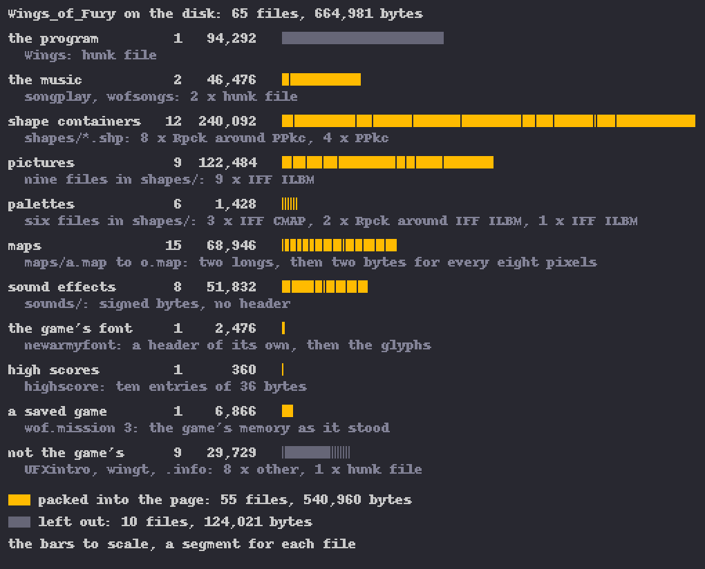
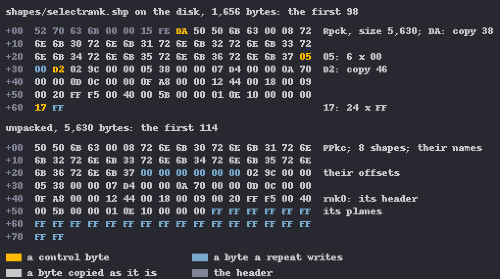
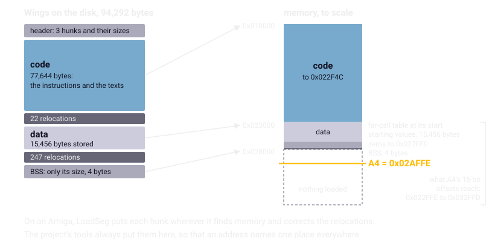
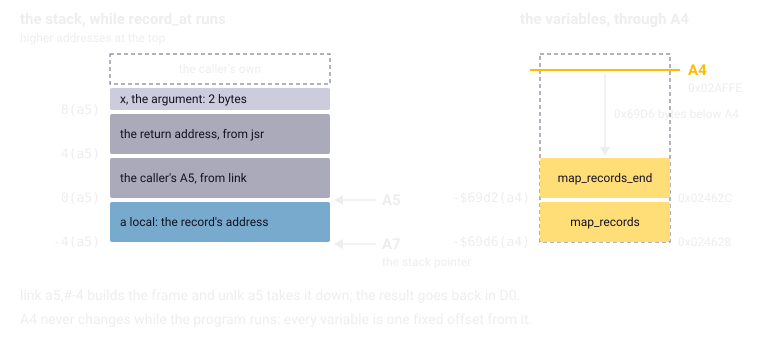

Chapter 3
{ .chapter-kicker }

# The disk

Wings of Fury came on one floppy disk, which starts the game on an Amiga 500 or 2000 (the manual, page 2), and almost everything the port knows about the game comes from it. By the end of this chapter you will know what is on the disk and how little of it the port had to decode, how the program is built from parts called hunks, and why the project's tools load those at one fixed set of addresses. You will also know how the compiler reaches the variables through the register A4, which explains the operand `-$46ec(a4)` of chapter 2, and how each compiled routine keeps its arguments in a frame on A5; what its 16-bit integers demand of the port; and why every table and text the port needs is read out of the program, never typed in again.

## An image of the floppy

The repository keeps the disk as an **ADF**, an Amiga Disk File: a copy of an Amiga floppy, block by block, in one file. A double-density floppy has 80 cylinders of two tracks, each track 11 blocks of 512 bytes: 1,760 blocks, 901,120 bytes, the 880 KB an Amiga owner knows, and exactly the size of the image, `original/wof.adf`. Beside it lie the disk's files, extracted byte for byte, under `original/disk/`. Nothing in the project ever writes to either.

The disk uses AmigaDOS's original file system, which keeps the top directory in block 880, the middle of the disk. A directory spreads its entries over 72 chains by a hash of their names, and the chains decide the order in which it lists its files: the order of the saved games in the load dialog, which chapter 1 met. The port and its tools read the extracted files; the image itself is read for that order alone, which the [headless original](../glossary.md#headless-original) hands the game as the machine would. The image confirms each file's chain; how a real machine walks the chains, and where it puts a newly saved file, is documented but unconfirmed, as chapter 1 said (chapter 20).

At start-up the disk's script, `s/startup-sequence`, runs a small command of the disk's own, enters the directory `Wings_of_Fury` and starts the program `Wings`. On the disk's top level, for no reason the disk tells, lies a second copy of the program, `Wings2`, byte for byte the same.

## What is on the disk

The game's directory, `Wings_of_Fury`, holds 65 files, 664,981 bytes in all.



/// caption
The game's directory on the disk: each kind of file with its count and bytes, each file a segment of its row's bar, gold where it goes into the port's page.
///

- **The program**, `Wings`, 94,292 bytes, the subject of the rest of this chapter.
- **The music**, in two files of its own: `songplay`, 5,148 bytes, the music player, a small program; and `wofsongs`, 41,328 bytes, the songs, the voices and their [sound samples](../glossary.md#sound-sample) (chapter 18).
- **Twelve shape containers**, the files ending in `.shp`, with 1,049 shapes between them (chapter 12).
- **Nine pictures**: the title sequence's three, the rank selection's, the high-score screen's two, the dashboard's by day and by night, and `Rank.iff`, which the game never opens.
- **Six palettes**, files of colours: three are bare lists of 32 colours, the other three pictures read only for their colours, and the game never opens two of those. The sky's palette, the sea's, the dashboard's picture and its shapes each come in a version for day and one for night (chapter 11).
- **Fifteen maps**, `maps/a.map` to `maps/o.map`, one for each mission: after two numbers of four bytes, a row of records of two bytes, one for every eight pixels of the world from left to right, each saying what stands there and how high (chapter 13).
- **Eight sound effects** in `sounds/`: nothing but **signed bytes**, bytes read as numbers from −128 to 127, which Paula plays as they are; `sounds/boom` is chapter 2's burst.
- **The game's font**, `newarmyfont`: its height, its first and last character, a width for each character, then the glyphs. The dialogs' font, [topaz 8](../glossary.md#topaz-8), comes from the ROM.
- **The high scores**, `highscore`: ten entries of 36 bytes, each a score, the rank reached and a name.
- **A saved game**, `wof.mission 3`, 6,866 bytes, saved on a real Amiga in the first rank's third mission, with 14,225 points.

A saved game is the game's memory as it stood, its pieces one after another without headers: 2,122 bytes of its variables, then the map's records and the tables of the targets. So its size follows from the map alone, from 4,258 bytes on map a to 11,516 on map m. Four of its fields are addresses in the memory of the machine that saved it, such as `0x0005FB4A` for the player's shape in this one; the port works them out from the data beside them. Chapter 17 takes the saved game apart.

One file the game asks for is missing: `wofdemo`, the [attract demo](../glossary.md#attract-demo). Left alone at the rank selection, the game tries to load it and, without it, starts a mission. The port does the same, unless a demo was recorded on the page, which then plays instead; the demo runs that chapter 1 counted play demos the tests recorded first (chapter 17). Nine files are not the game's at all: `UFXintro`, `wingt` and seven `.info` files.

The port packs 55 of the files into its page, all but the program and those nine: 540,960 bytes, each file in its original format. The program stays out: the port is its rewrite, its code the [core](../glossary.md#core), its data read as the last section tells. A file keeps its name, found whatever its case, as AmigaDOS finds it: the game asks for `shapes/Torpedo.shp`, the disk has `torpedo.shp`.

/// wrong
The port's file system first held a file the game writes, a saved game or the high scores, to at most 8,192 bytes, a limit sized from one saved game on map a. When the saved game was ported, its size was measured on all fifteen maps, and on seven of them a save would not have been kept (`re/notes/porting-m7.md`). The limit is now the largest save the port's tables allow. A size is measured over every case before it is trusted.
///

## The little there was to decode

The game has a packed format of its own, **Rpck**, named after the four letters a packed file begins with, then its unpacked size in four bytes and a stream of control bytes, each read as a signed byte. A negative one, −n, says: copy the next n bytes. Any other, n, says: repeat the next byte n + 1 times. Ten files are packed, eight shape containers and two palettes, and the game's loader unpacks any file that begins with those letters.

A **shape container** is a file of many shapes, the format that begins with `PPkc`: the number of shapes, a name of four characters for each, where each shape's entry begins, then the entries. An entry is a header of 20 bytes, with the shape's width and height, its hotspot (the point that lands on the position the shape is drawn at) and, since a shape may store fewer planes than the screen has, the screen's [bitplanes](../glossary.md#bitplane) each stored plane lands in; the planes follow. The game asks for its shapes by name, through lists of names in its data, looking most up once, when it loads a container, and a few as it needs them.

The figure shows the start of the rank selection's shapes. A byte above `0x7F` counts as negative, itself less 256, so the first control byte, `0xDA`, 218, is −38: the 38 bytes after it are copied, the container's letters, its count and its names. Then `0x05` writes a zero six times, `0xD2` copies 46 bytes, and `0x17` writes `0xFF` 24 times: the top row of the first shape's first stored plane, 192 pixels set.



/// caption
The game's packed format at work: the first bytes of `shapes/selectrank.shp`, 1,656 bytes on the disk, and the first bytes of the shape container they unpack to, 5,630 bytes.
///

The pictures are **IFF ILBM**, the Amiga's standard format for pictures: a file of chunks, each a name of four letters, its length and its contents, which give a picture's size, its colours (`CMAP`) and its bitplanes, each row packed (`BODY`). Three palette files are a bare `CMAP` chunk. The game reads its pictures with a reader of its own, which also knows a private chunk, `CMP2`, for a second palette and the line where it begins, though no file on the disk carries one; the port carries that reader over rather than replacing it.

The sound effects and the maps need nothing decoded. For the core the port wrote no decoders: it ported the original's loaders, routine by routine. Decoders in Python under `tools/` serve the tools, the tests and this book's figures.

/// know
The decoders of the packed files, the shapes, the pictures, the palettes and the font each ran twice on the same input, as the original's 68000 code under the [oracle](../glossary.md#oracle) (chapter 5) and as the port's C, the results equal byte for byte: all ten packed files and 40 random streams, all 55 files through the loader, all 1,049 shapes, all twelve picture files (the nine pictures and three palettes) and all six palette files. The loaders of the maps and the sound effects are held to the original through the headless original.
///

## The executable, a hunk file

An Amiga program is a **hunk file**, AmigaDOS's format for programs, made of **hunks**: parts of the program loaded into memory whole. A code hunk holds instructions, a data hunk variables with their starting values, and a **BSS** hunk memory that starts at zero, given in the file by its size alone. The file opens with a header that gives the number of hunks and their sizes; each hunk follows with its contents, a list of places to correct and an end mark, every part opening with a number of four bytes that says what it is.

`Wings` has one hunk of each kind. Its code hunk is 77,644 bytes: the instructions, and the story and most other texts, each after the routine that uses it. Its data hunk takes 20,464 bytes in memory, of which the file stores the first 15,456; the rest starts at zero. Its BSS hunk is 4 bytes.

The file does not say where its hunks go. Where the program holds an address, the file holds an offset from the start of a hunk and lists the place as a **relocation**: an entry naming a place in a hunk that holds an address, which the loader corrects by where the target hunk landed. The code hunk has 22 relocations, the data hunk 247.

AmigaDOS loads a program with **LoadSeg**, the routine of its [library](../glossary.md#library) that reads a hunk file, puts each hunk wherever it finds free memory of the kind the file asks for, and applies the relocations. `wofsongs` asks for [chip memory](../glossary.md#chip-memory), where Paula can reach its sound samples. The game loads its music with LoadSeg, and the system loaded `Wings` the same way.

`Wings` carries no **symbols**, the names a program file may keep for its routines and variables: no name survives in it as a symbol, and every name in this book's listings was given by the project, as chapter 4 tells. The music player kept its symbols, twenty names in its code.



/// caption
The program on the disk, hunk by hunk, and where the project's tools load each hunk, with A4 and the span its offsets reach.
///

## One layout for every address

On a real Amiga, LoadSeg chooses the addresses anew at every start, so an address written into a note would mean nothing the next day. So we use one **fixed load layout**: the one set of addresses at which all the project's tools load the program, the code at `0x010000`, the data at `0x023000` and the BSS at `0x028000`, each hunk at the next 4 KB boundary after the one before (`tools/hunk.py`). The disassembler that writes the [listing](../glossary.md#listing), the program written out as assembly language, loads it so, as do the oracle, the headless original and the build's extractor of tables. So an address names one place everywhere: `0x01C982` is the routine `record_at` in the listing, in the notes, under the oracle and in its port's comment. The running port itself holds no such addresses: where the original keeps a pointer, the port keeps an offset or an index.

## Manx Aztec C

The game's C was compiled with **Manx Aztec C**, an Amiga C compiler of its day. The first third of the code, up to `0x015D62`, is almost all [assembly language](../glossary.md#assembly-language) written by hand: the main loop, the routines that draw the scene, the interrupt routines, the objects' movement. After it come the 223 routines compiled from C, the C library's among them, with a second stretch written by hand in their midst: the routines that program the blitter. How the two kinds are told apart is chapter 4's subject; here they matter for what they share.

### A4

The compiler reaches the program's variables through one [register](../glossary.md#register), the **small-data base** A4: the register holding an address inside the data, from which every variable is reached by an offset of 16 bits. The program's first instruction jumps to the C library's start-up code, which first calls a routine of two instructions that loads A4. The file holds the number `0x7FFE` there, with a relocation into the data hunk, so A4 ends up 32,766 bytes into the data wherever the data was put: in the fixed layout, `0x02AFFE`.

An offset of 16 bits reaches from 32,768 bytes below the register to 32,767 above it. From `0x02AFFE` that is `0x022FFE` to `0x032FFD`, the whole data hunk from its first byte. An instruction names a variable in two bytes, where a full address takes four, and needs no relocation: when the data moves, A4 moves with it.

Now chapter 2's operand reads plainly. `-$46ec(a4)` is the variable `0x46EC` bytes below A4: `0x02AFFE` less `0x46EC` is `0x026912`, `rand_seed_const`. That chapter's `rand_beam` was written by hand, yet reaches its variables the same way: the hand-written assembly and the compiled C share one set of variables through A4. Of the listing's 21,332 instructions, 4,198, about one in five, have an operand relative to A4.

Of those, 659 are calls and 13 are jumps into the **far-call table**: 185 jump instructions at the start of the data hunk, each holding the full address of a routine. A call such as `jsr -$7e1e(a4)`, in the game's main routine, is one short instruction that reaches a routine anywhere in the code and needs no relocation of its own; the correcting is done once, in the table's 185 slots. With the calls relative to the program counter and the variables relative to A4, that is why the code hunk needs only 22 relocations.

### The frame on A5

The compiler also fixes the **calling convention**, the rules by which a caller hands a routine its arguments and gets the result back. The caller pushes the arguments onto the stack, the last first, 2 bytes for an int and 4 for a long or a pointer, and calls, which pushes the return address, 4 bytes; the result comes back in the register D0. Each of the 223 C routines begins with `link a5`, which builds its **stack frame**, the routine's own stretch of the stack: it pushes the caller's A5, sets A5 to the stack pointer and moves the stack pointer down to make room for the routine's variables. Above A5 lie the caller's A5 and the return address, four bytes each, so the first argument is always at `8(a5)`; the routine's variables lie below A5.

`record_at` shows both registers at work. Given a position in the world, its x, it returns the address of the map record under it, with the help of two variables: `map_records`, the address of the map's first record, and `map_records_end`, the bound it checks against.



/// caption
What `record_at` reaches while it runs: its frame on the stack through A5, and two variables through A4.
///

The listing computes in order. It reads x at `$8(a5)` as a word, because an int is 16 bits, and makes a negative x 0. It widens x to 32 bits with `ext.l`, a **sign extension**, which copies the sign bit into the new upper half so that the number keeps its value, because `divs.w` divides a 32-bit number. It divides by 8, because one record covers eight pixels; doubles the result with `asl.w`, because a record is two bytes, and widens it again; adds `map_records`, at `-$69d6(a4)`; and keeps the sum, the record's address, in its own variable at `-$4(a5)`. If that lies at or past `map_records_end`, at `-$69d2(a4)`, it takes the address two bytes before the bound instead. The result goes back in D0. Here the doubling in 16 bits cannot change the result, since x is at most 32,767 and x / 8 doubled at most 8,190; the port keeps the widths anyway.

//// html | div.listing-pair

/// html | div
```wingslst
--8<-- "generated/listings/asm/record_at.lst"
```
///

/// html | div
```c
--8<-- "generated/listings/c/wof_record_at.c"
```
///

////

The port names the original's address in its first comment and keeps each width the listing shows, with casts. It returns an offset into the map's records where the original returns an address. The oracle holds the two to each other on five maps, at every x where a record begins, near both ends and at 500 random places.

## The 16-bit int

In Manx Aztec C, as the game was built, an **int**, C's ordinary type for whole numbers, is 16 bits wide, and a long and a pointer 32; the compilers that build the port make an int 32 bits. An int holds the numbers from −32,768 to 32,767, and one past the largest is the smallest.

The game's arithmetic lives in that width. An enemy fighter sets the length of a turn from its distance from the player in pixels, times 100, divided by its speed. The 68000's `muls.w` multiplies two 16-bit numbers into 32 bits; the compiled code keeps only the low 16 bits of the product, sign-extends them with `ext.l`, and only then divides with `divs.w`. From a distance of 328 on, the product would not fit, 32,800 would become −32,736, and a port that kept all 32 bits would time the turn differently; whether a turn is ever timed at such a distance we did not measure. The port does what the original does, bit for bit.

Among the rules the specification sets for every routine (`SPEC.md`, section 7.1):

- No value of the game is a plain C int in the port; every width is named: `int16_t`, `uint16_t`, `int32_t` and their kin.
- Every change of width the listing shows happens in the port too: a sign extension, a product cut to 16 bits or kept at 32, a division that rounds toward zero and keeps a 16-bit quotient.
- Whether a comparison is signed follows the branch instruction that reads it: the 68000 has separate branches for signed and unsigned comparisons.
- Wrap-around is behaviour. A value that runs past its largest number wraps in the original, and the port wraps it too, with an explicit cast, because in today's C a signed overflow is undefined, and a compiler may assume it never happens.
- Floating point never goes through C's `float` or `double`, which round differently. The game's goes through the C library to the ROM's [fast floating point](../glossary.md#fast-floating-point), which the port redoes in integer code (chapter 14).

A last rule concerns the upper half of a register, where a routine may leave a value that the next one reads; the port must hand it on, and chapter 9 tells how that was learnt. Chapter 22 returns to the rules as a whole.

## Read from the executable, never retyped

The port needs the game's numbers and words, and we keep to one rule: hand-written sources hold code only, and every table, text and tuning value comes out of the program when the port is built, wherever the program keeps it. A constant that is part of a routine's arithmetic, such as the 8 that `record_at` divides by, is code like the rest of the routine, and the oracle holds it to the original.

The manifest `re/tables.toml` lists what is read, each entry with a name, a kind (names, strings, runs of numbers or bytes), where to read it and, where needed, how much; the music player's entries use addresses of its own layout. At every build, `tools/extract_tables.py` reads those bytes and writes them out as C, which is never committed. On the way it converts the byte order: the 68000 is **big-endian**, storing the most significant byte of a number first, as every file the project reads does, while the machines the port runs on are **little-endian**, storing the least significant byte first.

The manifest has 122 entries: 113 from `Wings`, 7 from the music player and 2 from the ROM, the system font and the key table. They hold the lists of shape names, the file names, the palettes of the [front end](../glossary.md#front-end), the screens before and between missions, the story, the dialogs' words, the mission's tables, the sound effects' periods and the music player's notes. One entry, `data_image`, is the stored part of the data hunk whole, 15,456 bytes, so that every variable the port keeps there starts with the original's own value. The story and most texts come from the code hunk, the file names from the data.

Some values are in no table at all. Chapter 2's burst plays at period 500, the operand of an instruction in the routine that sets up the sound effects' slots, here slot 4:

```wingslst
--8<-- "generated/listings/asm/sound_slots_init_boom.lst"
```

The first two lines hand the slot the burst's sound sample and its length. The third writes `$1f4`, which is 500, as its period; the next two a starting volume of 64 (`$40`), which every burst replaces by a volume from its distance, and a count of one: the burst plays once. The manifest's entry `slot_periods` reads that word at `0x01200C`, and the same word in the setups of slots 0 to 6, `0x22` bytes apart; slot 7 has no fixed period, because it plays four different sounds.

The rule buys a port that cannot drift from the data. A number typed in again could be typed wrong, and nothing would say so; a number read from the program is the original's by construction, and an address outside the program stops the build. It also keeps the game out of the port's sources: `src/`, `web/` and `tools/` hold no game data, which lives under `original/` and, packed, in the page, under its own reservation (`README.md`, "Licence").

/// dev
The fixed layout: code `0x010000` to `0x022F4C`; data `0x023000` to `0x027FF0`, its stored part to `0x026C60`, the far-call table `0x023000` to `0x023456`; BSS `0x028000`; A4 `0x02AFFE`. `tools/hunk.py FILE` prints a hunk file's hunks with the counts of their relocations and symbols. The 55 files go into the page as one packed file (`tools/build.py`, `pack_fs()`): `WOFS`, a version, the count and the directory's offset, then 40 bytes for each file, its name in 32, its offset and its length, big-endian.
///

## What comes next

Chapter 4 opens the listing: how a disassembler turned the machine code back into assembly language, how the routines got their names, how a skeleton of a routine's branches makes a long one readable, and how compiled C looks beside assembly written by hand.

## Further reading

The files named here are in the repository, `github.com/sy2002/wof-wasm`.

- `SPEC.md`, section 3.1, "Disk"; 3.2, "Executable"; 3.5, "File formats"; 5, "Build"; 7.1, "Arithmetic".
- `re/notes/porting-m1.md`, "The routines" and "How the tests establish it".
- `re/notes/shapes.md`, "Container and lookup"; `re/notes/campaign.md`, "The saved game".
- `tools/hunk.py`, `tools/extract_tables.py` and `re/tables.toml`.

Outside the repository: *The AmigaDOS Manual*, for the hunk format; Laurent Clévy's *ADF format FAQ*, for the disk; Motorola's *M68000 Family Programmer's Reference Manual*, for `link` and the offsets from A4.
