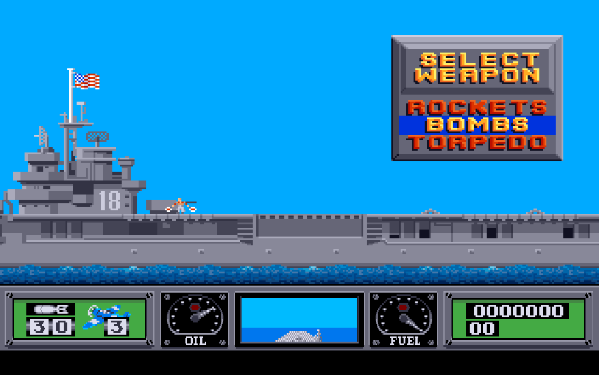

Chapter 1
{ .chapter-kicker }

# What faithful means

This book is about a port of Wings of Fury, Broderbund's Amiga game of 1990, to the browser, and about the word that carries most of the weight in its description: faithful. By the end of this chapter you will know what a faithful port is and how it differs from an emulator, an FPGA recreation and a remake, what the word promises in three parts, and why the result is a single HTML file. You will also know what was left out of the game and what was changed on purpose, and, in outline, which instruments hold the port to the original; most of them have a chapter of their own in Part I.

## Three ways to keep a game

Retro preservation has two established ways of keeping an old computer's games playable.

The first is the [**emulator**](../glossary.md#emulator): a program that imitates the old computer, its processor and its chips, closely enough that the game's original program runs on it unchanged. You play the game as its authors shipped it, on a machine that exists only as software.

The second is the [**FPGA recreation**](../glossary.md#fpga-recreation): the old computer rebuilt in programmable hardware, a chip whose circuits can be configured to behave like the original machine's. The Amiga cores for the MEGA65 and the MiSTer are of this kind. Here too the game's original program runs unchanged, on a machine that is real again.

Both keep the machine, and the game comes with it; neither changes a byte of the game.

A [**remake**](../glossary.md#remake) goes the other way. It is a new program, made to look and play like the old one, written from watching the old one. However well it is made, its code is new, and what it does is what its makers saw the original do.

This book tells of a third way, tried here for one game, and it is not a remake. It is a [**faithful port**](../glossary.md#faithful-port): one game carried from its original machine to another by rewriting its own logic, [routine](../glossary.md#routine) by routine (a routine being a piece of code that does one job), from the original program's [machine code](../glossary.md#machine-code), and held to the original by comparison. It preserves one game rather than the machine. The game's logic was taken out of the original executable's [68000](../glossary.md#68000) machine code and rewritten in C, and every picture, map, sound and table is read from the original disk. What runs in your browser is not an imitation of an Amiga. It is the game, carried over into a form today's computers run natively.

/// caption
Three ways to keep an Amiga game, and what each one keeps.
///

The faithful port keeps the work of art without keeping the machine. It is also the one way of the three that leaves the game readable: the port's source, the notes on how every part of the game works, and the proof that the port behaves as the original does are all in the repository, [`github.com/sy2002/wof-wasm`](repo:), where this book lives too.

"Routine by routine" is meant literally. The original program is one file of 94,292 bytes, and its machine code falls into 616 routines, 223 of them compiled from C and the rest written in [assembly language](../glossary.md#assembly-language). Every routine the game runs was read, named and rewritten in C, and carries the address of its original, so that the port's C and the original's assembly can be laid side by side. The rest, dead code and the Amiga's own machinery, was left, and chapter 8 tells how we knew which is which. The port is not a reconstruction of what the game seems to do; it is a translation of what its code does.

## The definition, in three parts

Faithful is a strong word, so we pin it down in three parts, each of which can be checked.

### Logic, tick for tick

The game does not move its world continuously but in steps, [**logic ticks**](../glossary.md#logic-tick): one step of the game's simulation, in which its aircraft, bombs and ships move on. A European Amiga takes 12.5 of them a second, the American machines the game was designed for a few more, and the picture is redrawn more often, as [the rhythm of ticks and pictures](#the-rhythm-of-ticks-and-pictures) below tells. The rates follow the television standard: a [**PAL**](../glossary.md#pal) machine, the European kind, draws its picture 50 times a second, an NTSC machine more often, and the game counts its ticks in pictures.

For every tick the game takes one [**input sample**](../glossary.md#input-sample): it reads the stick and the button into one [**input byte**](../glossary.md#input-byte), four bits for the stick's directions and two for the button, held or tapped, because the button serves two weapons: a tap drops the chosen one, a hold fires the guns. A tap is kept until the next sample, so unlike a short push of the stick it is never lost. The byte is the only way the stick and the button reach the game's logic; the keyboard's commands come in through the game's own key handler.

The first part of the definition says: give the port and the original the same start, the same input bytes and the same keys, and after every logic tick the two hold the same game state. Not a similar state; the same values.

There is one more input, easy to overlook: chance. The game's only source of random numbers reads where the [beam](../glossary.md#beam) that draws the picture happens to be at the moment of asking, which on the real machine depends on exactly how long the code took to get there. The port replaces the beam by a stream of values that can be reproduced, and in a comparison both sides get the same stream. With that the game becomes, in a precise sense, a function of its start, its inputs and its random stream, and of the rhythm of its ticks and pictures. That is what makes a faithful port checkable at all.

The arithmetic is held to the same standard. The game computes its flight model in [**fast floating point**](../glossary.md#fast-floating-point), Motorola's number format of 32 bits, whose routines live in the Amiga's ROM. A browser's numbers round differently and the game's state would drift, so the port does the same arithmetic in integer code, bit for bit, its nine operations tested against the ROM's own routines.

### The same pixels and the same palette

The second part is about the picture. The Amiga does not store a colour for every pixel. It stores a number, and a [**palette**](../glossary.md#palette) turns each number into a colour: a table of up to 32 entries, each one of 4,096 possible colours.

The definition says: for the same game state, the port's picture holds the same number in every pixel and the same palette as the original's. The game changes the palette down the screen: the sky above the horizon has one, the sea below it another, the dashboard a third, and the message line under the dashboard a ramp of its own. One palette cannot hold them all: the sea takes fifteen of the sky's colours for its shades, and the dashboard and the message line are areas of their own, in a finer mode. Each switch falls on a set line of every picture, except the sky's, which follows the horizon; so the port keeps a palette for every row.

/// caption
The first mission as the port draws it from the game's data, its 640 by 214 pixels shown in the 1024 by 642 box of a PAL display.
///

The picture is shown as a PAL screen showed it. The port keeps it at the dashboard's finer resolution, whose pixels a PAL screen shows taller than wide: square pixels would flatten it into a strip, and no whole-number enlargement fits both directions, so the port scales in two steps, which keeps every pixel sharp and even. PAL is the default because this disk comes from a PAL country, its extra pictures are of PAL height, and the real Amiga the port was compared with is a PAL machine.

### The same sounds at the same moments

The third part is about sound. The Amiga plays its sounds as [**sound samples**](../glossary.md#sound-sample): recorded waveforms that its sound chip plays back on one of four channels, each at its own pitch and volume. The definition says: the port starts the same sound sample on the same channel in the same tick, at the same pitch and the same volume, as the original; and its music keeps the timing of the original's music player. The sound effects and the music are not new recordings. They are the game's own sound samples, played by the game's own sound engine and music player, ported with the rest.

### The rhythm of ticks and pictures

Each of the three parts compares the port with the original in the same situation; none fixes the rhythm in which situations follow each other. The game draws its pictures in [**passes**](../glossary.md#pass): a pass is one round of the inner loop, the loop that plays a mission, which draws one picture and runs the part of the logic that goes by pictures.

A tick comes every few [VBlanks](../glossary.md#vblank), the moments the display finishes a picture; a pass takes as many as the machine needs, on a real PAL Amiga a couple in a quiet scene. We filmed the machine, as no instrument of ours counts the processor's time; and the count matters beyond smoothness, for the soldiers, the game-over countdown and the objects' animation go by passes: a wrong count would change the game.

/// figures
| On a PAL Amiga | How often |
|---|---|
| VBlanks a second | 50 |
| A tick | every 4th VBlank |
| A pass, quiet scene, filmed at 240 frames a second, about 5 to a VBlank | every 2nd VBlank, 2 to a tick |
| A pass, busy scene, not filmed | perhaps 3 VBlanks; the port keeps 2 |
///

## One file in the browser

The aim is a game anyone can open on any machine with a browser, as easily as a document. The port is a single HTML file: a double click, and the game is there, behind its help screen until the first key. It needs no installation, no emulator, no disk to boot and no settings, and asks the network for nothing. Every picture, map, sound, piece of music, table and text of the game, and its own font, comes from the original disk when the file is built and goes inside it: 55 of the disk's files, in their original formats, beside the port's code. The file is about 1.2 megabytes and runs in Chrome, Firefox and Safari; the tests drive Chrome and Firefox. You can play it on this site's page [Play the game](../play.md); the file itself is [`dist/wof.html`](repo:dist/wof.html) in the repository.

Two layers make it up. The [**core**](../glossary.md#core) is the game: the ported logic, in C, compiled to [**WebAssembly**](../glossary.md#webassembly), a compact binary form of program every current browser runs. The [**shell**](../glossary.md#shell) is a thin layer of JavaScript around it: the clock that paces it, a screen, a loudspeaker for the sound the core mixes, a keyboard, a place for saved games, and a few things around the game, listed below.

The line between the two is where the comparison ends: the core holds the game's whole state and knows nothing of the browser, so the same C builds for the test machine and runs there beside the original. And C, not JavaScript, because its fixed-width integers do the original's 16-bit arithmetic exactly, where JavaScript's numbers are all doubles; compiled to WebAssembly, it runs at close to native speed.

Code and content are kept apart, so that nothing of the game can be typed wrong and the game stays out of the port's sources: the sources hold code only, and every table, name list and text is read from the original executable when the file is built, the system font and the key table from the Amiga's ROM.

## What was left out

The disk the port was made from is not quite the disk Broderbund sold. Its executable carries a [**crack**](../glossary.md#crack): a change made to a program to remove its copy protection. The game's logic is the retail code; the crack disabled the protection check, added a text screen of its own to the executable and overwrote three picture files. Two things are left out of the port, and one is missing from the disk.

- **The copy protection.** The original checked that its player owned the printed manual, by asking for something only the manual could answer. On this disk the crack had already disabled the check, and the port does not bring it back.
- **The crack's own additions.** The crack's intro and its text screen in the executable are dropped, being the crack's and not the game's; the picture files it overwrote are shown as the disk holds them.
- **The publisher's logo**, which this disk does not carry. The first picture of the title sequence should be Broderbund's; the crack replaced it with a picture of its own, and put its copyright line of 1992 along the bottom edge of the game's title picture. So the port's title sequence opens with the crack's picture.

/// caption
The first picture of the title sequence, as this disk carries it: the crack's picture, where the publisher's logo once was.
///

A few things are left out for a plainer reason: a browser has no use for them. The original starts up its C runtime, closes the [Workbench](../glossary.md#workbench), plumbs its [interrupts](../glossary.md#interrupt), builds the lists for the [copper](../glossary.md#copper) that change the colours down the screen, and carries a debug reporter and a crash reporter. None of that is ported; the copper lists' effect is kept through the palette for every row. The operating system's services the game does need, the port replaces with small equivalents of its own: a file system over the disk's files, an allocator for its memory, and the ROM's key table, taken at build time.

## What was changed on purpose

Everything else is the original, its own defects included. What follows is every change a player can meet; the defects, and the few departures only the code shows, are told where they belong, in chapters 17, 20 and 23.

### The keys

The original takes its commands from the keyboard. Escape pauses, and the Control key with a letter restarts the game, clears the high scores, flips the vertical control, saves and loads; Control with S switches the music and is not in the manual. The manual for its part promises Control with D for the list of high scores, which this version of the program does not have. A browser keeps Control with R, F and L for itself (reload, find, the address bar), and a page cannot stop it from taking all of them. So the port gives each command a plain letter:

| Key | What it does | The original's key |
|---|---|---|
| the arrow keys, or W, A, S, D | the stick | the joystick |
| Space | fire | the joystick's button |
| Enter | chooses in a menu, as fire does | Return |
| P, or Escape | pause and continue | Escape |
| V | the vertical flip | Control-F |
| G | save, on the carrier only, as in the original | Control-G |
| L | load | Control-L |
| M | music off and on, in flight; silences the effects too | Control-S |
| R | restart, while paused or in the briefing | Control-R |
| C | clear the high scores, while paused | Control-C |
| H | the help screen | none |
| F | fullscreen | none |

R and C act only while the game is paused, R in the briefing as well, because without the Control key in front of them a stray press could throw a whole campaign away; the original accepts both while paused, so this narrows it and adds nothing. No key of the game is ever put on Control, Alt or Command: with Control as fire and W as up, firing while climbing would be Control with W, which closes the browser's tab. The port takes the keys by their position on the keyboard, as the Amiga did, so this book names a key by its place where keyboards differ, such as the key left of 1.

Inside the core, each command letter becomes the original's own Control code, so that the original's key handling sees what it saw on the Amiga. Nothing the manual describes is lost. One thing outside it is: a cheat sequence hidden in the program, no part of the game the manual describes, can no longer be typed, because letters it needs are commands now.

### The keyboard assist

The original was made for a joystick, which you hold; a key you tap, and that matters in two places. In the weapon menu in the carrier's hold a step costs several input samples: the menu steps on one, then waits for more in which the stick is pushed, and a key press covers fewer than a held stick, so a press is often swallowed; and with the vertical flip on, up on the key moves the menu down. In flight, a short tap can fall between two input samples and be lost.

The [**keyboard assist**](../glossary.md#keyboard-assist) smooths both. In the weapon menu one press is one step, the right way up whatever the flip says; everywhere else a short tap reaches the game exactly once, and never more often than a joystick held for that long would. The flying stays the original's. The assist is a switch in the core that the page turns on.

### The remembered flip

By default, pushing the stick forward makes the aircraft climb. That is how the game reads the joystick, and the manual's instructions for the take-off (page 5) say the same. For players who want a pilot's stick the game has a command: the [**vertical flip**](../glossary.md#vertical-flip), which swaps forward and back.

In the original the flip is part of the game's state. It starts off every time the program starts, a restart keeps it, and loading a saved game sets it to whatever the saved game held, so that a game saved without the flip switches it off under a player who flies with it. The project's owner is such a player, and so the port treats the flip as a preference: the browser remembers it, and the remembered value wins over a loaded game. A core that has not been given the preference behaves exactly as the original, and that is how every comparison runs.

### What the shell adds

Three things the original does not have at all come from the shell, around the game rather than in it.

- **The help screen**, on H, lists the port's keys in the player's words. It is up when the page opens, because a browser starts sound only on a key or a click, and the first one starts the sound and takes the help screen away.
- **The pause sign**, over the picture while a mission is paused, whatever asked for it. The shell also pauses a mission when fullscreen is left, so that Escape, which the browser takes for leaving fullscreen, still pauses, and after an absence of the page of a second or more, as a hidden page stops the clock in mid-flight.
- **Fullscreen**, on F.

/// dev
The layer that turns the port's command letters into the original's codes is [`src/portkeys.c`](repo:src/portkeys.c). The shell's own keys are in [`web/main.js`](repo:web/main.js): H, F, and the key left of 1, which opens the shell's diagnostics overlay and never reaches the game. The assist is [`src/assist.c`](repo:src/assist.c). Every rule is in [`SPEC.md`](repo:SPEC.md#62-shell), section 6.2, "Input", and [`re/notes/keys.md`](repo:re/notes/keys.md), whose ["The five readers"](repo:re/notes/keys.md#the-five-readers) lists every place the program reads the keyboard.
///

## How we know, in brief

The emulator is not what you play, but it is how the port was measured, the original running beside it under emulation. These are the instruments, in outline.

- [**The oracle.**](../glossary.md#oracle) An original routine runs on an emulated 68000 processor beside its port, on the same inputs, often thousands of random ones, and the results must be equal. Every [**pure routine**](../glossary.md#pure-routine), one that computes from its inputs alone, must pass it to count as [verified](../glossary.md#verified), held to the original by a test of its own; the suite holds hundreds of oracle tests.
- [**The headless original.**](../glossary.md#headless-original) The original program, from its `main` routine on, runs under emulation without a screen: only the processor is emulated, the custom chips' addresses are plain memory and the blitter never draws, which is what headless means. Stubs answer the operating system's calls, and the beam's position comes from the port's random stream; the ROM's own floating point and key conversion and the game's music player run for real. None of the game's logic is rewritten for it.
- **The comparisons.** The port and the headless original play the same mission from the same input bytes and the same keys, and are compared after every tick and every pass: every game variable and table the port keeps as the game's state, every drawing call with its arguments, every random number drawn and the routine that drew it, the palette of every row. One way of comparing sets the port to the original's state before each pass, so that a difference points at its pass; the other lets the port run alone from the program's start, as it runs in your browser. A completeness test demands that every place in memory the original writes during a mission is compared, or listed with the reason why not.
- **The missions** are flown by [**mission scripts**](../glossary.md#mission-script), recorded sequences of stick and key inputs that fly a mission the same way every time: dozens of them on every map, with runs of loaded games, of the game's [**attract demo**](../glossary.md#attract-demo), a recorded game it plays by itself when left alone, and of the keyboard commands. The title sequence and the menus are compared VBlank by VBlank.
- **The sound event log.** Every sound sample started, by the port and by the original, with its channel, pitch and volume, compared after every tick and every pass of every mission script.
- **The replay.** A demo the port recorded is played back in the native build, the port compiled for the test machine outside the browser, and in WebAssembly, against a fingerprint of the whole game state after every input sample: the comparisons run on the native build, and the replay holds the page's WebAssembly build to the same fingerprints.
- **The page.** The finished file is opened in Chrome and Firefox and played through the browsers' own drivers, the remote control a browser offers to tests, with real key presses, and checked for its pixels, its display, its timing and its sound.

Together they are about nine hundred tests.

/// figures
| What | How many |
|---|---|
| Mission scripts, all 15 maps | 60 |
| Runs of loaded games and the attract demo | 8 |
| Runs of the key commands | 21, 2 without a key, as controls |
| Oracle tests | over 300 |
| Random inputs, the fade's arithmetic alone | 20,000 |
///

What the instruments do not see belongs to the definition too. The headless original draws nothing, so no whole mission scene is compared pixel by pixel; the drawing calls and the palette of every row stand for it. Every single shape is compared pixel by pixel with the port's: the original's own routine draws it through a model of the Amiga's [blitter](../glossary.md#blitter), the chip that does the drawing, a model built from the chip's documentation rather than derived from the original.

Four things rest on documented behaviour, or on the eye and ear of the project's owner, rather than on a comparison:

- A busy scene's rhythm was not filmed; the port keeps the quiet scene's, and it plays right.
- How long a step of a fade between two pictures takes is processor time in the original, which the [listing](../glossary.md#listing), the original's instructions written out, cannot tell. The port sets it to two VBlanks, and the fades were found right by eye.
- The tempo of the music rests on the value one [register](../glossary.md#register) of the timer holds when the machine is switched on. Every song was heard and found right.
- The order in which a directory lists its files decides the order of the saved games in the load dialog. The Amiga's documentation describes it, and neither a run nor the disk has confirmed it.

Chapters 7, 18 and 20 give the detail.

## What comes next

This chapter has used a handful of Amiga words without explaining them: the VBlank, the copper, the blitter, the palette that changes down the screen. Chapter 2 takes twenty minutes to explain the machine the game was written for, the 68000 processor, chip memory, bitplanes, the copper, the blitter, Paula and the VBlank, and the little of AmigaOS the game uses: only what the port needed, so that the next chapters can be read without the deep dives that come later in the book.

## Further reading

The files named here are in the repository, [`github.com/sy2002/wof-wasm`](repo:).

- [`SPEC.md`](repo:SPEC.md), section 1: ["Goal"](repo:SPEC.md#1-goal), ["Definition of faithful"](repo:SPEC.md#definition-of-faithful) and ["Out of scope"](repo:SPEC.md#out-of-scope-for-this-specification).
- [`SPEC.md`](repo:SPEC.md), section 3.1, ["Disk"](repo:SPEC.md#31-disk), and 3.3, ["Runtime model"](repo:SPEC.md#33-runtime-model).
- [`SPEC.md`](repo:SPEC.md), section 6.2, ["Shell"](repo:SPEC.md#62-shell): "Video" and "Input"; 6.3, ["Blocking code becomes coroutines"](repo:SPEC.md#63-blocking-code-becomes-coroutines); 6.5, ["Audio model"](repo:SPEC.md#65-audio-model).
- [`SPEC.md`](repo:SPEC.md#8-verification), section 8, "Verification".
- [`README.md`](repo:README.md#amiga-to-web), "Amiga to Web".
- [`re/notes/keys.md`](repo:re/notes/keys.md), ["The commands"](repo:re/notes/keys.md#the-commands) and ["The vertical flip, and how long it lasts"](repo:re/notes/keys.md#the-vertical-flip-and-how-long-it-lasts).
- [`re/notes/porting-m4.md`](repo:re/notes/porting-m4.md#the-keyboard-assist), "The keyboard assist".
- [`re/notes/porting-m1.md`](repo:re/notes/porting-m1.md#findings), "Findings".
- [`re/notes/passes.md`](repo:re/notes/passes.md#what-the-film-of-the-real-machine-shows), "What the film of the real machine shows".
