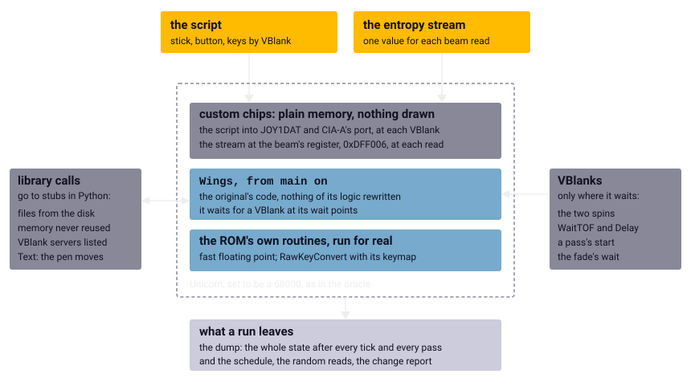

Chapter 6
{ .chapter-kicker }

# The headless original

The oracle of chapter 5 holds one routine at a time to its port. To hold the whole game, we run the original program whole, on the same emulated processor and without a screen. By the end of this chapter you will know what stands in for the Amiga in such a run and why none of it changes what the game does; how time, the player's hands and chance reach the program; what a run leaves for the comparisons with the port; and why two runs always come out the same. And you will meet the chapter's lesson: the wall clock must never shape a run.

## One routine is not a game

A routine under the oracle runs on a state the test builds, which lets a test choose states no mission produces. In a mission the game builds the state itself, routine after routine, and its routines read the world it has built: the positions, the pools of objects, the timers. What a mission does depends on the order in which the routines run, on what one leaves for the next and on the interrupts between them, all of which a test of one routine leaves out.

So the original program itself runs, from its `main` routine on, on the oracle's own machine: the same [Unicorn](../glossary.md#unicorn) set to be a [68000](../glossary.md#68000), the program at the [fixed load layout](../glossary.md#fixed-load-layout), the memory-form shift corrected. Everything from the initialisation and the title sequence to the inner loop that plays a mission, the VBlank's routines and the key handler is the original's own code; nothing of the game's logic is written again for the instrument.

This is the [headless original](../glossary.md#headless-original) of chapter 1, the original program run under emulation without a screen: the reference the port is compared with, tick by tick, in chapter 8, and the way the notes observe the running game, as chapter 4 put it. Around it is the [**harness**](../glossary.md#harness): the instrument's own code in Python, with the stubs, the hooks, the script, the stream and the dump of the sections below.

## What stands in for the machine



/// caption
The headless original: the original's code and the ROM's run for real; the harness stands in for the system and the chips, brings the script and the stream in through the chips' registers, and lets VBlanks ([chapter 2's timeline](amiga.md#the-vblank)) happen only where the program waits.
///

### The operating system

The game calls the operating system through its [libraries](../glossary.md#library), tables of jumps at fixed offsets from a library's address (chapter 2). The harness gives each library a made-up address whose every slot holds a return instruction, but for the floating point's, whose slots lead into the ROM, and puts a [hook](../glossary.md#hook) over the whole area, a routine of the instrument's own that the emulator calls at a chosen instruction. When the game calls a library, the hook stops the emulation, the harness runs a Python method of the same name, puts its answer into D0 and lets the program return. Each such method is a [stub](../glossary.md#stub), a substitute for something the game calls.

The stubs answer sixty functions of the system, of four libraries, a device and a resource. Files come from the game's disk, and what the game saves goes into a layer over them. Memory comes from an allocator that hands out each address once and never again. Each address then depends only on the requests before it, which the game makes in the same order every run, so every address is the same in every run; that matters because the state is compared address by address and holds pointers. `AddIntServer` keeps the list of routines the game wants called at every VBlank: the sound effects' and, after it, the game's own. `Text`, the system's routine for a line of text, draws nothing but moves the pen on as the system's font would, so that whatever the game computes from the pen stays the original's. A call without a stub ends the run, naming the call and its callers, so that nothing the game asks for is answered by accident. Stubs are enough because the game asks the system for little: files, memory, the system's two descriptions of a picture's planes and of the pen that draws on them, its VBlank routines, its waits for the next picture and a place for its key handler. Otherwise it does its own work.

### The ROM, run for real

Two services of the [Kickstart](../glossary.md#kickstart) ROM are not stood in for but run: the [fast floating point](../glossary.md#fast-floating-point), in which the game's tick computes the flight, and `RawKeyConvert`, which turns a raw key code into a character through the system's keymap. Both are pure code: they read their arguments and, for the key, the keymap, and nothing of the hardware. So the real ones can run as they are, and running them makes the ROM itself, not something written for the harness, the reference that the port's floating point is held to (chapter 5); the keymap is not even on the game's disk. The harness finds both in the ROM image, which whoever builds the port supplies, by name and content. Without the ROM no run starts.

### The custom chips

The addresses of the [custom chips](../glossary.md#custom-chips) are plain memory, so nothing is drawn; where the game waits for the blitter, the busy bit reads as zero and the wait falls through. Chapter 2 said that the game's logic never reads back what was drawn, and the headless original holds that as a test. Every read of display memory by the processor is counted by routine, and over the front end, a take-off, a long flight and a crash, not one bitplane was read. The only reads were of the copper's lists, by the routines that build them, and of the one-bit template into which the text routine sets a line of letters. Any other reader fails the test.

Some registers are more than memory: the joystick's and the beam's, of the sections below, Paula's, and one timer of a CIA. [Paula](../glossary.md#paula) is modelled because the sound effects engine learns that a [sound sample](../glossary.md#sound-sample) has played from Paula's interrupt, which plain memory never raises; the timer, because the music player runs on its interrupts. The model counts the channels' and the timer's time between two VBlanks and delivers what happened, the interrupts among it, with the next VBlank, before the game's VBlank routines, so the rule of the next section holds for them too. The port's Paula is the same model, so that the two logs of sound samples can be compared (chapter 18). A silent flight, nothing fired and the music off, runs to the same states with the model and without it, but for one word in which the sound engine keeps a copy of a register.

The music player is a player of its own in a file of its own, which the game loads with [LoadSeg](../glossary.md#loadseg) together with its songs and then calls like one of its routines. By default it runs for real, and every call into it is recorded. A run without the audio model has no timer for the player, so there every call is answered with "idle"; the test that the player changes nothing of a mission compares the two kinds of run, which from a mission's start hold the same state after every tick and every pass, the count of VBlanks aside.

The harness stands in for one routine of the game's own: the text screen of the [crack](../glossary.md#crack), whose entry it hooks to return at once, because the screen's random numbers would take values of the stream of chance, below, that the port never draws.

## Time: only where the program waits

On the Amiga the VBlank's [interrupt](../glossary.md#interrupt) comes when the picture is done, wherever the program happens to be. Unicorn imitates only the processor, so nothing in it finishes a picture. The harness could deliver the interrupt after some number of instructions, but then every result would depend on how the emulator counts. The port runs C, not these instructions, so a VBlank that fell at an instruction count could never be reproduced on its side; the waits exist on both sides, and there the two agree VBlank for VBlank. The harness follows one rule: the program runs until it waits, and VBlanks happen only where it waits.

A [**wait point**](../glossary.md#wait-point) is a place where the program waits, for the next picture, for a time or for the music's fade to end, and where the harness therefore lets VBlanks happen. In flight the program waits in a spin on one byte, `vblank_flag`, which the VBlank's routine sets in its third instruction; `st.b` sets every bit of the byte:

```wingslst
--8<-- "generated/listings/asm/vblank_server_flag.lst"
```

Here is the spin, `wait_vblank`, which a pass calls first. Look at the two instructions after the label `loc_01aa44`: `tst.b` tests the flag and `beq.b` jumps back to the test while it is zero; then `clr.b` clears it for the next time.

```wingslst
--8<-- "generated/listings/asm/wait_vblank.lst"
```

The harness hooks the test at `0x01AA44`, and it also hooks the start of a pass, the entry of the routine that runs one. That start is the one wait point at which the program does not say how many VBlanks it wants: the run's setting says it, two by default, and there the harness delivers the VBlanks the setting still owes since the last pass began, so the spin the pass calls first finds the flag already set and falls through. The spin delivers a VBlank of its own only where the program reaches it with the flag clear, where the front end waits to show a picture; a second spin, `wait_next_vblank`, clears the flag before it waits and so always gets one. The system's `WaitTOF`, which waits for the next picture, gets one VBlank, and `Delay` the VBlanks its time holds. And when the front end waits for a song's fade to end, it asks the music player again and again; on the machine the music player's timer ends the fade meanwhile. The harness gives each round of that asking four VBlanks, because the game takes an [input sample](../glossary.md#input-sample) every fourth VBlank and four keeps its rhythm.

A VBlank in the harness does what the machine's would: it sets the joystick's registers from the script, delivers the script's keys, and calls the routines the game installed for the VBlank, in the order of their priorities. The game's own counters of VBlanks count exactly as many as the harness delivers. So nothing depends on how many instructions the program runs, or on how fast the emulator runs them.

How many VBlanks a [pass](../glossary.md#pass) takes on the real machine no listing tells: two in a quiet scene, measured on film, while a busy scene may need more and was not filmed (chapter 7). Hence the setting, and the run records its [**schedule**](../glossary.md#schedule): the order of its VBlanks, passes and [logic ticks](../glossary.md#logic-tick) as they happened. In flight it reads two VBlanks and a pass, then two VBlanks, a pass and a tick, and so on. Each pass of a mission begins two VBlanks after the last, or three when the setting says three. A tick comes for every four VBlanks. The port's tests replay exactly that schedule, because how passes and ticks interleave decides what the game does: the schedule is an input of the simulation.

## The player's hands

The input is a script: segments of so many VBlanks with the state of the stick and the button during them, written as letters, `U` for the stick pushed forward, `D` for pulled back, `L` and `R`, `F` for fire, and raw key codes delivered at a segment's first VBlank.

The harness does not turn the letters into the [input byte](../glossary.md#input-byte). It turns them into the hardware's state at each VBlank: the joystick's registers, `JOY1DAT` for the stick and a bit of the CIA's port for the button. The game's own VBlank routines then read them, latch a tap or a hold of fire, keeping it until the next input sample, and queue the input sample, so the input byte, its latches, the queue and the message ticker are the original's own work. Even the table from directions to register values is the original's. At the start the harness runs the game's own decoder of the stick on all sixteen combinations of the register's four direction bits and keeps, for each direction, the value that gave it, rather than trusting a reading of those bits, which was once wrong (chapter 9). A tap of fire gives the tap bit for exactly one tick, fire held turns into the hold bit, and the stick pushed forward sets the first bit of the byte, the forward bit, each as a test demands. Keys go in as raw key events, each with its qualifier, the state of keys such as Control, through the game's own handler in the system's chain of key handlers.

All of it is set down in a [**run description**](../glossary.md#run-description): a small JSON file that says what one run of the headless original is, its script, its stream of random values, the VBlanks a pass and where it stops. This one, from [`tests/runs/`](repo:tests/runs/), starts a mission and switches the vertical flip on while the aircraft stands on the deck. Look at the presses of fire on lines 7 to 15, the key on line 17 and the stop on line 20:

```json linenums="1"
--8<-- "generated/listings/json/flight-control-f.json"
```

There are five presses, three VBlanks each and thirty apart. The first four carry the front end from the story to the mission, which begins right after the fourth; the fifth falls on the carrier's deck. The key on line 17, 35 with Control, is Control-F, in decimal because JSON has no hexadecimal. While the music fades, three times in the front end, the script's count of VBlanks stands still and falls behind the run's. The stop counts the script's VBlanks, so the run ends once 300 of them have passed, long before the 600 on line 18 are used up.

## Chance from a stream

The game's random numbers come from one register, the [beam](../glossary.md#beam)'s position, read by the routine `rand_beam` in play and directly in two places of the front end; on the machine every random number therefore comes from the processor's timing. The headless original has no beam. A hook on the beam's register, `0xDFF006`, writes into it before each read the next value of the [**entropy stream**](../glossary.md#entropy-stream): the reproducible stream of values that stands in for the beam's position, one value for every read.

The stream is the port's own generator, which multiplies and adds in 32 bits and gives values shaped like the beam's register; a test holds the harness's copy to the port's, value for value. So a run can be repeated exactly, and the port, given the same stream, draws the same numbers, as long as it calls `rand_beam` in exactly the original's order. A call out of order shows at once as a difference, which makes the stream a check of its own. A run with another stream differs from its first record in the dump on, while its schedule stays the same.

## What a run leaves

A run leaves a [**dump**](../glossary.md#dump): the file of the game's whole state after every logic tick and after every pass, and once more when a mission is set up and its inner loop first reached, where chapter 8 checks the setup before it follows the mission. The state is the program's own variables, the data hunk and the [BSS](../glossary.md#bss) of chapter 3, and every block of memory the game holds at the time, display memory left out; a block the game frees leaves the dump. Each record carries the counts so far, the tick's input byte, the bytes changed since the record before, and a SHA-256 hash of the whole state, a short fingerprint computed from every byte of it. A program that reads the dump rebuilds the state from the changes and checks it against the fingerprint, so it can trust its reconstruction; a test does so for every record.

Beside the dump a run keeps logs of the schedule, the random reads, the files opened, the music player's calls and the sound samples started. It can also watch more closely, in four ways on which the notes behind chapters 4 and 5 rest.

- [**The change report.**](../glossary.md#change-report) For every record, each range of memory that changed, with its old and new bytes, a name and the routines that wrote it.
- **The write summary.** The whole run in a few hundred lines, every write tagged with its routine and its phase, inside a VBlank, a tick, a pass or the main program; from it the harness reads off a table's record size, as chapter 4 read a pool's off its stride.
- **The read hook.** For chosen memory, "the map" or "the pools", which routine read which offset in which phase.
- [**Observers.**](../glossary.md#observer) An observer records every entry of a routine named to it: the VBlank, pass and tick, all sixteen registers, and the longs and words above the return address, which are a C routine's arguments; on request also the return with its [condition codes](../glossary.md#condition-codes). That is how the notes know what each screen of the front end draws and what the floating point is handed.

All of them only read: a run with an observer, or with the write summary and the read hook switched on, gives the same records and the same schedule as a plain run, as two tests demand. Watching the game does not change it.

## The same run, twice

Two runs of one description give the same dump, byte for byte, the same schedule and the same random reads, which a test compares on a flight; two longer runs on request, a long flight and the front end left alone, compare the fingerprints of every record. Change the input instead, and the dumps agree record for record until the scripts part; within eight VBlanks of that they part too, and they never agree again. The reasons are the ones above: the program's time is the VBlanks of its waits, its chance the stream, its input the script, and its memory the same addresses in every run. Nothing the program can see depends on a clock.

/// figures
| The headless original | How much |
|---|---|
| Functions of the system answered by stubs | 60 |
| Kinds of wait point | 5 |
| The dump of a flight of 1,260 ticks | 1.8 MB |
| The front end with five presses of fire, by the wall clock | under a second |
| A thousand ticks of flight, by the wall clock | 6.4 s, 7.3 s with the dump |
| Tests of the instrument | nearly forty |
///

## The wall clock never shapes a run

The harness does read the clock. A program caught in a loop that never waits would hang the test that ran it, so the harness must notice. It runs the emulation in [**slices**](../glossary.md#slice): stretches of a fixed number of instructions, a million by default, after each of which the harness looks at the clock and goes on. Where a slice ends is no wait point and nothing the program can notice, or so it must be.

Unicorn can end a stretch of emulation after a count of instructions or after a time. Time is the tempting choice, since the harness is asking about time, and it is wrong. A timeout stops the emulation from a timer that runs beside it, whenever the clock runs out, wherever the program is. It can land while a memory hook of the harness runs, on a read of the beam. Unicorn calls such a hook before the access completes, with the [program counter](../glossary.md#program-counter) set back to the instruction making it, so the stop reports that instruction as not yet run, its access made, and the next slice runs it again: a read of the beam takes a second value, a decrement of memory counts twice. And a timeout that lands in the middle of Unicorn's own stopping leaves every code hook silent in the next slice, so the program spins in `wait_vblank` for ever, with no hook to deliver its VBlank.

A slice normally reaches the next wait within milliseconds, so with slices of two seconds a timeout fires only when a loaded machine keeps the process from getting there that long. The full suite once met it: the timer by which a damaged aircraft loses its oil was decremented twice and came out one apart from one tick on, and chapter 9 tells how that was caught. With slices of three thousandths of a second the faults come at once. Ten recordings of one mission all differed from the unhurried one. One crashed, and three hung.

The cure is the counter, and a rule. Unicorn counts instructions in a hook of its own that runs ahead of every other, so a slice ends before an instruction whose hooks have not run yet, at a place the program alone decides, and the next slice starts exactly there. The wall clock only ever ends a run, and then as "Stuck", a failure that names where the program was: when the program reaches none of the places the harness stops it at, no wait and no library call, for a minute, or when a whole run takes longer than half an hour. The limits stand well above the longest stretches measured while the suite ran in parallel, because tighter ones once failed tests on a busy machine though nothing was wrong:

| | Longest measured, the suite running in parallel | Limit |
|---|---|---|
| Between two wait points | about 10 s | 60 s |
| A whole run | about 12 minutes | 30 minutes |

The test that holds the rule runs one flight three times, with every kind of hook in use, in slices of three lengths. Look at the three lengths on line 14 and the four comparisons at the end:

```python linenums="1"
--8<-- "generated/listings/py/test_where_a_slice_ends_changes_nothing.py"
```

`run` makes a headless original of the flight and runs it. The shortest slices, an odd length so that their ends fall everywhere, inside a block of instructions with a hook too, end more than ten thousand times (line 15); the longest never end between two wait points (line 16). Lines 18 to 22 demand the same records, random reads, schedule and observed calls, here of the routine that draws a shape. A second test, with the limit at nothing, expects Stuck at the first slice without a wait point. The counter costs nothing measurable: a mission recorded in 38 seconds with it took 40 with the timeout.

## What it does not cover

The instrument draws nothing, so no pixel of a mission's scene is compared: the drawing calls and the palette of every row stand for the picture (chapter 1). A saved game's name comes back in lower case, in which the layer over the disk keeps its names so that any spelling finds the file; the real file system keeps the case. The allocator never reuses memory, which suits a mission but not an endless campaign: of the eight megabytes the harness gives it, the start and the first mission take less than half a megabyte.

/// dev
The harness is [`tools/headless.py`](repo:tools/headless.py), with the stubs in [`tools/headless_os.py`](repo:tools/headless%5Fos.py), the dump in [`tools/headless_dump.py`](repo:tools/headless%5Fdump.py), the write summary and the read hook in [`tools/headless_writes.py`](repo:tools/headless%5Fwrites.py), and Paula and the CIA's timer in [`tools/headless_paula.py`](repo:tools/headless%5Fpaula.py). Its command line takes `run RUN.json --out A.dump`, then `show A.dump --step 120` or `diff A.dump B.dump`. A stub stops the emulation before it works because Unicorn forgets a register written inside a hook, while it keeps memory written there. Every hook is installed before the code it watches first runs, because Unicorn does not translate a block again for a later hook. The tests are [`tests/test_headless.py`](repo:tests/test%5Fheadless.py).
///

## What comes next

Chapter 7 is about the time the headless original keeps: why the schedule is an input of the simulation, and how a film of a real Amiga at 240 frames a second measured two VBlanks a pass in a quiet scene. Chapter 8 then holds the port to the headless original, mission by mission, and uses it to decide what to port at all: the [reach map](../glossary.md#reach-map), the map of which routines the mission scripts reach under the headless original.

## Further reading

The files named here are in the repository, [`github.com/sy2002/wof-wasm`](repo:).

- [`re/notes/headless.md`](repo:re/notes/headless.md), above all ["Scheduling"](repo:re/notes/headless.md#scheduling) and ["Unicorn, as it behaves here"](repo:re/notes/headless.md#unicorn-as-it-behaves-here).
- [`re/notes/random.md`](repo:re/notes/random.md), ["Consequences"](repo:re/notes/random.md#consequences); [`re/notes/testing.md`](repo:re/notes/testing.md), ["The wall-clock limits of the headless original"](repo:re/notes/testing.md#the-wall-clock-limits-of-the-headless-original); [`SPEC.md`](repo:SPEC.md#8-verification), section 8.

Outside the repository: [Unicorn Engine](https://www.unicorn-engine.org/); the [*Amiga Hardware Reference Manual*](https://archive.org/details/commodore-amiga-tech-ref-series-amiga-hardware-reference-manual-3rd-edition).
