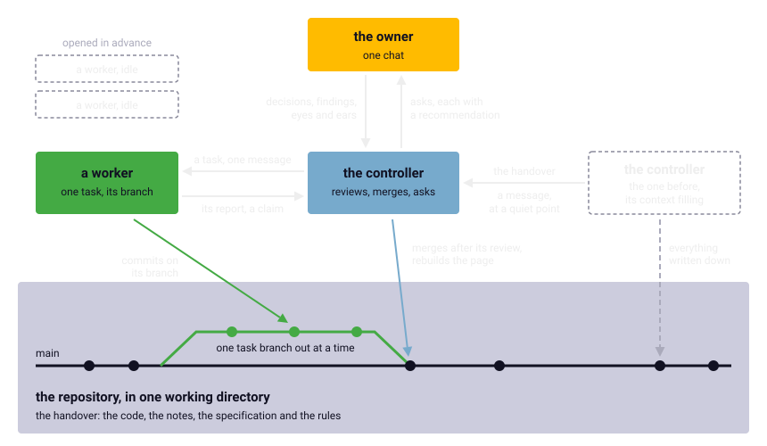

Chapter 10
{ .chapter-kicker }

# How the port was made

This book is a case study in two things: how a port was made faithful, which chapters 5 to 9 told, and how the work was arranged, which this chapter tells. The port was made by its owner and by the sessions of an AI coding assistant, arranged so that the [instruments](../glossary.md#instrument), not the readers of the listing, would decide. By its end you will know who "we" were, the rules the sessions worked by and why, what a task and a review contained, the milestones in order, which model did which work, and what it all took. It is an overview, not a diary.

## Who we were

Two kinds of hand made the port. The first is its owner's. The owner set the goal, a faithful port in one HTML file with the logic taken from the executable, and made the decisions that shaped it: the keys, the order of the milestones, what was dropped, whether to publish. The owner tested what no instrument could, the fades by eye and every sound by ear. The owner's own Amiga, a PAL machine, confirmed which way the stick climbs, and a film of its screen measured how long a pass takes (chapter 7). The work ran on the owner's computer, and the owner plays the port: findings from playing became tasks between the milestones.

The rest was done by sessions of an AI coding assistant, Claude Code. A [**session**](../glossary.md#session) is one conversation with the assistant in a terminal opened in the repository: it reads files, runs commands, writes code and commits it. A [**commit**](../glossary.md#commit-version-control) records a set of changes in the repository's history, with a message saying what they are. What a session has read and written is its context, which has a limit; when it fills, a fresh session takes over, knowing nothing of the conversation before it. Only the owner can open a session, and the owner sets its model and its effort, how much the model may reason on each step, at the controller's recommendation.

One session led. The [**controller**](../glossary.md#controller) is the session the owner talks to: it assigns the tasks, checks every result itself, merges, keeps the specification and the rules true, and is the only session that asks the owner for anything. The others were [**workers**](../glossary.md#worker), each doing the tasks the controller sent it, one at a time, a milestone or a bounded part of one. A task reaches a worker as a message from one session to another, which the assistant delivers by name; the report comes back the same way. Since only the owner can open one, the owner opened workers in advance, idle until a task came.

The controller changed too. Its context costs budget on every turn and fills as the work goes on, so before it was full, at a quiet point, it handed the lead to a fresh session opened in advance. That is a [**handover**](../glossary.md#handover): the lead passed on through the repository and a message saying where things stand. It works only if the repository holds everything, so the rule all sessions work by is that nothing may live only in a conversation. A worker starts from the specification and the notes, and ends by writing back its names, its findings, each routine's status, and every correction to the specification it proposes, which the controller folds in.

/// caption
The arrangement. The owner opens every session and talks to the controller, which sends a worker its task and reviews its report. All share one working directory, one task branch out at a time; a controller hands the lead on through the repository.
///

The sessions' handbook, [`CONTROLLER.md`](repo:CONTROLLER.md), is published as it was used; [`CLAUDE.md`](repo:CLAUDE.md) holds the rules every session works by.

## The rules, and what each answers

A worker never asks the owner anything. Its questions, and whatever needs the owner's eyes, ears or decision, go into its report, and the controller relays what it cannot answer itself. The owner watches one chat, the controller's, and would miss a request made anywhere else.

Every ask of the owner carries its whole context and a recommendation, and is repeated in every [**brief**](../glossary.md#brief), the controller's short account of where things stand, until it is answered: by the time the owner reads, the terminal has scrolled far past any earlier message. An ask asks for the least that settles the question and recommends an answer to each decision, so that a reply of one line, all as recommended, settles it.

All sessions share one working directory, the one copy of the repository on the owner's disk. A worker works on a [**branch**](../glossary.md#branch-version-control), a line of commits kept apart until the controller merges it, folding its commits into the main line. While the worker has its branch checked out, its files in the directory, the controller edits nothing, since a file it made could be swept into the worker's commits. So a task goes out only with nothing left uncommitted and no other worker busy, one branch out at a time; the owner decided against a working directory for each worker. The page is the owner's copy of the game: a worker never commits it, and the controller rebuilds and commits it at every merge, so that the committed page is always the build of the committed sources.

The owner works on the same computer while the sessions run, so the tests' browsers are muted, a test that needs a visible window runs while the owner is away, since a covered window stops the page's clock, and while the owner works the suite takes at most four cores.

The owner is often away for hours and did not want the work to wait for their testing. The controller therefore goes on through the milestones, decides routine questions itself and states each decision and its reason in the next brief, so that the owner can overturn it, stopping only for a question nothing sensible can be done without. Where the project records when something happened, the time comes from git's commits, not from a controller's own sense of the clock, which was found off by up to half an hour.

A worker stops and reports instead of trying again when an oracle test still fails after two fixes, when a hand-written routine is not understood after reading it whole, or when a change would alter a structure's layout, the core's interface or a porting rule: those are the controller's decisions, and through it the owner's. The owner let the controller merge once a result was checked; nothing is pushed, sent to a server such as GitHub, without the owner's word.

## A task and a review

A task is one message, and its first line is a complete sentence, since that is all a worker's terminal shows at first. The handbook gives a task ten parts:

1. what the task is, from the controller;
2. that the owner set this up and the worker reports to the controller only, so that it knows the arrangement is the owner's wish and does not ask them;
3. what to read first;
4. a clean tree, nothing uncommitted, and the branch and commit to start from;
5. what may be changed and what not: never the specification or the rules, whose changes are proposed in the report;
6. the deliverables, numbered;
7. the verification, as a method rather than a wish;
8. the milestone's acceptance criterion;
9. when to stop and report;
10. what the report holds: the files, the commands with their real output, where the specification was wrong or silent, what is fragile, what needs the owner, the commits.

A report is a claim, and claims in reports were found wrong: a review found that the last records of a map, which a report called uninitialised on a real machine, are not. A run can also seem to pass when it has not: piped through another command, a test run ends with that command's exit code, so an exit code of zero proves nothing. Hence a report carries the commands' real output, and the reviewer runs everything again. Before anything is merged, a [**review**](../glossary.md#review) checks it in seven steps:

1. the git facts: the commits, no forbidden path touched, nothing committed that the build makes, such as the page or the native library, and no game data;
2. a clean rebuild and the full suite, run by the reviewer;
3. no game content in the hand-written files;
4. a reading of the code that carries the weight and of how the tests compare, for a differential test must really run the original and the port;
5. one check of the reviewer's own that the worker's tests could not make;
6. a follow-up on the same branch if anything is wrong, and the review again;
7. the merge, the findings folded into the specification, the page rebuilt.

The fifth step is the one chapter 8 ended with: the worker's tests pass on what it thought of, and a check on inputs it never chose meets what it did not. The reviews' own runs and checks found real defects. The full suite, run again at a review on a busy machine, failed one script once, a failure traced to the timeout of chapter 9. A [closed loop](../glossary.md#closed-loop) on another seed and at other pass rates differed, which was traced to the record of sound samples that belonged to the process and, beside it, a register's upper word handed on, both chapter 9's. A reviewer's own reading of the game's call into the music player found a path in it the port had to mark as a [stand-in](../glossary.md#stand-in).

By the owner's rule, a follow-up confined to the port's own key layer, such as the keyboard assist, or to the page, on which no ported routine depends, gets a targeted run: the tests of the layer, the page tests in both browsers with a visible window, and the closed loop over two mission scripts, which shows that the layer switched off changes nothing. Anything that touches ported code, and every milestone, gets the whole suite.

## Inside a milestone

Each routine went the same way, in [six steps the specification sets out](../glossary.md#working-method): its [control-flow skeleton](../glossary.md#control-flow-skeleton) read, then the routine in the [listing](../glossary.md#listing); its name given and the listing made again; the C written with the original's address in a comment; a [pure routine](../glossary.md#pure-routine) held by an [oracle](../glossary.md#oracle) test; its status set in the [routine inventory](../glossary.md#routine-inventory); and a note written once a part of the game was understood, for later sessions to start from. Every statement in the milestones' [porting notes](../glossary.md#porting-note) says how it is known: observed or measured, with the tool or the test that shows it, or read from the listing alone. No session loads the listing whole, about 1.6 megabytes; it reads a skeleton, a search or a range of addresses, and keeps its context for the work.

The questions a milestone needed answered were settled before it began, or as the first thing it did. The specification lists thirteen points to establish, each answerable from the listing and due before the milestone that needs it. Four were a task of their own before the missions: what a [pass](../glossary.md#pass) writes and a tick reads, the game's objects and the map's records, answered by watching the [headless original](../glossary.md#headless-original), and the floating point, against the ROM.

## The milestones

The milestones, each ending with a working page and passing tests, in the order they were begun:

| Milestone | What it delivered | What held it |
|---|---|---|
| M0 | the build, an empty core, the shell's screen, clock, keys and sound | the page from a file, a steady test pattern, a tone after a key, nothing from the network |
| M1 | the file system, the loaders and decoders, the font, the tables | the first pictures in their colours, the decoders under the oracle |
| M2 | the headless original, as far as a mission's first pass | a dump after every tick, and two runs the same |
| M3 | the [front end](../glossary.md#front-end) and the port's keys | the original's choices for the same keys, compared VBlank by VBlank |
| four points to establish | what a pass writes and a tick reads, the map, the objects, the floating point | the headless original watched; the floating point against the ROM |
| M4 | the world and the player | a mission flown and ended, compared tick by tick in both loops |
| M5 | the weapons and the ground targets | the same, on the first three maps |
| M6 | the enemy aircraft and the ships | the same, on all fifteen maps |
| M8 | the sound effects and the music | the sound events equal in every loop, the music VBlank by VBlank, the owner's ears |
| M7 | the campaign, the saved game and the demo | a full campaign playable; the demo byte for byte, the saved file but for four pointers; a recorded demo played back after a page reload |
| M9 | the picture drawn by the graphics card | the frame time at the screen's size in both browsers; the owner's look in full screen, asked for |
| the release groundwork | the page and the game data in the repository, one check of the ROM, the [generated files](../glossary.md#generated-file) held to their regeneration | a fresh clone, with and without the ROM; one run of the suite |

M4 to M8 were each done in two parts, with a review and a merge between them, and each milestone's stand-ins named what the next had to reach (chapter 8). The order was the owner's. The front end came before the missions because it showed progress in the browser early, depended little on the game's objects, and the owner's look at the running page found what tests could not. The sound came before the campaign, to be in the page sooner for the owner's test flights. M9 was to be the shell's polish until the frame rate halved at a large full-screen size; the owner made it the drawing on the graphics card.

Three things were left undone, each by the owner's decision. M10, the shell's options (chosen keys, a gamepad, scaling, the video standard, a mute for the title music, an export of saved games), was dropped when the owner judged the game done for now; only bug fixes may come. The hidden cheat sequence was not needed (chapter 1). And beyond the one film the real machine was not measured: a busy scene's rhythm, the fades' speed and a directory's order stay as the port has them, because the port felt right to the owner.

## Two models, one worker at a time

The work ran on two kinds of the assistant's model: the controller on the stronger and scarcer, Fable, the workers on the cheaper, Opus, and a task that no observation could check went to the stronger. The owner's budget for the stronger model was limited, and the controller needed it on every turn, for the work the handbook keeps that model for: reading no observation can check, decisions no test can catch.

The handbook gives the reason the cheaper model was enough: what makes a worker reliable at reading is its task, not its model. A task demands that every finding be backed by an observation, from the oracle, the headless original or a test, and says which instrument answers which question. A reading mistake of the early days, the stick's bits of chapter 9, was found by an observation, not by a better reader.

The owner asked whether a worker should split its work among many agents at once. The controller's assessment was: not for now. The original program, run and compared, is a stronger adversary than a reviewing agent; time on the clock was not what was scarce; every agent pays again to read the rules and the notes; and the work is a chain through shared files. One estimate settled it for the missions: the game's object system is narrow, not wide, a few tables run by a few kilobytes of code in a handful of groups that share their helpers, with one routine deciding a record's behaviour. There was nothing wide to split, and one worker per milestone stayed. The one use of several agents is this book's: its fact-check and its readability read are two agents the controller starts for each chapter.

## What it took

The game took about twelve days of calendar time, from the first commit to the owner's decision that it was done. As the repository's own note on what may follow reckons, about two fifths of that went into what does not depend on this game, the instruments, the core's own machinery such as its memory and file system, the shell and the method, and three fifths into the game itself.

/// figures
| What it took | How much |
|---|---|
| Calendar days, the first commit to the game done | about 12 |
| Commits, the game and the book so far | about 290 |
| Controller sessions, to the game's end | 11 |
| Worker sessions, by the handbook's own naming | about 10 for the game, 9 for this book |
| The core, in C | about 19,400 lines |
| The shell, in JavaScript, HTML and CSS | about 2,400 lines |
| The tools | about 12,400 lines |
| The tests | about 23,000 lines, about 930 tests |
| A full run of the suite | about an hour and twenty minutes: the emulator tests over the cores, then the page tests alone |
| The notes | 29, about 196,000 words |
| The specification | about 19,700 words |
///

Eleven controllers in twelve days means a controller's context lasted about a day of reviews. The workers are fewer than the milestones: a milestone's two parts sometimes shared a session, and the owner's findings from play had a worker of their own for task after task.

The program's routines, by the inventory's status (chapter 4):

| Status | Routines |
|---|---|
| verified | 167 |
| ported | 155 |
| partial | 1 |
| replace | 47 |
| drop | 36 |
| todo | 210 |

One routine is partial, the scripts running only part of it; the two stretches they never reach, a debugging line to the console, are ported from reading. A routine starts as `todo`, while `replace` and `drop` mark a decision; most of the 210 are the C library and the system's glue at the end of the code, or code with no caller in the listing, on which nothing had to be decided.

## What the arrangement learned the hard way

The handbook keeps the lessons that cost time as warnings; these are the arrangement's own.

- An expired login stops every session without a word, so before a long run without the owner the controller checks the login and has it renewed.
- A computer left alone sleeps, which stops every session; once it cost an hour in mid-milestone. A long run without the owner starts with a command that keeps the machine awake, and a test that ran across a sleep counts for nothing.
- A usage limit stops every session in mid-turn; the controller is told when it resets, a worker is not. What carried the work through the first such stop has stayed: the controller checks about every fifty minutes and tells an idle worker without a report to look at the repository first and count an interrupted test run as void, and every task carries the same clause and asks for whatever passes to be committed.
- The assistant tells the controller whenever a worker falls idle, at every pause between its turns, even while it waits on a long command; so the controller asks for one such notice with the task and otherwise waits for the report.
- A controller's test run that overlapped a worker's rebuild compared an old native library with a new WebAssembly core, which the save-state tests hold to each other, and four tests failed that never failed again; a run is stopped before a follow-up that builds goes out.
- The suite's move to running in parallel was checked with five full runs where one would have done, at the cost of an afternoon; by the owner's rule, a change to the infrastructure gets one run.

## An honest account

In those twelve days the sessions read and rewrote every routine of the game's own that the scripts run, gave 445 of the program's 616 routines a name, and wrote the notes and the tests; the figures above give their size. The port does the C library's work and the system's its own way.

The sessions also got things wrong, in reading, in the instruments and in the tests, as chapter 9 told. All but one were caught by an instrument, by a reading of what the code really calls, or by the owner's eyes, ears and keyboard; the exception was the builder's path left in the page, found before the release.

The owner did what no session could: the decisions, the eye on the fades, the ear on every sound, the real Amiga and its film, and the playing that found what no test had, such as the page in Firefox standing still and silent after it went to full screen, or a key that would not open the page's diagnostics in two browsers. No session can decide what the port is for, or hear whether a song sounds right.

That makes the port a record that can be checked rather than trusted. The source, the notes with what was observed and what was only read, the tests, the handbook and the history of every change are in the repository, and anyone with the ROM, a Mac and the two browsers the tests drive can run the original beside the port and compare.

The owner's idea of what may follow is written down, not started: a template, "Amiga to Web", that would carry the instruments, the core's machinery, the shell and this method to other Amiga games built like this one, proven only when a second game went through it.

## The same method for this book

This book is made the same way. Each chapter starts as a [**fact sheet**](../glossary.md#fact-sheet): every claim it will make, with its source in the repository. A worker writes the draft from it. A reader that had no part in the draft, an agent of the controller's, checks every claim against the notes and the listing, and another, given only the chapter and the glossary, reads it as you do and reports where it lost the thread. The controller reads and edits; the owner's read is the last gate. The order of events comes from a dated record outside the repository; the claims are sourced inside it. At every chapter's merge so far, something in the notes or the specification was corrected: the method checks the record as well as the book.

## What comes next

Part I has told how the port was made and how it is known to be faithful. Part II opens the game itself, with the deep dives chapter 2 promised, now that you know how the knowledge of it was made and kept, beginning in chapter 11 with the display.

## Further reading

The files named here are in the repository, [`github.com/sy2002/wof-wasm`](repo:).

- [`CONTROLLER.md`](repo:CONTROLLER.md), the handbook: ["The arrangement"](repo:CONTROLLER.md#the-arrangement), ["What a task contains"](repo:CONTROLLER.md#what-a-task-contains), ["Reviewing a report"](repo:CONTROLLER.md#reviewing-a-report), ["Models and effort"](repo:CONTROLLER.md#models-and-effort), ["The plan ahead"](repo:CONTROLLER.md#the-plan-ahead) and ["Pitfalls that cost time"](repo:CONTROLLER.md#pitfalls-that-cost-time).
- [`CLAUDE.md`](repo:CLAUDE.md): ["Session protocol"](repo:CLAUDE.md#session-protocol) and ["Rules"](repo:CLAUDE.md#rules).
- [`SPEC.md`](repo:SPEC.md), sections 7.4, ["Working method"](repo:SPEC.md#74-working-method); 9, ["Milestones"](repo:SPEC.md#9-milestones); 10, ["Points to establish"](repo:SPEC.md#10-points-to-establish).
- [`book/BOOK.md`](repo:book/BOOK.md#6-the-way-of-working), section 6, "The way of working".
- [`re/notes/amiga-to-web.md`](repo:re/notes/amiga-to-web.md), the idea of a template.
- [`re/notes/testing.md`](repo:re/notes/testing.md#times-and-how-many-workers), "Times, and how many workers".

Outside the repository: [the assistant's documentation](https://code.claude.com/docs/en/overview), for the tool itself; Wikipedia's ["Code review"](https://en.wikipedia.org/wiki/Code%5Freview), the practice the review follows.
