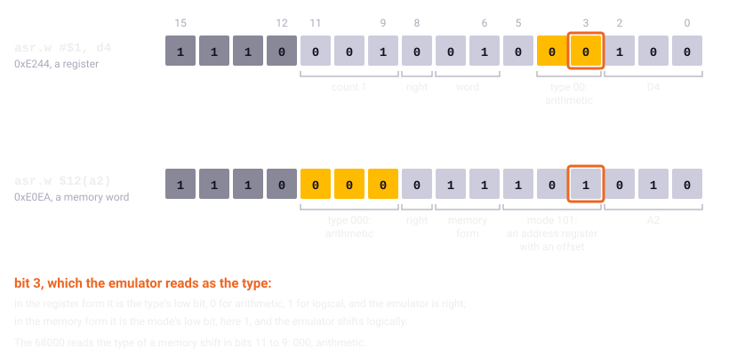

Chapter 5
{ .chapter-kicker }

# The oracle

A faithful port is held to the original as a whole and one routine at a time. By the end of this chapter you will know how a single routine is taken out of the original program, run on an emulated 68000 beside its port and compared with it on thousands of inputs, and why the project needed that before it could run the original whole. You will know what "verified" in the inventory of routines promises and what it does not. And you will see the instrument itself put to the test: a test that failed although the port was right and so exposed a fault of the emulator, flags the emulator reported stale, and the ROM's own floating point as the reference for the port's.

## One routine at a time

The port was written from the [listing](../glossary.md#listing), routine by routine, and every ported [routine](../glossary.md#routine) names the address of its original (chapter 4). The obvious test runs the whole game twice, the original and the port, and compares them; the project does that too, tick by tick (chapter 8), and that is what finally says whether the game behaves the same. But a comparison of whole runs says only that the two part company, from which tick on and, with a report it can make, which routine wrote what. Which input made it go wrong, it cannot say.

Run one routine alone, on inputs the test chooses, and a failure names the routine and the input. The test can also choose inputs the recorded missions never produce. A bomb kills the running soldiers within a band of pixels around where it lands, its killing span. When the port was broken on purpose, by making that span one pixel wider, the recorded [mission scripts](../glossary.md#mission-script) run against it went through unchanged, because none of them puts a soldier at the edge of a span; the test of the routine alone, over random states of the game, failed. Chapter 8 tells of these deliberate breakages.

There was a third reason. The first things the port needed were the loaders and decoders: the unpacker, the reader of the pictures, the shapes, the font. They could be held to the original's own routines before anything could run the original whole, which came after and is chapter 6's subject.

## The arrangement

A test of this kind is a [**differential test**](../glossary.md#differential-test): one that hands two implementations of the same thing the same input and demands the same output. The instrument that runs the original's side is the [oracle](../glossary.md#oracle), as chapter 1 called it; the test calls both sides and compares.

The original's side runs in Unicorn, a library that imitates processors, built on the processor emulation of QEMU, a well-known [emulator](../glossary.md#emulator). An emulator of the whole Amiga would run the whole machine; the tests need to call one routine, set its memory and registers and watch any instruction, thousands of times from Python, and that is what such a library offers. Left to itself, Unicorn imitates a ColdFire, a related chip that lacks instructions the game uses, so the oracle tells it to be a [68000](../glossary.md#68000). It gives it two megabytes of plain memory, room for the program, a stack and the test's buffers, and loads the program at the [fixed load layout](../glossary.md#fixed-load-layout) of chapter 3, every [relocation](../glossary.md#relocation) applied, so each address in the listing is the routine's own: a test calls `0x016FF6`, and `colour_lerp` runs.

The port's side is its C, compiled by the test machine's own compiler into a [**native library**](../glossary.md#native-library): the port built as a library for the computer the tests run on, rather than as the page's WebAssembly. The sources are the same; a test in Python can call the native library directly, routine by routine, and the replay of chapter 1 holds the page's WebAssembly to the same results. Entry points for the tests alone, compiled into this library and nowhere else, reach the port's internals through plain numbers, so a test need not copy the layout of the port's structures and the page carries none of them.


/// caption
The oracle: one routine of the original under emulation, its port in the native library, the same inputs into both and the outputs compared.
///

## Calling a routine without its program

A routine expects its arguments, the game's variables and somewhere to return to, and the oracle provides each.

A compiled routine is called as its callers call it, by the compiler's [calling convention](../glossary.md#calling-convention) of chapter 3: the test pushes the arguments onto the stack, two bytes for an [int](../glossary.md#int-the-c-type) and four for a long or a pointer, and reads the result from D0. Where the routine reaches the game's variables, the oracle sets A4 to `0x02AFFE`, the [small-data base](../glossary.md#small-data-base) the game's own code keeps there. A hand-written routine follows no convention but its own, so its test sets the [registers](../glossary.md#register) the routine was read to take: `text_width` of chapter 4 gets the text's address in A0 and its length less one in D0.

As the return address the oracle pushes a trap address at which the emulation stops. A routine still running after 50 million instructions, far more than any routine of the game needs, has run away and fails, as does one that touches memory outside the two megabytes, with the address and the instruction: a failure with a place, not a test that hangs.

Most routines read and write the game's variables, which are inputs and outputs too. Every variable ported from the original is registered with its original address, so the test can write one state of the game into both sides, the byte order turned round because the 68000 is [big-endian](../glossary.md#big-endian) and the test machine [little-endian](../glossary.md#little-endian), and afterwards compare every registered variable and table either side touched. A routine can run alone whenever its inputs, the game's state among them, can be set so.

Some routines call things that mean nothing without the operating system, which is not there to give out memory, clear a picture or read a file. For those the test uses a [**stub**](../glossary.md#stub): a stand-in that answers for something the routine calls but that is not under test. The first tests need three. The game's wrapper around the system's allocator hands back a fixed buffer. The game's routine that clears a picture's memory, which calls the system's, returns at once, and the test clears the bytes itself, so both sides start from the same empty picture. The routine that loads the font, which only prepares the tests of the text, has its call of the file reader replaced by an instruction that hands over the font's address, already in the emulated memory. The routines under test are never changed; the later tests add stubs of their own by the same rule, each in the test that needs it, with its reason beside it.

## A test, read

Here is the test of `colour_lerp`, the step of a fade whose listing chapter 4 read, from [`tests/test_oracle_m1.py`](repo:tests/test%5Foracle%5Fm1.py). Look first at `compare`, which runs the original and the port on one step and two colours and, if they differ, fails with the input and both answers; then at the two kinds of input below it.

```python linenums="1"
--8<-- "generated/listings/py/test_colour_lerp_matches_over_its_range.py"
```

`Original()` on line 9 is one emulated machine with the program loaded; `ported` is the native library. The loops on lines 24 to 28 fade every colour to black and to white, and black to every colour, at each of the 16 steps: every fade the game runs. Lines 30 to 32 add 20,000 random triples of a step and two colours. The random numbers come from a fixed seed, the 11 on line 30, so every run draws the same inputs and a failure can be repeated exactly. Set `WOF_SLOW_ORACLE=1` and lines 17 to 22 run the whole cross product instead, every step from every colour to every colour, which takes about an hour and a half.

## Every input, or many

The first tests, of the loaders and decoders, take every input where the inputs are few, as the box lists. The unpacker's random streams include the control byte `0x80`, which chapter 3's format reads as a signed byte: the most negative value, asking for the longest run of bytes to be copied, an edge of the format. The port's pixels for each shape are compared with the test's own reading of the planes the container holds. The shapes of the player's aircraft, which the game mirrors in place whenever the aircraft turns round, are mirrored by both sides and compared; a mirror is its own inverse, so the port's result, mirrored again, must come back as it was, which catches a mistake in either direction.

/// figures
| The tests | What they cover |
|---|---|
| Packed files, through the unpacker | all 10, and 40 random streams |
| Files, through the loader | all 55 the port carries |
| Shapes, converted to pixels | all 1,049 |
| Shapes of the player's aircraft, mirrored and back | all 216 |
| The fade's arithmetic | every step of every fade, and 20,000 random triples |
| Picture files, through the picture reader | all 12: the 9 pictures and the 3 palettes kept as pictures |
| Palette files, through the palette reader | all 6 |
| The player's flight | 3,000 random states |
| The bombs, rockets and torpedoes | 2,500 random states |
| The writer of a saved game | 600 random states |
| Oracle tests in the suite | over 300 |
///

The later routines' inputs are thousands of random states of the game, and a random state is not random bytes: each test builds a state its routine can meet, from a map of the disk, with objects near the targets and the player, and each field drawn mostly from the values the game uses and now and then from anywhere in its range.

Drawing is the exception. The original draws its shapes with the [blitter](../glossary.md#blitter), the Amiga's drawing chip, and the emulator imitates only the processor. So the blit tests map the chips' addresses as plain memory, and whenever the original's drawing routine writes the register that starts a blit, the test captures the blitter's registers as they stand: the sequence of register settings, the programme. A small model of the blitter, [`tests/blitter.py`](repo:tests/blitter.py), replays it on a copy of the picture, and the pixels are compared with the port's. The clipping, the addresses, the sizes and the masks in the programme are the original's own; how the blitter combines them is documented hardware behaviour that the project modelled and did not derive from the original. The port's drawing rests on the same reading of the documentation, so a mistake in that reading would be shared and pass unseen.

One test leaves the port out. The clip is the rectangle the game allows drawing in; drawn over a picture of all zeros and one of all ones, a blit may change no pixel outside the shape's box within the clip. The blitter works in words of sixteen pixels, and the original's programme masks the edge words so that nothing outside the box changes, which lets the port clip pixel by pixel. Chapter 12 returns to the model.

## What verified means

A routine is [verified](../glossary.md#verified) when it is ported and held to the original by a test of its own; for a [pure routine](../glossary.md#pure-routine) that test is the oracle's and is due before the status is set. Pure is meant broadly: the specification counts arithmetic, table lookups, decoders, collision tests and state machines over plain structures. So `object_step`, which moves an object through the game's state, is verified under the oracle on random states written into both sides.

Held otherwise are the routines whose work is to run others in turn, as the tick and the pass do, to draw the world from the map, or to talk to the system, as the loader of a map does. They are `ported`, held by the comparisons of whole runs, which also hold what no test of one routine can: the order and the moment in which the game calls its routines (chapter 8). About a quarter of the 616 routines of the [routine inventory](../glossary.md#routine-inventory) are verified. The status is a judgement written by hand and no tool checks it; the test is the evidence.

A test is also only as good as its inputs. A register's upper half was once assumed to be zero at a routine's start, because every recorded run had found it so, until a run found it otherwise; chapter 9 tells the story. Since then the rule is never to assume it, and the oracle tests of the later routines draw it at random.

## The instrument is checked too

Were the emulator wrong, a test would fail a right port or hold a port to a wrong answer, so the instrument is checked too. [`tools/oracle.py`](repo:tools/oracle.py), run on its own, tests itself: it runs the original's unpacker on all ten packed files and compares what comes out with the project's decoder in Python, [`tools/rpck.py`](repo:tools/rpck.py). The loader test holds all 55 files to that decoder, which for the packed ones answers as the original's unpacker does, by the self-test, and for the others hands back the disk's own bytes.

A harder lesson came from a test that failed where the port was right. A shift moves the bits of a number along; one place to the right halves it. An [**arithmetic shift**](../glossary.md#arithmetic-shift) right copies the sign bit into the top, so a negative number stays negative and is halved, rounded down. A [**logical shift**](../glossary.md#logical-shift) right fills the top with a zero, which suits a number without a sign and turns a negative one into a large positive one. The 68000 has both, for a register and for a word in memory; a [**memory-form shift**](../glossary.md#memory-form-shift) shifts a word in memory by one bit.

The test of `objects_step`, which moves the bombs, rockets and torpedoes by calling `object_step` for each, failed over its random states. When a bomb lands on an airfield's runway, `object_step` bounces it: it turns the vertical speed round, halves it and caps it at 9, then halves the horizontal speed, and once either is zero the bomb is done. A speed is a long here, its upper word the whole pixels a tick, its lower word the fraction:

```wingslst
--8<-- "generated/listings/asm/object_step_bounce.lst"
```

`neg.l` turns the vertical speed round, `asr.w`, an arithmetic shift right of a word in memory, halves its upper word, and the next three instructions cap it at 9. The second `asr.w` halves the horizontal speed, and the `bne.w` after it branches on whether the result was zero. It reads that from the [**condition codes**](../glossary.md#condition-codes), or flags: five bits the 68000 sets after most instructions, saying whether the result was negative (N), zero (Z) or too large for its width (V), whether a carry came out (C), and a copy of the carry for arithmetic over several words (X). They sit in the low byte of the status register.

On one of its random states the port turned a vertical speed into −2, and the original, under the emulator, into +9. The word to be halved was `0xFFFD`, which is −3. By the manual's definition of the arithmetic shift, a 68000 makes it `0xFFFE`, which is −2, and so did the port. The emulator made it `0x7FFE`, 32,766, as if the word had no sign, and the routine capped that at 9.

The reason lies in the instruction's first word, its [opcode](../glossary.md#opcode). A shift of a register keeps its type, arithmetic or logical, in bits 4 and 3 of that word. A shift of a word in memory needs those bits to say where the word lies, and keeps its type higher up. The emulator reads bit 3 in both forms.



/// caption
One bit, two meanings: in a shift of a register, bit 3 is the type's low bit; in a shift of a memory word it is the mode's, and an address register with an offset, as in the game's, sets it. The emulator takes it for the type in both.
///

One failing case says little of the rest, so we went through every shift and rotate with a memory operand in the program; a rotate is a shift whose bit that falls out comes back in at the other end, here by way of the X flag. There are 48, five of them arithmetic, and the emulator gets those five wrong:

| In memory | How many | What the emulator does |
|---|---|---|
| arithmetic shift right, `asr.w` | 3 | shifts logically: a wrong word |
| arithmetic shift left, `asl.w` | 2 | the right word, a wrong overflow flag |
| logical shift right, `lsr.w` | 1 | right, by the same fault |
| rotate left through X, `roxl.w` | 42 | right |

Two of the three right shifts are the bounce's. The third halves an argument of a compiled routine that lays out a viewport's planes in a copper list, when a flag of its own is set:

```wingslst
--8<-- "generated/listings/asm/cop_vport_planes_shift.lst"
```

The port builds its copper lists its own way, but the whole original of chapter 6 runs this routine, so the shift matters there. The left shifts' wrong overflow flag is overwritten by the next instructions before anything reads it, and the rotates, which scroll the ticker's text, run right.

The correction is a [**hook**](../glossary.md#hook): a routine of the instrument's own that the emulator calls whenever the program reaches a chosen instruction or touches chosen memory. Unicorn is a package pinned at one version, so the correction lives not in a patched emulator but in the repository, in [`tools/m68k_fix.py`](repo:tools/m68k%5Ffix.py), where a test can hold it; it puts a hook on each of the three right shifts. Here is the shift as a 68000 does it, then the hook:

```python linenums="1"
--8<-- "generated/listings/py/asr_word.py"
```

In `asr_word`, the `| (value & 0x8000)` on line 5 is the whole difference from a logical shift: it puts the sign bit back on top. Line 6 makes the flags: the bit that falls out becomes C and X, the top bit N, a zero result Z.

```python linenums="1"
--8<-- "generated/listings/py/_shift.py"
```

In `_shift`, lines 3 to 5 work out the word's address from the address register and the offset that follows the opcode. Line 6 shifts the word, line 7 writes it back, line 8 puts the flags into the status register, and line 9 moves the program counter four bytes on, past the instruction, so that the emulator never executes it. The flags are not a nicety: the bounce's `bne.w` reads them.

The oracle installs the hook whenever it loads the game's program, and the whole original that chapter 6 runs is built on the oracle, so both instruments carry the correction. A test holds all of it: that the emulator still shifts wrongly, so that a corrected emulator will say the hook can go; that the hook gives the 68000's word and flags and the next branch sees them; and that its list holds every arithmetic right shift of a memory word in the listing.

The bounce lies in a part of `object_step` that no recorded mission executes, because no script's weapon comes down on an airfield, and the tests of that time passed with the correction as they had without it. No recorded mission met the fault; a test over random states did.

## Flags that go stale

The flags a routine leaves at its return are part of what it gives its caller. The floating-point routines of the ROM leave theirs on purpose, and the program branches on them at five places, all in a number formatter the game never runs. The port keeps the flags all the same: it copies the ROM's routines instruction by instruction, and those routines read their own flags in their arithmetic, so the flags at the return come with them.

Unicorn does not hand the flags out reliably. Like QEMU, on which it is built, it works the flags out lazily: it keeps the last operation and its operands and computes the flags only when an instruction needs them, because most flags are never read. Reading the status register from outside gives whatever was last worked out. After `addq.w #1` on `0x7FFF` it reports a negative result without the overflow, where a 68000 sets both. After `tst.w` on `0x00010000`, whose lower word is zero, it reports nothing at all, where a 68000 sets Z.

The oracle's answer is to let the routine return through two instructions of its own: a move of the status register into a memory slot, then a jump to the trap address. Neither changes a flag, and the move runs inside the emulation, which forces the flags to be worked out first. The instrument is tested before it measures anything: nine short hand-made sequences of instructions, whose flags Motorola's manual fixes, run through the oracle, and all but one would come out wrong if it still read the lazy register.

## The ROM's own floating point

The [fast floating point](../glossary.md#fast-floating-point) whose flags opened the last section lies in the [Kickstart](../glossary.md#kickstart) ROM, and the game's flight model computes with it. The tests run the ROM's routines under the oracle: the ROM image is mapped into the emulated memory, the library found in it by its name and called through the game's own entry points. The port's nine operations are the ROM's instructions transliterated into C, because a browser's own floating point rounds differently and the flight would drift; they are held to the ROM's in the result, in D1, which the ROM's routines also set, and in the flags.

The cases are the known edges; random numbers shaped to make the hard cases frequent, exponents close together, mantissas that differ in their last bits, the ends of the range and both ways into a division by zero; and every pair of numbers the game was seen to hand the library in a run. They run on the native library, in WebAssembly and under a checker that stops at the first undefined behaviour of C it can detect. A long run beside the suite, [`tools/ffp_soak.py`](repo:tools/ffp%5Fsoak.py), adds a million random operands for each operation; at its last run not one result differed. Chapter 14 tells what the game computes with them.

/// figures
| The floating point | How much |
|---|---|
| Operations held to the ROM's | 9 |
| Cases in the suite | over 27,000 |
| Random operands in the long run | a million an operation |
///

/// dev
The oracle is [`tools/oracle.py`](repo:tools/oracle.py): `Oracle(a4=0x02AFFE)`, then `o.call(address, o.W(word), o.L(long), regs={'a0': ...}, ccr=True)`, which returns D0 and leaves the flags in `o.ccr`. [`tests/original.py`](repo:tests/original.py) wraps the original's routines with their stubs; `Ported` in [`tests/conftest.py`](repo:tests/conftest.py) reaches the port through [`tests/shim.c`](repo:tests/shim.c). The hook corrects `0x010BB8` and `0x010BE0` in `object_step` and `0x019D5E` in `cop_vport_planes`; [`tests/test_headless.py`](repo:tests/test%5Fheadless.py) holds the fault and the list. `WOF_SLOW_ORACLE=1` runs the colour test's cross product.
///

## What comes next

Chapter 6 runs the whole program, not one routine, under the same emulator, from its `main` routine on, with stubs for the operating system and hooks to watch it: the headless original, the reference for the comparisons of whole runs.

## Further reading

The files named here are in the repository, [`github.com/sy2002/wof-wasm`](repo:).

- [`SPEC.md`](repo:SPEC.md), section 4, ["Tools"](repo:SPEC.md#4-tools); 7.1, ["Arithmetic"](repo:SPEC.md#71-arithmetic); 7.4, ["Working method"](repo:SPEC.md#74-working-method); 8, ["Verification"](repo:SPEC.md#8-verification).
- [`re/notes/porting-m1.md`](repo:re/notes/porting-m1.md), ["How the tests establish it"](repo:re/notes/porting-m1.md#how-the-tests-establish-it); [`re/notes/porting-m5.md`](repo:re/notes/porting-m5.md), ["The emulator's memory-form shift (observed)"](repo:re/notes/porting-m5.md#the-emulators-memory-form-shift-observed); [`re/notes/headless.md`](repo:re/notes/headless.md), ["Unicorn, as it behaves here"](repo:re/notes/headless.md#unicorn-as-it-behaves-here); [`re/notes/ffp.md`](repo:re/notes/ffp.md), ["The port"](repo:re/notes/ffp.md#the-port).
- [`tools/oracle.py`](repo:tools/oracle.py), [`tools/m68k_fix.py`](repo:tools/m68k%5Ffix.py), [`tests/test_oracle_m1.py`](repo:tests/test%5Foracle%5Fm1.py) and its successors.

Outside the repository: Motorola's [*M68000 Family Programmer's Reference Manual*](https://archive.org/details/m68000familyprog0000unse), for the shifts, their encoding and the condition codes; [Unicorn Engine](https://www.unicorn-engine.org/); Fabrice Bellard's [paper on QEMU](https://www.usenix.org/legacy/event/usenix05/tech/freenix/full%5Fpapers/bellard/bellard.pdf), section 3.3, on the lazy flags.
