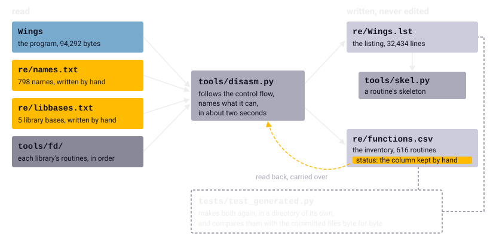

Chapter 4
{ .chapter-kicker }

# Reading the executable

The program's code, 77,644 bytes, carries not a single name, and the port was written from it, routine by routine. By the end of this chapter you will know how those bytes were turned back into something people can read, how the routines got their names, what the inventory of routines records and what a control-flow skeleton is for. You will see compiled C beside hand-written assembly and why the port must tell them apart, what could be recognised in the code, and why a reading is only a claim until the running original confirms it.

## The program as numbers

Chapter 3 left the program's code [hunk](../glossary.md#hunk) at `0x010000`: a row of bytes, and no [symbol](../glossary.md#symbol) to say where a routine begins or what a variable is for. A processor needs nothing more. A person does, and the port is written from the original's code, not from what the game seems to do, as chapter 1 said. So the first instrument of the project is a [**disassembler**](../glossary.md#disassembler): a tool that turns machine code back into [assembly language](../glossary.md#assembly-language), one instruction a line.

Decoding one instruction is mechanical. A [68000](../glossary.md#68000) instruction is one to five words of 16 bits, and the first word, the [**opcode**](../glossary.md#opcode), names the operation and how its operands are found, and so how many words follow. The project leaves this step to Capstone, a disassembly library. What makes it treacherous is that instructions have no fixed length, in this program anywhere from two bytes to eight: a decode that starts at a wrong byte does not stop, it gives nonsense that still looks like instructions.

The hard part is therefore knowing where to start. The code hunk holds more than code: the strings lie after the routines that use them, tables sit between routines, and ordinary text decodes as perfectly valid 68000 code. A disassembler that ran straight through the hunk would read every message as instructions.

So [`tools/disasm.py`](repo:tools/disasm.py) follows the program's [**control flow**](../glossary.md#control-flow): the order in which its instructions run, set by its branches, jumps, calls and returns. It starts where code certainly begins, at the program's first instruction, at every routine the [far-call table](../glossary.md#far-call-table) points to, and at every `link a5`, which opens each compiled routine (chapter 3). From each start it decodes on, follows a branch both ways and a call into its routine, through the far-call table where the call goes that way, and ends a path at a return or an unconditional jump.

Then the tool sorts what no path reached. First, wherever the program holds the address of a place in the code, the place is taken as a string if it reads as one and tried as code otherwise. Then a sweep goes through the gaps that are left, and a run of at least twelve printable bytes, at least 70 per cent of them letters or spaces, is set aside as text. Last, any other gap counts as code only if it decodes cleanly up to a return or a jump, or runs into code already found, and does not begin with bytes that are almost all printable. The sweep found 55 blocks of code that no path reaches, 45 of them routines of their own: nothing calls them, or they are reached only through an address computed while the program runs. Nearly every byte is accounted for:

| What the code hunk holds | Bytes |
|---|---|
| instructions | 73,792 |
| strings and text | 3,725 |
| the tables of four `switch` statements | 88 |
| unexplained | 39 |

## The listing

What the disassembler writes is the [**listing**](../glossary.md#listing), [`re/Wings.lst`](repo:re/Wings.lst): the whole program as assembly language, 32,434 lines, 21,332 of them instructions. Each instruction stands at its address in the [fixed load layout](../glossary.md#fixed-load-layout), so that an address names the same place in the listing, the notes, the tests and the port's comments. Here is the start of the game's main routine, `main`, with the lines the listing puts above it:

```wingslst linenums="1"
--8<-- "generated/listings/asm/main_start.lst"
```

Line 1 is the book's, naming the range. Line 2 opens the routine: its name, its kind, here `[asm]` for written by hand, and its slot in the far-call table, in decimal, `-32760(a4)`, where an operand would write `-$7ff8(a4)`. Line 3 is the comment the project gave it, whose per-frame loop is what this book calls a [pass](../glossary.md#pass). Line 4 lists the routines that call it, here the C library's start-up code, which needed no name. Line 5 is a [**label**](../glossary.md#label): a name for an address that a branch or a call leads to, on a line of its own, so that the place a jump lands is plain to see; line 18 is one inside the routine, `loc_` and its address.

An instruction's line has four columns: the address, the instruction's bytes, the instruction, and after a semicolon what the tool knows of it. Read down the routine:

- Line 6 sets a bit at `$bfe001.l`, a port of one of the [CIAs](../glossary.md#cia), and the tool leaves the address a number. It names only what the program defines or the project's lists name, and the chips' registers are neither. This bit drives the Amiga's audio filter, which dulls the high notes, and the power light: set, it turns the filter off and dims the light. The first thing `main` does is let the game's sound through unfiltered.
- Line 7 calls through the far-call table; the tool adds an arrow and the routine the slot holds, without which `-$7e1e(a4)` would say nothing.
- Line 8 calls an address given relative to the [**program counter**](../glossary.md#program-counter), the register that holds the address of the instruction being executed, so that the operand names a distance, not a place; the tool gives the routine's name, `open_libraries`.
- Line 9 loads the register A6 with the address of a library, intuition, for the call on line 10, which the tool names `intuition.CloseWorkBench`: the game closes the [Workbench](../glossary.md#workbench) as it starts.
- Line 11 sets a variable through the [small-data base](../glossary.md#small-data-base), A4, and the tool gives its name, `outside_mission`. Line 12 installs the game's routine for the [VBlank](../glossary.md#vblank), chapter 2's. Line 13 sets a variable nobody has named, shown as `g_` and its address.
- Lines 14 to 16 compare the number of arguments the program was started with against one. With more, line 17 stores the address of the name `wofdemo` in `demo_file_name`: the address is a [relocation](../glossary.md#relocation), which the tool shows by the name and the string it points to. Started with an argument, the game records a demo (chapter 17).
- Lines 19 and 20 push that count and call on.

The library calls are named in two steps. A program keeps a library's address, its [**library base**](../glossary.md#library-base), in a variable and loads it into A6, as line 9 does, to call one of the library's routines at a fixed offset below it. [`re/libbases.txt`](repo:re/libbases.txt) names the five variables that hold the bases of exec, intuition, graphics, dos and mathffp. It is kept by hand because the tool does not follow a library's address from the call that opens the library to the variable that keeps it. The tool watches A6 being loaded from one of the five and looks the offset up in that library's published list of routines, under [`tools/fd/`](repo:tools/fd/), the routines six bytes apart as the list counts them. All but seven of the code's 137 calls and jumps into a library are named so. Three of the seven are where the tool loses track of A6; the other four use a base the list does not name. These names matter beyond reading: at every call into the system the port must stand in for the operating system (chapter 2).

After the code come the data hunk's far-call slots and variables. The texts are summarised on purpose. A string the program points to stands at its own address, cut short, and again in the comment of the instruction that points to it. A run of text that nothing points to is one line with its length; six such runs are left, and the longest is most of the story, whose first line the data points to and whose further lines the code walks through one after another. The listing, which anyone can read in the repository, is not meant to be a second copy of the game's texts; the port reads them from the program when it is built (chapter 3).

## Names

Every name of the game's own routines and variables was given by the project; the system's routines carry the names their libraries' lists give them. The project's names come from one hand-kept file, [`re/names.txt`](repo:re/names.txt): an address in hexadecimal, a name and, after a semicolon, a comment. It names 798 addresses, and most names carry a comment that says what the thing does or which note tells more. A routine without a name is `sub_` and its address, which still holds for 171 of them.

The names are kept apart from the listing because the listing is made by the tool and never edited by hand, so that it can be made again whenever the tool learns something or a name changes; a name typed into it would be gone at the next run. So a routine, once understood, gets its line in [`re/names.txt`](repo:re/names.txt), and a run of about two seconds puts the name into the listing and the inventory, and from there into every skeleton; the reports of the headless original read the same file. The test [`tests/test_generated.py`](repo:tests/test%5Fgenerated.py) makes the listing again from the names kept in the repository and compares it with the listing kept there, byte for byte, so the listing a reader browses is always what the tool makes.



/// caption
How the listing is made: the program, the two hand-kept files and the libraries' lists go in, the listing and the inventory come out, and a test holds both to what the tool makes.
///

The names are the vocabulary the notes, the port's comments and the tests share: `record_at` is the same routine everywhere, and its port says `orig 0x01C982` beside its C.

## The inventory

A [**routine**](../glossary.md#routine) is a piece of the program that is called, does one job and returns to its caller. The same run of the disassembler writes the [**routine inventory**](../glossary.md#routine-inventory), [`re/functions.csv`](repo:re/functions.csv): a row for each of the 616 routines, with its address, name and kind, its size, for C its frame and arguments, its far-call slot, its callers and the routines and library routines it calls, the variables and strings it uses, and its status in the port. It is the list the work was planned on, by kind and size, and the list by which the headless original watches routines by name (chapter 6).

The inventory counts as one routine everything from an entry point the disassembler found to the next one, so every byte of the code belongs to one routine. That is nearly always right. A routine that falls through into the next one's instructions, sharing their code, is cut in two: `ship_at_offset` appears with 4 bytes, and the rest of it under the following address.

The status says where the port stands with each routine. It is the one column kept by hand; the tool carries it over at every run, and a routine new to the inventory starts as `todo`.

| Status | What it means |
|---|---|
| [**verified**](../glossary.md#verified) | ported and held to the original by a test of its own: under the oracle for a pure routine, by other tests for the rest |
| `ported` | ported and held by the comparisons of whole runs of the game |
| `partial` | ported as far as the recorded runs of the game reach it; the rest is marked, and a run that reaches it fails |
| `replace` | the port does the job its own way: the memory, the copper lists, the calls into the floating point |
| `drop` | not needed: the crack's screen, the debug reporters |
| `todo` | no status set |

The [oracle](../glossary.md#oracle) runs one routine alone, on inputs it is handed (chapter 5). A routine that reads or draws the world cannot run alone, so most of the game's logic is held by comparing whole runs of the game with the original's, tick by tick (chapter 8): `ported` names another instrument, not a lesser one. `partial` exists so that no code the port lacks ever runs unnoticed. About a quarter of the routines are verified, a quarter ported, and a third have no status. Those are not all work left: 117 of them lie at the end of the code, in the C library and the code that talks to the operating system, and 67 have no caller in the listing. The port's core has no C library and does the little the game takes from its own in its own code; chapter 8 tells how the port knew which code the game runs.


/// caption
The code hunk along its addresses, from [`re/functions.csv`](repo:re/functions.csv). Above, by kind: the first third all hand-written; compiled code in the middle with islands of assembly, the blitter library among them; at the end the C library and the code that talks to the system, most of its bytes compiled. In routines: 205 hand-written up to `0x015D62`; then 187 compiled and 61 hand-written; the blitter library's 25; and from `0x0215D8` on, 36 compiled and 102 small hand-written ones. Below, where the port stands with each routine.
///

## The skeleton of a routine

A long routine in the listing is a wall of moves and arithmetic, and what it does is easier to see in its shape: where it loops, where it branches away, what it calls. A [**control-flow skeleton**](../glossary.md#control-flow-skeleton) is that shape: the routine with only its labels, calls, branches, comparisons and returns. [`tools/skel.py`](repo:tools/skel.py) prints it from the listing, by name or address, and it is the first step of porting any routine, before it is read in full ([`SPEC.md`](repo:SPEC.md#74-working-method), section 7.4).

Here is the skeleton of `map_load`, a hand-written routine of 226 bytes: 22 lines of its 76. The lines left out are simply absent, with no mark where they were. Two labels on consecutive lines are two places that branches land on, and the forward `bra.w` enters the loop at its test, as a `dbra` loop is entered at the bottom.

```wingslst
--8<-- "generated/listings/skel/map_load.lst"
```

Read from the top, it clears the airfields and runs a short loop: the `dbra` counts a register down and branches back until it falls below zero, here adding up the missions of the ranks before the one played, to find the mission's map. It opens the map's file through dos, reads twice, the two numbers at the file's head that chapter 3 described, and asks for memory for the records, a block that comes back cleared, as the last section tells; if none is given, it branches away to the routine that ends the program. Then it reads the records, closes the file and hands the records to `map_scan`. The 54 lines left out clear the mission's counts, find the file's name and work out the sizes; they are read next, with the shape known.

## Compiled C and assembly written by hand

The two kinds of code look different in the listing, and the port must know which is which. A compiled routine keeps to the compiler's [calling convention](../glossary.md#calling-convention): its arguments on the stack, its result in D0, its [int](../glossary.md#int-the-c-type) 16 bits wide, with the widths chapter 3 showed. A hand-written routine has a convention of its own, taken from its registers, and may leave a value in a register for the next one to read, which chapter 9 shows the port had to learn. A compiled routine's arguments are where the convention says; a hand-written routine's can be known only by reading it whole, so the oracle is told the registers for each one by hand.

Two routines show the difference: `colour_lerp`, compiled C, one step of a fade from one colour to another, and `text_width`, written by hand, the width of a text in the game's font.

//// html | div.listing-pair

/// html | div
```wingslst
--8<-- "generated/listings/asm/colour_lerp.lst"
```
///

/// html | div
```wingslst
--8<-- "generated/listings/asm/text_width.lst"
```
///

////

`colour_lerp` takes three arguments: the step of the fade, from 0 to 15, the colour it starts from and the colour it goes to. An Amiga colour is three fields of four bits, red, green and blue, which the masks `$f00`, `$f0` and `$f` pick out. The routine opens with `link.w a5, #$fffe`, a [stack frame](../glossary.md#stack-frame) with room for one variable at `-$2(a5)`, and reads its arguments at `$8(a5)`, `$a(a5)` and `$c(a5)`. At step 15 it returns the target colour at once, through the `unlk a5` and `rts` near its top, to which its last instruction also branches back. Each field is worked out by the same few instructions, written out three times, blue first, where a person would write a loop. Blue and green cut their product to 16 bits with `ext.l` before `divs.w`, chapter 3's idiom. Red cannot: its difference, up to 3,840, times the step would not fit a 16-bit int, so the compiled code keeps the product whole and divides it through a helper near the end of the code, unnamed in the listing, the compiler's own division of a long. The port keeps both widths, chapter 3's lesson in miniature. Its callers, the two fades (not shown), push three words, the last argument first, call, take the six bytes off the stack again and find the result in D0. It is the routine of chapter 1's example of the oracle, held on every fade the game runs and 20,000 random colours besides.

`text_width` has no frame. With one `movem.l` it saves every register but D0 and the stack pointer, so that its caller's values survive the call. It takes the text's address in A0 and its length less one in D0, because `dbra` runs once more than its count, and it uses A5, the compiled code's frame pointer, for its own purpose: the address of the loaded font file. For each character it skips one that lies outside the font, and otherwise adds its width from the font's table, a width of zero counting as ten, and one pixel of space. It leaves the width in D0, restores the registers and returns. Its caller, `text_render`, also written by hand, takes one off the length itself before the call. That convention is written nowhere but in the routine and in the comment the project gave it.

The inventory tells the two kinds apart by one rule: a routine whose first instruction is `link a5` is C, any other is assembly. The rule holds because the compiler opens every function that way, and it counts the 223 compiled routines the specification names. The code map above shows where they lie. The first third is written by hand throughout: the main loop, the drawing of the scene, the VBlank's routine, the objects' movement. Past it the compiled routines take over, with hand-written islands such as the sound effects engine, the dashboard and the keyboard's handler, and then the blitter library.

## What could be recognised, and how

Four kinds of evidence recur behind the names and the notes.

- **A library call by its offset.** The tool names most of these by itself. Where it cannot, the same lists serve by hand: the game's nine routines of [fast floating point](../glossary.md#fast-floating-point) each push a number and jump to one dispatcher, a routine that forwards the call to the library, and the number is the routine's offset in the mathffp library, −66 for an addition. Matched against the library's list, the numbers gave `ffp_add` and its eight neighbours.
- **A text by its use.** Where the code takes a string's address, the string names what holds it. The variable that `main` fills with `wofdemo` became `demo_file_name`; a routine that asks for four blocks of memory under the names `Ricochet`, `Splashes`, `Smoke` and `Balloons` named the pools of small objects it makes ([`re/notes/objects.md`](repo:re/notes/objects.md#the-inventory), "The inventory").
- **A table by its stride.** A routine that walks a table steps by the size of one record, so the step gives the record, and the table's size divided by it the count. The smoke's pool is 800 bytes and the routines that walk it step 20, so it holds 40 puffs of smoke; a run of the original wrote it with the same stride.
- **A routine by its callers and its data.** The header lists who calls a routine, and the comments which variables it touches and which library routines it uses. `text_width` is called by `text_render` alone and reads the font's first and last character. The only routine that writes the ricochet's pool has no caller in the listing, and the runs that watched the pools never saw that one filled: as far as the listing and the runs show, this version of the game never fires a ricochet.

## A reading is a claim

Everything above is reading, and a reading can be wrong, so many of the notes mark every statement as "read", from the listing alone, or "observed", with the run or the test that shows it. To observe, the project runs the original program whole: the [headless original](../glossary.md#headless-original) can watch any routine by name, every time it is entered with its registers and its arguments, and a test holds that watching changes nothing; chapter 6 tells how. That is how the notes know what each screen of the front end draws, and what the floating point is handed in the middle of a flight. A [pure routine](../glossary.md#pure-routine) is held to its port under the oracle, chapter 5.

A routine ported from reading alone is a claim too. The routine that restores the play screen after a dialog was ported from reading and first run by a script that saves a game: 997 of that run's [passes](../glossary.md#pass) differed from the original's, in the rows below the [split line](../glossary.md#split-line) and in the ticker's, until it was fixed ([`re/notes/porting-m7.md`](repo:re/notes/porting-m7.md#the-port), "The port").

The instrument's stand-ins are claims as well. A note once blamed the machine for leaving the last four records of every map uninitialised, resting on how the headless original's stand-in for the system's memory behaved; reading the allocator the game calls showed that it asks the system for cleared memory ([`re/notes/map.md`](repo:re/notes/map.md#the-file), "The file"). The port's memory had zeroed its blocks from the start, and the finding turned that into a rule, with a test. Chapter 9 tells of a reading of the stick's bits that the running original contradicted.

/// dev
[`CLAUDE.md`](repo:CLAUDE.md#rules) holds the rule to port from the listing, never from assumptions. [`tools/disasm.py`](repo:tools/disasm.py) writes into [`re/`](repo:re/), or with `--out DIR` elsewhere, and always takes the status column from [`re/functions.csv`](repo:re/functions.csv); read that file with a CSV reader, because its strings column holds commas. [`tools/m68kdis.py`](repo:tools/m68kdis.py) `EXE START LEN` decodes an address range straight through, without the control flow; [`tools/skel.py`](repo:tools/skel.py) `ADDR --all` prints a whole routine.
///

## What comes next

Chapter 5 takes one routine out of the listing and runs it on an emulated 68000 beside its port, on thousands of inputs: the oracle, and what verified means.

## Further reading

The files named here are in the repository, [`github.com/sy2002/wof-wasm`](repo:).

- [`SPEC.md`](repo:SPEC.md), section 3.2, ["Executable"](repo:SPEC.md#32-executable); 4, ["Tools"](repo:SPEC.md#4-tools); 7.4, ["Working method"](repo:SPEC.md#74-working-method).
- [`tools/disasm.py`](repo:tools/disasm.py), [`tools/skel.py`](repo:tools/skel.py), [`re/names.txt`](repo:re/names.txt), [`re/libbases.txt`](repo:re/libbases.txt), [`re/functions.csv`](repo:re/functions.csv) and [`tests/test_generated.py`](repo:tests/test%5Fgenerated.py).
- [`re/notes/headless.md`](repo:re/notes/headless.md), ["Observers"](repo:re/notes/headless.md#observers) and ["Write summary, read hook"](repo:re/notes/headless.md#write-summary-read-hook); [`re/notes/objects.md`](repo:re/notes/objects.md#the-inventory), "The inventory".

Outside the repository: Motorola's [*M68000 Family Programmer's Reference Manual*](https://archive.org/details/m68000familyprog0000unse), for the instructions and their encoding; [Capstone](https://www.capstone-engine.org), the disassembly library; the [*Amiga ROM Kernel Reference Manual: Libraries*](https://archive.org/details/commodore-amiga-tech-ref-series-amiga-rom-kernel-reference-manual-libraries-3rd-edition), for the libraries and their offsets; the [*Amiga Hardware Reference Manual*](https://archive.org/details/commodore-amiga-tech-ref-series-amiga-hardware-reference-manual-3rd-edition), for the CIAs.
