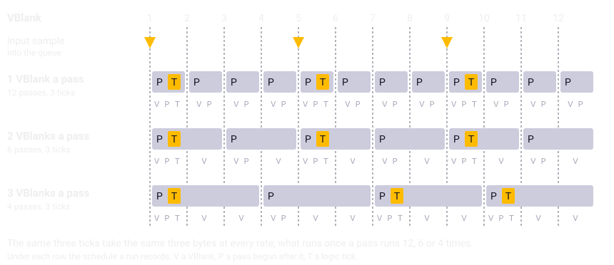
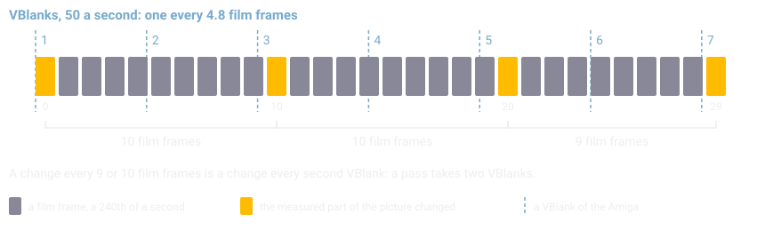

Chapter 7
{ .chapter-kicker }

# Time

Chapter 1 stated the game's rhythm in a paragraph and a box: a logic tick every fourth VBlank, a pass every second VBlank on a real PAL Amiga in a quiet scene. This chapter takes them apart. By its end you will know the game's three rhythms and what each is for; how the stick reaches the logic; why a pass, the round that draws a picture, also moves the game on; why the interleaving of passes and ticks is an input of the simulation, and what depends on it; how a film of a real Amiga measured it; how the port keeps time in a browser; and why one setting of the port rests on the eye alone.

## Three rhythms

The first rhythm is the [VBlank](../glossary.md#vblank), the moment the display finishes a picture: 50 times a second on a PAL Amiga, 60 on an NTSC one. It is the beat the game counts its time in, and it reaches the program as an [interrupt](../glossary.md#interrupt), whatever the program is doing at the time. The game counts it in a [**VBlank server**](../glossary.md#vblank-server): a routine the operating system calls at every VBlank. The game installs two, the sound effects engine's and, after it, its own, `vblank_server`, which counts the VBlanks, takes the stick's input and scrolls the message ticker.

The second is the [logic tick](../glossary.md#logic-tick), one step of the simulation. The game takes one for every [input byte](../glossary.md#input-byte) its server collects, and the server collects one every fourth VBlank, so the logic runs at a quarter of the VBlank's rate: 12.5 ticks a second on PAL. Chapter 2 gave the reason: the interrupt collects the bytes on time whatever the drawing costs, and so the game becomes a function of its inputs.

The third is the [pass](../glossary.md#pass), one round of the inner loop, which draws one picture. Each pass first draws, in `frame_update`, a fixed sequence of about twenty routines, and then runs a tick for every byte waiting, in `run_queued_ticks`. A pass runs as often as the machine manages and never more than once a VBlank: it begins by waiting for the first VBlank since the last picture was handed over, because until then the screen it would draw into is still on view (chapter 2). On real hardware a pass usually takes longer than one VBlank, and how much longer depends on how much there is to draw and to compute.

The first rhythm is the machine's. The second is tied to it by the program, four VBlanks to a tick. The third is tied to nothing but the scene, and most of this chapter is about what follows.

## One byte every fourth VBlank

The logic never touches the stick or the button. Everything the player's hands do reaches it through the input byte, and the VBlank server makes the byte. At every VBlank, unless the game is paused, the server first calls `vblank_every_frame`, which times the fire button, and then counts a divider down. Look at the last three instructions: `subq.w` takes one off `vblank_divider`, `bgt.w` jumps past the input sample while the divider is still above zero, and `move.w` sets it back to four.

```wingslst
--8<-- "generated/listings/asm/vblank_server_divider.lst"
```

The divider begins at zero, so the first VBlank after the start takes an [input sample](../glossary.md#input-sample), and so does every fourth after it. The routine `read_joystick` makes the byte: four bits for the stick's directions, forward, back, right and left, and two for the button, one for held and one for tapped. The directions are the stick's state as it stands at the input sample. A push that begins and ends between two input samples never reaches the game.

The button is treated differently, because it means two things: a tap drops the chosen weapon, a hold fires the guns. A tap can be shorter than the four VBlanks between two input samples, and a reading at the input sample alone would lose it. So `vblank_every_frame` watches the button at every VBlank. If the button comes up within ten VBlanks of a press, it sets a [**latch**](../glossary.md#latch), a flag that keeps a brief event until it is read, for a tap; if the button is still down after ten, it sets a second latch, for a hold. The next input sample copies both latches into the byte and clears them, a tap winning over a hold, so that one byte never says both. The threshold counts VBlanks, not ticks: the timing runs at the VBlank's rate, and only its result waits for the input sample.

The byte then goes into the [**input queue**](../glossary.md#input-queue): the list of up to six input bytes that the VBlank server fills and the ticks empty, one byte a tick. Here is the rest of the input sample. The server calls `read_joystick`, compares the queue's count with 6, and when six bytes are waiting calls `input_queue_pop`, which drops the oldest, before the new byte goes in at the end.

```wingslst
--8<-- "generated/listings/asm/vblank_server_queue.lst"
```

The queue is what lets a slow pass keep the logic's pace. A pass that takes longer than four VBlanks can find two bytes waiting, and runs two ticks, and the flight goes on at the same speed, in fewer pictures. Input is lost only when the passes fall more than six input samples behind, the oldest bytes first, or when the game empties the queue on purpose, at a mission's start and after the load and save dialogs.

## The tick follows the bytes

At the other end of the queue is `run_queued_ticks`, which the inner loop calls after each pass has drawn. It runs `logic_tick` for as long as the queue holds a byte, and `logic_tick` takes one byte off the front and hands it to the routines that steer, fire and choose. The assembly is on the left, the port's C on the right. Look at the loop, `jsr logic_tick` with `tst.w` of the queue's count and `bgt.b` back to the call, and at the `while` that is its port; the first lines belong to a demo, played back or recorded (chapter 17).

//// html | div.listing-pair

/// html | div
```wingslst
--8<-- "generated/listings/asm/run_queued_ticks.lst"
```
///

/// html | div
```c
--8<-- "generated/listings/c/run_queued_ticks.c"
```
///

////

One tick for each byte, and one byte for every four VBlanks: the logic's rate is the input sample's, whatever the passes do, as long as they keep within the queue. A pass of two VBlanks makes two passes to a tick.

## A pass is not only a picture

If a pass only drew, the number of VBlanks it takes would change what you see and nothing else. It does more. `frame_update` runs game logic once in every pass: the soldiers on an island move and die there, score is added, messages are queued for the ticker, objects are spawned, and the restart after a lost aircraft and the countdown at the end of a game advance. Nine routines among those it calls, directly or further down, draw random numbers. None of this is a fault the port could quietly put right. A faithful port translates what the code does (chapter 1): what the original does once a pass, the port does once a pass, and how many VBlanks a pass takes becomes part of what the port must reproduce.

What matters to the simulation is what crosses from the pass into the tick. To find it, we ran the [headless original](../glossary.md#headless-original) with every write and every read of memory tagged with the phase it was made in: a VBlank's server, the tick's routines, the pass's routines, or the main program outside them (chapter 6 named the instruments). A tool runs a [mission script](../glossary.md#mission-script) twice. The first run says which ranges of memory a pass writes; the second watches every read of exactly those ranges and says who reads them inside a tick. Over seven scripts, from a mission left alone on the carrier's deck to every life used up, a pass wrote a few hundred ranges, which join into blocks where they touch, and a tick read about a third of the blocks.

Each of those is a [**coupling**](../glossary.md#coupling): a piece of state that a pass writes and a logic tick reads, through which the number of VBlanks a pass takes reaches the simulation. Grouped by what they are:

| A pass writes | What the tick finds |
|---|---|
| a drawing copy of each object's position and frame, in the object's own record, and of the aircraft's height | the copies, which it reads back |
| the byte of an object's record that says what the object is | records the pass has freed or changed |
| the pass counter, which runs from 0 to 99, and a flag that a picture was drawn | counts that the objects and the lift go by |
| a distance worked out while drawing the world | a value the ground guns' sound uses |
| the pools of splashes, smoke and balloons, whose records it draws, counts down and frees, and claims for its smoke | free records of the splashes' and smoke's pools, for the tick's splashes and the engine's smoke, and the balloons' records it steps |
| the soldiers' table | the soldiers, who live in the pass, for the tick's shots to hit |
| the score and an island's count of soldiers | a soldier who died, and scored, in a pass |
| the aircraft's oil and fuel | what a gun's fire took from them in a pass |
| the [clip rectangle](../glossary.md#clip-rectangle) and where the drawing routines draw | the state it needs to draw itself |

The table is a lower bound, since a coupling shows only where a script reaches it. Two of its rows, the soldier who scored and the gun's fire, came from scripts written after the seven, for the weapons; the scripts written for the ships found one more writer of the byte that says what an object is, a ship's shell that reaches the torpedoes in a pass. Chapter 8 tells of those scripts.

The last row is the surprise: the tick draws too. When the aircraft is lost in the sea, the player's update, which runs in every tick, calls the restart, and the restart clears the playfield and waits some twenty VBlanks, `WaitTOF` by `WaitTOF`, inside the tick. So the drawing state belongs to the pass's routines and the tick's alike, and VBlanks can go by in the middle of a tick.

## The schedule is an input

So the number of VBlanks a pass takes is not only a matter of how smooth the picture looks. It sets how fast the soldiers run, how fast the countdown at the end of a game falls, how often the objects are animated, and everything else in the couplings. How passes and ticks interleave is an input of the simulation, as the input bytes and the [entropy stream](../glossary.md#entropy-stream), the reproducible values that stand in for the beam, are inputs. Chapter 6 called the order of a run's VBlanks, passes and ticks its [schedule](../glossary.md#schedule).

The listing cannot say how many VBlanks a pass takes on a real Amiga. That is processor time: how long the 68000 needs for the drawing and the logic of one pass, which depends on the scene. The headless original has no model of the processor's cycles; it lets VBlanks happen only where the program waits, and at the start of each pass it delivers the VBlanks still owed since the last pass began, those spent waiting inside a tick counted (chapter 6). The setting is two, which the film of the next section measured.



/// caption
One stretch of a mission at one, two and three VBlanks a pass, and under each row its record: V a VBlank, P a pass begun after it, T a tick. In every row the same three ticks take the same three bytes; only the passes between them differ. The middle row is the machine's in a quiet scene.
///

Is the table of couplings the only way the VBlanks a pass takes reach the tick? To find out, we ran the same mission script at all three settings and compared the game's state at equal tick numbers, byte by byte. The random numbers are such a way too: a pass draws them, so at another setting the tick would draw other values, and the comparison therefore sets the entropy stream to one constant value. It also checks first that the three runs fed the tick the same input bytes, since otherwise it would say nothing.

Every byte that differs must then fall into one of four classes: written by a pass; written by a VBlank server, since at equal tick numbers the three runs stand a VBlank or two apart; written in a tick by a routine that reads a coupling; or written by a routine such a reader calls. Anything else would be a finding.

| Script | Ticks | Bytes that differ | Left unexplained |
|---|---|---|---|
| level flight, nothing in the air | 220 | 51 | none |
| into the sea and through the restart | 600 | 82 | none |
| twenty bombs, which bring soldiers out | 1,050 | 121 | none |

Of about 21,000 bytes of state, the hardest of the three runs differs in 121, and every one of them falls into a class. Everything else is identical at equal tick numbers, the map, the queue and the tick's own input bytes included. The tick is a function of the input bytes and the entropy stream alone, as long as the couplings are reproduced, and the VBlanks a pass takes change nothing but them.

The full comparison runs for minutes, so the suite holds a short one over a fourth, shorter script, the guns firing; "the pass rate" is the tools' name for the VBlanks a pass takes. Look at the demand on line 10 that the input bytes match, the bound on line 14, set above the largest count seen, and the demand on line 15 that nothing is left over:

```python linenums="1"
--8<-- "generated/listings/py/test_the_pass_rate_changes_only_what_the_pass_writes.py"
```

That is why the comparisons of chapter 8 hand the port the schedule as part of its input, and why the port must take as many VBlanks a pass as the machine does. A player would see the difference: on a machine whose passes fit into one VBlank, the figure's top row, the soldiers would run and the countdown fall twice as fast.

## Two VBlanks a pass: the film

One could count the 68000's cycles in a cycle-exact emulator, but the machine itself was at hand, and a film of it answers on the hardware. So the project's owner filmed their PAL Amiga 500, its monitor fed over HDMI, with a phone at 240 frames a second: the story scroller, then the carrier's hold, its lift and the aircraft rolling along the deck. In the film one film frame is a 240th of a second, and one picture of the display, from one VBlank to the next, which we call a refresh here, lasts nearly five film frames.

The picture on the screen changes once a pass, when the pass's drawing is shown. So the time between two changes, counted in refreshes, is the number of VBlanks a pass takes. [`tools/film_rate.py`](repo:tools/film%5Frate.py) measures it: it takes the average change of brightness between each film frame and the next in a chosen part of the game's picture, finds the film frames where that change jumps, and counts the intervals between them. A shaking hand does no harm, as two film frames are only about 4 milliseconds apart. The part chosen must change with every pass and leave the dashboard and reflections out: the band of sea below the ship worked, the strip under the hull in chapter 1's picture of the first mission.

A camera and a video connection could drop or merge refreshes, so the method was first tried on a picture whose rhythm is known without measuring it. The story scroller sets its pace with its own waits: each of its steps waits for the VBlank, `WaitTOF` by `WaitTOF`, and shows a new picture every second VBlank, so its pace is written in the program, not in processor time. The port's front end, held to the original's VBlank by VBlank, changes the scroller's picture every second VBlank in nearly every interval. On the film the scroller changed every 9 or 10 film frames, two refreshes: the chain from the Amiga to the camera resolves every change. That is the calibration.



/// caption
How the film reads: a change every 9 or 10 film frames is a change every second VBlank. The strip is idealised; the film's intervals are counted by the tool.
///

In the quiet scene the sea band, too, changed every second refresh in most of the intervals, as the box counts them: a pass takes two VBlanks on the real machine there. The setting of the headless original and of the port is that measurement.

/// figures
| The film | How long, how often |
|---|---|
| One film frame | 1/240 s |
| One refresh on PAL, VBlank to VBlank | 4.8 film frames |
| The story scroller, the calibration | a change every 9 or 10 film frames: 2 refreshes |
| The sea band, quiet scene: intervals of 2 refreshes | 85 of 120 |
| The other intervals | other multiples of a refresh, 10 of them at 1, 4 at 3 |
///

A busy scene, with many objects, soldiers and explosions in the air, was not filmed. There the original may need three VBlanks a pass, and the port would have to model the load to follow it. The port felt right in play, and the choice was made to leave it so, the busy scene and the fades unfilmed: the port keeps two.

## How the port keeps time

A browser offers [animation frames](../glossary.md#animation-frame) at the monitor's rate, not VBlanks. The port's [shell](../glossary.md#shell), the JavaScript around the game, therefore keeps a clock of its own: it adds up the real time that passes and issues one VBlank of the [core](../glossary.md#core), the game compiled to WebAssembly, for every fiftieth of a second on PAL, and after each VBlank calls the core's pass entry once. What counts is the game's time, its VBlanks, not the monitor's pictures: a monitor of 144 Hz and one of 30 Hz alike get 50 VBlanks a second.

The core's VBlank entry is the port of `vblank_server` with `vblank_every_frame`, the divider, the input sample and the queue of six included. Its pass entry resumes the port's main program where it waits. Every wait of the [front end](../glossary.md#front-end), the screens before and between missions, is counted in whole VBlanks, one resume per VBlank: a `Delay` of the system one VBlank for each fiftieth of a second on PAL, a round of the music's fade four. So the port and the headless original stay together VBlank for VBlank. In play the program waits at a pass's start until the setting's two VBlanks have gone by, the headless original's rule, and a resume that finds it still waiting does nothing. VBlanks the tick spent waiting in the restart count towards the next pass, as in the original; chapter 22 tells how the port's code stops at such a wait and goes on at the next VBlank.

After a stall, while the page is on view but the browser could not run it, the clock replays at most 24 VBlanks: the six input samples the queue would have held; anything older the machine would have dropped too. A hidden page replays nothing. Its clock stops, and a mission comes back paused (chapter 23).

The program never asks which video standard it runs on. It reads none of the system's fields that tell a 50 Hz machine from a 60 Hz one. Everything is counted in VBlanks, so on a PAL machine everything runs at five sixths of the speed of the American machines the game was designed for. Only the music's timer and two short waits of the sound engine keep time of their own (chapters 2 and 18). For the port, PAL or NTSC is the rate of the shell's clock and of the core's sound clocks, switched together with the shape of the pixels behind the diagnostics overlay (chapter 23); PAL is the default.

/// figures
| The rates | PAL | NTSC |
|---|---|---|
| VBlanks a second | 50 | 60 |
| Input samples and logic ticks a second | 12.5 | 15 |
| A pass in a quiet scene | every 2nd VBlank, filmed | not filmed; the port keeps 2 |
///

## The fade step

A fade carries a picture's colours from one table to another, most often from black or to black, in sixteen steps. Each step moves every colour a step of the way, with the original's own arithmetic, carries and all, which the oracle holds (chapter 5), and rebuilds the [copper](../glossary.md#copper)'s list with the new colours. There is no wait in the loop at all. On the machine a step lasts as long as its arithmetic and its rebuild take the processor, and nothing in the program says how long that is. In the headless original, which has no clock between the program's waits, a fade takes no time at all.

In the port, as in the headless original, the game's time passes only where the program waits, so the port has to give the fade a duration of its own. It gives each step a number of VBlanks, a setting of the core, whose comment says why the listing cannot settle it:

```c
--8<-- "generated/listings/c/fade_vblanks.c"
```

The value 2 is the owner's eye: the fades of the title sequence's pictures were watched and found right, and no film was made of them. Of the port's two settings of time that are estimates, this is the one no film stands behind at all; the other rests on a film of a quiet scene. Here is where it is spent. Look at the sixteen steps of the outer loop and the inner loop that waits out `fade_vblanks` VBlanks after each:

```c
--8<-- "generated/listings/c/wof_fade.c"
```

The comparisons set the fade step to zero; then the port's fades take no time either, and the two agree VBlank for VBlank through every fade. The music's fade is another wait, of the front end for the music player, which chapters 6 and 18 tell.

/// dev
The couplings and the comparison at three settings are [`tools/pass_observe.py`](repo:tools/pass%5Fobserve.py): without arguments the table over the seven scripts, with `--control --runs NAME --ticks N` the comparison. The phase-tagged writes and reads are [`tools/headless_writes.py`](repo:tools/headless%5Fwrites.py); the suite's tests, [`tests/test_passes.py`](repo:tests/test%5Fpasses.py). The film's tool, [`tools/film_rate.py`](repo:tools/film%5Frate.py), takes the film with `--crop X0 Y0 X1 Y1` and needs ffmpeg. The shell's clock is [`web/clock.js`](repo:web/clock.js); the core's VBlank entry, `wof_vblank`, is in [`src/input.c`](repo:src/input.c), the pass's start in `wof_frame_update` of [`src/world.c`](repo:src/world.c), the pass setting in [`src/core.c`](repo:src/core.c) and the fade's in [`src/fade.c`](repo:src/fade.c).
///

## What comes next

The chapter in one sentence: the game's logic is a function of its input bytes, its random stream and its schedule, and of the three only the schedule had to be measured on the machine. Chapter 8 holds the port to the headless original at every tick and every pass. The headless original records its schedule as it runs, and the port's tests replay exactly that schedule through the core's VBlank and pass entries, as part of the run's input; the comparisons hold at one and three VBlanks a pass as they do at two. Chapter 8 also tells what of the original had to be ported at all, and how the port is known to be complete.

## Further reading

The files named here are in the repository, [`github.com/sy2002/wof-wasm`](repo:).

- [`re/notes/passes.md`](repo:re/notes/passes.md): ["The answer"](repo:re/notes/passes.md#the-answer), ["The control: one, two and three VBlanks per pass"](repo:re/notes/passes.md#the-control-one-two-and-three-vblanks-per-pass) and ["What the film of the real machine shows"](repo:re/notes/passes.md#what-the-film-of-the-real-machine-shows).
- [`SPEC.md`](repo:SPEC.md), section 3.3, ["Runtime model"](repo:SPEC.md#33-runtime-model); 6.2, ["Shell"](repo:SPEC.md#62-shell), "Clock"; 6.3, ["Blocking code becomes coroutines"](repo:SPEC.md#63-blocking-code-becomes-coroutines); 10, ["Points to establish"](repo:SPEC.md#10-points-to-establish), points 2, 6 and 9.
- [`re/notes/input.md`](repo:re/notes/input.md), ["The chain"](repo:re/notes/input.md#the-chain) and ["Fire button and the tap/hold discrimination"](repo:re/notes/input.md#fire-button-and-the-taphold-discrimination).
- [`re/notes/headless.md`](repo:re/notes/headless.md), ["Scheduling"](repo:re/notes/headless.md#scheduling) and ["The fade's wait"](repo:re/notes/headless.md#the-fades-wait).
- [`re/notes/display.md`](repo:re/notes/display.md#fades), "Fades"; [`re/notes/random.md`](repo:re/notes/random.md#video-rate), "Video rate".
- [`tools/film_rate.py`](repo:tools/film%5Frate.py) and [`tools/pass_observe.py`](repo:tools/pass%5Fobserve.py), their opening descriptions.

Outside the repository: the [*Amiga Hardware Reference Manual*](https://archive.org/details/commodore-amiga-tech-ref-series-amiga-hardware-reference-manual-3rd-edition), for the VBlank's interrupt; the [*Amiga ROM Kernel Reference Manual: Exec*](https://archive.org/details/amiga-rom-kernel-reference-manual-exec), for the interrupt servers; and Glenn Fiedler's ["Fix Your Timestep!"](https://gafferongames.com/post/fix%5Fyour%5Ftimestep/), for the kind of fixed-step clock the shell keeps.
