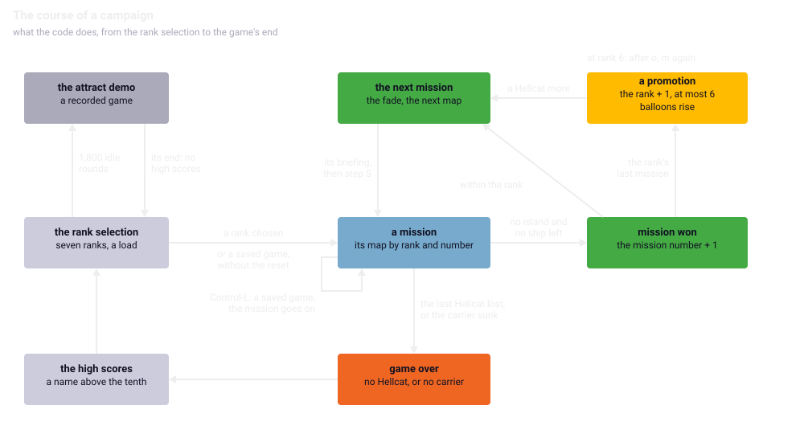
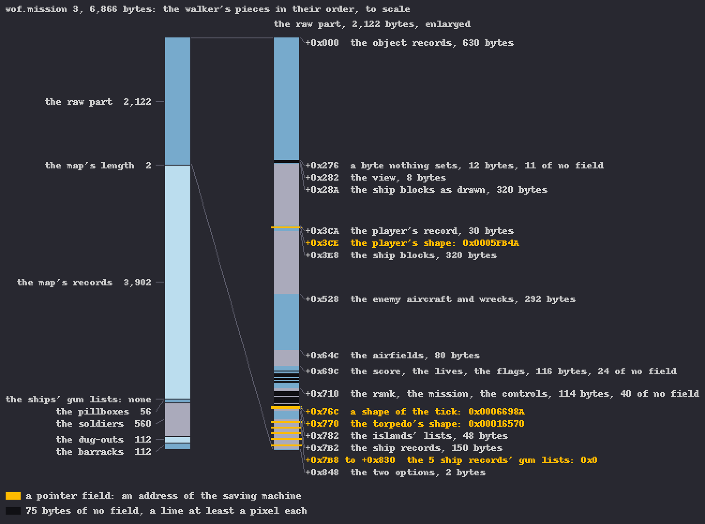
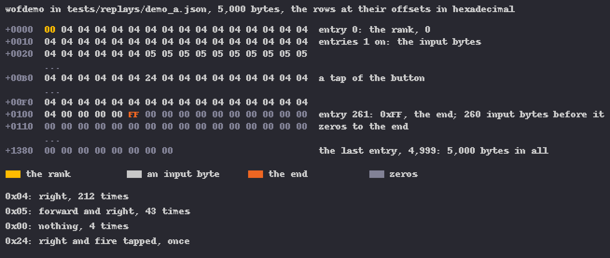

Chapter 17
{ .chapter-kicker }

# The campaign

Chapters 13 to 16 took one mission apart. This chapter is about what holds the missions together and what outlives a mission, a game and a page reload. By its end you will know in which order the maps come, when it is night, and why the game never ends; what a won mission and a promotion change; how the high scores are kept; what a [saved game](../glossary.md#saved-game) holds and how the port reads one from a real Amiga; and how the game records and replays its own demo. The port and its instruments are gathered at the end.

## Seven ranks, fifteen maps

The manual offers seven naval ranks (page 4); to the code a rank is where a campaign starts, and only the later ranks' maps carry enemy ships and airfields (chapter 13). A [**campaign**](../glossary.md#campaign) is the run of missions from the rank chosen to the game's end, through the maps from that rank's first on, in the order of their letters. The [**rank**](../glossary.md#rank) is the campaign's stage, 0 to 6: the player chooses the first, and a promotion moves it on. The [**mission number**](../glossary.md#mission-number) counts the missions within a rank from 1.

| Rank | Missions | Maps |
|---|---|---|
| 0 | 3 | a, b, c |
| 1 | 3 | d, e, f |
| 2 | 2 | g, h |
| 3 | 2 | i, j |
| 4 | 1 | k |
| 5 | 1 | l |
| 6 | 3 | m, n, o |

The rank selection lists the seven ranks and, below them, an item that loads a saved game; choosing a rank sets the mission number to 1. Two tables turn the pair into a map. `map_load`, chapter 13's loader, needs the file's name, whose index is a running count: the missions of the ranks below plus the mission number less one. The other readers, the night's choice and the island's bonus among them, need only the map's number, which a second table gives by rank and mission with no count to make.



/// caption
A won mission leads to the next mission, or first to a promotion; the last Hellcat or the carrier lost, to the game over and the high scores. A saved game enters at a mission; the attract demo returns without the high scores.
///

## A mission won

A mission is won when the last island is [neutralised](../glossary.md#neutralised-island) with no enemy ship left, which the [pass](../glossary.md#pass) finds at the last [soldier](../glossary.md#soldier)'s death and the [tick](../glossary.md#logic-tick) at the last [pillbox](../glossary.md#pillbox)'s, or when the last enemy ship sinks with no island left (chapters 15 and 16). Each calls `mission_won`, which counts the mission number on and compares it with the rank's count of missions. Within the count, the ticker gets the next mission's message. Beyond it comes the [**promotion**](../glossary.md#promotion), the step from a rank's last mission to the next rank's first: the mission number back to 1, the rank one up but never past 6, the promotion's flag, `balloons_on`, set, and a message of its own.

The message is appended to what the [ticker](../glossary.md#ticker), chapter 11's message line, holds, which is always the island's bonus or the sunk ship's name. On the left, `tst.b (a2)+` walks to the end of that text and leaves the pointer one past its NUL, the zero byte that ends a text; `subq.w #2` steps back over the NUL and the character before it, so the new message begins where the old one's last character stood. Both branches then point the ticker at the text and set the [**won flag**](../glossary.md#won-flag), a word only this routine sets, which says that the mission is won.

//// html | div.listing-pair

/// html | div
```wingslst
--8<-- "generated/listings/asm/mission_won.lst"
```
///

/// html | div
```c
--8<-- "generated/listings/c/wof_mission_won.c"
```
///

////

Nothing here touches the score: the manual's bonus for a whole mission (page 10) is the last island's bonus or the last ship's score, paid just before the call (chapters 15 and 16).

## The next mission

The won flag waits for an aircraft in the [hold](../glossary.md#hold): `main` tests it at the head of its inner loop with the weapon menu, which is up only there. So the next mission begins with the winner if it landed, or with the next aircraft if it was lost; if the winner was the last Hellcat and is lost, the game is over instead.

The steps come in a fixed order: the flags cleared, the sound slots emptied, the ticker stopped, both views [faded](../glossary.md#fade) out, the mission's assets freed. If the promotion's flag is set, the lives get one more, the `addq.b` on the left. Then the night is chosen, the new map loaded and its briefing shown, where Control-R goes back to the rank selection. After the briefing come the [dashboard](../glossary.md#dashboard)'s pictures, the day's or the night's as just chosen, the display's setup, the shapes, the lists and the sounds; then `bra.w` jumps into the mission's reset, which ends at [step S](../part-1/mission.md#more-than-the-game-runs), where a mission's loop begins. On the right, the port's coroutine with its `goto`.

//// html | div.listing-pair

/// html | div
```wingslst
--8<-- "generated/listings/asm/main_next_mission.lst"
```
///

/// html | div
```c
--8<-- "generated/listings/c/main_next_mission_c.c"
```
///

////

There is no rank selection and no campaign's reset: the score, the [enemy plane counter](../glossary.md#enemy-plane-counter) and the lives carry over. Day and night are chosen here, as chapter 11 told: maps a to g are always flown by day, h to o by the top bit of a fourth draw of the beam, and nothing clears the night flag between campaigns.

The briefing shows the rank's name, the mission number and the manual's objectives (page 10), two counts from the map's first walk (chapter 13, whose table gave the ships): the islands that hold a target, only two of map l's three, and the enemy ships, a count that goes down as they sink, so a loaded game's briefing names the ships still to sink.

| Map | a | b | c | d | e | f | g | h | i | j | k | l | m | n | o |
|---|---|---|---|---|---|---|---|---|---|---|---|---|---|---|---|
| islands | 1 | 2 | 3 | 2 | 3 | 2 | 3 | 3 | 3 | 0 | 3 | 2 | 4 | 3 | 3 |
| ships | 0 | 0 | 0 | 0 | 0 | 1 | 1 | 1 | 2 | 2 | 1 | 2 | 2 | 2 | 3 |

Three Hellcats begin a campaign (page 10); each aircraft lost costs one (chapter 14), each promotion adds one, and the dashboard's drum shows at most nine.

## The promotion, and no end

From the next pass the promotion's flag lets the free records of the Balloons [pool](../glossary.md#pool) rise over the carrier (chapter 15). And it is still set at the next mission, which gives the Hellcat the manual promises (pages 8 and 10) before the mission's reset clears it. The balloons themselves are never cleared: with the flag off, the records in use are neither drawn nor moved, and in the script `promote_a` nineteen of the twenty stood unseen through map d's flight. They fly on at the next promotion.

After map o, the last rank's last mission, the promotion runs once more: the rank stays 6 and the mission number becomes 1, so the next map is m. The campaign goes round m, n and o for ever, each round with a promotion's message, balloons and a Hellcat more. There is no end sequence: a game ends only when the last Hellcat is lost, when the carrier has sunk, or when the player quits.

The [**game over**](../glossary.md#game-over) follows the last Hellcat's loss, after chapter 14's wait, or the carrier's sinking. If the aircraft is aboard when the carrier is 33 rows down (chapter 16), it goes into the sea with every life, and a count of 100 passes, run down by the routine that draws the game-over picture, ends the game; a flying aircraft is the last, since none follows a sunk carrier. `main` fades out and, unless a demo was played, shows the high scores; then the rank selection begins a new campaign.

## The high scores

The [**high-score file**](../glossary.md#high-score-file), `highscore`, chapter 3's, is 360 bytes: ten rows of 36, best first. A row holds a score, the rank reached and a name of 30 bytes, of which at most 16 are ever typed. The high-score screen reads the file and sorts it every time, a bubble sort that swaps whole rows until a sweep swaps nothing. Only a score greater than the tenth's makes the screen ask for a name; the new row replaces the tenth, the lowest after the sort, and the table is sorted again and written. Nothing else writes the file, and the screen comes only at the outer loop's end, so it is written at most once a game.

A missing file reads as ten empty rows: score 0, rank 0 and a name of twelve spaces. The disk's own file holds exactly that in its last three rows, so it had been played into seven times before this copy of the disk was made. Control-C in flight deletes the file without a question; the manual lets it work only after Control-D, which this executable lacks, as chapter 1 told (page 12). A developer's reset that writes ten rows of 5,000 points is there too, and nothing calls it. The port keeps the file in the browser's storage (chapter 23).

## The saved game

Control-G saves only while the aircraft is on the carrier (page 11); the dialog puts `wof.` in front of the name typed. Chapter 3 described the result.

Writing and reading share the [**saved game's walker**](../glossary.md#saved-games-walker), a routine that goes through the file's pieces in a fixed order and hands each to a [**callback**](../glossary.md#callback), a routine passed to it to be called back: the writer's callback writes the piece, the reader's reads it. A piece is direct, the memory at an address, or pointed, the block whose address is stored there. Since the write and the read run the same walk, the read finds every piece where the write put it.

| # | Piece | Kind | Length |
|---|---|---|---|
| 1 | the raw part | direct | `0x84A`, 2,122 bytes |
| 2 | the map's length | direct | 2 bytes |
| 3 | the map's [records](../glossary.md#map-record) | pointed | the map's length |
| 4 | a gun list for each enemy ship | pointed | 14 bytes a gun |
| 5 | the pillboxes | pointed | 14 bytes a record |
| 6 | the soldiers | pointed | 8 bytes a record |
| 7 | the [dug-outs](../glossary.md#dug-out) | pointed | 16 bytes a record |
| 8 | the [barracks](../glossary.md#barracks) | pointed | 16 bytes a record |

The lengths are worked out in 16 bits, as the compiled C works them. On the left, a call of a routine that does nothing, which no note explains; the pillboxes' count, a byte widened with its sign by `ext.w` and multiplied by 14 with `mulu.w`; and the soldiers' count, a word shifted three places. The maps' counts stay far below 128, where a byte's sign would matter; the port keeps the widths all the same, so its file is the original's even for a crafted count.

//// html | div.listing-pair

/// html | div
```wingslst
--8<-- "generated/listings/asm/save_walk_tables.lst"
```
///

/// html | div
```c
--8<-- "generated/listings/c/save_walk.c"
```
///

////

A gun list goes in for each ship present whose record holds a score; the player's carrier scores 0 (chapter 16), so it is never in the file. The [**raw part**](../glossary.md#raw-part), the first piece, memory as it stands from the object records on, holds every count the later pieces need: a file describes its own layout, and [`tools/savegame.py`](repo:tools/savegame.py) decodes one by that alone. The walker also writes: it sets the map's end pointer two bytes past where `map_load` leaves it, so a mission's first saving moves that pointer of the running game, as the port's does too.

/// figures
| The figures | |
|---|---|
| The raw part and the map's length | 2,124 bytes |
| The smallest saved game, map a | 4,258 bytes |
| Chapter 3's saved game, map c | 6,866 bytes |
| The largest saved game, map m | 11,516 bytes |
///

A saved game's size follows from its map alone. Chapter 3's file was saved on a real Amiga in map c, the first rank's third mission.



/// caption
Chapter 3's saved game to scale, its pieces in the walker's order, and the raw part enlarged: its regions at the port's named fields, the bytes of no field dark, the four pointer fields in gold.
///

The raw part holds the object records, the [player's record](../glossary.md#players-record), the ships' parked aircraft, the [enemy aircraft records](../glossary.md#enemy-aircraft-record), the airfields, the score, the lives, the flags, the rank and mission number, the islands, the five [ship records](../glossary.md#ship-record), and two options, the vertical flip and the music switch. 75 of its bytes belong to no variable the port keeps, nothing in a mission writes them, and in chapter 3's file all are 0. The sixteenth [object record](../glossary.md#object-record), where an enemy torpedo runs, lies outside it, so no enemy torpedo comes back with a loaded game; so do the pools, the sound slots and the ticker's text.

Four kinds of field in the raw part hold addresses in the machine that saved: the player's shape, a shape the tick keeps for level flight, the torpedo's shape, and each ship's gun list. These are the [**pointer fields**](../glossary.md#pointer-field).

## Loading a game

The reader's callback puts a direct piece back where it lies; for a pointed piece it allocates a new block, reads into it and stores the block's address, only when the read delivered the whole length. A file that cannot be opened makes the program exit.

Two paths lead there. From the rank selection, the load item opens the dialog, a cancel going back to the menu; the music stops, the map is freed, the file read, the briefing shown, and `main` runs the mission's setup without the mission's reset, so the file's state becomes the mission's. In flight, Control-L, refused while a demo runs, frees the dashboard's shapes, the sounds and the demo's buffer, loads, shows the briefing and runs one tick, and the inner loop goes on in the loaded game's mission, without step S.

The pointer fields come back as the saving machine left them. The player's and the torpedo's shapes do no harm, since the next tick sets both from the frame's name before anything reads them, and the gun lists are replaced by the new blocks. The one that matters is the shape kept for level flight: the player's drawing reads it in the hold before any level tick sets it again. What the original draws from another machine's pointer, no run has shown.

The port derives all four. In its own files that field holds a [**shape handle**](../glossary.md#shape-handle), the port's small number for a shape, at most four hex digits; from a real Amiga it holds an address far larger. The frame's name says which shape the player's pointer beside it names. Where that shape's record lies in its [container](../glossary.md#shape-container), whose layout chapter 3 showed, places the container in the saving machine's memory. The other pointer's distance from there names its record: for chapter 3's file `wh0f` of the Hellcat's shapes, the one the original's own saved games hold. A pointer that names no record draws nothing until a level tick sets the field. In the C, the last loop compares each record's place with the pointer:

```c
--8<-- "generated/listings/c/saved_hellcat_shape.c"
```

The file also brings back the [vertical flip](../glossary.md#vertical-flip), and the player's remembered preference wins (chapter 1). The port refuses a file it cannot hold before the load begins: one missing, shorter than its own counts ask, or with counts beyond the port's tables. The original's program exits on the first and reads the others into blocks of any size; the port keeps each block at a fixed place of a fixed size, so its dialog leaves as a cancel and the game goes on.

## The demo

The manual promises a self-running demo after loading (pages 2 and 3), chapter 3's [attract demo](../glossary.md#attract-demo), which this disk does not carry. `main` looks at its argument count once, the lines chapter 4 read: started with an argument, the program records every game from the rank chosen on. The rank selection then allocates a buffer of `0x1388` bytes, 5,000, seeds the random generator from the [beam](../glossary.md#beam), the only place the program seeds it, and stores the rank in entry 0, the buffer's first byte.

From step S the [VBlank server](../glossary.md#vblank-server) stores the [input byte](../glossary.md#input-byte) of each [input sample](../glossary.md#input-sample) in the next entry until the pass has two, and `run_queued_ticks`, whose first lines chapter 7 left to this chapter, waits [VBlank](../glossary.md#vblank) by VBlank until they are in. So a demo's pass has two ticks whatever it costs, and the ticks repeat whatever the machine's speed. A recording runs more where an aircraft is lost: the restart's input samples, taken inside a tick, are queued and run but not kept, while a playback queues nothing then. A full buffer, 4,998 input bytes, ends the game, and at its end `demo_end` writes `0xFF` after the last entry and saves the buffer as `wofdemo`.



/// caption
The port's recording kept for its replay test: the rank, then input bytes, `0x04` for right, `0x05` right and forward, one `0x24` with a tap, one an input sample; the end after 260 of them, and zeros.
///

Left alone for 1,800 rounds of its menu, a round being one VBlank, the rank selection asks for the demo. It loads `wofdemo`, and would read a shorter file past its end; without the file a normal game starts at the rank under the cursor. It seeds the generator from the beam, takes the rank from entry 0, and from step S the server takes the demo's bytes in place of the stick, two a pass. The `0xFF` ends the playback, as does a full buffer; on the left, a byte taken only while the pass still wants one, and beside it the port's.

//// html | div.listing-pair

/// html | div
```wingslst
--8<-- "generated/listings/asm/vblank_server_playback.lst"
```
///

/// html | div
```c
--8<-- "generated/listings/c/wof_vblank_playback.c"
```
///

////

Fire ends a playback too; after a playback a flag skips the high scores, and a pause takes no byte.

The game has one random routine, and every draw is a constant exclusive-ored with the beam's position at the moment of the call (chapter 6). A demo's seeding sets only that constant, from the beam itself, so on a real machine neither the constant nor any draw repeats, and a playback follows its recording only until a draw matters. Two values run on from mission to mission besides, and are not in the file: the swell's phase, which rocks the carrier and its [lift](../glossary.md#lift) ([chapter 13](world.md#the-ground-under-the-aircraft)), and the night flag.

The port's milestone asks that a recorded demo replay identically after a page reload. So beside the demo it writes a [**seed file**](../glossary.md#seed-file), `wofdemo.seed`, 12 bytes: the state of the [entropy stream](../glossary.md#entropy-stream) that serves every beam value, the seed's included, a hash of the demo, the swell's phase and the night flag. A playback whose demo matches the hash starts from all three, so after a reload it runs as the first playback did, and as the recording did if that lost no aircraft. A `wofdemo` without it, one from a real Amiga, plays with everything as it stands. The port records with a development key (chapter 23).

/// figures
| The times, on PAL, derived | |
|---|---|
| The rank selection left alone, 1,800 VBlanks | 36 seconds |
| The longest demo, 4,998 input bytes, one a tick | about 400 seconds |
///

## What the port made of it

The next mission runs in the mission's [coroutine](../glossary.md#coroutine), in the original's order, with a `goto` into the mission's reset (chapter 22). The port reads `mission_won`'s table by address, and `choose_night`'s with the original's signed index, not modulo the table's length, which would differ for a rank past the table, as the oracle's random states give.

The write callback takes each byte by its address from the port's [registered state](../glossary.md#registered-state), the variables kept under their original addresses, from the block behind a pointer for a pointed piece, and from the executable's image where nothing writes. A pointer field gets a shape handle, or 1 where a ship's list is set, since the port keeps no address there. The file goes to the file system in one piece, of at most 12,412 bytes, the largest saved game the port's tables allow.

Two [stand-ins](../glossary.md#stand-in) that had marked values the port did not yet produce fell: the score's text and the ticker's message. The score is formatted as the system's formatter, RawDoFmt, does with `%07ld`, the sign inside the zeros, so a negative score, which a file can bring, reads `000-123`; the ticker's message stays in the registered state. The demo's buffer is registered too, so every byte recorded or played is compared. And the save script found the play screen left switched off after a dialog, the fault chapters 4 and 9 told.

## How it is held

Six [mission scripts](../glossary.md#mission-script) of the campaign run in the [closed loop](../glossary.md#closed-loop) from the program's start, every tick and pass compared through the win and the next mission's first ticks, and through a game saved in the hold; three run only in the suite's long run. A [poke](../glossary.md#poke) of the mission number and the rank reaches the promotion and the cap.

Maps k and l, the two one-mission ranks, are beyond the [autopilot](../glossary.md#autopilot), so the chain through them uses pokes: one script sets each enemy ship's hits and the islands left to 0 at every mission's reset, eight missions and seven wins. Two wins in a row by play were not reached, the [dug-outs](../glossary.md#dug-out)' fire taking the oil in the low hunts while the soldiers the bombs let out kept coming, so the islands held; and no script saves with a weapon in flight, since the autopilot's landing takes longer than any weapon flies. The chain and the save script also hold at one and three VBlanks a pass, where the save script found the upper word chapter 9 told; the [open loop](../glossary.md#open-loop) finds no step that differs, and the [completeness list](../glossary.md#completeness-list) accounts for every address the scripts write.

The saved file is compared byte for byte with the one the [headless original](../glossary.md#headless-original) wrote; every differing byte is named by its field, and only the pointer fields may differ:

```python
--8<-- "generated/listings/py/test_the_saved_file_is_the_originals_but_for_its_pointers.py"
```

Under the [oracle](../glossary.md#oracle), `mission_won` and `choose_night` are held over 2,000 random states each, the walker's writes and reads over 600 each, and the score's formatting over 616 scores against the ROM's own RawDoFmt. Eight more scripts load chapter 3's file from the rank selection and a saved game by both paths, record a demo and play it back. After a load the port's state is the original's, the derived fields what the original's first tick makes of them; the port's recording is the original's file, and the original plays it as the port does.

The recording of the figure is [replayed](../glossary.md#replay) in the [native library](../glossary.md#native-library) and in WebAssembly against the state's fingerprint at each of the run's 2,021 input samples, one every fourth VBlank from the program's start through the idle rank selection and the playback. The page tests save, reload and load, and record a game that loses no aircraft, reload, and find both playbacks equal to it at every input sample (chapter 24).

[Controls](../glossary.md#control), chapter 8's breaks of the port on purpose, were each caught:

| What was changed in the port | Script | Where it first showed |
|---|---|---|
| the promotion one mission early | the chain | pass 243, map n won |
| the extra Hellcat not given | the chain | the first tick of map k |
| the soldiers' piece a record short | the save script | the file's size |

/// dev
The shape the tick keeps for level flight lies at `0x02541A`; a shape's record lies 6 plus 8 times the shape count plus its offset bytes after its container's start. The scripts are [`tools/m7_scripts.py`](repo:tools/m7%5Fscripts.py), whose `trace NAME` prints the campaign tick by tick; the controls [`tools/m7_controls.py`](repo:tools/m7%5Fcontrols.py); [`tools/savegame.py`](repo:tools/savegame.py) with `--fields` names every field of a raw part and the bytes of none.
///

## What comes next

The chapter in one sentence: two tables of maps by rank and mission number hold the campaign together, and a promotion that stops at rank 6 makes it endless; a reload keeps the high-score file, a saved game's memory up to the shell's limit (chapter 23) and a demo's input bytes, the port's seed file beside them. Chapter 18 takes up the sound: the slots the next mission empties, the music a load stops, and Paula's channels.

## Further reading

- [`re/notes/campaign.md`](repo:re/notes/campaign.md): ["A mission won"](repo:re/notes/campaign.md#a-mission-won), ["The next mission"](repo:re/notes/campaign.md#the-next-mission), ["The saved game"](repo:re/notes/campaign.md#the-saved-game) and ["The loader"](repo:re/notes/campaign.md#the-loader).
- [`re/notes/demo.md`](repo:re/notes/demo.md): ["Recording"](repo:re/notes/demo.md#recording), ["Playback and the attract mode"](repo:re/notes/demo.md#playback-and-the-attract-mode) and ["The port"](repo:re/notes/demo.md#the-port); [`re/notes/highscore.md`](repo:re/notes/highscore.md).
- [`re/notes/porting-m7.md`](repo:re/notes/porting-m7.md): ["The scripts"](repo:re/notes/porting-m7.md#the-scripts), ["Part 2: the port"](repo:re/notes/porting-m7.md#part-2-the-port) and ["Part 2: how it is held"](repo:re/notes/porting-m7.md#part-2-how-it-is-held).
- [`src/front.c`](repo:src/front.c), [`src/dialog.c`](repo:src/dialog.c), [`src/hiscore.c`](repo:src/hiscore.c), [`tools/savegame.py`](repo:tools/savegame.py), [`tests/test_campaign.py`](repo:tests/test%5Fcampaign.py), [`tests/test_loader.py`](repo:tests/test%5Floader.py), [`tests/test_demo.py`](repo:tests/test%5Fdemo.py) and [`tests/test_replays.py`](repo:tests/test%5Freplays.py).
- [`original/manual.txt`](repo:original/manual.txt), the game's manual: pages 2 and 3 for the demo, 4 for the ranks, 8 and 10 for the Hellcats and the objectives, 11 for the high scores and saving, 12 for the commands.
