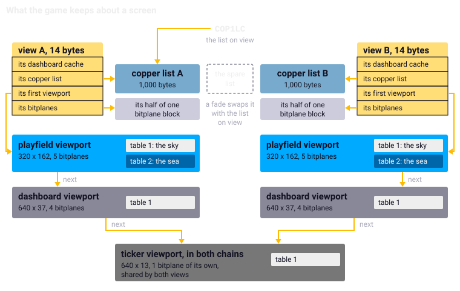
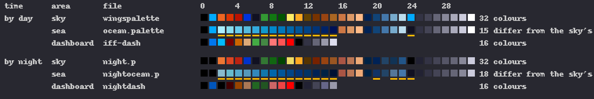
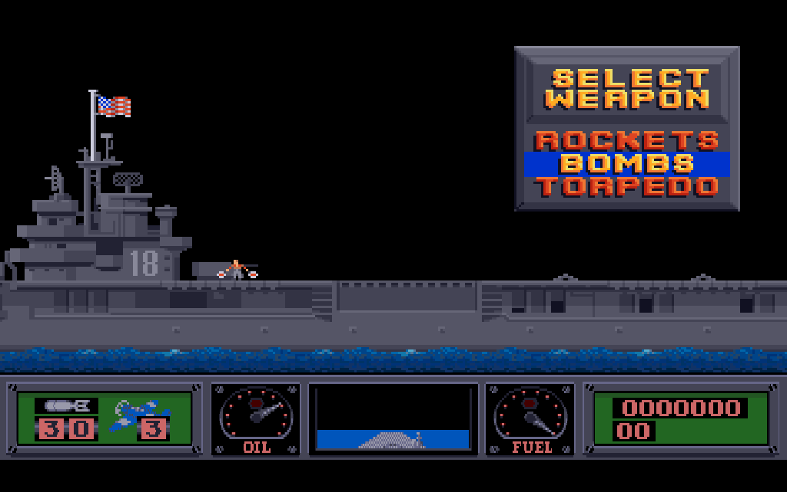
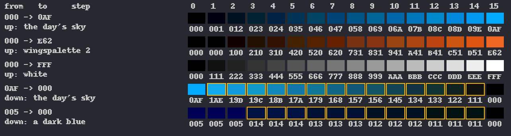

Chapter 11
{ .chapter-kicker }

# The display

Chapter 2 gave the display's parts a paragraph each. This chapter, Part II's first, opens the game's own display system. By its end you will know what the game keeps about a screen and why it builds its display itself; how it writes the copper's list and rewrites two instructions of it in every pass; where the colours come from, by day and by night; how the picture zooms out when the aircraft climbs; why a fade to black passes through colours the picture never had; and how a picture, the dashboard and the ticker reach the screen. Each mechanism ends with what the port made of it and the instrument that holds it.

## A display of its own

An Amiga program normally asks the operating system for its display: it describes the screen in the system's records, a View for the whole and a ViewPort for each area, and the system's routines make the copper's list from them. Wings of Fury does not. The program carries code that would call those routines, linked in beside the game's own, and nothing in the game reaches it. The game keeps records of its own, writes the copper's lists with a small library of its own, and hands the copper a list by writing the [register](../glossary.md#register) `COP1LC` itself.

Chapter 2 said what it wants of the display: three areas in different modes and more colours than one [palette](../glossary.md#palette) holds. Writing the lists itself gives it one thing more: it knows where every instruction lies. The wait for the split line sits at an entry whose index the game keeps, the sky's colour at entry 35, so a pass changes the picture's colours by rewriting those two instructions in place instead of building the list again. The price is records and memory of its own.

## What the game keeps about a screen

A [**view**](../glossary.md#view) is the game's record of one whole screen: 14 bytes that name its copper list, its bitplanes, the first of its areas and a cache of the dashboard's. There are two, A and B, the screens of the [double buffering](../glossary.md#double-buffering); the one not on view is the back view. A [**viewport**](../glossary.md#viewport) is one area of a view, a band of the screen with its own size, mode and [**depth**](../glossary.md#depth), the number of its [bitplanes](../glossary.md#bitplane), which gives it 2 to that number colours; each names the next one down, so that a view's viewports form a chain. Each holds a [**colour table**](../glossary.md#colour-table), table 1: 32 colours of 12 bits, for the colour registers. The playfield's viewport has a table 2, the sea's. A [**copper list**](../glossary.md#copper-list) is the list of waits and register writes the [copper](../glossary.md#copper) follows through a frame; the game keeps one for each view and a third, spare.

Each viewport also carries a BitMap and a RastPort, the system's description of its planes and its drawing context, pens, mode and position, so that the dialogs' text, drawn by the system's calls, lands on the game's screens. `display_init`, run once, takes every buffer from [chip memory](../glossary.md#chip-memory) and never resizes it; the high-score screen, the one larger layout, runs over into the other view's half, which it does not use.

/// figures
| What the game keeps | Size |
|---|---|
| A view | 14 bytes; two of them |
| A viewport | 172 bytes; five: two playfields, two dashboards, the ticker |
| A copper list's buffer | 1,000 bytes; three: view A's, view B's, the spare |
| One view's bitplanes | 44,240 bytes: the playfield's 32,400 and the dashboard's 11,840 |
| The ticker's bitplane | 84 x 13 bytes, shared by both views |
///



/// caption
The play screen's records: two views, each a chain of viewports with their colour tables, two copper lists, a spare and one shared ticker.
///

## Eight screens

Every screen the game shows is one of eight layouts, each set up by its own routine. None uses HAM or interlace, the Amiga's modes for more colours and taller pictures. [**Low resolution**](../glossary.md#low-resolution) puts 320 pixels across a line, [**high resolution**](../glossary.md#high-resolution) 640 in the same time of the [beam](../glossary.md#beam).

| Screen | Viewports: size, bitplanes, first line | Shown for |
|---|---|---|
| Play | 320 x 162, 5, at 0; 640 x 37, 4, at 163; 640 x 13, 1, at 201 | a mission |
| Picture | 320 x 200, 5 | the title sequence, the rank selection |
| Story | 640 x 200, 1, at 5 | the story scroller |
| Briefing | 640 x 147, 3 | the briefing |
| Text | 640 x 200, 2 | the crack's text screen, not ported |
| Dialog | 320 x 200, 4, the back view only | loading and saving, a name for the high scores |
| High scores | 320 x 75, 5, at 0; 640 x 145, 4, at 76; view A only | the high-score display |
| Play, restored | as the play screen, the back view | the return from a dialog in a mission |

The story's 200 rows fill 230 lines because the copper reloads the plane's address where the text wraps, a ring that chapter 19 tells. The play screen's lines are [**display lines**](../glossary.md#display-line), counted from the picture's top, where line 0 is beam line 44. The [**playfield**](../glossary.md#playfield), where the game is played, is the top area; lines 162 and 200, above the dashboard and the ticker, are blank, so that the copper can set up the next area out of sight, as chapter 2 told.

## The copper builder

`view_build_copper` makes a view's list again from its chain of viewports. Its instructions are waits and moves, a move being the copper's write of a value into a register:

1. The planes off, and the eight [**sprites**](../glossary.md#sprite) switched off and their pointers parked: 32 moves. The sprite hardware fetches whatever its pointers name, and the game uses no sprites, so all eight point at zeros.
2. For each viewport below the first, a wait for the line above it and the planes off: the blank line.
3. For each viewport, a wait for the line above it and a move for each colour its depth gives, from table 1.
4. Its planes: a wait for the same line; the display window and the data fetch, which say where the area lies on the screen; the modulos, how many bytes the display skips at the end of each row of a plane; the plane addresses; then a wait for its first line and the mode with its depth.
5. Where the split is enabled and a table 2 exists: a wait for the split line and a move for each colour whose second value differs from its first.

Steps 2 to 4 each wait for the same line; a copper wait for a position already passed falls through at once. A list for the play screen therefore begins, entry by entry: 0, the planes off; 1 to 32, the sprites; 33, the wait above the playfield; 34, `COLOR00`; 35, `COLOR01`, the sky's colour. `mission_display_setup` then appends the ticker's ramp to each list: ten pairs of a wait and a `COLOR01`.

Here is the last step, `cop_vport_split`, in the [listing](../glossary.md#listing). After `cop_wait` writes the wait for the split line, the loop compares each entry of table 2, whose address the viewport holds at `$9c`, with table 1's, at `$98`; `beq.b` skips equal ones, and the move goes to register `$180` plus twice the index, that entry's colour register.

```wingslst
--8<-- "generated/listings/asm/cop_vport_split.lst"
```

A move writing a colour already there would change nothing, so the sea costs only the moves of its own colours: fifteen by day. The port builds no list, as the last section tells.

## Two views and the swap

Chapter 2 told [double buffering](../glossary.md#double-buffering) as a concept and chapter 7 its timing. A [pass](../glossary.md#pass) of play waits for the [VBlank](../glossary.md#vblank), works out where the picture lies in the world and rewrites the back list's split line, draws the playfield and the dashboard into the back view, and ends in `flip_buffers`, which pokes the sky's colour into the back list and calls `view_show` for the back view. `view_show` installs the list without waiting: an end marker behind its last entry, `COP1LC` pointed at it, the flag the VBlank sets cleared, so that the next pass's wait really waits, and the front and the back view swapped. The copper takes the new list up at the next VBlank. The port keeps both views and the swap.

## How the colours change

Colours change in two ways: a table changed and the list built again, or a built list poked in place. Nothing cycles colours.

A picture brings its own colours, its `CMAP` chunk, the part of an ILBM file that holds them, into table 1. The mission's four palette files are read by another routine, which looks for the letters `CMAP`; so the sea's day file, `ocean.palette`, a whole picture with chunks that name colours to cycle, reads like the three bare lists.

The horizon's [split line](../glossary.md#split-line) moves. A pass first paints the sky in colour 1, from the top of the playfield down to the horizon's row, and draws the world over it; the split line is that row. The aircraft's height, in pixels upward from the water line, moves it:

/// figures
| The aircraft's height | The split line |
|---|---|
| up to 131 | row 151 |
| above 131 | one row further down the screen for every pixel |
| 142 and above | row 162, the blank line: the sea's palette is gone |
| above 186 | the eighth scale: row 151 again |
///

`cop_set_split_line` rewrites the one wait in the back list with a trick: it sets the list's count of entries back to the split's index, lets `cop_wait`, which appends a wait, write it there, and puts the count back. In the C, the port keeps the row in the playfield's record, `split_line`; the rows above it take table 1, the rows below the sea's colours.

//// html | div.listing-pair

/// html | div
```wingslst
--8<-- "generated/listings/asm/cop_set_split_line.lst"
```
///

/// html | div
```c
--8<-- "generated/listings/c/wof_cop_set_split_line.c"
```
///

////

The [**sky flash**](../glossary.md#sky-flash) takes the other way. Every pass, `flip_buffers` pokes the sky's colour into entry 35 of the back list. When a rocket hits land or the aircraft crashes there, the tick sets a count of 5 and a colour, white, or red when the hit was a target; a ship hit flashes too: red for a torpedo running into it or the aircraft crashing into its hull, white for anything falling onto its deck, and red again where that destroys a gun; a bomb never flashes. The pass counts down and on odd counts pokes the flash's colour instead: the colour, the sky, the colour, the sky, the colour. Colour 1 is the sky's, and the sea's table leaves it as it is, so the flash reaches the rows above the split and below it alike.

A [**fade**](../glossary.md#fade), sixteen steps that carry a colour table to another, builds the new list at every step in the spare buffer and installs it, and the buffer that was on view becomes the spare, so that the copper never reads a list being written.

The play screen's colours are held in both loops of chapter 8: after every pass each row's colours are compared with a model made from the original's tables and split line alone. The fades and the pictures' colours are held under the [oracle](../glossary.md#oracle) of chapter 5.

## Day and night

`choose_night` runs only on the way from one mission of a campaign to the next and looks up the next mission's map. For the maps a to g it is day. For h to o it draws the beam four times and takes the top bit of the last draw: an even chance, from the beam. The flag starts at zero in the program's data, nothing writes it but `choose_night` and a loaded game, whose file carries it, and nothing clears it: so the first campaign after the program starts begins by day, and a campaign begun after a game lost at night begins at night. Beside the listing's four calls of `rand_beam`, the port draws four times from its stream:

//// html | div.listing-pair

/// html | div
```wingslst
--8<-- "generated/listings/asm/choose_night.lst"
```
///

/// html | div
```c
--8<-- "generated/listings/c/wof_choose_night.c"
```
///

////

The flag picks one file of each of four pairs: the sky's palette, `wingspalette` or `night.p`; the sea's, `ocean.palette` or `nightocean.p`; the dashboard's picture, `iff-dash` or `nightdash`, with 16 colours of its own; and the dashboard's shapes, `dash.shp` or `nightdash.shp`. By day the sea changes fifteen of the sky's colours, by night eighteen. Colour 1, the sky's own, is a light blue by day and black by night.



/// caption
A mission's colour tables by day and by night, read as the game reads them; a bar marks a sea's colour that the copper sets at the split line.
///

The flight scripts of chapter 8 begin at a campaign's first mission, which is day, so the two loops reach the night by a [poke](../glossary.md#poke): the flag set on both sides at the end of the rank selection, and the whole flight agrees. One of the campaign scripts met a night mission through `choose_night` itself, on map m. The figure below is the port's first mission made night that way. `choose_night` is held under the oracle over 2,000 states.



/// caption
The first mission as a night mission, at the moment of chapter 1's day picture, in the 1024 by 642 box of a PAL display.
///

## Two scales

When the aircraft climbs above 186 pixels, the picture zooms out. A flag the player's update sets selects the [**eighth-scale view**](../glossary.md#eighth-scale-view), the notes' name, in which "view" means the picture as seen, not the record. At the eighth scale eight pixels of the world make one of the screen: every screen coordinate is divided by eight, a shift of three bits. The aircraft stays at screen x 160, as at full scale, and the screen spans eight times as much of the world. The shapes come from a second table of pointers, resolved by name in a [shape container](../glossary.md#shape-container) of their own, `8thscale.shp`; 84 of the world's 184 names have no shape there and are not drawn, among them the balloons, the guns of the dug-outs and pillboxes and most of a soldier's frames.

The split line sits at 151 again and stays there: at the eighth scale the picture's vertical place is fixed, so the water line lies at row 152 whatever the height, and the horizon no longer moves. The flight scripts that climb into the eighth scale agree in both loops of chapter 8.

As chapter 2 told, the port's picture holds both resolutions at 640 wide, every low-resolution pixel written twice; how a low-resolution [PAL](../glossary.md#pal) pixel, 16/15 as wide as tall, is shown on a modern screen is chapter 23's.

## The fade's arithmetic

`colour_lerp`, chapter 4's listing, does not interpolate a colour the way one might write it. It takes the start colour whole, and for blue, green and red in turn adds into the whole word the component's share of the difference: the difference times the step, divided by 15, masked to the component's four bits. When a component falls, its share is negative, and the mask turns it into a large positive number that carries into the next component up.

Take a dark blue, `0x005`, fading to black, at step 8. Blue's difference is −5, and −5 times 8, divided by 15, is −2. Masked to four bits, −2 is 14. Added to the word, 5 and 14 make 19, which is `0x013`: blue 3, and a 1 carried into green. Blue computed on its own would give `0x003`; the carry adds a green the colour never had, through most of the fade. These are the colours the hardware shows, which ignores the word's top four bits. The sky's blue gains a trace of red from its first step down, and a fade up from black, where every component rises, shows nothing of the kind.



/// caption
The sixteen steps of five fades through the port's `colour_lerp`, framed where a step differs from what each component alone would give.
///

Every fade-out's colours depend on this arithmetic, so the port keeps it exactly, and the oracle holds it on every fade the game runs. The game's four fade routines are one routine in two forms, one viewport with one target or a pair with two, the pair running as many colours as its first viewport's depth gives. The test below holds the port's one routine to the original's four: eight cases, their comments naming the screens and routines most stand for, each run on random tables on both sides and compared after the sixteen steps.

```python
--8<-- "generated/listings/py/test_the_fades_agree_with_the_original.py"
```

A picture comes up from black: the game decodes it into the back view, keeps its colours, blacks the table, shows the view and fades to the kept colours. How long a step lasts is chapter 7's question.

## How a picture reaches a viewport

The pictures are [IFF ILBM](../glossary.md#iff-ilbm) files, chapter 3's format of chunks. The game's reader knows four chunks, `BMHD`, the header with the picture's size, `CMAP`, `CMP2` and `BODY`, and ignores the rest. It clears the viewport's planes and decodes as many rows as both the picture and the viewport have, of as many planes as both have, each row unpacked from [**ByteRun1**](../glossary.md#byterun1), the ILBM format's packing, in which a control byte says either copy the next bytes or repeat the next one. It assumes that packing without looking at the header; every picture the game shows uses it.

A picture taller than its viewport is cut off at the bottom. `broderbund`, `wingstitle` and `selectrank` are 256 rows high, PAL's height, as chapter 1 said of this disk's extra pictures, and show their first 200; the high-score screen's background, 200 high, shows 145. The port carries the reader over, because its crop is what the screen shows, and under the oracle it is held to the original's on every picture and palette file.

## The dashboard

The [**dashboard**](../glossary.md#dashboard) is the play screen's middle area: 640 by 37 in high resolution, four planes, 16 colours, with its own picture by day and by night and its own shapes. The manual describes its instruments on its pages 8 and 9: counters of the weapon and of the Hellcats left, the oil pressure and fuel gauges with their warning lights, the score, the enemy aircraft shot down, and in the middle the manual's 3-D view, the dashboard's 3-D window, which chapter 16 tells. The dashboard is double-buffered like the playfield. A pass draws the 3-D window every time, but an instrument only when its value differs from what that buffer shows, from one cache of the instruments for each view: each buffer must be brought up to date on its own. The drawing calls of every pass, the dashboard's among them, are compared in both loops of chapter 8.

## The ticker

The [**ticker**](../glossary.md#ticker) is the message line at the bottom of the play screen: one plane of 672 pixels a row, of which 640 are shown. Both views share it: no pass draws into it and the interrupt moves it in place, so nothing needs double buffering. The [VBlank server](../glossary.md#vblank-server) draws each new character into the hidden 32 pixels at the right, and on every VBlank while a message runs it shifts the whole plane left by one pixel, with the processor, inside the interrupt: 13 rows of 42 words. A0 starts at the plane's end, `$444`, 84 times 13 bytes on; D0 counts the rows. Each row begins with `lsl.b` of a zero, which clears the extend flag, the X of chapter 5's [condition codes](../glossary.md#condition-codes); then each `roxl.w -(a0)` shifts one word left, taking in the bit the word to its right gave up, for all 42 words, before `dbra` starts the next row.

```wingslst
--8<-- "generated/listings/asm/vblank_server_ticker.lst"
```

Because the shift runs in the interrupt, the text moves one pixel every VBlank, whatever a pass costs. The messages are made at run time: the game formats each with the system's formatter, exec's `RawDoFmt`, into one of two buffers, from the tick and from the pass alike, and the ticker takes a message only while none runs. Under the oracle the port's ticker is held to the original's VBlank by VBlank.

## What the port made of it

The port has no planes, no copper and no list. It keeps the two views and their chains, but every viewport is an [**indexed framebuffer**](../glossary.md#indexed-framebuffer), one byte per pixel holding its colour number, at the viewport's own width, 320 pixels or 640. Every drawing works there in the area's own pixels and the game's own coordinates, as on the machine, and installing a list means no more than saying which view the picture is made from.

What the copper builder does that can be seen comes out of [**bands**](../glossary.md#band): runs of consecutive output rows of one viewport that share a set of colours, which [`src/screen.c`](repo:src/screen.c) hands to [`src/video.c`](repo:src/video.c). A band carries its colours, because every mechanism that changes colours down the screen is such a run with a table of its own; bands with the same colours share a palette. Here is where the play screen's rows get theirs; look at the three sources: the split, below which the rows take the sea's colours where they differ from the sky's; the poked colour 1; and the ticker's ramp, one grey a row for its first ten rows.

```c
--8<-- "generated/listings/c/play_colours.c"
```

/// figures
| The port's display | |
|---|---|
| The picture | 640 x 214, a byte a pixel |
| Palettes | 24 of 32 colours; palette 0 black |
| Bands | 48 at most |
| A view's display memory | 640 x 260 bytes |
///

The first mission's picture goes through ten palettes: black, the sky's, the sea's, the dashboard's and six greys of the ticker's ramp. Twenty-four, because chapter 19's story scroller needs seventeen: the sixteen greys of its two ramps and the black of the rows above it. Palette 0 is black and reserved for the rows no viewport covers, the blank lines among them. A view's memory is taller than any screen because the scroller's plane walks down it.

A viewport names its surface by an offset into one block of display memory, not by an address, so the [core](../glossary.md#core)'s state holds no pointer, and a saved state of the core, loaded again, brings the picture back with the logic. The list buffers, the parked sprites, the window and fetch registers and the plane pointers mean nothing without a copper; the inventory of chapter 4 marks them `replace`. Of installing a list the port keeps the one thing a waiting routine can see: it clears the flag the VBlank sets. The tests of the core hold that every row has a palette and that the [native library](../glossary.md#native-library) and the WebAssembly draw the same picture; chapter 24 tells how the page is held to the core, chapter 23 how the [shell](../glossary.md#shell) shows the picture.

/// dev
The copper library is `0x019958` to `0x01A1F4`. `view_build_copper` (`0x01A0D4`) also skips a viewport less than two lines above the next. `cop_wait` (`0x019A9C`) adds 44 to a display line, clamps the result at `0x106` and, past beam line 255, first writes the wait for the end of line 255. `BPLCON0` is `0x5200` for the playfield, `0xC200` for the dashboard, `0x9200` for the ticker. In the port, beside the two files named above: [`src/iff.c`](repo:src/iff.c), [`src/fade.c`](repo:src/fade.c), [`src/dash.c`](repo:src/dash.c).
///

## What comes next

The chapter in one sentence: the game builds its own display and rewrites two instructions of its list in every pass; the port keeps its records and colours and makes from them a palette for every row. Chapter 12 turns to what the pixels of these surfaces are made from: the shapes, the containers that hold them, the blit that draws them through a mask, the mirrors and the clipping.

## Further reading

- [`re/notes/display.md`](repo:re/notes/display.md), the whole note.
- [`re/notes/porting-m3.md`](repo:re/notes/porting-m3.md), ["The fades, and the one provisional setting"](repo:re/notes/porting-m3.md#the-fades-and-the-one-provisional-setting), ["Views, viewports and what reaches the output"](repo:re/notes/porting-m3.md#views-viewports-and-what-reaches-the-output).
- [`SPEC.md`](repo:SPEC.md#64-video-model), section 6.4, "Video model"; [`src/video.c`](repo:src/video.c) and [`src/screen.c`](repo:src/screen.c), their opening comments.

Outside the repository: the [*Amiga Hardware Reference Manual*](https://archive.org/details/commodore-amiga-tech-ref-series-amiga-hardware-reference-manual-3rd-edition), for the copper, the playfield and the sprites, and the [*Amiga ROM Kernel Reference Manual: Libraries and Devices*](https://archive.org/details/amiga-rom-kernel-reference-manual-libraries-and-devices), whose first chapter tells the system's View and ViewPort.
