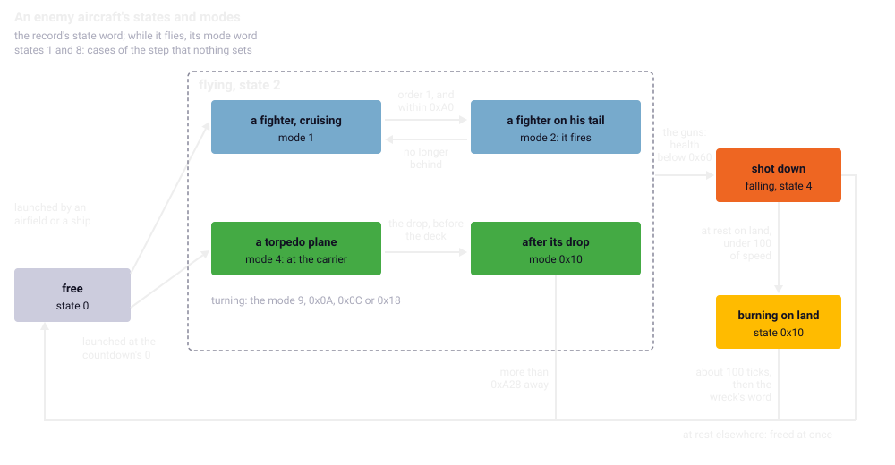
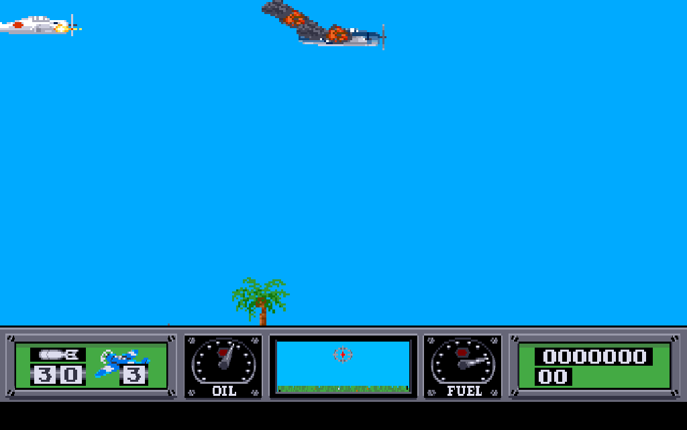
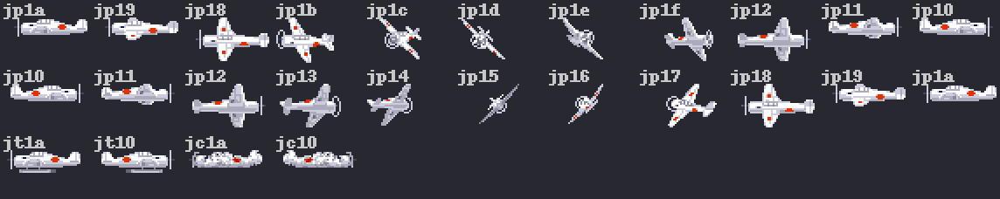

Chapter 16
{ .chapter-kicker }

# The enemy

Chapter 15 gave the player weapons and ground targets; this chapter is about what fights back. By its end you will know how the game keeps an enemy aircraft and decides what it does; where the aircraft come from; why shooting one down takes long; how the ships shoot and sink; how the carrier is attacked and defended; and what the dashboard's 3-D view shows of it. The port and its instruments are gathered at the end.

## Four records

The manual sends torpedo planes against the carrier, fighters against the player and ships to be sunk (pages 1, 10 and 11). The game keeps every enemy aircraft in an [**enemy aircraft record**](../glossary.md#enemy-aircraft-record): one of four records of 52 bytes, `0x34`, in a fixed table. A flight has to remember from one [tick](../glossary.md#logic-tick) to the next where it is against the player, how fast it goes and wants to go, the height it flies towards, its health and its timers; those are its fields. Every launch needs a free record, so no more than four enemy aircraft are ever in the air.

The record's first word, its state, says what the tick does with it: 0 free, 2 flying, 4 shot down and falling, `0x10` burning on land. The step has cases for 1 and 8 as well, which nothing ever sets. While the aircraft flies, its [**mode**](../glossary.md#mode-of-an-enemy-aircraft) says what it is doing. The mode is a set of bits: bit 0 a [**fighter**](../glossary.md#fighter) cruising, bit 1 a fighter on the player's tail, bit 2 a [**torpedo plane**](../glossary.md#torpedo-plane), bit 4 a torpedo plane that has dropped its torpedo, so the values are 1, 2, 4 and `0x10`; bit 3 is added while the aircraft turns.

Every tick the game works out each record's [**relation**](../glossary.md#relation-to-the-player), where it stands against the player: 1 behind him flying the same way, 3 ahead of him the same way, 2 and 4 coming the other way, east and west of him. Among those behind him the same way it counts an order, 1 for the nearest. The record also keeps a health of `0xF0`, 240, at the launch, a burst count for the guns that hit it, a hit flag, and two timers for its turns. Its speed, in hundredths of a pixel a tick, moves each tick half the way towards a wanted speed, and 5 more; its height steps towards a wanted height. Its x moves by the speed times the factor of its [attitude](../glossary.md#attitude), the stage of a turn, on the ROM's floating point, as the player's does (chapter 14).

`enemy_aircraft_step` walks the four records once a tick. For each in use it takes the relation and the order, then acts by the state: a flying aircraft flies by its mode, trailing smoke by its damage; a shot-down one falls; a wreck burns. Then, whatever the state has become, it eases the speed, moves the aircraft unless it burns, and picks its frame. The compiler made the switch on the state a chain of subtractions: on the left, `subq.l` takes 1, 1, 2, 4 and 8 off the state in turn, and each `beq` lands on its state's case. The port's C on the right walks the same way.

//// html | div.listing-pair

/// html | div
```wingslst
--8<-- "generated/listings/asm/enemy_aircraft_step_states.lst"
```
///

/// html | div
```c
--8<-- "generated/listings/c/wof_enemy_aircraft_step.c"
```
///

////



/// caption
The enemy aircraft record's states, and its modes while it flies, with what changes them: the numbers by the boxes are the state and mode words' values, those by the arrows distances in pixels and the health.
///

## How they fly

A cruising fighter goes by its relation. Behind the player it closes in at his [airspeed](../glossary.md#airspeed) plus the distance between them; within `0xA0` pixels, 160, the first in the order goes onto his tail, and the others hang back at his height. Coming the other way, it turns about, or slows while he turns. Ahead of him the same way it lets him catch up, jinks between heights of 35 and 95, and turns after `0x226` ticks, 550, when he turns, or 8 to 13 ticks after his guns hit it.

On the tail it keeps about `0x82` pixels, 130, behind, at his airspeed plus or less 50, and takes his height. It fires only while it is first in the order, level, within 160 pixels and less than 8 of height: on the left, the tests in turn, `cmpi.w #$1,$c(a0)` the order, `cmpi.w #$8,-$2(a5)` the height, `tst.w $16(a0)` the attitude, `cmpi.w #$a0,$28(a0)` the distance, then the facing; `move.w #$1,$12(a0)` sets the firing word. At the player's very height, every other tick, it counts down his hit count, the word chapter 15's targets count down; at zero his oil falls by 8 and his fuel by a draw below 32, and the count starts again at 6 to 10.

//// html | div.listing-pair

/// html | div
```wingslst
--8<-- "generated/listings/asm/fighter_attack_fire.lst"
```
///

/// html | div
```c
--8<-- "generated/listings/c/fighter_attack_fire_c.c"
```
///

////



/// caption
The oil run, a replay of the script `oil_d`, [VBlank](../glossary.md#vblank) 3323 on map d: the airfield's fighter on the player's tail. The run checks the fighter's record there, state 2, mode 2, relation 1 and its firing word set, at x 2755 and height 156, and the player at x 2900 and the same height.
///

A torpedo plane flies at the carrier at 9 pixels a tick, its launch speed of 900, at a height of 50. Within `0x3E8` pixels, 1,000, before the deck it comes down to 20, and once level there it drops its torpedo into the sixteenth [object record](../glossary.md#object-record), chapter 15's; the torpedo runs on in the sea into the carrier. Chased from behind, it keeps about 150 pixels ahead of the player by itself, jinking. Once it has dropped, it climbs to 60 and flies on; more than `0xA28` pixels, 2,600, from the player, its record is freed.

A turn steps the attitude by one every third tick; at 14 the facing turns, and past 25 the turn is over. The horizontal speed follows chapter 14's factor of the attitude, which falls to 0 in the middle of a turn, so an enemy aircraft almost stands still there. A fighter's timing of a turn is chapter 3's example of the [16-bit int](../part-1/disk.md#the-16-bit-int). And a cruising fighter ahead of the player whose attitude stands at 13, the middle of a turn, keeps the player's aircraft from turning.

The frame drawn is the attitude, 28 further when the aircraft faces east, from two tables of 28 names of `japplane.shp`:



/// caption
The frames an enemy aircraft flies with: a turn from west to east, `jp1a` to `jp10`, and one from east to west, `jp10` to `jp1a`, each name once where the attitude holds it for two or three steps; a torpedo plane level, `jt1a` and `jt10`, and the wreck, `jc1a` and `jc10`.
///

## Where they come from

Every launch goes through one routine, `aircraft_launch`, given a kind, an x, a height and a facing. It walks the four records and keeps the last free one it meets, and launches a torpedo plane only while no other is in the air: on the left, `tst.w (a0,d0.l)` finds a free state and `btst.b #$2` the torpedo plane's bit; after the loop the routine gives up when no record is free, or when a torpedo plane is asked for while one flies. A launch sets state 2, a health of 240, a speed of 900 and a burst of 5 to 7; a fighter takes the height it is given and counts one more fighter up.

//// html | div.listing-pair

/// html | div
```wingslst
--8<-- "generated/listings/asm/aircraft_launch_search.lst"
```
///

/// html | div
```c
--8<-- "generated/listings/c/wof_aircraft_launch_search.c"
```
///

////

Three things call it. The first is the [**enemy's countdown**](../glossary.md#enemys-countdown), the field of the [player's record](../glossary.md#players-record) whose counting chapter 14 told. At 0 a torpedo plane comes `0x1800` pixels, 6,144, away on the side of the carrier's deck the player is on, flying at him; over the deck, a draw of the [beam](../glossary.md#beam) decides the side. The launch needs the player more than `0x1A00` pixels short of x `0x7FFF`, which only the far east of the two longest maps fails. After each drop the countdown is 500 again.

The second is an airfield. With the player within `0x1E0` pixels, 480, of it and fewer fighters up than its most, a parked aircraft rolls from its end, a pixel a tick faster every eight ticks up to 7, and takes off at the far end as a fighter. Each launch starts a cooldown of 100 ticks, shared with the ships, in which nothing else goes up.

The third is a ship. An enemy ship afloat, with the player's x inside a range its table gives and fewer fighters up than its most, sends up the aircraft of its deck's last entry, facing west. The Japanese carrier instead readies one at a time on its deck and rolls it west, faster each tick towards 8 pixels a tick, until it leaves the ship's west end.

## Shot down

While the guns fire (chapter 15), the tick tests every record against them: one ahead of the player the same way, within 160 pixels and `0x14`, 20, of height, while the stick is left alone, the [pitch](../glossary.md#pitch-of-the-aircraft)'s target 0, is hit. The hit flag is set, each tick of hits counts the burst down, and at a burst's end the aircraft smokes and loses 8 of its health. Below `0x60`, 96, it is shot down: 350 points and state 4.

From 240 down by 8 that takes nineteen bursts, some 110 to 170 ticks of hits, and they do not come at once: every hit starts the aircraft's evasion, a turn 8 to 13 ticks later, which breaks the chase off. On the left, the first test is `cmpi.w #$3,$4(a0)`, the relation, and nothing tests the state. A record already freed keeps the relation it last had, so a free record left at 3 near the player would be hit too. The port does the same.

//// html | div.listing-pair

/// html | div
```wingslst
--8<-- "generated/listings/asm/guns_hit.lst"
```
///

/// html | div
```c
--8<-- "generated/listings/c/wof_guns_hit.c"
```
///

////

A shot-down aircraft trails smoke and comes down; on the ground it slides, killing the [soldiers](../glossary.md#soldier) within 20 pixels and hitting the [map record](../glossary.md#map-record) under it as a crash does while it is faster than 500, and below a speed of 100 the [**enemy plane counter**](../glossary.md#enemy-plane-counter) on the [dashboard](../glossary.md#dashboard) counts the kill. On land it burns for about a hundred ticks; then it leaves its [**wreck's word**](../glossary.md#wrecks-word), its x, negative when it faced west, in a list from which the [pass](../glossary.md#pass) draws the wreck, and its record is freed. Anywhere else it is freed at once. The word goes to the list's start plus twice the count of wrecks, whatever the count: the list holds forty words, and a forty-first would land in the enemy aircraft records behind it. Chapter 20 returns to it among the original's quirks.

## The ships

The game keeps five [**ship records**](../glossary.md#ship-record) of 30 bytes, `0x1E`: the destroyer, the battleship, the cruise ship, the Japanese carrier and the player's carrier. The map's scan fills each from the [slot](../glossary.md#slot) that introduces it (chapter 13), and it takes only the first of each kind, so a map can carry at most one ship of each.

| Ship | Guns | Hits | Deck height | Score |
|---|---|---|---|---|
| destroyer | 8 | 1 | 27 | 2,500 |
| battleship | 14 | 2 | 27 | 4,500 |
| cruise ship | 4 | 1 | 28 | 1,000 |
| Japanese carrier | 15 | 3 | 21 | 6,000 |
| the player's carrier | none | 4 | 33 | 0 |

Maps a to c have no enemy ship and no airfield; the first ship comes on map f, and map o carries three, the most; [chapter 13](world.md)'s table gives them map by map. Every map gets the countdown's torpedo planes. No map has more than four islands, which matters because the drawing reads the islands from two lists of four words.

Each gun of a ship has an entry of 14 bytes, `0x0E`, in the ship's list: its x, its height, whether it is destroyed, and its smoke. In every pass with the player off the deck, every gun of every enemy ship still afloat with hits left takes a shot at him: when a draw of the beam modulo 512 exceeds the gun's distance from him, and he is no higher than `0xC8`, 200, six times in sixteen a splash lands in the sea within 32 pixels of him. A torpedo within ten pixels of the splash is destroyed, his or a torpedo plane's. The gun is drawn and fires on the aircraft as a target's gun does, chapter 15's. A rocket, a torpedo falling onto the deck or a crash destroys the first standing gun within 16 pixels, as chapter 15 told, and the gun smokes for `0x32`, 50, puffs.

## The torpedo run and the sinking

A torpedo running in the sea that reaches a ship flashes the sky red, chapter 11's [sky flash](../glossary.md#sky-flash), and takes one of the ship's hits. The manual asks for the ship's guns to be disabled before the torpedo run (page 7); the code counts the hit whatever the guns do. When the hits reach 0 the ship sinks: it is drawn a row of pixels lower after an interval that starts at 20 ticks and shortens by one with every row, down to a row a tick. Ten rows down an enemy ship pays its score, the [ticker](../glossary.md#ticker) names it, the name chosen by its score, and one ship fewer is left. With no ship and no island left the mission is won, chapter 17's subject. At `0x78` rows, 120, the ship is gone and its map records are cleared.

Two places in this routine decide the port, and neither says what it seems to. The carrier and an enemy ship take different paths at every row, and what tells them apart is the carrier's score of 0. The listing compares the rows with 1, `cmpi.w #$1,$14(a1)`, then loads the score, `move.w $12(a1),d0`, and only then branches with `beq`. A `move` sets the flags from the value it moves, so the branch reads the score, not the comparison: a score of 0 takes the carrier's path.

The second is the last ship. `subq.b #$1` takes one off the count of ships left, and `bgt` branches while ships remain. But `bgt` judges the true result of the subtraction, overflow included, not the byte it leaves: from `0x80`, −128 as a signed byte, the byte becomes `0x7F` with the overflow flag set, and the branch is not taken. The mission would be won with 127 ships left. The port tests the byte before the decrement, as a signed number, against 1, which is what `bgt` decides. The oracle's case 508 of the sinking found it; no map has more than three enemy ships.

//// html | div.listing-pair

/// html | div
```wingslst
--8<-- "generated/listings/asm/ship_sinking_score.lst"
```
///

/// html | div
```c
--8<-- "generated/listings/c/ship_sinking_score_c.c"
```
///

////

A third place in the enemy's code can never act. The speed's routine holds a slowing aircraft at 900 at least, but the wanted speed is held at 900 or more first, and slowing lands half the gap plus 5 above it, so that floor is never reached.

## The carrier's defence

The player's carrier takes four hits, and each torpedo plane's torpedo that runs into it takes one. Sunk, it goes down as a ship does. At every row while the player is aboard, in the [hold](../glossary.md#hold), he is put back on the [lift](../glossary.md#lift); at `0x21` rows, 33, his aircraft, if it stands on the deck, goes into the sea, the lives are taken and the count to the game's end starts, chapter 17's. The countdown stops.

What defends the carrier is the manual's (page 11): shoot the torpedo plane down before it drops, or destroy its torpedo in the water. The game's walk of the torpedoes in the sea takes the sixteenth object record whatever it holds, so the bullets' splashes, a bomb or a rocket nearby, and an enemy ship's shot destroy it. An arrow at the top of the 3-D view points west or east to the first torpedo plane that has not yet dropped.

## The 3-D view

The [**3-D view**](../glossary.md#3-d-view) is the window in the middle of the dashboard, whose clip chapter 12 gave: the manual's view from the cockpit (page 8). It shows the sky and the sea, the map records ahead of the aircraft in eleven rows of the window from the horizon down, and a cursor whose row follows the height, the manual's artificial horizon. An enemy aircraft ahead is drawn on the row of the window that holds its distance, in the window's middle, a quarter of its height above the row, in one of three sizes of the dashboard's own frames, turned to the player's facing. Under the score, the enemy plane counter shows at most 99, with a kill icon for each plane, seven to a row in two rows (page 9).

In the playfield the pass draws the wrecks first, then every aircraft in use, at an eighth of every position in the [eighth-scale view](../glossary.md#eighth-scale-view); one that fires draws its guns' flash on every other pass with chapter 12's exclusive-or blit. The ships' decks and the airfields show their parked aircraft, on an airfield 64 pixels apart. The Japanese carrier draws one shape more, the thirteenth of its names, which its container does not hold: the call draws nothing, and the port makes the same call with no shape.

/// figures
| The times, on PAL, derived | Ticks | Seconds |
|---|---|---|
| The next torpedo plane after a drop | 500 | 40 |
| An enemy aircraft's turn | 25 steps × 3 | about 6 |
| A kill: nineteen bursts of hits | 110 to 170 | 9 to 14 |
| A wreck burning on land | about 100 | about 8 |
| The cooldown after a launch | 100 | 8 |
| A ship sunk: its score, and gone | 163; 328 | 13; about 26 |
///

## What the port made of it

[`src/enemy.c`](repo:src/enemy.c) is the module of compiled C behind the walk, in the original's order, each routine with its `orig` comment and the 16-bit widths, the record's fields named in [`src/records.def`](repo:src/records.def); the launches, the guns, the sinking and the drawing sit in [`src/tick.c`](repo:src/tick.c), [`src/player.c`](repo:src/player.c), [`src/world.c`](repo:src/world.c) and [`src/dash.c`](repo:src/dash.c). The two speed limits, 900 and 2,600, are words of the original's data that nothing writes, registered all the same, and so is the unread word after them, so that the C structure of the globals needs no padding there.

The wreck's word is stored by its original address: the port writes its two bytes, big-endian, into whichever registered variable or table covers that address, so a forty-first word lands in the aircraft records as the original's does. Where the ships' guns hand on the upper words of two registers to the targets' fire, the port passes them, chapter 9's family of [upper words](../glossary.md#upper-word). The sounds of these routines are chapter 18's.

## How it is held

Twenty-five [mission scripts](../glossary.md#mission-script) fly the enemy, by the [autopilot](../glossary.md#autopilot) of chapter 8 with new parts: the countdown left to run, the dogfight, the torpedo at a ship, the crash on a ship and the wait in the hold. Maps beyond the first rank are reached by the rank chosen and a [poke](../glossary.md#poke) of the mission number. Every script runs in the [closed loop](../glossary.md#closed-loop), every tick and pass compared, five only in the suite's long run and two also at one and three VBlanks a pass, and in the attributed [open loop](../glossary.md#open-loop); the [completeness list](../glossary.md#completeness-list) accounts for every address they write, and the pass's tables are held big enough on all fifteen maps.

Under the [oracle](../glossary.md#oracle), each routine of the module that takes a record is held over 1,200 random settings of the registered state, the walk over 3,000, and the launches, the guns and the sinking over 2,000 each; the cases also run every stretch of the code no script reached. The enemy's guns' flash is a second test of chapter 12's exclusive-or blit. The page test flies map d from the keyboard and finds the airfield's fighter in the picture by its frame's pixels, since its colours alone are also those of other things on the screen (chapter 24). Fourteen [controls](../glossary.md#control) broke the port on purpose, and the loops caught each:

| Control | Script | Caught |
|---|---|---|
| the countdown after a drop 501 for 500 | `countdown_b` | at tick 2021 |
| the health a burst takes 7 for 8 | `fight_a` | at tick 2143 |
| the kill icons 12 pixels apart for 13 | `kills_a` | in the first pass |

No flight shot an enemy aircraft down over land. Over map a's island the dug-outs' fire took the oil during the low chase; against the airfields' fighters, seven plans of up to 15,000 ticks brought none down: hit, a fighter turns away, it jinks down to 35 pixels over land, where the chase flies into the ground, and on the tail it takes the oil. The fall on land, the burning and the wreck's word are reached with a poke instead: a fighter shot down high over map a's island, placed in a record. Here is the dogfight's close chase: the button held, the height followed with pushes that carry the direction, the guns fired within 400 pixels.

```python
--8<-- "generated/listings/py/dogfight_chase.py"
```

/// dev
The routines the listings do not show: `fighter_cruise` `0x01D9C6`, `torpedo_plane` `0x01DEA4`, the countdown `0x01BC02`, `airfields_step` `0x011622`, `ship_launches` `0x011510`, `ship_gun_shell` `0x014EFC`, `window_strip` `0x014206`. The wreck's word is stored by `wof_original_store16` in [`src/core.c`](repo:src/core.c); the scripts are [`tools/m6_scripts.py`](repo:tools/m6%5Fscripts.py), their schedules [`tools/m6_runs.py`](repo:tools/m6%5Fruns.py).
///

## What comes next

The chapter in one sentence: four records fly the enemy aircraft, each tick by its state, its mode and its relation to the player, launched by the countdown, the airfields and the ships and shot down by nineteen bursts; five records keep the ships, which shoot and sink row by row, the carrier among them. Chapter 17 takes up the campaign: the mission won and lost, the ranks the maps belong to, the night, and the game's end after the carrier sinks.

## Further reading

- [`re/notes/enemy.md`](repo:re/notes/enemy.md): ["The fifteen maps"](repo:re/notes/enemy.md#the-fifteen-maps), ["The enemy aircraft"](repo:re/notes/enemy.md#the-enemy-aircraft), ["The ships"](repo:re/notes/enemy.md#the-ships), ["The carrier's defence"](repo:re/notes/enemy.md#the-carriers-defence) and ["Open"](repo:re/notes/enemy.md#open).
- [`re/notes/porting-m6.md`](repo:re/notes/porting-m6.md): ["The scripts"](repo:re/notes/porting-m6.md#the-scripts), ["The dogfight"](repo:re/notes/porting-m6.md#the-dogfight), ["The pass: what part 1 ports"](repo:re/notes/porting-m6.md#the-pass-what-part-1-ports), ["The tick: what part 2 ports"](repo:re/notes/porting-m6.md#the-tick-what-part-2-ports), ["Flags that decide in the tick"](repo:re/notes/porting-m6.md#flags-that-decide-in-the-tick) and ["How the port is held to the original"](repo:re/notes/porting-m6.md#how-the-port-is-held-to-the-original).
- [`src/enemy.c`](repo:src/enemy.c), [`src/tick.c`](repo:src/tick.c), [`src/world.c`](repo:src/world.c) and [`src/dash.c`](repo:src/dash.c); [`tests/test_oracle_m6.py`](repo:tests/test%5Foracle%5Fm6.py), [`tests/test_enemy.py`](repo:tests/test%5Fenemy.py), [`tools/m6_autopilot.py`](repo:tools/m6%5Fautopilot.py) and [`tools/m6_observe.py`](repo:tools/m6%5Fobserve.py).
- [`original/manual.txt`](repo:original/manual.txt), the game's manual: page 1 for the enemy, page 7 for the torpedo run, pages 8 and 9 for the 3-D view and the enemy plane counter, pages 10 and 11 for the fighters, the ships and the torpedo planes.
