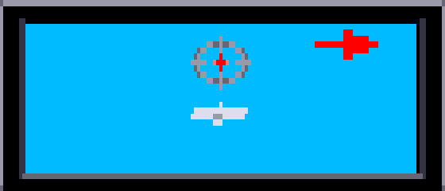

Chapter 16
{ .chapter-kicker }

# The enemy

Chapter 15 gave the player weapons and ground targets; this chapter is about what fights back. By its end you will know how the game keeps and flies an enemy aircraft, where the aircraft come from, why shooting one down takes long, how the ships shoot and sink, how the carrier is defended, and what the dashboard's [3-D view](../glossary.md#3-d-view) shows of them. The port and its instruments are gathered at the end.

## Four records

The manual sends two kinds of enemy aircraft and ships to be sunk (pages 1, 10 and 11). [**Torpedo planes**](../glossary.md#torpedo-plane) attack the player's carrier with torpedoes; [**fighters**](../glossary.md#fighter) hunt the player's aircraft. The game keeps every one of them in an [**enemy aircraft record**](../glossary.md#enemy-aircraft-record): one of four records of 52 bytes in a fixed table. A flight has to remember from one [tick](../glossary.md#logic-tick) to the next where it is against the player, its speeds and height, its health and its timers; those are its fields. Every launch needs a free record, so no more than four enemy aircraft are ever in the air.

The record's first word, its state, says whether it is free, flying, shot down and falling, or burning on land; the routine that steps the records, below, has cases for two more values, which nothing ever sets, and no note says why. While the aircraft flies, its [**mode**](../glossary.md#mode-of-an-enemy-aircraft) says what it is doing. The mode is a set of bits, one for each task: a fighter cruising, a fighter on the player's tail, a torpedo plane, a torpedo plane that has dropped its torpedo; a bit more is added while it turns. The diagram gives the numbers.


/// caption
The states and modes of an enemy aircraft record, the words' values in the boxes; on the arrows what moves a record on: a launch; first in the order within 160 pixels; the drop; health below 96; beyond 2,600 pixels, at rest away from land, or after about 100 ticks of burning.
///

Every tick the game works out the [**relation**](../glossary.md#relation-to-the-player) of each record in use, where it stands against the player: 1 behind him flying the same way, 3 ahead of him the same way; 2 flying the other way east of him, 4 the other way west of him. Among those behind him the same way it counts an order, 1 for the nearest. The record also keeps a health, 240 at the launch; a burst count, the ticks of hits the player's guns need for one burst, each burst taking 8 of the health; a hit flag; and two timers for its turns.

Its speed, in hundredths of a pixel a tick, chases a wanted speed while it flies: speeding up, by half the gap plus 5 a tick; slowing, by half the gap less 5, so it comes to rest about 10 above the wanted speed. A floor of 900 for a slowing aircraft can never act, since the wanted speed is held at 900 or more first. The height steps towards a wanted height, and the x moves by the speed times the factor of the [attitude](../glossary.md#attitude), the stage of a turn, on the ROM's floating point, as the player's does (chapter 14).

`enemy_aircraft_step` walks the four records once a tick. For each in use it takes the relation and the order, then acts by the state: a flying aircraft flies by its mode, trailing smoke by its damage; a shot-down one falls; a wreck burns. Then it eases the speed of one that flies, moves it unless it burns, and picks its frame. The compiler made the switch on the state a chain of subtractions: on the left, `subq.l` takes 1 off the state, then 1, 2, 4 and 8 more, a running total of 1, 2, 4, 8 and 16, and each `beq` lands on the case of the state that total matches. The port's C on the right walks the same way.

//// html | div.listing-pair

/// html | div
```wingslst
--8<-- "generated/listings/asm/enemy_aircraft_step_states.lst"
```
///

/// html | div
```c
--8<-- "generated/listings/c/wof_enemy_aircraft_step.c"
```
///

////

## How they fly

A cruising fighter goes by its relation: behind the player it wants a speed of his [airspeed](../glossary.md#airspeed) plus the distance between them; within `0xA0` pixels, 160, the first in the order goes onto his tail, and the others hang back at his height. Coming the other way east of him, it turns about, or slows while he turns; west of him, it slows, moves 32 pixels above or below his height and turns. Ahead of him the same way it lets him catch up and jinks, dodging between heights of 35 and 95. It turns when any of three things happens: after 550 ticks, when he turns, or 8 to 13 ticks after his guns hit it.

On the tail it keeps about 130 pixels behind him and takes his height. It fires only while it is first in the order, flying straight, its attitude 0, within 160 pixels and less than 8 of height: on the left, `cmpi.w #$1,$c(a0)` is the order's test, the others follow, and `move.w #$1,$12(a0)` sets its firing word, by which the pass draws its guns' flash. The flash does no harm; the [**hit count**](../glossary.md#hit-count) does, the word of the player's record that chapter 15's targets count down. At exactly his height, every other tick, the fighter counts it down too; when it runs out his oil falls by 8 and his fuel by up to 31, and a new count of 6 to 10 begins.

//// html | div.listing-pair

/// html | div
```wingslst
--8<-- "generated/listings/asm/fighter_attack_fire.lst"
```
///

/// html | div
```c
--8<-- "generated/listings/c/fighter_attack_fire_c.c"
```
///

////


/// caption
The oil run, a replay of the script `oil_d`, about 58 seconds into map d's mission: the airfield's fighter on the player's tail. The run checks the fighter's record there: state 2, mode 2, relation 1, its firing word set.
///

A torpedo plane flies at the carrier at 9 pixels a tick, at a height of 50. Within 1,000 pixels before the deck it comes down to 20, and once at that height and flying straight it drops its torpedo into the sixteenth [object record](../glossary.md#object-record), chapter 15's, still short of the deck; the torpedo runs on in the sea into the carrier. Chased from behind, it keeps about 150 pixels ahead of the player, jinking. Once it has dropped, it climbs to 60 and flies on, and 2,600 pixels from the player its record is freed.

A turn steps the attitude by one every third tick; at 14 the facing turns, and past 25 the turn is over. The horizontal speed follows chapter 14's factor of the attitude, which falls to 0 in the middle of a turn, so an enemy aircraft almost stands still there. A fighter's wait before its next turn, its distance times 100 over its speed, is chapter 3's example of the 16-bit [int](../glossary.md#int-the-c-type); whether a distance that overflows it is ever reached, no run has measured. A cruising fighter ahead of him at attitude 13, mid-turn, keeps the player's aircraft from turning; no note says why.

The frame's number is the attitude, 0 to 25, plus 28 when the aircraft faces east. Two tables of 28 names, one for each facing, give its shape in `japplane.shp`, with 26 a torpedo plane flying straight and 27 the wreck:


/// caption
A turn from west to east passes through `jp1b` to `jp1f`, one from east to west through `jp13` to `jp17`, each name shown once where the attitude holds it for two or three steps; below, a torpedo plane flying straight and the wreck, each facing both ways.
///

## Where they come from

Every launch goes through one routine, `aircraft_launch`, given a kind, an x, a height and a facing. It walks the four records and keeps the last free one it meets, where chapter 15's drop takes the first; no note says why. It launches a torpedo plane only while no other that has not yet dropped holds a record, flying or falling: it tests the torpedo plane's bit of the mode, which the 3-D view's arrow looks for too. A launch gives the record full health, a speed of 900 and a first burst of 5 to 7.

Three things call it. The first is the [**enemy's countdown**](../glossary.md#enemys-countdown), the [player's record](../glossary.md#players-record)'s field whose counting chapter 14 told. When it reaches 0, a torpedo plane comes 6,144 pixels from the player, on the carrier's side of him, flying towards him; over the deck a draw of the [beam](../glossary.md#beam) picks the side. The launch also needs the player more than 6,656 pixels short of x 32,767, the largest number a 16-bit word holds, which keeps the new aircraft's x inside a word; only the far east of the two longest maps fails the test. The launch is tried on that one tick: after each drop the countdown is 500 again, but a torpedo plane shot down before its drop, or a launch that failed, leaves it at 0, and none comes until a visit to the [hold](../glossary.md#hold) or the next aircraft sets it again.

The second is an [**airfield**](../glossary.md#airfield), a runway on an island from which fighters take off, its parked aircraft and its most fighters up given by the map's table. With the player within 480 pixels of it and fewer fighters up than its most, a parked aircraft rolls from its end, a pixel a tick faster every eight ticks up to 7, and takes off at the far end as a fighter. The roll starts a cooldown of 100 ticks, shared with the ships.

The third is a ship. Every enemy ship carries two to seven aircraft parked on its deck, with the most it lets up and a range of the player's x, from the map's tables. Afloat with hits left, with the player in its range and fewer fighters up, it sends up the last of its parked aircraft, always facing west. The Japanese carrier, the enemy's own carrier, readies one at a time on its deck instead and rolls it west, faster each tick towards 8 pixels a tick, until it leaves the ship's west end.

## Shot down

While the guns fire (chapter 15), the tick tests every record. A record ahead of the player the same way, within 160 pixels and `0x14`, 20, of his height, is hit while he leaves the stick alone, the [pitch](../glossary.md#pitch-of-the-aircraft)'s target at 0. The hit flag is set and each tick of hits counts the burst down; at a burst's end the aircraft smokes and loses 8 of its health, and a new burst of 6 to 9 begins. Below `0x60`, 96, it is shot down: 350 points and state 4.

From 240 that takes nineteen bursts, a first of 5 to 7 ticks of hits and eighteen of 6 to 9, 113 to 169 ticks; and they do not come at once, because every hit starts the aircraft's evasion, a turn 8 to 13 ticks later. On the left, the first test is `cmpi.w #$3,$4(a0)`, the relation, and nothing tests the state. A freed record keeps the relation it last had, so a free record left at 3 near the player would be hit too, and below 96 paid for and set falling; no run has shown it, and the port does the same.

//// html | div.listing-pair

/// html | div
```wingslst
--8<-- "generated/listings/asm/guns_hit.lst"
```
///

/// html | div
```c
--8<-- "generated/listings/c/wof_guns_hit.c"
```
///

////

A shot-down aircraft trails smoke and comes down; on the ground it slides, killing the [soldiers](../glossary.md#soldier) within 20 pixels and hitting the [map record](../glossary.md#map-record) under it as a crash does while faster than 500. When its speed falls below 100, the [**enemy plane counter**](../glossary.md#enemy-plane-counter) on the [dashboard](../glossary.md#dashboard) counts the kill, on land or on the sea. On land the wreck then burns for about a hundred ticks and leaves its [**wreck's word**](../glossary.md#wrecks-word), its x, negative when it faced west, in a list from which the [pass](../glossary.md#pass) draws it, and its record is freed; anywhere else the record is freed at once. The word goes to the list's start plus twice the count of wrecks, whatever the count: the list holds forty words, and a forty-first would land in the enemy aircraft records behind it. Chapter 20 returns to it among the original's quirks.

The pass draws the wrecks first, then every aircraft in use, at an eighth in the [eighth-scale view](../glossary.md#eighth-scale-view); one that fires draws its guns' flash every other pass with chapter 12's exclusive-or blit. Ships and airfields show their parked aircraft, on an airfield 64 pixels apart.

## The ships

The game keeps five [**ship records**](../glossary.md#ship-record) of 30 bytes: the destroyer, the battleship, the cruise ship, the Japanese carrier and the player's carrier. The cruise ship is the notes' name for the smallest, with four guns. The map's scan fills each record from the [slot](../glossary.md#slot) that introduces the ship (chapter 13), and it takes only the first of each kind, so a map can carry at most one ship of each.

| Ship | Guns | Hits | Deck height | Score |
|---|---|---|---|---|
| destroyer | 8 | 1 | 27 | 2,500 |
| battleship | 14 | 2 | 27 | 4,500 |
| cruise ship | 4 | 1 | 28 | 1,000 |
| Japanese carrier | 15 | 3 | 21 | 6,000 |
| the player's carrier | none | 4 | 33 | 0 |

Maps a to c have no enemy ship and no airfield; the first ship comes on map f, and map o carries three, the most; [chapter 13](world.md)'s table gives them map by map, and every map gets the countdown's torpedo planes.

Each gun has an entry of 14 bytes in the ship's list. While the player flies, every standing gun of every enemy ship afloat with hits left takes a shot at him in every pass, by draws of the beam, and fires on the aircraft as a target's gun does, chapter 15's.

/// figures
| A ship's gun's shot | |
|---|---|
| The shot | a draw below 512 must exceed the gun's distance from the player |
| His height | at most 200 |
| The splash | six times in sixteen, within 32 pixels of him |
| A torpedo destroyed | his or a torpedo plane's, within 10 pixels of the splash |
| A gun destroyed | the first standing one within 16 pixels of a rocket, of a torpedo falling onto the deck, or of a crash: 200 points, then 49 puffs of smoke |
///

## The torpedo run and the sinking

A torpedo running in the sea that reaches a ship takes one of the ship's hits and flashes the sky red, chapter 11's [sky flash](../glossary.md#sky-flash), which a torpedo never makes on land. The manual asks for the ship's guns to be disabled before the torpedo run (page 7); the code counts the hit whatever the guns do. At 0 hits the ship sinks, drawn a row of pixels lower after each interval, which starts at 20 ticks and shortens by one with every row; the battleship, whose first interval the scan leaves at 0, takes its first row at once. Ten rows down an enemy ship pays its score, the [ticker](../glossary.md#ticker) names it, the name chosen by its score, and one ship fewer is left. With no ship and no island left the mission is won, chapter 17's subject. At 120 rows the ship is gone and its map records are cleared.

Two places in this routine decided how the port had to be written. The carrier and an enemy ship take different paths at every row, and what tells them apart is the carrier's score of 0. The listing compares the rows with 1, `cmpi.w #$1,$14(a1)`, then loads the score, `move.w $12(a1),d0`, and only then branches with `beq`. A `move` sets the flags from the value it moves, so the branch reads the score: the comparison's result is overwritten and decides nothing, and a score of 0 takes the carrier's path.

The second is the last ship. `subq.b #$1` takes one off the count of ships left, and `bgt` branches while ships remain. But `bgt` judges the true result of the subtraction, overflow included, not the byte it leaves: from `0x80`, −128 as a signed byte, the byte becomes `0x7F` with the overflow flag set, and the branch is not taken. With no island left, the mission would be won with 127 ships still to sink. The port tests the byte before the decrement, as a signed number, against 1, which is what `bgt` decides. One of the oracle's random states, its case 508 of the sinking, found it; no map has more than three enemy ships.

//// html | div.listing-pair

/// html | div
```wingslst
--8<-- "generated/listings/asm/ship_sinking_score.lst"
```
///

/// html | div
```c
--8<-- "generated/listings/c/ship_sinking_score_c.c"
```
///

////

## The carrier's defence

The player's carrier takes four hits, one for each torpedo plane's torpedo that runs into it, and goes down as a ship does. At every row while the player is aboard, in the hold, the code puts him back on the [lift](../glossary.md#lift) with the weapon menu closed; at 33 rows his aircraft, if it stands on the deck, goes into the sea, the lives are taken and the count to the game's end starts, chapter 17's. The enemy's countdown stops.

What defends the carrier is the manual's (page 11): shoot the torpedo plane down before it drops, or destroy its torpedo in the water. The walk of the torpedoes in the sea tests the sixteenth object record whatever its type, so the enemy's torpedo is destroyed by the same things as the player's: the bullets' splashes, a bomb or a rocket nearby, and an enemy ship's shot. An arrow at the top of the 3-D view points west or east to the first torpedo plane that has not yet dropped.

## The 3-D view

The [**3-D view**](../glossary.md#3-d-view) is the window in the middle of the dashboard, the manual's view from the cockpit (page 8). It shows the sky and the sea, the map records ahead of the aircraft in eleven rows of the window from the horizon down, and a cursor whose row follows the height, the manual's artificial horizon. An enemy aircraft ahead is drawn on the row of the window that holds its distance, in the window's middle, a quarter of its height plus 4 above the row, with a frame picked by its own frame and that row from the dashboard's small pictures of the enemy.



/// caption
The countdown run, a replay of `countdown_b`, about 146 seconds into map b's mission: the torpedo plane coming at the player, below the cursor, and the arrow to it. The run checks the plane's state, mode and relation, 2, 4 and 2, and the player's facing.
///

Under the score, the enemy plane counter shows the kills, a kill icon for each, seven to a row in two rows: after fourteen the icons stop, and the digits go on to 99 (page 9).

/// figures
| The times, on PAL, derived | Ticks | Seconds |
|---|---|---|
| The next torpedo plane after a drop, without the button | 500 | 40 |
| An enemy aircraft's turn | 25 steps × 3 | about 6 |
| A kill: nineteen bursts of hits | 113 to 169 | 9 to 14 |
| A fighter at his height: from full oil to the engine's end | about 60 to 100 | about 5 to 8 |
| The cooldown, from the start of a roll | 100 | 8 |
| A ship sunk in `torpedo_f`, observed: its score, and gone | 163; 328 | 13; about 26 |
///

## What the port made of it

[`src/enemy.c`](repo:src/enemy.c) holds the original's compiled C behind the walk, routine by routine in the original's order, each with its `orig` comment and the 16-bit widths, the record's fields named in [`src/records.def`](repo:src/records.def). The two speed limits, 900 and 2,600 hundredths, 9 and 26 pixels a tick, are words of the original's data that nothing writes, registered all the same; 2,600 is also the distance in pixels at which a dropped torpedo plane is freed, a constant written into the code there.

The wreck's word is stored by its original address: the port writes its two bytes, big-endian, into whichever registered variable or table covers that address, so a forty-first word lands in the aircraft records as the original's does. Where the ships' guns hand on the upper words of two registers to the targets' fire, the port passes them, chapter 9's family of [upper words](../glossary.md#upper-word). The sounds of these routines are chapter 18's.

## How it is held

Twenty-five [mission scripts](../glossary.md#mission-script) fly the enemy, by the [autopilot](../glossary.md#autopilot) of chapter 8 with new parts: the countdown left to run, the dogfight, the torpedo at a ship, the crash on a ship and the wait in the hold. Every script runs in the [closed loop](../glossary.md#closed-loop), every tick and pass compared, five only in the suite's long run and two also at one and three VBlanks a pass, and in the [open loop](../glossary.md#open-loop) with its differences attributed: one is allowed only where a later milestone's stand-in was reached, and none differed. The [completeness list](../glossary.md#completeness-list) accounts for every address they write, and the tables the pass walks are held against all fifteen maps.

Under the [oracle](../glossary.md#oracle), each routine of the module that takes a record is held over 1,200 random settings of the registered state, and the cases run every stretch of the code no script reached. The enemy's guns' flash is a second test of chapter 12's exclusive-or blit. The page test flies map d from the keyboard and finds the airfield's fighter in the picture by its frame's pixels, since colour alone could not tell it (chapter 24). Fourteen [controls](../glossary.md#control) broke the port on purpose, and the loops caught each:

| Control | Script | Caught |
|---|---|---|
| the countdown after a drop 501 for 500 | `countdown_b` | at tick 2021 |
| the kill icons 12 pixels apart for 13 | `kills_a` | in the first pass |

No flight shot an enemy aircraft down over land. Over map a's island the [dug-outs](../glossary.md#dug-out)' fire took the oil in the low chase; against the airfields' fighters, seven plans of up to 15,000 ticks brought none down: hit, a fighter turns away, jinks down to 35 pixels, where the chase flies into the ground, and on the tail takes the oil. A poke reaches the fall on land instead: a fighter shot down high over map a's island, placed in a record.

Here is the dogfight's close chase: it holds the button from 400 pixels, though a hit needs 160, because the guns fire only after ten VBlanks held, and it pushes the stick forward or back always with the direction of flight, since forward alone, flying west, is the [landing stall](../glossary.md#landing-stall).

```python
--8<-- "generated/listings/py/dogfight_chase.py"
```

/// dev
Other routines: `fighter_cruise` `0x01D9C6`, `torpedo_plane` `0x01DEA4`, `aircraft_launch` `0x01E4D0`, `window_strip` `0x014206`. The Japanese carrier draws one shape more, its thirteenth name, which `japcarrier.shp` does not hold, so the call draws nothing; the port makes the same call. The unread word after the speed limits is registered too, so that the C structure of the globals needs no padding. The wreck's word is stored by `wof_original_store16` in [`src/core.c`](repo:src/core.c); the scripts are [`tools/m6_scripts.py`](repo:tools/m6%5Fscripts.py), their schedules [`tools/m6_runs.py`](repo:tools/m6%5Fruns.py).
///

## What comes next

The chapter in one sentence: four records fly the enemy aircraft by state, mode and relation, launched by the countdown, airfields and ships and shot down in nineteen bursts; five records keep the ships, which shoot and sink row by row. Chapter 17 takes up the campaign: the mission won and lost, the ranks the maps belong to, the night, and the game's end after the carrier sinks.

## Further reading

- [`re/notes/enemy.md`](repo:re/notes/enemy.md): ["The enemy aircraft"](repo:re/notes/enemy.md#the-enemy-aircraft), ["The ships"](repo:re/notes/enemy.md#the-ships), ["The carrier's defence"](repo:re/notes/enemy.md#the-carriers-defence) and ["Open"](repo:re/notes/enemy.md#open).
- [`re/notes/porting-m6.md`](repo:re/notes/porting-m6.md): ["The scripts"](repo:re/notes/porting-m6.md#the-scripts), ["The dogfight"](repo:re/notes/porting-m6.md#the-dogfight), ["Flags that decide in the tick"](repo:re/notes/porting-m6.md#flags-that-decide-in-the-tick) and ["How the port is held to the original"](repo:re/notes/porting-m6.md#how-the-port-is-held-to-the-original).
- [`src/enemy.c`](repo:src/enemy.c), [`src/tick.c`](repo:src/tick.c), [`src/world.c`](repo:src/world.c) and [`src/dash.c`](repo:src/dash.c); [`tests/test_oracle_m6.py`](repo:tests/test%5Foracle%5Fm6.py), [`tests/test_enemy.py`](repo:tests/test%5Fenemy.py), [`tools/m6_autopilot.py`](repo:tools/m6%5Fautopilot.py) and [`tools/m6_observe.py`](repo:tools/m6%5Fobserve.py).
- [`original/manual.txt`](repo:original/manual.txt), the game's manual: pages 1, 10 and 11 for the enemy, 7 for the torpedo run, 8 and 9 for the 3-D view and the counter.

Outside the repository: Wikipedia's ["Fighter aircraft"](https://en.wikipedia.org/wiki/Fighter%5Faircraft) and ["Torpedo bomber"](https://en.wikipedia.org/wiki/Torpedo%5Fbomber), for the real kinds.
