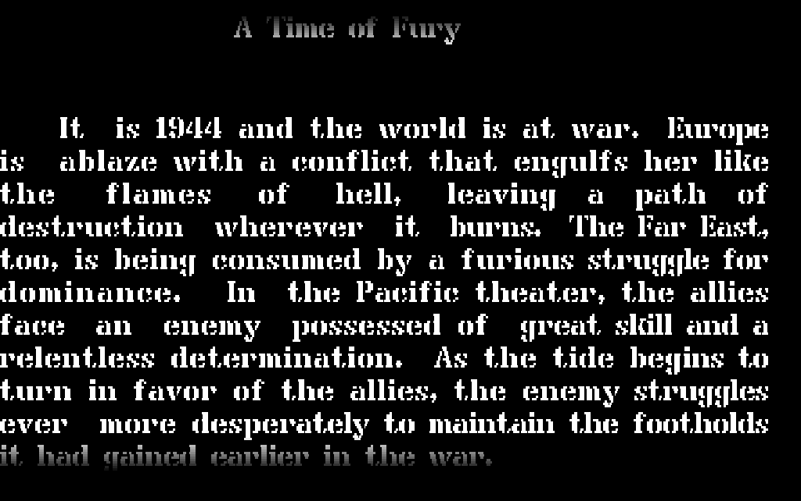
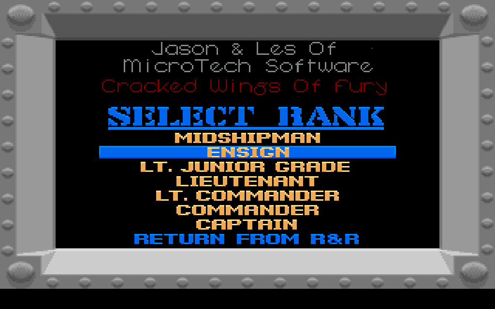
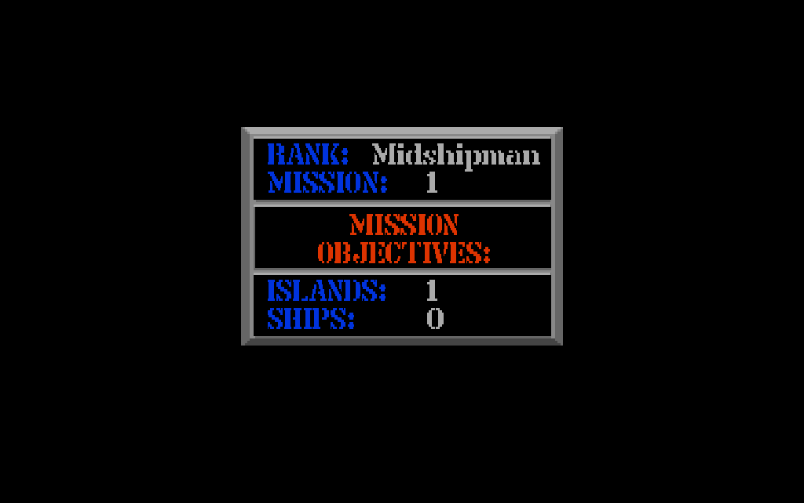
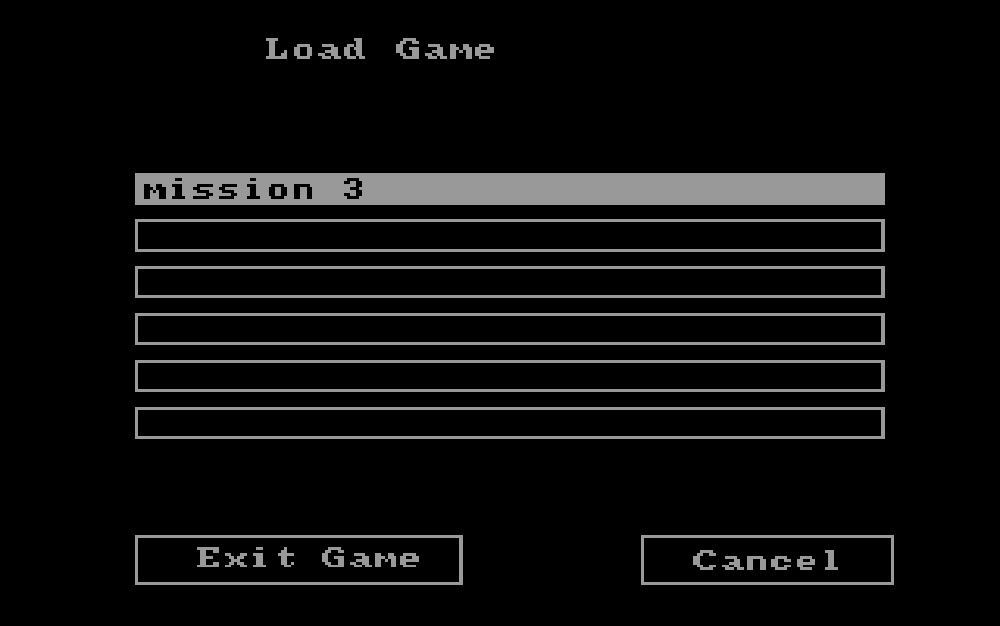
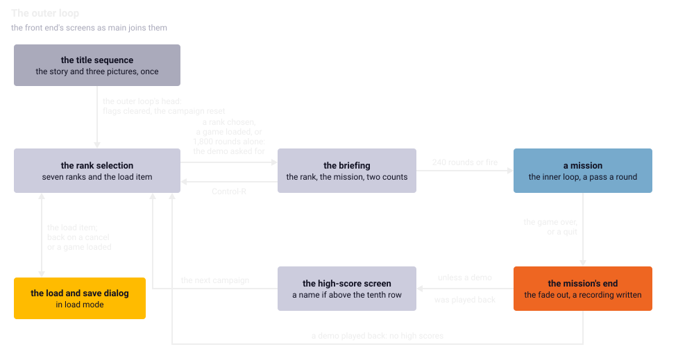
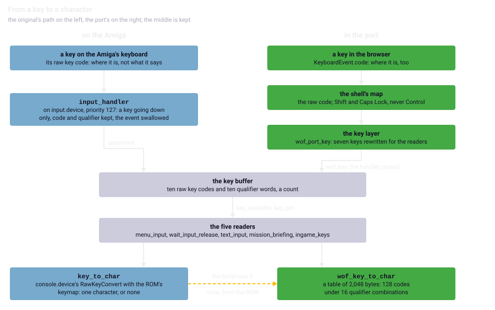

Chapter 19
{ .chapter-kicker }

# The front end and the keys

Before and between missions the game runs a few screens: a scrolling story, three pictures, a menu of ranks, a briefing, a dialog for saved games, the high scores. By the end of this chapter you will know what each draws, waits for and reads, VBlank by VBlank; how one loop joins them; why the dialogs' font comes from the ROM; how a key becomes a code that the ROM's own routine turns into a character; and what the port made of it, its own keys and the keyboard assist among it.

## A timetable of waits

The [**front end**](../glossary.md#front-end) is the game's screens before and between missions, and the loop that joins them. Each screen waits by calling graphics.library's `WaitTOF`, which returns at the next [VBlank](../glossary.md#vblank), so many times or until the button goes down; one call is a round, one VBlank. So, left alone, the program keeps one timetable, and the port is held to it. A run of the [headless original](../glossary.md#headless-original) with no input, on PAL:

| VBlank | What happens |
|---|---|
| 1 | song 2; the story scroller |
| 3 to 2,915 | 53 lines of the story, one every 56 VBlanks |
| 3,791 | the scroller ends; song 2 fades |
| 3,895 | song 1; the first picture, 60 rounds in a palette of its own, 120 in its colours |
| 4,078 | the title, 300 rounds |
| 4,379 | the credits, 600 rounds |
| 4,980 | the rank selection; song 1 fades |
| 5,084 | song 4; from 5,087 the menu, which gives up when its count passes 1,800 |
| 6,888 | the menu gives up and asks for the demo; the music stops |
| 6,992 | the briefing, 240 rounds |
| after 7,237 | step S, the inner loop; from 7,235 the briefing's fade, the setup, `main`'s first tick |

A change of song waits for the [song's fade](../glossary.md#songs-fade), 104 VBlanks in which the screen stands still (chapter 18). The display's [fades](../glossary.md#fade) hold no wait, so the headless original runs them in no time; the port gives a step two VBlanks, the comparisons none ([chapter 7](../part-1/time.md#the-fade-step)). With the taps of fire the tests use, step S comes after 444 VBlanks, 312 of them the three songs' fades.

/// figures
| The timetable in seconds, derived | |
|---|---|
| A line of the story, 56 VBlanks; the pictures' waits, 60 to 600 rounds | 1.1 s; 1.2 to 12 s |
| The rank selection, 1,800 rounds; the briefing, 240 | 36 s; 4.8 s |
| A change of song, 104 VBlanks; a fade in the port, 32 | 2.1 s; 0.64 s |
| The front end left alone, fades at no time, 7,237 VBlanks; with fire, 444 | 145 s; 8.9 s |
///

## The story scroller

The [**story scroller**](../glossary.md#story-scroller) comes first, behind song 2; the [crack](../glossary.md#crack)'s text screen before it is left out (chapter 1). Its screen is two views of 640 by 200, one shown, each a single [viewport](../glossary.md#viewport) of one [bitplane](../glossary.md#bitplane). Its window, the rows the screen shows, is 230 rows from wherever the plane's start stands, text visible down to row 196. Every step, four VBlanks, the start moves a row down, so the text rises with nothing copied; a line is 14 rows, so one comes every 14 steps. After 210 steps the start returns to the top, and the [copper list](../glossary.md#copper-list) reloads the plane's address at the ring's row 210, so the window's lower rows show the top again: a ring of 210 rows, which is how a window of 230 rows shows a bitmap of 200.

Each new line is drawn where the window's row 196 will show it: after a wrap at the ring's row 196, otherwise 14 rows above the plane's start, before the drawing's first row, which graphics.library does not clip here. So drawing and display reach past the bitmap, the display to row 258: the port's graphics layer must not clip either, and its view block is 640 by 260 bytes ([chapter 11](display.md#what-the-port-made-of-it)).

The processor draws each line in the game's font into a one-bit stencil of where the ink goes, and graphics.library's `BltTemplate` stamps it in the current colour, justified to 615 pixels unless it ends a paragraph. A grey ramp of colour 1, `0x111` a row, fades the text in over the visible text's bottom 16 rows and out over its top 16; the port gives each grey a palette. Fire ends the scroller, or some 210 steps after its last line and a wind-down of 16 rounds of two VBlanks; it reads no key.



/// caption
The story scroller at VBlank 780 left alone: the ramps fade the text out at the top and in at the bottom.
///

## The title sequence

The [**title sequence**](../glossary.md#title-sequence) runs the scroller and then three pictures behind song 1: chapter 1's picture of the crack, the title and the credits, on two views of 320 by 200 with five planes. Each picture is decoded into the view not on show, its colours set aside and the view's own black, while the previous one is still up; then the views swap and it fades in, so no picture is seen being decoded. The first fades in to a fixed palette of the executable, waits 60 rounds, then fades to its own colours and waits 120. Fire ends a wait and skips the rest of the sequence at once.

## The rank selection

The [**rank selection**](../glossary.md#rank-selection) is the menu of chapter 17's seven [ranks](../glossary.md#rank) and the load item below them, behind song 4. Its picture is the third the crack touched, three lines of the crack group above the heading (chapter 1). Its highlight, one of eight records of a [shape container](../glossary.md#shape-container), is drawn by chapter 12's `shape_draw_xor`, which inverts the screen's bits where the shape has them, so drawing it again takes it away. A move draws the old one away and the new one in, then copies the shown view into the other, so that the next move finds the same pixels to erase in either.



/// caption
The rank selection after one pull of the stick: the blue bar is the highlight, drawn in exclusive-or on the second item; the three lines at the top are the crack group's.
///

The menu's [reader](../glossary.md#reader-of-the-key-buffer), `menu_input`, takes the cursor keys and Return from the [key buffer](../glossary.md#key-buffer) of waiting keys, told below, then polls the stick and the button. Look at its count of rounds against `0x708`, 1,800, beyond which it returns 1000, the demo's request; in the port `CO_WAIT` stands for `WaitTOF`:

//// html | div.listing-pair

/// html | div
```wingslst
--8<-- "generated/listings/asm/menu_input_loop.lst"
```
///

/// html | div
```c
--8<-- "generated/listings/c/wof_menu_input_loop.c"
```
///

////

After a move it waits up to nine rounds for the stick and the button to rest, so that one push moves one item. The [attract demo](../glossary.md#attract-demo) it asks for is not on this disk, so a game starts at the rank under the cursor. The rank is stored twice, as the rank chosen and the rank played, which promotions raise and a high-score row carries (chapter 17).

## The briefing

The [**briefing**](../glossary.md#briefing) comes before every mission, on two views of 640 by 147 with three planes: the shape `rank` from `world.shp` as its background, the disk's `Rank.iff` never opened, and on it, in the game's font, the rank's name, the [mission number](../glossary.md#mission-number) and chapter 17's two counts. It sets no pen, graphics.library's colour number to draw with, so its text takes the one `InitRastPort` leaves when the game sets up its screens: `0xFF` cut to three planes, colour 7, which a test holds. After 240 rounds or on fire the mission begins; Control with R goes back to the rank selection.



/// caption
The first mission's briefing, VBlank 7,100, left alone.
///

## The load and save dialog

The [**load and save dialog**](../glossary.md#load-and-save-dialog) lists the saved games and loads one, or saves the game under a typed name. It takes the back view alone, 320 by 200 with four planes, and draws itself with graphics.library in the system font, [topaz 8](../glossary.md#topaz-8), choosing none. Topaz 8 is in the [Kickstart](../glossary.md#kickstart) ROM, not on the disk, so the port's build reads it from the ROM image whoever builds supplies (chapter 2), finding the glyphs themselves, since the system fills in a ROM font's header only when it starts. Six slots and two buttons, one to leave and one to end the program, come from a table, every line of their boxes parallel to an axis; the selection is a rectangle filled in the complement mode, which inverts what is there, so a second fill undoes it.



/// caption
The dialog in load mode with this disk's one saved game; every pixel is graphics.library's.
///

The list is the game's directory as dos.library's `ExNext` hands out its entries. Look at the test of each name, `w`, `o`, `f` in either case, a full stop and one character more, and at the port's side, which computes the same list:

//// html | div.listing-pair

/// html | div
```wingslst
--8<-- "generated/listings/asm/dialog_file_list_prefix.lst"
```
///

/// html | div
```c
--8<-- "generated/listings/c/wof_fs_dir_entry.c"
```
///

////

There is no sorting: the list keeps the order of the directory's 72 hash chains (chapter 3), six names at most, and would list a directory so named. In save mode the cursor goes straight into the [line editor](../glossary.md#line-editor), told below, on a slot's name, and saving over an edited name deletes the old file, so editing a name renames the save. A typed `:` or `/` becomes a space, and `wof.` goes in front. After a load, chapter 17's setup of the loaded mission follows.

## The high scores and the name entry

The [**high-score screen**](../glossary.md#high-score-screen) ends a game, behind song 0, with chapter 17's [high-score file](../glossary.md#high-score-file) in memory only while it runs, and two viewports, a picture above a slab. The ten rows go on the slab in the game's font three times: a pixel up and left in pen 0, a pixel down and right in pen 0, then in place in pen 15, white outlined in black. Before it runs the [**name entry**](../glossary.md#name-entry), shown only when the score beats the tenth row's: the dialog's screen and the line editor, with room for 16 characters.

## The outer loop

The [**outer loop**](../glossary.md#outer-loop) is `main`'s loop that runs, after the title sequence, the rank selection, the briefing, a mission and the high-score screen, again and again. A mission is the inner loop, one [pass](../glossary.md#pass) a round, with chapter 17's briefings between missions inside it.



/// caption
The outer loop. The dialog here is the load item's; in flight Control-G and Control-L open it too (chapter 17).
///

## How a key reaches the game

The keyboard never reaches the logic through the [input byte](../glossary.md#input-byte). A key sends a [**raw key code**](../glossary.md#raw-key-code), a number from 0 to 127 that names the key's place, not its letter, bit 7 set when the key goes up rather than down; so a German keyboard gives the same codes as an American one. With it travels the [**qualifier**](../glossary.md#qualifier), a word of bits for the keys held: the two Shifts, Caps Lock, Control (`0x0008`), the Alt and the Amiga keys.

The system's input.device passes every event down a chain of handlers by priority. The game's own sits at 127, the highest, so it sees each key first: it drops a key going up, appends the code and the qualifier to the [**key buffer**](../glossary.md#key-buffer), ten of each with a count, and clears the event's class, so that the system's own handlers do not act on the game's keys as well. `key_get` takes the oldest key and shifts the rest down, with an off-by-one. Look at the loop's `ble`: it runs while the index is at most the new count, so with a full buffer its last turn copies one entry from past the end of each array. Beside it, how the port reads that entry:

//// html | div.listing-pair

/// html | div
```wingslst
--8<-- "generated/listings/asm/key_get_shift.lst"
```
///

/// html | div
```c
--8<-- "generated/listings/c/key_code_at.c"
```
///

////

On the machine the byte past the ten codes is the high byte of a qualifier word, and the word past the ten qualifiers is the count. Nothing reads those two places before the buffer fills again, but they are state, compared with the original's after every step, so the port leaves the same values there. It stores them as two fields of their own, so that its buffer need not be laid out as the original's memory was.

The command readers test only Control; the line editor also tests the two Shifts and right Amiga. A qualifier mask that could demand a qualifier on every key is set only in a case a game started from the command line never meets; the port keeps it, dead in play, for the test that runs its other path.

To act on a letter, a reader calls `key_to_char`, which hands the key to console.device's `RawKeyConvert` with the system's default [**keymap**](../glossary.md#keymap), the table that turns a code and its qualifier into characters, and keeps the result only when exactly one character came back. So `0x13` gives r, R with Shift and the control character `0x12` with Control, and a cursor key gives a sequence of two bytes, so none.

The keymap is the system's, in the ROM, and the headless original runs the ROM's own routine on it ([chapter 6](../part-1/headless.md#the-rom-run-for-real)). The port's [core](../glossary.md#core) runs no 68000 code, so its build runs that routine once under the emulator, as chapter 5's oracle runs a routine, over every code under the sixteen combinations of the four bits the port can send, both Shifts, Caps Lock and Control: a table of 2,048 bytes, 1,050 of them characters. Writing the routine anew would mean its rules for every kind of key, for a game that never asks for more than one character; running it makes the ROM itself the reference.

## The readers and the commands

Five [**readers**](../glossary.md#reader-of-the-key-buffer) look at the buffer: `menu_input` in the menus, the line editor `text_input`, the briefing and `ingame_keys`, once a pass in flight, take keys from it, and `wait_input_release` only asks whether one waits. The story, the pictures and the high scores read no key. `ingame_keys` runs before the inner loop's test of the pause, so its commands work paused too and Escape can end the pause; it and the briefing convert a key without its qualifier and test the Control bit apart:

| State | Keys |
|---|---|
| Rank selection | cursor up `0x4C` and down `0x4D` move the highlight, wrapping round; Return or keypad Enter chooses |
| Briefing | Control and R: back to the rank selection |
| In flight and paused | Escape `0x45`, the pause; with Control: R restart, S the music (chapter 18), F the [vertical flip](../glossary.md#vertical-flip), G save on the carrier, L load, not while a demo plays, C delete the high-score file |

Control with B leads into the game's own crash reporter, which the port lacks. The cheat sequence, the plain keys C, O, L, I and N, unlocks debug keys that change the lives, the fuel and the weapons. The manual's Control-D and Control-C are told in [chapter 17](campaign.md#the-high-scores). A restart keeps the flip and a loaded game sets it from the file; the port puts its remembered preference back after a load (chapter 1).

The [**line editor**](../glossary.md#line-editor), `text_input`, edits the name entry's name and the dialog's file names; its caret is a complement fill, drawn again to go:

| Key | What it does |
|---|---|
| Return or Enter, or fire | accept and leave |
| cursor left, right | a character; with either Shift, to the line's start or end |
| cursor up or down, or the stick | leave, to the slot above or below |
| Backspace, Delete | delete before, or under, the caret |
| right Amiga and X | clear the line |
| any other key | converted with its qualifier and inserted, if there is room |

There is no filter: any single byte the conversion gives goes in.

## What the port made of it

The key path is kept routine by routine, `key_to_char` over the table; dropped are the handler's mouse half, whose byte nothing reads, the chain of events, with no input.device behind it, and `key_get`'s wait on an empty buffer, which no live caller reaches.

### The key layer

In front of the buffer sits the port's [**key layer**](../glossary.md#key-layer), in a file of its own because it is policy decided with the owner, not a port. A browser keeps Control with R, F and L for itself, so each command gets a plain letter, rewritten into what the readers expect:

| Key | Becomes | When | Why that letter, that rule |
|---|---|---|---|
| P | Escape | always | Escape works too |
| V | Control-F, the flip | always | F is fullscreen |
| G | Control-G, save | always | its own letter |
| L | Control-L, load | always | its own letter |
| M | Control-S, the music | always | S is the stick pulled back |
| R | Control-R, restart | paused, or in the briefing | a stray press would end a campaign |
| C | Control-C, clear the high scores | paused | a stray press would wipe the high scores |

Otherwise a key passes as it came, and inside the line editor every key does. Look at the editor's test around the switch:

```c
--8<-- "generated/listings/c/wof_port_key.c"
```

The cost: P, V, G, L and M never reach a reader as plain letters outside the editor, and the cheat, whose third key loads, cannot be typed; nothing in the manual is lost, for a plain letter does nothing in the original. The [shell](../glossary.md#shell) ([chapter 23](../part-3/shell.md)) takes H and F for its help screen and fullscreen, and maps `KeyboardEvent.code`, a place too, to the raw code, leaving out the function keys and Help, so as not to swallow reload or the developer tools; the key left of 1, its diagnostics key; and right Amiga. The port's development keys behind the diagnostics overlay set a score for the name entry, open either dialog, record the following games as the demo, choose PAL or NTSC and step the stereo width.



/// caption
From a key to a character: the buffer and its readers are the original's on both sides; the shell's map, the key layer and the table are the port's.
///

### The keyboard assist

Chapter 1 told what the [keyboard assist](../glossary.md#keyboard-assist) does; here is how. The weapon menu in the [hold](../glossary.md#hold) steps on the input byte, then waits for two more [input samples](../glossary.md#input-sample) that carry input, so a step costs three input samples, twelve VBlanks, and for 15 ticks after it opens it is not run; a stick is held through that, a key tapped. So the assist turns a press of forward or back in the menu into a [**push**](../glossary.md#push-of-the-keyboard-assist), the stick held for exactly twelve VBlanks, one step at any phase. Two presses made meanwhile are remembered; one in the first 15 ticks waits for the VBlank on which the menu will listen, worked out from its countdown and the queued input samples. The push is never flipped, so up on the key is up in the menu. Elsewhere a direction that goes down arms itself, and the next input sample carries it even after the key is up: a tap shorter than four VBlanks reaches exactly one tick. The menu's steps from twelve taps forward, 20 VBlanks apart, a blank cell a case the test does not run:

| Each tap | The original | With the assist |
|---|---|---|
| 1 VBlank | 1 | 12 |
| 2 VBlanks | 2 | 12 |
| 3 or 5 VBlanks | | 12 |
| 4, 8 or 12 VBlanks | 4, 8 or 12 | |
| held for 240 VBlanks | 20 | 20 |

In the original the steps grow with the taps, since longer taps cover more of the input samples a step costs. Only the input sample sees the assist; nothing of it is a registered value or writes one, the front end's polls and the button's [latches](../glossary.md#latch) see the controller as it is, and the rank menu, which polls every VBlank, is left alone. The core starts with the assist off, as every comparison runs; the page switches it on.

### The waits, the drawing and the files

The front end blocks, and a page cannot: it must hand control back to the browser between frames, or no frame is drawn and no key arrives. So every routine that waits is a [coroutine](../glossary.md#coroutine), code that stops at a wait and goes on there at the next call (chapter 22). One `CO_WAIT` is one VBlank, because the headless original delivers a VBlank where the program waits and the shell calls the core once a VBlank; the port's start runs to its first wait, so the music's first call falls on VBlank 1 in both. Of the four waits, `wait_frames_or_fire` counts the rounds asked for, ending on fire, `wait_input_release` at most nine, `menu_input` past 1,800, and `wait_vblank` none if its VBlank has come.

graphics.library becomes seven calls on [indexed](../glossary.md#indexed-framebuffer) pixels, `Move`, `Text`, `RectFill`, `Draw`, `SetAPen`, `SetBPen` and `SetDrMd`, with `BltTemplate` behind the text routines, without clipping, as on the machine. `Draw` refuses a sloped line, which would need the blitter's line mode, whose pixels the port has not established; the front end draws only the sides of boxes.

What the game writes goes into the file system's overlay, in front of the read-only disk, kept out of the core's state so that loading a state does not un-write a saved game. Its order comes from the names alone: the name's hash modulo 72 gives the chain, chains are walked upward, and in a chain the player's files come first, newest first; a real Kickstart 1.3 doing the same is documented, not confirmed. The dialog's button that ends the program reloads the page (chapter 23).

## How it is held

The keys are held under the headless original by the 34 [run descriptions](../glossary.md#run-description) of [`tests/runs/`](repo:tests/runs/), chapter 1's 21 in flight and paused among them: the front end left alone and with fire, one in the scroller, which reads no key, and 31 in the states that read keys, each command with its key and without. Here the flip, with Control and F, F alone, twice, and no key:

```python
--8<-- "generated/listings/py/test_control_f_flips_the_vertical_control.py"
```

The port replays both front-end runs from the program's start, given only their input, the fades at zero: the same files, notes of the music and drawing calls, with places and texts, at the same VBlanks. The headless original draws nothing, so a screen's look rests on those calls, which [observers](../glossary.md#observer) record without changing the run, and on the owner's eyes. Under the [oracle](../glossary.md#oracle) run the off-by-one, the qualifier mask, the table against the ROM's routine over all 2,048 combinations, the justified template and the fades. The line editor runs against the original's own `text_input` under the headless original, over fixed and random keys. A test holds the layer's five letters, the assist's table is a test of the port alone, and the page tests drive the keys in two browsers (chapter 24).

/// dev
Routines: `title_sequence` `0x018022`, `story_screen` `0x017E80` (its strings at `0x017494`, 2,152 bytes), `rank_select` `0x018262`, `mission_briefing` `0x018590`, `load_save_dialog` `0x018B96`, `high_score_screen` `0x019856`, `input_handler` `0x02075A`, `key_get` `0x0207E4`, `key_to_char` `0x020700`, `text_input` `0x016086`. Qualifier bits: `0x0001`, `0x0002` the Shifts, `0x0004` Caps Lock, `0x0008` Control, `0x0010` left Alt, `0x0080` right Amiga. Raw codes: Return `0x44`, Enter `0x43`, cursor keys `0x4C` to `0x4F`, Backspace `0x41`, Delete `0x46`, X `0x32`; R `0x13`, S `0x21`, F `0x23`, G `0x24`, L `0x28`, C `0x33`. The qualifier mask is left Alt when `task_setup` (`0x0125C6`) finds a trap handler not dos's own. A coroutine's local that outlives a wait lives in its context, since the resume skips its setting, and no wait sits inside the routine's own `switch` ([`src/coro.h`](repo:src/coro.h)). A run description's key is a decimal raw code, or one with its qualifier ([`re/notes/keys.md`](repo:re/notes/keys.md#the-run-descriptions-keys)).
///

## What comes next

The chapter in one sentence: the front end is a timetable of waits in VBlanks, and a key a raw code and qualifier in a buffer of ten that the ROM's routine, run once at the port's build, turns into a character, with the port's own keys and assist in front. [Chapter 20](quirks.md) gathers the original's quirks, four met here: whether a real machine lists the directory in the port's order; what nothing reads, the fades' second argument, the editor's fifth, the rank selection's return value and the right mouse button's byte; the buffer's off-by-one; the manual's Control-D.

## Further reading

- [`re/notes/frontend.md`](repo:re/notes/frontend.md): ["The timetable, left alone"](repo:re/notes/frontend.md#the-timetable-left-alone) and ["Screen by screen"](repo:re/notes/frontend.md#screen-by-screen).
- [`re/notes/keys.md`](repo:re/notes/keys.md): ["Raw code to character: console.device"](repo:re/notes/keys.md#raw-code-to-character-consoledevice), ["The five readers"](repo:re/notes/keys.md#the-five-readers) and ["The commands"](repo:re/notes/keys.md#the-commands).
- [`re/notes/porting-m3.md`](repo:re/notes/porting-m3.md): ["The key path"](repo:re/notes/porting-m3.md#the-key-path), ["The front end as coroutines"](repo:re/notes/porting-m3.md#the-front-end-as-coroutines) and ["The file system's write side"](repo:re/notes/porting-m3.md#the-file-systems-write-side); [`re/notes/porting-m4.md`](repo:re/notes/porting-m4.md): ["`ingame_keys` and the pause"](repo:re/notes/porting-m4.md#ingame%5Fkeys-and-the-pause) and ["The keyboard assist"](repo:re/notes/porting-m4.md#the-keyboard-assist).
- [`re/notes/system-font.md`](repo:re/notes/system-font.md); [`re/notes/drawing.md`](repo:re/notes/drawing.md#text), "Text".
- [`src/front.c`](repo:src/front.c), [`src/keys.c`](repo:src/keys.c), [`src/portkeys.c`](repo:src/portkeys.c), [`src/assist.c`](repo:src/assist.c), [`src/dialog.c`](repo:src/dialog.c); [`tests/test_frontend.py`](repo:tests/test%5Ffrontend.py), [`tests/test_front_port.py`](repo:tests/test%5Ffront%5Fport.py) and [`tests/test_oracle_m3.py`](repo:tests/test%5Foracle%5Fm3.py).
- [`original/manual.txt`](repo:original/manual.txt), the game's manual: pages 2 to 4, 11 and 12.
- The [*Amiga ROM Kernel Reference Manual: Libraries and Devices*](https://archive.org/details/amiga-rom-kernel-reference-manual-libraries-and-devices), on input.device and console.device.
