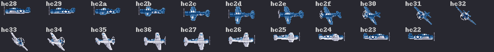
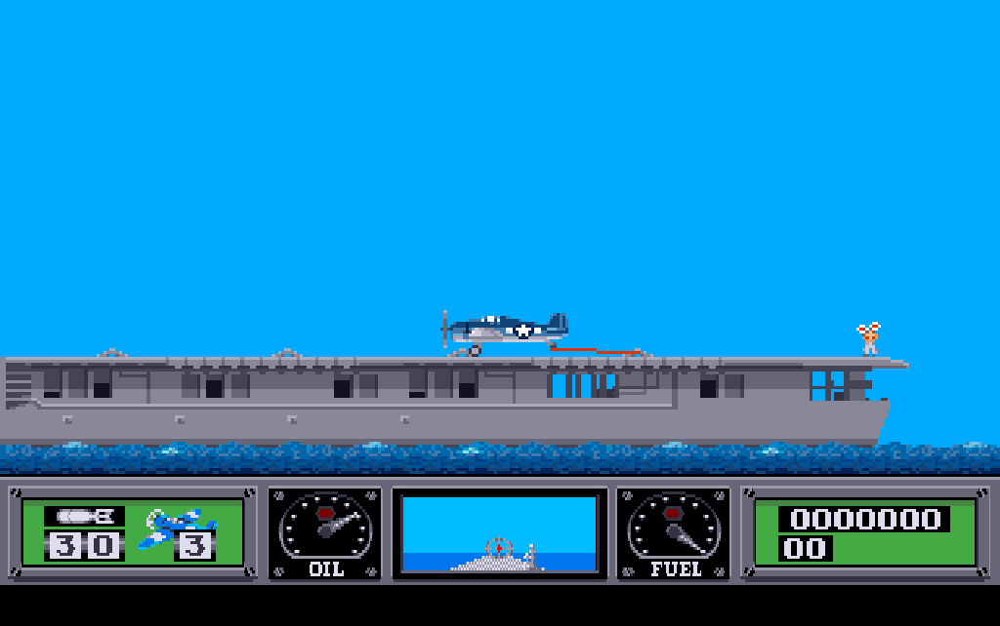
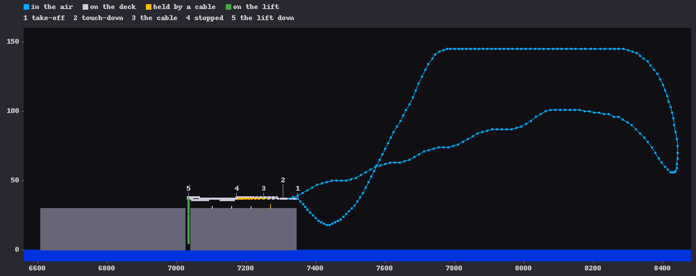

Chapter 14
{ .chapter-kicker }

# The player

Chapter 13 laid out the strip of records the aircraft flies over; this chapter is about the aircraft. By its end you will know what the game keeps of the player; how one [logic tick](../glossary.md#logic-tick) turns the stick into a motion, partly on the floating point of the Amiga's ROM; the take-off and the landing, and why the landing needs the stick held forward; the lift and the hold; the fuel and the oil; every way an aircraft is lost and how the next comes; and what the fire button does besides firing. It ends with what the port made of it and the instruments that hold it.

## What the game keeps of the player

Everything a tick does to the aircraft goes through one place, the [**player's record**](../glossary.md#players-record): thirty bytes at a fixed address that say where the aircraft is, how fast it moves and what it is doing. With a few variables beside it and the mirror markers of chapter 12, it is the player's state, which the loops of chapter 8 compare after every tick.

| Field | What it holds |
|---|---|
| height | pixels above the [water line](../glossary.md#water-line), the sea's surface |
| x | the [world x](../glossary.md#world-coordinates), pixels from the map's west end |
| frame | the shape it is drawn with, a pointer and a name |
| state | what the tick does with the aircraft, the table below |
| fuel | `0xC0` when full |
| oil | `0x80` when full |
| facing | +1 flying east, −1 west |
| two speeds | horizontal and vertical, pixels a tick |
| the enemy's countdown | ticks |

Two more words have no use that the notes name.

The state word picks what the player's update, run once a tick, does with the aircraft.

| State | The aircraft |
|---|---|
| 0 | in the air |
| 1 | on the deck, or standing in the hold |
| 4 | coming down |
| 6 | in the sea, or a wreck at rest on a ship's deck below a height of 20 |
| 7 | held by an arresting cable |
| 8 | burning, a wreck at rest on land or higher on a ship |
| 11 | on the lift while it moves |

Five more values, 2, 3, 5, 9 and 10, share the lift's branch or do nothing, and are never set. Beside the record lie the variables of the flight. The [**airspeed**](../glossary.md#airspeed) is a number from 0 to 1,400 that scales both speeds. There is no throttle lever: the stick is the throttle, as the manual's diagram says (page 5). Pushed the way the aircraft faces, it raises the airspeed each tick by the airspeed's step, which grows by one a tick up to 8; left alone, the step shrinks to 4 and the airspeed falls by it, in the air to 1,000. The [**pitch**](../glossary.md#pitch-of-the-aircraft) is the aircraft's angle in hundredths of a degree, positive with the nose up, which moves towards a target the stick sets; a step of the target is 6 degrees. The [**attitude**](../glossary.md#attitude), the notes' name for the stage of a turn, is 0 when the aircraft flies straight and 1 to 25 while it turns.

## The flight model

Once a tick, while the aircraft is in the air, the routine `player_motion` turns the pitch and the airspeed into a move. It moves the pitch a quarter of the way to its target, so that the nose swings over a few ticks when the stick moves the target; the division rounds towards zero, so the pitch stops a few hundredths short.

The sine and the cosine of the angle come from a table of sines, one for each whole degree from 0 to 90; the cosine is the sine of 90 degrees less the angle. From them the routine splits the airspeed into a horizontal speed and a vertical speed, each divided by 100. The horizontal speed is also multiplied by a factor for the attitude, which falls from 1 in straight flight to 0 at the middle of a turn, the stage where the facing changes, and has 50 added before the division, so that it is rounded to the nearest whole pixel. In level flight, then, the airspeed counts hundredths of a pixel a tick.


/// caption
One tick of the flight model: the two speeds from the pitch and the airspeed, the ceiling the aircraft bounces off, and the airspeed below which it sinks.
///

On the left, the horizontal speed: the factor times the airspeed made floating point (`ffp_flt`), times the cosine, plus `0xC8000046`, which is 50 (a mantissa of 0.78125 times 2 to the 6th), divided by 100 and cut to a whole number (`ffp_fix`); `muls.w` multiplies it by the facing and adds it to the x. The vertical speed follows with the sine, without the factor and without the 50. On the right, the port's C makes the same calls on the same values.

//// html | div.listing-pair

/// html | div
```wingslst
--8<-- "generated/listings/asm/player_motion_speeds.lst"
```
///

/// html | div
```c
--8<-- "generated/listings/c/wof_player_motion_speeds.c"
```
///

////

Climbing and diving leave the airspeed as it is (the sidebar has the one line that seems to say otherwise).

Below an airspeed of 1,000 the aircraft sinks: the vertical speed loses another pixel a tick for every hundred the airspeed lacks, and the pitch's target drops by half a step a tick unless the stick is held forward. A player sees it after a slow take-off, the aircraft sagging towards the sea before it climbs; it is not the game's stall, which the next section tells. The tests hold the motion against a model too: [`tests/ffp_model.py`](repo:tests/ffp%5Fmodel.py) states in Python what the routine computes, the floating point handed in, and reproduces every value the original computed in the flights observed. Its part for the slow flight, `g_025414` the airspeed and `g_026d43` the [input byte](../glossary.md#input-byte), whose bit 0 is the stick forward:

```python
--8<-- "generated/listings/py/model_01bdfa_slow.py"
```

Last, the height moves by the vertical speed. Above 1,100 it is held at 1,100, the vertical speed is halved and turned round and the pitch's target turned round, so the aircraft bounces off a ceiling; below −4 it is held at −4.

Only the dozen calls that make the two speeds are the [fast floating point](../glossary.md#fast-floating-point) of the [Kickstart](../glossary.md#kickstart) ROM, six of its nine operations; the easing, the sinking and the bounds are the 68000's integer arithmetic. The port does the floating point with the ROM's routines transliterated into integer code (chapter 5), because a browser's rounds differently and the speeds are cut to whole pixels: a last bit that differs would tip a rounding sooner or later, and the two flights would part for good. Under the [oracle](../glossary.md#oracle) the motion is held over 3,000 random settings of the registered state, the ceiling and the airspeed's floor of 1,000 among them, against the original on the ROM's routines and against the model on the port's floating point.

## The stick

The stick reaches the logic only through the input byte of chapter 7, four bits for the directions and two for the button. As chapter 1 said, pushing it forward climbs; in the air it works much as the manual's diagram lays it out (page 5):

| The stick | In the air |
|---|---|
| forward, with left or right | a climb: the target up a step a tick, to 30 degrees; less below an airspeed of 1,000 |
| forward alone | flying west, the stall the landing needs; flying east, the target lowered, for no reason the notes give |
| back, with left or right | a dive: the target down a step a tick, half while turning, to 45 degrees down |
| back alone | a steep dive, two steps a tick |
| towards the facing | full throttle: the airspeed up by its step, to 1,400 |
| against the facing | a turn |
| left alone | a climb levels out, the airspeed falls to 1,000, a turn goes on or unwinds |

While the aircraft turns with neither forward nor back, the pitch's target sinks by a quarter of a step a tick, so a turn loses height unless the stick is pushed forward; the manual asks for more lift while turning (page 5).

A turn runs the attitude from 0 to 25, one stage every second tick. At 14 the facing changes, and after 25 the attitude is 0 again, the aircraft flying the other way. For each attitude a table gives the frame, one table for each facing, and the turn's frames are drawn as the container stores them; only the frames of straight flight, chosen by the pitch's target, and those on the deck are mirrored in place through the [mirror marker](../glossary.md#mirror-marker) of chapter 12. A turn begun facing west shows these frames:



/// caption
The frames of a turn from facing west to facing east, in the order the attitude shows them, each drawn as `hellcat.shp` stores it. The facing changes at stage 14 while `hc32` holds for five stages, so 25 stages show 21 frames.
///

The stick left alone lets a turn finish once it is past its sixth stage; earlier, the aircraft rolls back, one stage a tick.

Since straight flight takes its frame from the pitch's target, not from the pitch, the frame shows where the nose is going. The [**landing stall**](../glossary.md#landing-stall) is a flag that the stick forward alone sets while the aircraft flies west, and every other input clears. The same input moves the target to 6 degrees up, so the aircraft is drawn nose up; but while the flag is set and the target stands there, the motion eases the pitch towards 8 degrees down instead, and the aircraft drops. A player knows it as the stall the manual teaches for the landing (page 6): the nose raised, the stick forward alone, the aircraft sinking onto the deck.

## On the deck and off it

On the deck another routine reads the stick. Pushed towards the facing it raises the airspeed by its step, as in the air; against the facing it takes 8 off the airspeed a tick and, once the aircraft stands, turns it round on the spot, one stage a tick; left alone the airspeed falls by 8 a tick to 0. Each tick the aircraft rolls a hundredth of its airspeed along the deck, rounded. The deck runs between two ends, sixteen pixels in from the carrier's sides; past either end the aircraft is in the air, state 0, with the airspeed the roll gave it, and too slow to climb it comes down in the sea.

The figures below follow one flight, the landing run, a run of the port made for this book: it replays the landing chapter 8's autopilot flew, from the schedule the [headless original](../glossary.md#headless-original) recorded, and meets the original's states at the same VBlanks. On the lift facing west, the aircraft is turned round with the stick against the facing and rolled east along the deck; it leaves the deck's east end slower than 1,000, sags towards the sea and climbs with the stick pushed east and forward, much as the manual's take-off asks (page 5).

## The landing

The approach comes from the east, the aircraft facing west, as the manual teaches (page 6). When the aircraft touches what lies under it, its wheels below the [ground height](../glossary.md#ground-height) of chapter 13 or at or below the water line, the routine of the ground decides. It counts the aircraft over the deck when its x lies between the deck's ends, its attitude is 0, its wheels are no more than 4 pixels below the deck and the carrier is afloat. Then it lands only facing west with the landing stall set; anything else over the deck bounces.

After the test of the deck, the listing tests the facing, `cmpi.w #$ffff,$14(a0)`, and the flag, `tst.w landing_stall`; a landing writes 1, the deck's state, into the record (`move.w #$1,$c(a0)`). The bounce turns the vertical speed and the pitch's target round with two `neg.w` and lifts the aircraft 6 pixels (`addq.w #$6,(a0)`). Both sound the screech.

//// html | div.listing-pair

/// html | div
```wingslst
--8<-- "generated/listings/asm/ground_contact_landing.lst"
```
///

/// html | div
```c
--8<-- "generated/listings/c/ground_landing.c"
```
///

////

Anywhere else, touching is a crash, state 4.

On the deck the tailhook does the rest. An [**arresting cable**](../glossary.md#arresting-cable) is one of four wires across the deck that stop the aircraft when its tailhook catches one:

/// figures
| The cables | |
|---|---|
| The tailhook | 24 pixels behind the aircraft |
| The cables, numbered west to east | the first 70 pixels east of where the aircraft stands on the lift, the others 56 apart |
| Caught | within 8 pixels of a cable |
| At an airspeed of | 600 or more, with the deck's flag clear |
| The pull | 110 off the airspeed a tick, to a stop |
| The deck, in map a | from world x 6,608 to 7,344 |
///

The deck's flag is the catch. While the aircraft rolls along the deck faster than 600, its routine sets the flag whenever the stick is not held forward; the aircraft is then drawn in its frame of straight flight, and the tailhook does not catch. What the flag stands for in play the notes do not say. So the stick must stay forward after the touch-down, as the [autopilot](../glossary.md#autopilot) of chapter 8 found. An aircraft the tailhook misses rolls on, slowing by 8 a tick with the stick left alone, and past the deck's west end it flies or, too slow, falls into the sea. In the listing, look at `cmpi.w #$258`, the airspeed of 600, then `tst.w g_025a9c` and the loop of four: the cable's x minus and plus 8 against the tailhook's, then `addi.w #$38` to the next cable. A catch writes 7 into the record's state and keeps the cable's x for the drawing.

//// html | div.listing-pair

/// html | div
```wingslst
--8<-- "generated/listings/asm/cable_hook.lst"
```
///

/// html | div
```c
--8<-- "generated/listings/c/hook.c"
```
///

////

Held by the cable, the aircraft loses 110 of its airspeed a tick until it stands, and the state is 1 again. Meanwhile the pass draws the cable with the line routine chapter 8 named, the only line the game draws. In the landing run the autopilot touched down at an airspeed of 1,400, the most there is, where the cable needs 600; four ticks later the tailhook caught the fourth cable, the first an aircraft flying west meets.



/// caption
The landing run about 29 seconds into the mission: the cable at world x 7,270 holds the aircraft, its airspeed down to 1,148.
///



/// caption
The landing run tick by tick, from the deck to the hold, the height over the world x coloured by the record's state: the take-off at an airspeed of 708, the dip to 18, the climb to 145, past the 131 above which the horizon moves (chapter 13); the caught cable in gold; the height drawn four times as tall as the x.
///

## The lift and the hold

The [**lift**](../glossary.md#lift) carries the aircraft between the carrier's deck and the [**hold**](../glossary.md#hold) below it, where the aircraft is refuelled, repaired and rearmed. The fire button on the lift, with the aircraft standing and the carrier afloat, takes it down, state 11. The lift sinks one step a [pass](../glossary.md#pass), 32 steps, by a count of passes the tick reads, one of chapter 7's couplings; the aircraft's height follows, since the ground under it is the deck less the lift (chapter 13). At the bottom the aircraft is reset: the tank filled, the oil restored, the weapons loaded and the weapon menu raised, which chapter 15 tells. While the menu is up the aircraft cannot move; the stick forward and back steps through the weapons, and the button closes the menu and sends the lift up, a step a pass.

## Fuel and oil

The fuel starts at `0xC0` and falls by one every 28 ticks, only in the air; it never rises but in the hold. The oil starts at `0x80`, the engine's oil pressure of the manual (page 8), and stays there while nothing hits the aircraft. The guns of islands and ships take oil, and fuel, when they hit (chapters 15 and 16), and once the oil is below full it leaks one more every 80 ticks in the air; the enemy's fighters take it too (chapter 16).

In the air with the fuel below 0, or the oil below `0x60`, the update sets state 4 and the aircraft comes down. The [dashboard](../glossary.md#dashboard)'s two gauges show both (chapter 11), each with the manual's red warning light (pages 8 and 9): the oil's blinks below `0x74`, the fuel's at `0x40` or below, in the air, on the deck and on the cable, and both stay dark while the aircraft comes down, lies wrecked or rides the lift. The script `fuel` flies until the tank is empty and the aircraft falls into the sea.

/// figures
| The times, on PAL | Ticks | Seconds |
|---|---|---|
| A full tank, in the air | 193 × 28 | about 430 |
| From the fuel's light to the end | 65 × 28 | about 145 |
| The oil's leak, from the first hit to the end | 32 × 80 | about 205 at most |
| A turn | 26 stages × 2 | about 4 |
| The wait after a loss | 150, or 31 with the button | 12, or about 2.5 |
| The enemy's countdown, and after a press | 1,350; 750 | 108; 60 |
| Full speed, level | 14 pixels a tick | 175 pixels a second |
///

## Losing an aircraft

The crash's routine looks at what lies under the aircraft, and the attitude levels out two stages a tick while it comes down.

| Where, or why | What follows |
|---|---|
| the sea, after a crash or a take-off too slow | at rest in the water, state 6, sinking a pixel every third tick |
| out of fuel, or the oil too low | state 4, then the sea or the land below |
| land | the wreck burns at rest, state 8; the [map record](../glossary.md#map-record) under it is hit as by a rocket, and the soldiers under it die (chapter 15) |
| a ship | on its deck the wreck rests; into its hull below the deck, it slides back with a red [sky flash](../glossary.md#sky-flash) and ends in the sea |
| shot down | chapter 16 |

At rest, a wait counts the ticks: after 150, or after 30 with the fire button, the next aircraft comes. It costs a life; it stands on the lift in the hold, facing west, with the weapon menu up. With no life left, or the carrier sunk, the game is over, chapter 17's subject. Before the next aircraft appears, the tick itself clears the playfield, shows it and waits for the [VBlank](../glossary.md#vblank) twenty-one times, twenty counting a number down from 20 and one more finding it at zero: twenty-one VBlanks inside one tick (chapter 7 told that the tick draws too). On the left the clearing, `flip_buffers` and the two loops on `gfx_WaitTOF`; on the right each wait is a `CO_WAIT` of a coroutine, a routine that can stop at a wait and go on at the next VBlank (chapter 22).

//// html | div.listing-pair

/// html | div
```wingslst
--8<-- "generated/listings/asm/player_lost_restart_waits.lst"
```
///

/// html | div
```c
--8<-- "generated/listings/c/wof_player_lost_restart_waits.c"
```
///

////

## What the button does besides firing

Tapped in the air, the fire button drops the chosen weapon; held, it fires the guns while the aircraft flies straight (chapter 15). Besides these and its work on the lift, in the menu and after a loss, it has one use more. The record's last field counts down to the enemy: set to 1,350 for each new aircraft, it loses one in each tick without a fire bit while the carrier is afloat with hits left, and at 0 an enemy aircraft comes, on conditions chapter 16 tells. A fire bit puts it back to 750 if it has fallen below, but not once it is 0. So the scripts of the first milestones held the button inside their turns, where a hold neither fires nor drops: the enemy aircraft were a later milestone's.

## What the port made of it

[`src/player.c`](repo:src/player.c) holds the original's C routines from `0x01AA6E` to `0x01CBB2` in their order, but for two helpers placed first and the update last, each with its `orig` comment, every width of the listing kept, the 16-bit [int](../glossary.md#int-the-c-type) included. The code indexes small constant tables by attitude, frame and pitch, and an index can run past a table's end into the variables behind it: the wheel table, the wheels' height below the aircraft's reference point by attitude, reads at attitude 9 a variable the deck's routine writes. Nothing of it shows, but a port that read a constant there would part from the original; the port reads such a table by its original address, from the registered variable where one covers the byte and from the executable's bytes elsewhere, and the oracle test of the deck found the case.

The oracle holds fifteen of the update's routines, the stick's in the air and on the deck, the touch-down, the tailhook, the crash, the deck's and the countdown's among them, each over 1,500 random settings of the registered state, more than 1,000 of them compared after every call, and a turn's step through every attitude. The [mission scripts](../glossary.md#mission-script) of the first mission milestone fly them in both loops of chapter 8, every pass and tick compared, the VBlanks a tick waited included: the aircraft left on the deck, a flight, a climb to the ceiling, an aircraft rolled off the deck into the sea, the game over, the weapon menu, the turns, the landing with the lift and the hold and, in the suite's long run, the fuel flight. A wreck on land or on a ship and the loss of oil come in the weapons' and the enemy's scripts (chapters 15 and 16).

/// dev
One line of `player_motion` takes the vertical part, cut to a whole number by `SPFix`, out of the airspeed's step. `SPFix` truncates towards zero, every sine in the table short of 90 degrees is below 1, the largest 0.99985, and the clamps keep the pitch far from 90 degrees, so the line takes 0 at every angle the game reaches.

In the port: [`src/player.c`](repo:src/player.c), [`src/tick.c`](repo:src/tick.c), [`src/mission.c`](repo:src/mission.c), [`src/ffp.h`](repo:src/ffp.h); the fifteen routines are `PLAYER_ROUTINES` in [`tests/test_oracle_m4.py`](repo:tests/test%5Foracle%5Fm4.py), the loops [`tests/test_world.py`](repo:tests/test%5Fworld.py).
///

## What comes next

The chapter in one sentence: the player is one record and a few variables, moved once a tick by the stick through a flight model partly on the ROM's floating point, landed by a rule and a cable, refuelled in the hold and brought back after every loss. Chapter 15 takes up what the button drops and fires, and the targets it hits.

## Further reading

- [`re/notes/objects.md`](repo:re/notes/objects.md#the-players-record), "The player's record".
- [`re/notes/ffp.md`](repo:re/notes/ffp.md): ["`player_motion` `0x01BDFA`, once per tick from `0x01C70E`"](repo:re/notes/ffp.md#player%5Fmotion-0x01bdfa-once-per-tick-from-0x01c70e) and ["The two tables of constants"](repo:re/notes/ffp.md#the-two-tables-of-constants).
- [`re/notes/porting-m4.md`](repo:re/notes/porting-m4.md): ["The tick"](repo:re/notes/porting-m4.md#the-tick), ["The player's states"](repo:re/notes/porting-m4.md#the-players-states), ["Landing, refuelling, rearming"](repo:re/notes/porting-m4.md#landing-refuelling-rearming), ["Every way an aircraft is lost"](repo:re/notes/porting-m4.md#every-way-an-aircraft-is-lost) and ["The scripts of part 2"](repo:re/notes/porting-m4.md#the-scripts-of-part-2).
- [`SPEC.md`](repo:SPEC.md), sections 3.4, ["Operating system and hardware use"](repo:SPEC.md#34-operating-system-and-hardware-use), the row of mathffp; 6.3, ["Blocking code becomes coroutines"](repo:SPEC.md#63-blocking-code-becomes-coroutines).
- [`src/player.c`](repo:src/player.c); [`tests/ffp_model.py`](repo:tests/ffp%5Fmodel.py), [`tests/test_oracle_m4.py`](repo:tests/test%5Foracle%5Fm4.py) and [`tools/m4_scripts.py`](repo:tools/m4%5Fscripts.py).
- [`original/manual.txt`](repo:original/manual.txt), the game's manual: pages 5 and 6 for the stick, the take-off and the landing, 8 and 9 for the gauges.

Outside the repository: Wikipedia's ["Arresting gear"](https://en.wikipedia.org/wiki/Arresting%5Fgear), for the real cables and tailhooks of a carrier.
