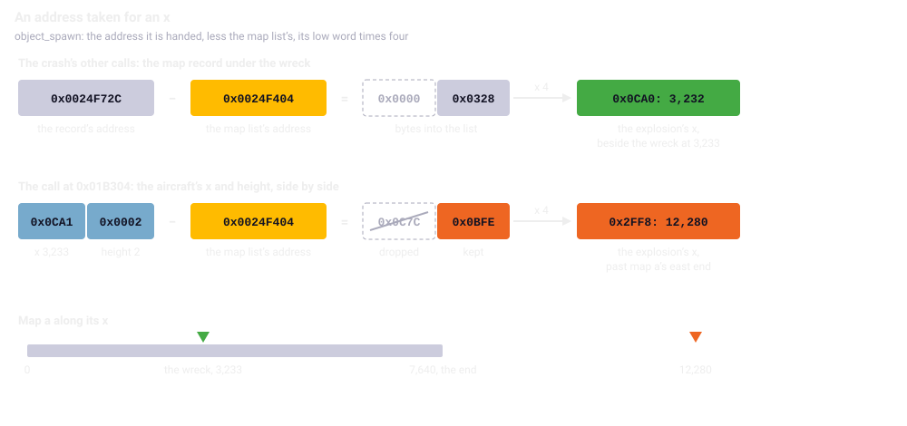
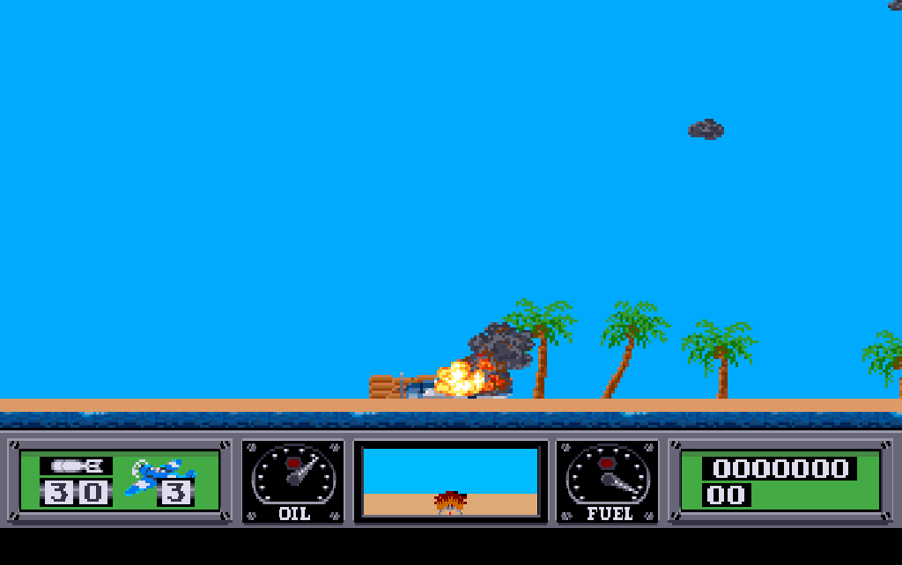
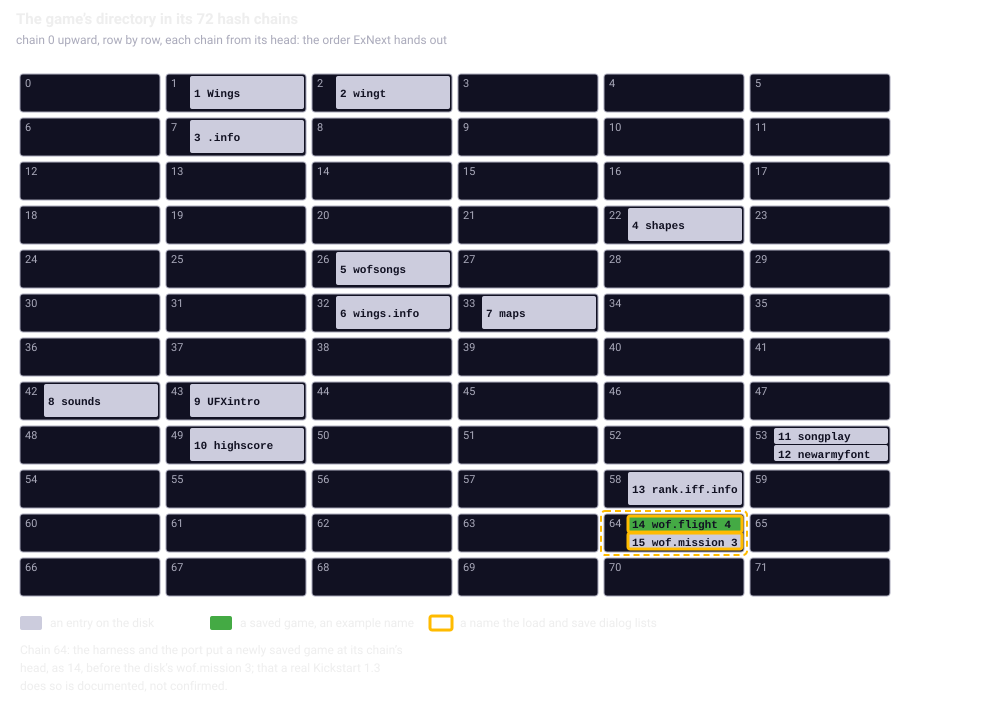

Chapter 20
{ .chapter-kicker }

# The original's quirks

The chapters before this one met the original's oddities one at a time; this chapter gathers them. By its end you will be able to tell a quirk of the original from a change the port made on purpose and from a mistake of the port; you will know why a wreck's explosions land where they do and why the port carries an address of a machine it is not; and you will know how the game's directory is ordered, and which half of that order nobody has confirmed.

## Keeping the accidents

A faithful port translates what the original's code does, its defects included (chapter 1). The rule reaches far, because the comparisons hold the port to the original's state after every [tick](../glossary.md#logic-tick) and every [pass](../glossary.md#pass) (chapter 8). An accident that leaves a value behind must leave the same value in the port, or the two part; a well-meant correction would show as a difference. So the port keeps the original's accidents as carefully as its intentions.

We call a quirk any place where the original's code does something odd: it reads past the end of a table, hands a routine the wrong thing, keeps code nothing runs, or disagrees with its manual. A quirk is what the code does; where the [listing](../glossary.md#listing) shows how it came about, this chapter says so, and it claims no intention. The quirks fall into four kinds:

1. accidents that reach what the player sees or what the state holds;
2. code nothing calls and values nothing reads;
3. what a real Amiga does that neither the [headless original](../glossary.md#headless-original) nor the port reproduces;
4. the port's own changes, each a decision of the owner.

Two quirks get a section each; the rest a table per kind, with the chapter that told the mechanism.

## An address for an x

When an aircraft crashes on land, it hits the ground and slides to a stop before its wreck burns. On every tick of the slide the crash routine makes an explosion through `object_spawn`, which puts one into a free [object record](../glossary.md#object-record) (chapter 15). `object_spawn` expects the address of a [map record](../glossary.md#map-record), takes the record's distance in bytes from the start of the list of map records, and multiplies it by four: the record's world x, since a record of two bytes covers eight pixels (chapter 13). Every other call hands it such an address, the record under the wreck.

The call made during the slide hands it something else. On the left, look at the three pushes before the `jsr`: a long of zero, then the aircraft's height, `(a0)`, then its x, `$2(a0)`, eight bytes where every other call pushes ten. The routine reads its first argument as a long, so it takes the x and the height side by side as the address, and finds zero where the height and its flag belong. On the right, the port makes the same call:

//// html | div.listing-pair

/// html | div
```wingslst
--8<-- "generated/listings/asm/crash_explosion.lst"
```
///

/// html | div
```c
--8<-- "generated/listings/c/wof_crash_explosion.c"
```
///

////

What comes out is arithmetic on a number that is not an address. The routine subtracts the address where the system put the list of map records, the map list's address, and keeps only the lower 16 bits of the result before multiplying by four. Those bits depend only on the lower halves of the two numbers, so the aircraft's x drops out: the explosion's x is four times the height less the lower half of the map list's address, wrapped modulo `0x10000`. On the ground the sliding wreck has a height of 2, and in the headless original's first mission the list lies at `0x24F404`, which gives 12,280.



/// caption
The record under the wreck and the call during the slide, both less the map list's address `0x0024F404`: the first gives the record's x, the second a number whose upper half is dropped.
///

Map a ends at x 7,640, so on map a those explosions fall past its east end. A run of the port that dives onto map a's island shows what the player sees during the slide: the explosions the crash makes at the record under the wreck, and nothing of the quirk, whose records lie far to the east.



/// caption
A wreck sliding on map a's island, [VBlank](../glossary.md#vblank) 3,574 of the run. The explosions shown are those at the record under it; the run checks three more explosion records at x 12,280, past the map's end.
///

The number 12,280 is the headless original's, not the machine's. The headless original's allocator hands out each address once, so its addresses are the same in every run (chapter 6), and the map list moves after a restart and with the next mission. On an Amiga the address is whatever the system's memory allocator returns, which depends on the machine's memory and on what was loaded before. So where a wreck's explosions land on a real Amiga depends on the machine; near the wreck only by chance.

Everywhere else the port keeps positions in the map as offsets and never needs an address (chapter 13). This one call makes the address part of the game's arithmetic, so the port carries it as [registered state](../part-1/oracle.md#calling-a-routine-without-its-program), a value of the original's memory under its original address, and the map loader takes it from outside at every map load, as the [entropy stream](../glossary.md#entropy-stream) is taken. The tests give it the headless original's address at every load; a [control](../glossary.md#control) that left it out differed from the first step. The page has no machine's allocator to follow, so it uses the address of a game's first mission in the headless original at every load, and behaves as one known run of the original. There a wreck sliding at height 2 sends those explosions to 12,280 on every map. That is past the end of map a and of the short map j, and somewhere on each of the other thirteen.

## The order of the directory

The [load and save dialog](../glossary.md#load-and-save-dialog) lists the saved games in the order dos.library's `ExNext` hands out the entries of the game's directory, without sorting (chapter 19). That order is the file system's own. A directory spreads its entries over 72 chains, lists chosen by a number worked out from each name, so that finding a file means reading one chain rather than every entry (chapter 3). `ExNext` walks the chains from 0 upward, and each chain from its head. Here is the port's hash; look at the start from the name's length, each letter in upper case added after a multiplication by 13, the 11 bits kept, and the modulo 72:

```c
--8<-- "generated/listings/c/name_hash.c"
```

So the order follows from the names alone, and it is not the alphabet. The disk's own directory shows it: fourteen entries in thirteen chains, with `songplay` and `newarmyfont` sharing chain 53. A test reads the directory blocks of the disk image and holds the order and the hash against them:

```python
--8<-- "generated/listings/py/test_the_disk_image_gives_the_order_the_file_system_hands_out.py"
```

Every entry of all five directories on the disk lies in the chain the same hash gives. The dialog only lists names that begin `wof.`, and the disk brings one, the saved game `wof.mission 3`, in chain 64.



/// caption
The game's directory in its chains, read row by row; `wof.flight 4` is an example name that hashes to chain 64.
///

Half of this is unconfirmed, as chapter 1 said. That a real [Kickstart](../glossary.md#kickstart) 1.3 walks the chains in this order at all is documented behaviour, and so is where it puts a new entry: at the head of its chain, before the older ones. Neither was checked on a machine, and the owner decided not to. The disk cannot settle the second question. Thirteen of its chains hold two or three entries, and in every one the head carries the earlier date, which reads as new entries added at the tail. But most of the game's files carry the date 0, which a copying program writes when it keeps no dates, so the entries that look oldest may have been written last, and then the same disk reads as additions at the head.

Head or tail matters only when two saved games share a chain. A game saved as `wof.flight 4` falls in chain 64 beside `wof.mission 3`: at the head it is listed first, at the tail second. Two names in chains of their own come in chain order either way, as the tests' saved games do.

What the game writes goes into the port's file system as an overlay in front of the read-only disk; inside a chain a written file comes before the disk's, two written files newest first, as in the headless original. The [shell](../glossary.md#shell) stores the overlay in the order it was written, because the order is part of the list (chapter 19). Tests hold the port's chains against the headless original's hash, and the order of two names in one chain.

## Accidents that reach the game

The port keeps each of these, held by the [oracle](../glossary.md#oracle) or a run:

| The quirk | What follows | Told in |
|---|---|---|
| The balloons of a [promotion](../glossary.md#promotion) are never cleared | those in use stand unseen through the next mission and fly on at the next promotion | 17 |
| The Japanese carrier draws a shape its container does not hold | the call draws nothing; the port makes it | 16 |
| The [wreck's word](../glossary.md#wrecks-word) is written past a list of forty | a forty-first lands on the first [enemy aircraft record](../glossary.md#enemy-aircraft-record)'s state | 16 |
| The guns test a record's [relation](../glossary.md#relation-to-the-player) to the player, not whether it is in use | a freed record left ahead of the player could be shot down | 16 |
| The count of ships left is decremented as a byte, then tested with its overflow | from a count of 128, the mission is won with 127 afloat | 16 |
| The carrier and an enemy ship are told apart by the flags a score's move leaves | a score of 0 takes the carrier's path | 16 |
| Tables are read past their end: the map's second walk, the wheels' table, the islands' lists, a gun's frame, a rank past 6, a long score | the port reads each by address and finds what the original finds | 13 to 17 |
| Saving moves the map's end pointer two bytes | a game's first save changes the running game | 17 |
| The [key buffer](../glossary.md#key-buffer)'s shift runs one place too far | a full buffer copies a value from behind each array | 19 |
| A shot finds all fifteen object records in use | it is lost, and costs no weapon | 15 |
| A [soldier](../glossary.md#soldier)'s scream leaves its numbers in two registers | one impact kills one soldier, unless others stand at the map's west end | 15 |
| A running torpedo goes out undrawn | its record stays in use until the [hold](../glossary.md#hold) clears them all | 15 |
| A sound is started three times over, each time stamped with the VBlank | it plays from the second VBlank after the tick | 18 |
| The music's periods are an NTSC machine's | on [PAL](../glossary.md#pal) every note is a sixth of a semitone flat | 18 |
| The soldiers' waits count every VBlank since the start | the front end's 312 VBlanks of fading music move them | 15, 18 |

In the last ship's count the listing shows how the quirk comes about: `subq.b` takes one off a byte, and `bgt` decides on the true result of the subtraction, overflow included, not on the byte it leaves (chapter 16). The port tests the byte before the decrement, which is what `bgt` decides, so a count of 128 wins the mission in the port as in the original; the oracle's random states found that the test had to be written so. No map has more than three enemy ships.

For a table read past its end the port has one rule: read the table by its original address. A byte that a registered variable covers comes from the variable, since the original finds there whatever the game last wrote; every other byte comes from the executable's own data. Writes go by address too, which is how the forty-first wreck's word reaches the aircraft records. Here is the reading side:

```c
--8<-- "generated/listings/c/data_byte.c"
```

## What the manual promises

Where the manual and this executable disagree, the port follows the code:

| The manual | The executable | Told in |
|---|---|---|
| Control-D shows the high scores (page 12) | no reader takes it; a test finds it changes nothing anywhere | 1, 17 |
| Control-C works only after Control-D (page 12) | it deletes the high-score file at once | 17 |
| its list of keys (page 12) | has one more, Control-S, the music | 1, 18 |
| the torpedo run comes once a ship's guns are disabled (page 7) | the hit counts whatever the guns do | 16 |
| a bonus for a whole mission (page 10) | is the last island's bonus or the last ship's score | 17 |

## Code nothing calls, values nothing reads

The [reach map](../glossary.md#reach-map) and the oracle found code no path of the game reaches and values nothing reads (chapter 8), and the port treats them by one rule. A whole routine nothing calls is left out. Code inside a routine the game runs is kept, in the original's order and arithmetic, because it is part of the routine a test runs and compares. A table or a pool is kept where its place belongs to the layout the registered state mirrors.

| What nothing reaches | The port | Told in |
|---|---|---|
| A developer's reset of the high scores, a wait for a key, a setter of the key mask, a raw blit, a second picture copy, a second random generator, the C library's floating-point formats | left out | 17, 19, and here |
| Eight routines of the [sound effects engine](../glossary.md#sound-effects-engine) | left out; the one path to them is a [stand-in](../glossary.md#stand-in) | 8, 18 |
| The Ricochet [pool](../glossary.md#pool), whose one writer nothing calls | kept, twenty records, for the layout | 15 |
| The fades' second argument, the [line editor](../glossary.md#line-editor)'s fifth, the [rank selection](../glossary.md#rank-selection)'s return value, the [briefing](../glossary.md#briefing)'s answer after a load in flight | ignored, as by the original | 19 |
| The right mouse button's byte, written and never read | dropped with the mouse half of the key handler | 19 |
| A line of the flight model that always takes 0 | kept | 14 |
| A floor of the enemy's speed, above which it always stays | kept | 16 |
| A test of the targets' slots that never holds | kept, its comment naming it | 15 |
| Two states of the enemy aircraft that nothing sets | kept | 16 |
| A second [music player](../glossary.md#music-player), loaded with the music switched off | a stand-in, forced by a test | 18 |
| Three writes to a register of [Paula](../glossary.md#paula)'s that can only be read | kept, changing nothing, whatever they were for | 18 |
| A key mask a game started from the command line never sets | kept, its other path tested | 19 |

## What a real Amiga does differently

The headless original and the port model the machine where the game depends on it. A few things a real Amiga does are not in the model, and where they matter something else stands in:

| On a real Amiga | The model and the port | Told in |
|---|---|---|
| A pass takes processor time the listing cannot give | two VBlanks a pass, filmed on the owner's PAL Amiga in a quiet scene; a busy scene not filmed | 7 |
| A [fade](../glossary.md#fade)'s steps take processor time nobody measured | none in the headless original; two VBlanks a step in the port, by the owner's eye | 7 |
| The wait for a [song's fade](../glossary.md#songs-fade) ends within a VBlank of its end | rounds of four VBlanks, up to three VBlanks late, which also moves the soldiers' count | 6, 18 |
| A PAL frame is about 0.16 percent longer than a fiftieth of a second | exactly a fiftieth | 18 |
| Paula raises a cycle's end request when it fetches the last word | raised once the word has played, four bytes, four samples, later | 18 |
| Paula's filter and the analogue mixing | none | 18 |
| The [timer's latch](../glossary.md#timers-latch) holds at start whatever the chip's reset left | the documented reset value, on which the music's tempo rests | 1, 18 |
| A 60 Hz machine runs everything a fifth faster; the program never asks | PAL or NTSC is a setting of the shell's clock | 7 |
| The data holds the machine's addresses | the map list's, kept; a saved game's [pointer fields](../glossary.md#pointer-field), derived; a freed demo buffer read at address 0, read as 0 | 17, and here |
| One unpacker writes a byte past the end of its buffer | the port stops at the declared size; nothing reads the byte | 12 |
| The [blitter](../glossary.md#blitter) draws the [cable](../glossary.md#arresting-cable), the game's one line | drawn from the blitter's documentation, its pixels not compared with a machine | 14 |

The specification listed thirteen points to establish, each due before the milestone that needed it, and all thirteen are answered. These rows are where an answer stops at an estimate or at the documentation.

## Changes made on purpose

A [**deliberate divergence**](../glossary.md#deliberate-divergence) is a change of the original's behaviour that the port makes on purpose, by a decision of the project's owner written in the specification. A quirk is the original's and kept, a divergence decided and written down, and a mistake of the port put right when an instrument catches it (chapter 9). There are seven in the game:

| The change | Why | Told in |
|---|---|---|
| The [crack](../glossary.md#crack)'s screens and the copy protection left out; its pictures shown as the disk holds them | the screens are the crack's; the protection was disabled on this disk | 1 |
| A plain letter for each Control command, restart and clearing only while paused; the cheat sequence cannot be typed | a browser keeps Control with R, F and L | 1, 19 |
| The [keyboard assist](../glossary.md#keyboard-assist) | a key is tapped where a stick is held | 1, 19 |
| The [vertical flip](../glossary.md#vertical-flip) remembered, winning over a loaded game | the owner flies with it | 1 |
| A fade's step of two VBlanks | the original leaves it to the processor | 7 |
| A saved game's pointers derived; a file the port cannot hold refused | another machine's addresses mean nothing here | 17 |
| A [seed file](../glossary.md#seed-file) beside a recorded demo | so that it replays after a reload | 17 |

The crash and debug reporters are left out for a plainer reason: a browser has no use for them (chapter 1). Around the game the shell adds the help screen, the pause sign, fullscreen, a pause when the page is hidden, the stereo width, the choice of PAL or NTSC, and a reload of the page where the dialog's Exit Game would end the program (chapter 23). Every comparison runs the [core](../glossary.md#core) as the original, the assist off and no preference given. One thing that looked like a quirk was none: the [memory-form shift](../glossary.md#memory-form-shift) that the emulator under the oracle once ran wrong was the instrument's fault, corrected there (chapter 5).

## What the catalogue says about the method

None of these quirks is a guess. Every routine the scripts enter is ported, and every part of one that no run executes is accounted for: ported and run by the oracle's cases, marked as a stand-in, or explained in a note, and the reach map fails on a part that is none of these (chapter 8). The oracle's cases run what play never reaches: the full key buffer, the forced branch of the music, the music player's regions no run executes, the sinking's random states. The [completeness list](../glossary.md#completeness-list) accounts for every address the original writes during a mission. So a quirk in this chapter is known from the listing and the runs, not suspected, and the port's departures in the game are seven, each decided and written down.

/// dev
The addresses: `crash` `0x01AFBA` and its call at `0x01B304`; `object_spawn` `0x010820`; `map_list_address` `0x024628`; the wrecks' list `0x0251DA`, the aircraft records `0x02522A`; the wheels' table `0x025E3E`, read past its end at `0x025E50`. The port reads and writes the original's memory by address with `wof_original_load8`, `wof_original_store8` and `wof_original_store16` in [`src/core.c`](repo:src/core.c), the player's tables through `data_byte` in [`src/player.c`](repo:src/player.c). The release build's address is `WOF_MAP_LIST_ADDRESS` in [`src/wof.h`](repo:src/wof.h). The tests: the directory's order in [`tests/test_front_port.py`](repo:tests/test%5Ffront%5Fport.py), the full buffer in [`tests/test_oracle_m3.py`](repo:tests/test%5Foracle%5Fm3.py), the sinking in [`tests/test_oracle_m6.py`](repo:tests/test%5Foracle%5Fm6.py), the second player and the read-only register in [`tests/test_music.py`](repo:tests/test%5Fmusic.py).
///

## What comes next

The chapter in one sentence: the port keeps what the original's code does, its accidents, its unused code and its quarrels with the manual included, models the machine where the game depends on it, and departs from the original in seven decisions, each written down. Part III turns to the code itself: chapter 21 is a tour of the repository, chapter 22 tells the core and the registered state that lets the port keep the values this chapter has shown, and chapter 23 the shell and its additions.

## Further reading

- [`re/notes/porting-m5.md`](repo:re/notes/porting-m5.md#the-wrecks-explosion-and-the-map-lists-address-observed), "The wreck's explosion and the map list's address".
- [`re/notes/frontend.md`](repo:re/notes/frontend.md#the-order-of-the-file-list), "The order of the file list"; [`re/notes/porting-m3.md`](repo:re/notes/porting-m3.md): ["The order of the list"](repo:re/notes/porting-m3.md#the-order-of-the-list) and ["The off-by-one that is state"](repo:re/notes/porting-m3.md#the-off-by-one-that-is-state).
- [`re/notes/porting-m6.md`](repo:re/notes/porting-m6.md#flags-that-decide-in-the-tick), "Flags that decide in the tick"; [`re/notes/enemy.md`](repo:re/notes/enemy.md): ["Shot down, and what it scores"](repo:re/notes/enemy.md#shot-down-and-what-it-scores) and ["Open"](repo:re/notes/enemy.md#open).
- [`re/notes/music.md`](repo:re/notes/music.md): ["The game's calls"](repo:re/notes/music.md#the-games-calls) and ["The timer"](repo:re/notes/music.md#the-timer); [`re/notes/porting-m8.md`](repo:re/notes/porting-m8.md#what-the-model-leaves-out), "What the model leaves out"; [`re/notes/headless.md`](repo:re/notes/headless.md#the-fades-wait), "The fade's wait".
- [`re/notes/passes.md`](repo:re/notes/passes.md#what-the-film-of-the-real-machine-shows), "What the film of the real machine shows"; [`re/notes/display.md`](repo:re/notes/display.md#fades), "Fades"; [`re/notes/random.md`](repo:re/notes/random.md#video-rate), "Video rate".
- [`re/notes/campaign.md`](repo:re/notes/campaign.md): ["A mission won"](repo:re/notes/campaign.md#a-mission-won), ["What the port writes in the raw part"](repo:re/notes/campaign.md#what-the-port-writes-in-the-raw-part) and ["The loader"](repo:re/notes/campaign.md#the-loader); [`re/notes/demo.md`](repo:re/notes/demo.md#the-port), "The port"; [`re/notes/keys.md`](repo:re/notes/keys.md): ["Control, and the two masks"](repo:re/notes/keys.md#control-and-the-two-masks) and ["The right mouse button"](repo:re/notes/keys.md#the-right-mouse-button).
- [`SPEC.md`](repo:SPEC.md): ["Out of scope"](repo:SPEC.md#out-of-scope-for-this-specification), [7.3, "Determinism"](repo:SPEC.md#73-determinism) and [10, "Points to establish"](repo:SPEC.md#10-points-to-establish).
- [`src/core.c`](repo:src/core.c), [`src/fs.c`](repo:src/fs.c), [`src/player.c`](repo:src/player.c), [`src/objects.c`](repo:src/objects.c) and [`src/mission.c`](repo:src/mission.c).
- [`original/manual.txt`](repo:original/manual.txt), the game's manual: page 7 for the torpedo run, page 10 for the mission's bonus, page 12 for the keys.
