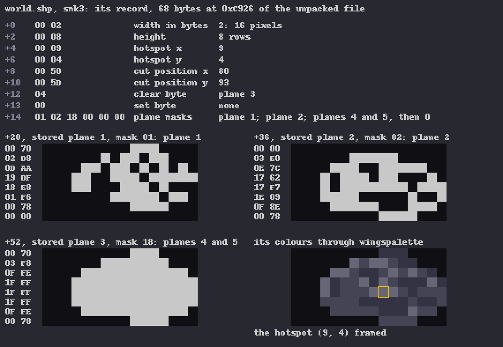
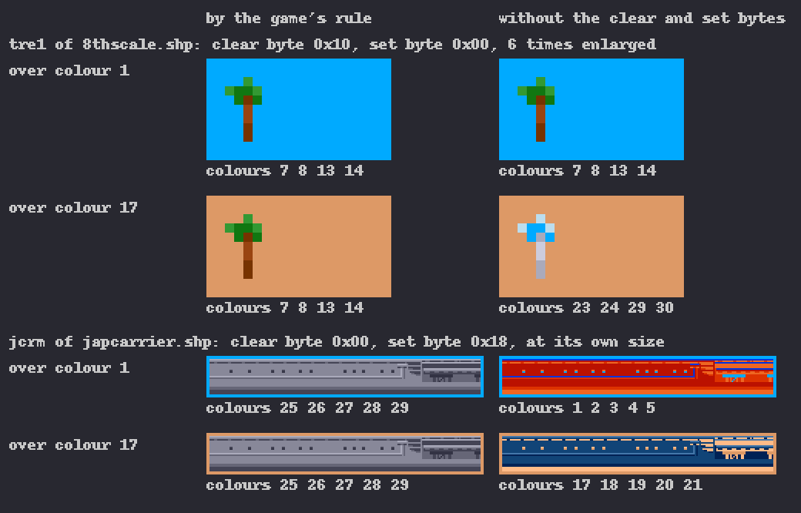
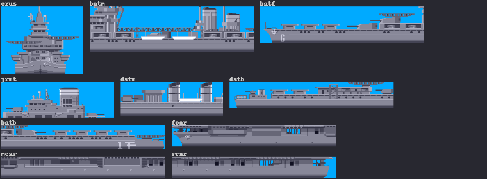
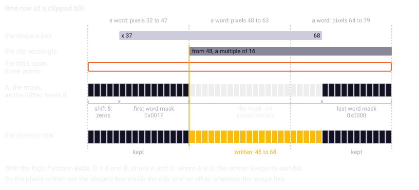
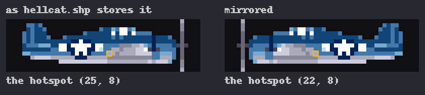
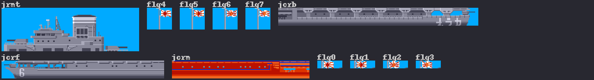

Chapter 12
{ .chapter-kicker }

# Shapes

This chapter follows a shape from chapter 3's file into chapter 11's surfaces. By its end you will know what a shape is to the game and what each field of its header is for; how the program's names become shapes, and when; what exactly the blit does, and how its clipping comes out exact to the pixel although the [blitter](../glossary.md#blitter) works sixteen pixels at a time; how the game turns the player's aircraft round; and how to read the contact sheets. Each mechanism ends with what the port made of it and the instrument that holds it.

## What a shape is to the game

The game keeps a [shape container](../glossary.md#shape-container) as it came from the disk. It loads the file whole into [chip memory](../glossary.md#chip-memory), unpacks it if it is packed in chapter 3's [Rpck](../glossary.md#rpck) format, and from then on works on that image, converting and moving nothing. A shape, to the game, is a pointer to its [**shape record**](../glossary.md#shape-record): a header of 20 bytes, then its stored planes, the [bitplanes](../glossary.md#bitplane) it carries, one after another. The drawing reads the fields and planes where they lie, so a pointer is all it needs.

The twelve containers hold 1,049 shapes. Most store fewer planes than the [playfield](../glossary.md#playfield)'s five: about a quarter store all five, and one stores none. Here is one record whole, `smk3` of `world.shp`, one of the smoke's shapes.



/// caption
The record of `smk3`, 68 bytes: its header, its stored planes a row to a line beside their bits, its colours and hotspot.
///

## The header, field by field

The first two words give the size: the width in bytes, eight pixels to a byte, and the height in rows. The smoke is 16 by 8 pixels, and that rectangle is the shape's box.

The next two are the [**hotspot**](../glossary.md#hotspot): the point of the shape, counted from its top left corner, that lands on the position the shape is drawn at. The routines that draw a shape from a table or a lookup subtract it from the position first, so a shape is placed by a point of its own, the smoke by the middle of its cloud, (9, 4): the code needs nothing of its size, and frames of different sizes stay in place.

The words at `+8` and `+10` are, to all appearances, the position the shape was cut from in the picture the artist drew it in: every x among them is a multiple of 16, and some frames of one animation share one cut position. Only the rank selection reads them, drawing its highlight at the position its records give, one row of the rank list each, with no hotspot taken off. In two containers the game overwrites the first, for the mirror.

The next two bytes name planes of the screen. A byte that names planes uses a colour number's bits as chapter 2 gave them, plane 1 worth 1 up to plane 5 worth 16: `0x10` is the fifth plane, `0x18` the fourth and the fifth, `0x04` the third. These two are the [**clear and set bytes**](../glossary.md#clear-and-set-bytes): the screen planes the blit sets to 0 and those it sets to 1 wherever the shape's [mask](../glossary.md#mask) is set. Otherwise a screen plane the shape does not store keeps the background's bits, and a pixel's colour depends on what lay beneath; with the clear byte `0x10` a four-plane shape lands in colours 0 to 15 whatever the fifth plane held. On the playfield's five planes that keeps its colours; on the [dashboard](../glossary.md#dashboard)'s four the blit takes the fifth plane out of the clear byte, the set byte and the plane masks alike, so there the same clear byte, which 207 of the dashboard's 223 shapes carry, does nothing.

/// figures
| The two bytes in the 1,049 shapes | Shapes |
|---|---|
| Clear byte 0 | 512 |
| Clear byte `0x10`, the fifth plane | 481 |
| Clear byte of another value | 56 |
| Set byte other than 0 | 7 |
///

In the figure, `tre1`, a palm at the [eighth scale](../glossary.md#eighth-scale-view), has four planes and the clear byte `0x10`: over colour 17, an island's ground, whose fifth plane is set, it keeps its greens and browns, and without the byte it would turn blue and grey. `jcrm`, one of the Japanese carrier's shapes, stores three planes, colours 1 to 5, and its set byte `0x18` puts the fourth and fifth planes under every pixel: on the screen it shows the carrier's greys, 25 to 29.



/// caption
`tre1` of `8thscale.shp` and `jcrm` of `japcarrier.shp` over colours 1 and 17: by the game's rule on the left, without the clear and set bytes on the right.
///

The header's last six bytes are the [**plane masks**](../glossary.md#plane-mask), one for each stored plane and a zero after the last: each names the screen planes that stored plane is written to. A plane mask is not the shape's mask of chapter 2, which says where the shape has colour. An ordinary five-plane shape has `0x01 0x02 0x04 0x08 0x10`. A plane mask of two bits writes a stored plane into two screen planes: the smoke's third, `0x18`, lands its third stored plane in planes 4 and 5, and its clear byte `0x04` clears plane 3, which it does not store, so three stored planes give the smoke its colours 25 to 27 over any background.

## From names to shapes

The program almost always asks for a shape by a name of four characters; two places go by number. The names lie in nine [**name lists**](../glossary.md#name-list) in the program's data, each ended by a zero. When a container is loaded, `shapes_resolve` looks every name of its list up in it and writes the results into a [**pointer table**](../glossary.md#pointer-table), an array of record pointers in the list's order. The code then names a shape by its [**slot**](../glossary.md#slot), its fixed position in a table, and fetches it with one load. Resolving once also lets one list serve two containers, as chapter 3 said, the world's at both scales and the dashboard's by day and night.

| Name list | Names | Resolved in | Absent |
|---|---|---|---|
| `world_names` | 184 | `world.shp`; `8thscale.shp` | 55; 84 |
| `torpedo_names` | 138 | `Torpedo.shp` | 40 |
| `dash_names` | 117 | `dash.shp`; `nightdash.shp` | none |
| `hellcat_names` | 107 | `hellcat.shp` | 16 |
| `destroyer_names` | 27 | `destroyer.shp` | none |
| `battleship_names` | 25 | `battleship.shp` | none |
| `cruiseship_names` | 24 | `cruiseship.shp` | none |
| `japplane_names` | 22 | `japplane.shp` | none |
| `japcarrier_names` | 13 | `japcarrier.shp` | 3 |

A name absent from its container gives a null pointer, and that is the normal case, not an error: 84 of the 184 world names have no shape at the eighth scale, as chapter 11 told, and even the world's own container lacks 55, `lpn0` to `lpnj` among them; their slots stay null and draw nothing. A container may hold more shapes than its list names: the dashboard has 223 for 117 names, the rest reached by tables of names of their own.

The lookup, `shape_find`, walks the container's names from the first, stops at the first name not less than the one it wants, and then tests whether it is the same. That early exit is right only over names in ascending order, and all twelve containers are so, strictly; most of the nine lists are not, and need not be. In the loop on the left, `cmp.l (a1)+,d0` compares four letters as one long, and `dble` loops back while the wanted name is still the greater and names remain; the port on the right keeps the exit.

//// html | div.listing-pair

/// html | div
```wingslst
--8<-- "generated/listings/asm/shape_find.lst"
```
///

/// html | div
```c
--8<-- "generated/listings/c/wof_shape_find.c"
```
///

////

By number go the rank selection, which takes the eight records of `selectrank.shp`, a container without a list, through `shape_by_index`, and the start-up, which walks the two mirrored containers to set their marker. Other names come from tables of the program's own: the enemy aircraft's frames, and the dashboard's variants of them, are resolved once a mission, and while the player's aircraft is drawn from the slots of `hellcat_names`, the routine that chooses its frame looks the frame's name up anew each time. Chapters 14 and 16 tell the frames.

Before every mission two tables are built from the others, `MasterList` and `AthList`, whose "Ath" reads as "eighth". The map's records index them: 273 slots, the world's 184, then the cruise ship's 24, the destroyer's 27, the Japanese carrier's 13 and the battleship's 25, null where the mission has no such ship; `AthList` holds the same names resolved in `8thscale.shp`. The map's own loop fetches each record's shape there and skips a null slot. The objects, the smoke, the soldiers and the rest reach their shapes by slot through one helper, `draw_world_shape`. Its first lines turn the world's position into the screen's, chapter 13's subject, and by the routine's rule leave out a shape whose x lies outside −128 to 448; then `add.w d2,d2` twice makes the slot an offset of four bytes a pointer, `movea.l (a0,d2.w),a0` fetches the record, and the two `sub.w` take the hotspot off. It has no test for null; the blit rejects a null record.

```wingslst
--8<-- "generated/listings/asm/draw_world_shape.lst"
```

The port builds its tables from the lists in the program, not from the files, because the slots are the code's interface and follow the list's order, not the container's. It keeps the slots and the early exit and holds both under the [oracle](../glossary.md#oracle) of chapter 5: every name of every list and every name a container carries, looked up in all twelve containers, about seven thousand lookups, and every table entry for entry.

## What is loaded when

| When | What | Until |
|---|---|---|
| The program's start | `world.shp`, `hellcat.shp`, `Torpedo.shp`, `japplane.shp`, `8thscale.shp` | the program's end |
| The rank selection | `selectrank.shp` | the screen's end |
| Each mission | `dash.shp` by day, `nightdash.shp` by night | the mission's end |
| Each mission, after its map | the container of each enemy ship the map holds | the mission's end |

The five that stay hold what any mission may draw: the world at both scales, the player's aircraft and its weapons, the enemy aircraft. Only the dashboard has night shapes; the world changes by its [palette](../glossary.md#palette) alone. A container that cannot be loaded ends the program, except `battleship.shp`, which the game treats as optional. The port keeps every container converted from its start, so neither failure can happen, but opens the files in the original's order, and chapter 8's comparisons hold the headless original's log of opened files to the port's trace.

## The blit, exactly

As chapter 2 told, the blit draws through a mask, and `shape_draw` chooses it first. A shape whose one stored plane is larger than 1,040 bytes, the buffer the mask is built in, gets none (the width times the height, `mulu.w`, compared with `MaskBuffer_size`). With the stored planes counted in D1, two or more get their OR, which the processor builds in the buffer (`bhi.b` to its loops); one is its own mask, the record plus `$14`, 20, the header's size (`lea.l $14(a0),a1`); none gets none, A1 subtracted from itself, which zeroes it (`suba.l a1,a1`).

```wingslst
--8<-- "generated/listings/asm/shape_draw_mask.lst"
```

Then come three phases, a run of the blitter for each screen plane: the clear planes, its source B held at 0; the set planes, B held at all ones; each stored plane into the screen planes of its plane mask, B the stored plane. Each run combines the mask, source A, with B and the screen plane, C, by the logic function `0xCA`. The blitter's function is a byte with one bit for each of the eight [**minterms**](../glossary.md#minterm), the eight ways A, B and C can be set at a pixel, the bit saying whether the result is 1 there; programmers name a function by that byte, and `0xCA` gives B where A is set and C where it is not. For a pixel of colour number v under the mask the phases come to `v = (((v and not clear) or set) and not U) or p`, U being every plane the plane masks name and p the shape's pixel; on the dashboard the clear byte, the set byte and U first lose their fifth plane. Screen planes named by none of them keep the background's bits.

A shape without a mask writes its whole box, colour 0 included: an [**opaque shape**](../glossary.md#opaque-shape). Eleven are too large for the buffer, as chapter 2 told; ten are pieces of the carriers and the ships, which carry the sky's colour where the opaque blit would otherwise show a hole. One shape stores no plane at all, `bchm`, whose clear and set bytes would paint colour 17; no name in the program asks for it.



/// caption
The ten hull pieces too large for a mask, in the day palette: no colour 0, and the sky's colour 1 around nine of them.
///

## Clipping to the pixel

Every draw is limited to a [**clip rectangle**](../glossary.md#clip-rectangle), the part of the screen it may change, its bottom and right edges the first row and column outside it. The game sets five: the playfield, the dashboard, the dashboard's 3-D window of chapter 16, the playfield down to the carrier's water line, and the front end's screen; the sidebar gives their sizes. `clip_set` rounds the left and right edges down to a multiple of 16 (`andi.w #$fff0`): the blitter writes a plane a word at a time, 16 pixels, and rounding whatever it is given keeps its word arithmetic from meeting an edge inside a word. Every edge the game asks for is on one already.

That raises a puzzle: a shape may lie at any x and the blitter writes whole words, yet nothing outside the shape's box changes and the clip cuts the box exactly. Four things answer it, and the diagram follows one row. The blit's span starts at the word that holds the shape's left edge and, when x is not a multiple of 16, is one word wider than the shape, so it overhangs the box on both sides. The blitter's shifter, which moves source A right by up to 15 pixels, carrying what falls out into the next word, moves the mask by x's remainder and brings in zeros. Its two [**word masks**](../glossary.md#word-masks), ANDed with the first and the last word of every row of the mask, blank the shape's columns left of the clip and the extra word on the right; when the clip's edge lies more than a word right of x, whole words are skipped first and the first word mask blanks the rest. And with the function `0xCA`, a 0 in the mask leaves the screen's bit as it was. So every pixel of the shape's box inside the clip is written, and no other. A right edge of the clip inside the box is cut the same way: the blit ends at the clip's word, and the last word mask blanks the columns past the edge.



/// caption
One row of a shape 32 pixels wide at x 37, the clip from pixel 48: the shift and the two word masks leave the mask set only on the box's pixels inside the clip.
///

So the port may clip pixel by pixel, the rectangle rounded as the original rounds it; a test below holds the claim.

## A highlight that removes itself

A second routine, `shape_draw_xor`, takes no mask and ignores the clear byte: inside the clipped box it inverts the screen planes of the set byte and combines each stored plane with the screen's by exclusive or, which flips a screen bit wherever the shape's bit is set. Drawing a shape twice at one place leaves the screen as it was, which is how the rank selection moves its highlight. The player's muzzle flash and an enemy aircraft's are drawn the same way. The port's routine does the same on pixels, and a test holds it to the original's register programme on every shape of `hellcat.shp`.

## The mirror

The player's aircraft turns round, and the game keeps each frame once. At load it walks every record of `hellcat.shp` and `Torpedo.shp` and writes 2 into its word at `+8`. From then on that word is the [**mirror marker**](../glossary.md#mirror-marker), which way the stored pixels face, 2 meaning as the file holds them. The routine that chooses the aircraft's frame compares the marker with the facing it wants and, only when they differ, writes the new value and calls `shape_mirror_x`, which turns the record round in place. A frame is mirrored once when the aircraft turns, not at every draw, and the way the shapes face becomes part of the game's state: chapter 8's [open loop](../glossary.md#open-loop) hands it over, and chapter 9's music tests once left shapes mirrored for the tests after them.

`shape_mirror_x` reverses every row of every stored plane, swapping bytes from both ends and reversing each byte's bits through a table, `bit_reverse_table`. The hotspot turns too, so that the same point of the aircraft lands on the drawing position, now counted from the other side: its x becomes 8 times the width, less 1, less the old x. On the left, look at that arithmetic, `lsl.w #$3`, `subq.w #$1` and `sub.w $4(a0)`, and at the inner loop's two `move.b` through the table; on the right the port works on pixels, where one reversal of each row is the whole mirror.

//// html | div.listing-pair

/// html | div
```wingslst
--8<-- "generated/listings/asm/shape_mirror_x.lst"
```
///

/// html | div
```c
--8<-- "generated/listings/c/wof_shape_mirror_x.c"
```
///

////



/// caption
The Hellcat `hc05` as `hellcat.shp` stores it and mirrored, its hotspot framed in both.
///

The routine that chooses the frame does not test its lookup: for a frame name absent from a container it reads the marker through a null pointer and may even write there. The lowest addresses hold the processor's exception vectors, ordinary memory, so the read returns some bytes and the write lands in a vector nobody uses; the port tests first, to the same visible result. Under the oracle its mirror is held to the original's on all 216 records of the two containers, each mirrored twice to come back as it was.

## What the port made of it

The port has no planes and no blitter. It converts every shape once, at load, to the pixels of chapter 11's [indexed framebuffer](../glossary.md#indexed-framebuffer), a colour number a byte, and keeps the header's fields the blit still needs: the clear and set bytes, every plane the plane masks name, the number of stored planes, the size of one, the hotspot and the marker. Then it throws the file image away. A pointer table becomes an array of shape numbers, −1 standing for null. Under the oracle every one of the 1,049 conversions is held to the planes the original keeps.

The mask needs no storage. A pixel's colour number is the OR of the plane masks of the stored planes set there; since no two plane masks of a shape share a plane, the number is 0 exactly where no stored plane has its bit, which is where the mask, the OR of the stored planes, is 0, and that holds for every shape on the disk. The blit is the one place where the port cannot follow the original instruction by instruction, since the original programmes a chip the port does not have. It applies the rule per pixel, with the same clipping and the same order of drawing. Here is its heart: the clear and set bytes and the plane masks' planes folded into `keep` and `force`, a pixel of 0 skipped where the shape has a mask, and one line that writes the pixel.

```c
--8<-- "generated/listings/c/shape_blit_pixels.c"
```

## How the blit is held

Chapter 5 told how the blit is compared, through its [**register programme**](../glossary.md#register-programme): the blitter's [registers](../glossary.md#register) as they stand when a blit starts, its pointers, its modulos (the bytes it skips at each row's end), word masks, shifts, logic function and size. The original's `shape_draw` runs under the oracle with the custom chips' addresses as plain memory, every blit is captured at the register that starts it, and a model of the blitter, [`tests/blitter.py`](repo:tests/blitter.py), replays it on a copy of the planes, to be compared with the port's pixels.

/// figures
| The blit's comparison | |
|---|---|
| Shapes and positions | 1,049 x 6: on a word and shifted, inside and over every edge |
| Clip rectangles and backgrounds | 2 x 2: the whole playfield and one inside it; empty and noisy |
| Draws on the playfield's five planes | 1,049 x 6 x 2 x 2 = 25,176 |
| Draws on the dashboard's four planes | (223 + 223 + 140 + 116) x 3 = 2,106, four containers at three positions |
///

As chapter 5 said, that holds the clipping, the pointers, the word masks and the phases to the original's own code; the model itself is documented hardware behaviour, read the same way for the port, which an emulator exact to the cycle would check. One test leaves the port out and holds the programme to the claim of the clipping section: every seventh shape of `world.shp`, at four positions against both clips, drawn over all zeros and all ones; `touched`, the pixels either draw changed, must lie within `box`.

```python
--8<-- "generated/listings/py/test_the_blit_writes_exactly_the_shape_box.py"
```

These tests and those of the earlier sections make `shape_find`, `shapes_resolve`, `shape_mirror_x`, `clip_set` and the blit's routines [verified](../glossary.md#verified). Two containers unpack to one byte more than they declare, and the port's reading found the original writing it past the end of its buffer; the port stops at the declared size, and nothing reads the byte.

## The contact sheets

A [**contact sheet**](../glossary.md#contact-sheet) is a picture of every shape of a container with its name above it, as a photographer's contact sheet shows a whole film. [`tools/ppkc.py`](repo:tools/ppkc.py) makes it from the planes in the day palette, colour 0 left as the ground, twice enlarged. Seven are kept in [`ref/sheets/`](repo:ref/sheets/), and a test holds each byte for byte to what the tool makes of the disk. Here is the Japanese carrier's container, made by the same tool.



/// caption
A contact sheet of `japcarrier.shp`, packed, in the day palette: `jcrm` shows the colours its planes store.
///

A sheet answers what a name shows and lays an animation's frames side by side. One caution: it shows the colour numbers the planes store, not what the clear and set bytes make of them, so `jcrm`, red and blue here, is grey on the screen. The shape browser of this book shows every shape of every container.

/// dev
The clip rectangles, top, bottom, left and right, the bottom and the right exclusive:

- the playfield, 0, 162, 0, 320: 162 rows by 320 columns;
- the dashboard, 0, 37, 0, 640;
- its 3-D window, 7, 32, 256, 400: rows 7 to 31, columns 256 to 399;
- the water line's: the sides kept, the bottom at the carrier's water line, or 161.

The blitter library lies at `0x0209BC` to `0x0215D8`; `aircraft_frame`, which chooses the player's frame, at `0x01ABDE`. The notes and [`SPEC.md`](repo:SPEC.md#35-file-formats) count the planes from 0, so their "clear plane 4" is this chapter's fifth plane, `0x10`. In the port: [`src/shapes.c`](repo:src/shapes.c), [`src/draw.c`](repo:src/draw.c); the tests in [`tests/test_oracle_m1.py`](repo:tests/test%5Foracle%5Fm1.py).
///

## What comes next

The chapter in one sentence: a shape is a record in a container the game keeps as it came from the disk, reached through tables its names were resolved into once, and drawn by one blit whose rule, clipping included, the port keeps pixel by pixel. Chapter 13 turns to the map, whose records name these shapes by slot.

## Further reading

- [`re/notes/shapes.md`](repo:re/notes/shapes.md), the whole note.
- [`re/notes/drawing.md`](repo:re/notes/drawing.md), ["Summary"](repo:re/notes/drawing.md#summary), ["The blitter library"](repo:re/notes/drawing.md#the-blitter-library), ["What `shape_draw` does, exactly"](repo:re/notes/drawing.md#what-shape%5Fdraw-does-exactly) and ["The scene routines"](repo:re/notes/drawing.md#the-scene-routines).
- [`re/notes/porting-m1.md`](repo:re/notes/porting-m1.md), ["The blit is per-pixel, and why"](repo:re/notes/porting-m1.md#the-blit-is-per-pixel-and-why) and ["How the tests establish it"](repo:re/notes/porting-m1.md#how-the-tests-establish-it).
- [`SPEC.md`](repo:SPEC.md), section 3.5, ["File formats"](repo:SPEC.md#35-file-formats); 6.4, ["Video model"](repo:SPEC.md#64-video-model).
- [`src/shapes.c`](repo:src/shapes.c) and [`src/draw.c`](repo:src/draw.c), their opening comments; [`tools/ppkc.py`](repo:tools/ppkc.py) and [`ref/sheets/`](repo:ref/sheets/).

Outside the repository: the [*Amiga Hardware Reference Manual*](https://archive.org/details/commodore-amiga-tech-ref-series-amiga-hardware-reference-manual-3rd-edition), its chapter "Blitter Hardware", for the minterms, the shifters and the word masks.
