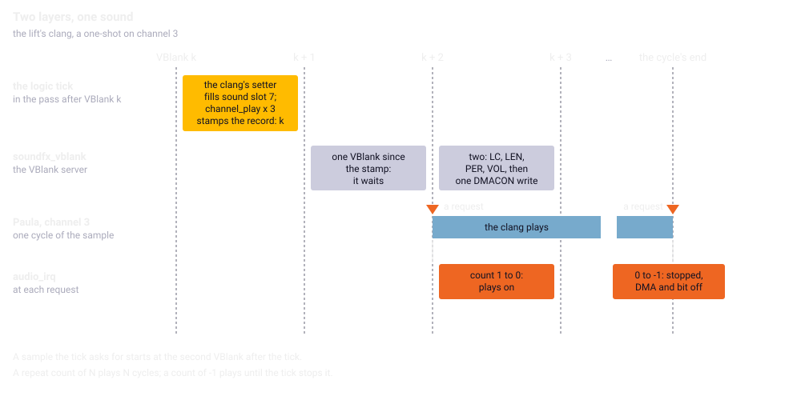
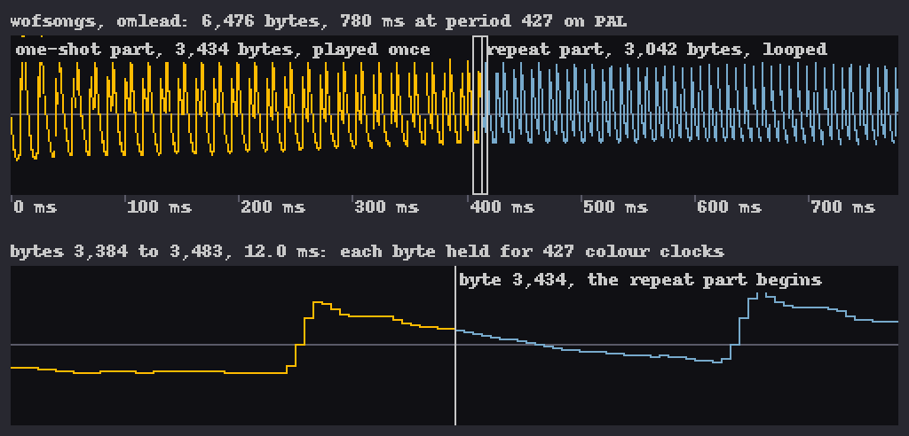
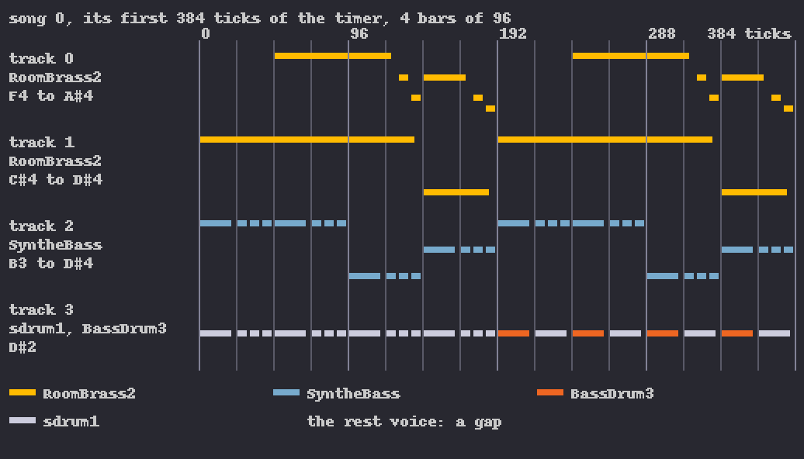

Chapter 18
{ .chapter-kicker }

# Sound and music

Chapter 2 said that two engines drive Paula, one for the sound effects and one for the music; this chapter takes both apart. By its end you will know how the effects reach Paula through two layers of code, why a sound starts two [VBlanks](../glossary.md#vblank) after the tick asks for it and how its end is learnt; how the music's waits move a mission; how the music player keeps time and stores its songs, why its notes are flat on a European Amiga, and the one value its tempo rests on; and what the music's key does. The port and its instruments come at the end.

## Paula, as far as this chapter needs it

[Paula](../glossary.md#paula) plays four channels, each given a [sound sample](../glossary.md#sound-sample)'s address, its length in words, a [period](../glossary.md#period) and a volume from 0 to 64 (chapter 2). A channel reads its sound sample from [chip memory](../glossary.md#chip-memory) by itself, which the Amiga calls DMA, direct memory access; the [register](../glossary.md#register) `DMACON` switches it, its bits 0 to 3 naming the four channels: written with bit 15 set, the named channels go on, without it they go off. The interrupt registers, `INTREQ` and `INTENA`, follow the same rule.

Switched on, a channel raises an [**interrupt request**](../glossary.md#interrupt-request) at once, a bit by which a chip asks the processor for an [interrupt](../glossary.md#interrupt). It plays its bytes, each held for its period, to the sound sample's end, one [**cycle**](../glossary.md#cycle); then it takes the address and length again, raises its request again and plays on. The requests are bits 7 to 10 of `INTREQ`, together `0x0780`; one reaches the processor only while its bit and the master bit, `0x4000`, are set in `INTENA`. Paula's channels interrupt at level 4 of the 68000's seven, so the processor runs the routine whose address lies at `0x70`, the [**level-4 vector**](../glossary.md#level-4-vector): so a program learns that a sound sample has played.

## Two layers

The game's [**sound effects engine**](../glossary.md#sound-effects-engine), the code that plays its eight effects, has two layers. The [logic tick](../glossary.md#logic-tick) knows what ought to sound, but the game hands a channel a new sound sample only in a [VBlank server](../glossary.md#vblank-server), by a rule of its own, and a channel's end shows only in a request, which only the interrupt's handler sees. So the tick writes what it wants into records of its own, and a second layer starts and stops the channels as the game's rule and the hardware allow.

The upper layer is eight [**sound slots**](../glossary.md#sound-slot), two to a channel, each holding a sound sample, its length, period, volume and repeat count, the cycles to play. The lower layer is four [**channel records**](../glossary.md#channel-record), one a channel, holding what the channel was last asked to play, when it last stopped, and the count of cycles the handler takes down. The table's periods and volumes are operands of the instructions (chapter 3):

| Sound slot, channel | Sound sample | Period, volume | Cycles | Sounds for |
|---|---|---|---|---|
| 0, 0 | `machinegun` | 200, 64 | for ever | the player's guns |
| 1, 0 | `engine` | eased | for ever | the aircraft's engine |
| 2, 1 | `machinegun` | 160, 57 | for ever | an enemy aircraft's guns |
| 3, 1 | `engine` | 330, by distance | for ever | the nearest enemy aircraft |
| 4, 2 | `boom` | 500, by distance | 1 | a burst |
| 5, 2 | `splash` | 350, by distance | 1 | a splash; aboard, the sea at 800, 34, for ever |
| 6, 3 | `machinegun` | 320, by distance | for ever | a ground gun |
| 7, 3 | as set | | | the [lift](../glossary.md#lift), the wheels' screech, a soldier's scream |

The first sound slot of a pair that is on gets the channel, as chapter 2 said: the guns drown the engine, a burst a splash. Setting sound slot 7 switches 6 off and the reverse, so on channel 3 the last one set wins. A sound sample already playing on its channel is not started again, so the setter of a one-shot, a sound played once, clears the pair's memory of the sound sample last handed over, and a second burst starts afresh. Loudness falls with distance:

/// figures
| Loudness by distance | |
|---|---|
| An enemy aircraft, n its distance in steps of 16 pixels | 64 − 4n up to n = 5, then 44 − n |
| A burst, a splash, a scream, n in steps of 32 pixels | 64 − n; a scream half of it |
| Silent from, derived | 704 and 2,048 pixels |
| A ground gun, n its distance in steps of 8 pixels | 64 − n, heard within 448 pixels |
///

The distance chapters 7 and 13 saw the [pass](../glossary.md#pass) work out for the sound is this one, sound slot 6's, not the engine's.

The aircraft's engine, sound slot 1, is eased: each tick its volume moves towards a target by 1 up or 2 down, and its period by 20 up or 10 down towards a target of its own. That target is a base plus the [nose's target angle](../glossary.md#pitch-of-the-aircraft) divided by 128 and the height divided by 16, so the engine sounds higher with the nose down and lower with height. Ten places in the controls' code set the volume's target and the base, in chapter 14's words:

| The aircraft | Volume | Period's base |
|---|---|---|
| full throttle, in the air or on the deck, or a dive | 64 | 335 |
| flying otherwise | 49 | 385 |
| on the deck otherwise, or held by the cable | 40 | 808 |
| crashing | 25 | 960 |

Paused, or with the music off, nothing moves and the channels stop.

## Two VBlanks late

Once a tick, `sound_channels` gives each channel the winner of its pair: a sound sample already playing gets only a changed period or volume, a new one goes to `channel_play`, three times with the same arguments. No note says why; the port calls it three times too. Look at the three calls at the end, and the three of `channel_stop` above:

//// html | div.listing-pair

/// html | div
```wingslst
--8<-- "generated/listings/asm/sound_channels_play.lst"
```
///

/// html | div
```c
--8<-- "generated/listings/c/sound_channels_play_c.c"
```
///

////

`channel_play` stops a busy channel before setting the new sound sample up, and every stop writes the effects engine's count of VBlanks into the channel record. So the second call undoes the first and sets it up again, as does the third, and the record waits, stamped with the current count.

The effects engine's VBlank server, `soundfx_vblank`, runs before the game's own and starts a waiting channel only two VBlanks or more after its stamp: `cmp.l #$2, d0` and `blt.w`. Then come the four registers, and `or.w d1` collects the channel's bit for the one write of `DMACON` after the loop, which switches the channels on together.

//// html | div.listing-pair

/// html | div
```wingslst
--8<-- "generated/listings/asm/soundfx_vblank_start.lst"
```
///

/// html | div
```c
--8<-- "generated/listings/c/soundfx_vblank_start_c.c"
```
///

////

So a sound sample the tick asks for starts at the second VBlank after the tick, which keeps a channel silent for at least a whole VBlank between two sound samples. No note says why the game waits; the port waits as it does.



/// caption
The lift's clang through the two layers: the tick after VBlank k fills sound slot 7 and stamps the channel record; the VBlank server waits a VBlank and starts the channel at the second; Paula plays the one cycle, a request at its start and at its end; the handler stops it at the second.
///

The handler at the level-4 vector, `audio_irq`, takes a channel's count down at each request and stops the channel when the count goes below zero. A request comes at the start and at every cycle's end, so a repeat count of N plays N cycles: the clang, with 1, is stopped by its second request. A count of −1 is never counted, and the engine, the sea and the guns loop until the tick stops them. At a stop the handler's write of `INTENA` also silences, until the next VBlank, the interrupt of any channel it looked at earlier in the call and left playing; no script ever met that.

//// html | div.listing-pair

/// html | div
```wingslst
--8<-- "generated/listings/asm/audio_irq_count.lst"
```
///

/// html | div
```c
--8<-- "generated/listings/c/audio_irq_count_c.c"
```
///

////

Eight routines of the effects engine are never called in play, and the port leaves them out; the one path of `channel_play` that would lead to them, for a channel 6 no caller asks for, is the [stand-in](../glossary.md#stand-in) chapter 8 showed.

## The sound samples

The eight effects are files of [signed bytes](../glossary.md#signed-byte) (chapter 3), loaded into chip memory at a mission's setup unless already loaded. Between missions all but the engine's are freed, for no reason a note gives, and the dialog for saving and loading frees that one too and loads it again as it closes. When the next mission begins, `sound_slots_clear` empties the eight sound slots and `sound_channels` stops the channels. The manual warns that a 512K machine may lose some effects at the higher levels (page 3); the port plays them all from its page.

## What the scripts play

The [headless original](../glossary.md#headless-original) and the port keep the same [**event log**](../glossary.md#event-log), chapter 1's sound event log: every start of a sound sample and every restart at a cycle's end, with its channel, period, volume and instant. Over the 75 runs of the first three mission milestones, chapter 8's [mission scripts](../glossary.md#mission-script) and runs of the keys, the effects start 1,129 times and restart 10,219 times, the sea in every run while the aircraft waits in the [hold](../glossary.md#hold). No request became ready for the processor while the main program ran between VBlanks, so delivering at VBlanks, as chapter 6's model does, loses nothing the original would see.

The sound moves even missions that never hear it. A target lets its [soldiers](../glossary.md#soldier) out one by one, each after the first at a wait read from the count of VBlanks since the program's start (chapter 15), a count that includes the 312 VBlanks the [front end](../glossary.md#front-end) waits between screens for the music to die away. Three scripts made before the headless original played the music (chapter 6) went another way with it: one let its second soldier out at tick 625 instead of 637, another no longer won. Each takes a [poke](../glossary.md#poke) setting the count back to its value without those waits.

## The music player

The [**music player**](../glossary.md#music-player), `songplay`, is a [hunk file](../glossary.md#hunk-file) of 5,148 bytes; the songs and their sound samples are in `wofsongs`, 41,328 bytes, whose code returns the address of its data, beside an overlay loader nothing calls. `music_start` loads both with [LoadSeg](../glossary.md#loadseg) and opens the player's timer; `music_stop` closes it and lets both go, called too by the dialog for saving and loading before it loads a game. The player has one entry, a command in D0: thirteen commands, of which the game gives six: open the timer, read a song's instruments, play, close the timer, report the song's state, and the song's fade.

The player's beat is the timer chapter 2 named, [CIA](../glossary.md#cia)-A's timer A. It counts down at the [**E clock**](../glossary.md#e-clock), the [colour clock](../glossary.md#colour-clock) divided by five; run out, it reloads from the [**timer's latch**](../glossary.md#timers-latch), a 16-bit value written a byte at a time, and raises an interrupt: a [**timer's tick**](../glossary.md#timers-tick), at which the player runs `SongInt` once. A timer's latch of L gives a timer's tick every L + 1 counts.

The player takes the timer through `ciaa.resource`, the system's way of sharing a CIA's timers. Command 0, `_OpenTimerInt`, hands it an interrupt node, the system's record of a routine to call, here `SongInt`, and starts the timer without loading it from the timer's latch, so that it counts down from the counter's power-up value. Then it keeps the level-4 vector and puts its own handler there, the `move.l` from `$70.w` and the one into it; in the port the vector is a value of the state.

//// html | div.listing-pair

/// html | div
```wingslst
--8<-- "generated/listings/player/_OpenTimerInt.lst"
```
///

/// html | div
```c
--8<-- "generated/listings/c/open_timer_int.c"
```
///

////

While the music is loaded, the effects engine's `audio_irq` never runs. Command 4, close the timer, puts it back, and since the rank selection ends with `music_stop`, every mission begins with it in place.

A song's command writes the timer's latch's high byte and restarts the timer: 56 for songs 1 to 4, 60 for song 0. Nothing writes the low byte. It and the counter are taken to hold `0xFF` and `0xFFFF` from power-up, the CIA's state at reset by its documentation: the one assumption chapter 1 named, which nothing in the game writes over and no film of a real machine checked. With it the songs keep chapter 2's tempo; with 0 in the low byte every song would be 1.8 percent faster.

/// figures
| The times, on PAL, derived | |
|---|---|
| A timer's tick, songs 1 to 4: the timer's latch `0x38FF` | 14,592 counts, 20.57 ms, 1.0285 VBlanks |
| With the low byte 0: `0x3800` | 14,337 counts, 1.8 percent faster |
| The first timer's tick, from the counter's `0xFFFF` | 65,536 counts, 92 ms |
| A quarter note, 24 timer's ticks | 494 ms, 121.5 beats a minute; song 0, 528 ms, 113.6 |
| The song's fade, 99 timer's ticks | 2.04 seconds; song 0, 2.18 |
///

## What a timer's tick does

At each timer's tick `SongInt` looks at the play state: idle, a song asked for, playing, a stop asked for, or fading. A song asked for starts its four [**tracks**](../glossary.md#track), each a line of music on its own channel, at volume 32, which goes as it stands to Paula's volume register. Playing, a note counts its time down and at its release switches its channel off; when its time has run out, the track reads on to the next note.

A note's length and the timer's tick of its release come from the player's table of durations. Its sound is the track's [**voice**](../glossary.md#voice), the instrument the track has chosen: the player points the channel at the voice's sound sample, its sample length covering the one-shot part and the repeat part, sets the period and volume, and switches channel and interrupt on. At the first request, at the start, its own handler points the channel at the repeat part, which Paula takes at the cycle's end: the one-shot part plays once, the repeat part loops while the note sounds. A sound sample without a repeat part, as the two drums', goes off at its next request.



/// caption
The voice omlead at 427, the period of track 0's first note of song 2: its one-shot part, played once, and its repeat part, which loops from the line, as the maker reads them.
///

The period comes from a table of 132 numbers, a semitone apart, each the colour clocks of one wave at that note, divided by the voice's bytes a wave and shifted by its octave; the notes' path never reads the rate a sound sample's header names, so that rate changes nothing. The table holds an NTSC machine's colour clocks: on an NTSC Amiga its notes are in tune with A at 440 hertz within a third of a cent on average, a cent being a hundredth of a semitone; on a PAL Amiga, whose colour clock is slower, every note is 15.9 cents flat, about a sixth of a semitone, and the timer's ticks, counting the same clock, are slower by the same ratio. The port plays the table as it stands: in its PAL setting, the default, as a PAL Amiga does; in its NTSC setting in tune and 0.9 percent faster.

## Changing songs

The [**song's fade**](../glossary.md#songs-fade) is the player's fade-out, not the display's [fade](../glossary.md#fade): every speed + 1 timer's ticks each track's volume goes one lower, until none is left and the song stops. The game asks for speed 2, a step every three timer's ticks, so from volume 32 the song's fade takes 33 steps, the last finding nothing left. A note keeps the volume it started with, so the long held notes of songs 2 and 4 sound at full volume through the song's fade and stop at its end.

With the music loaded, `music_start` first starts the song's fade of the song playing, then asks for the song's state until the answer is 0: a call, a test, a branch back, nothing that waits. On a real machine the timer's interrupts end the song's fade while it spins, and the screen stands still for about two seconds. The port's [coroutine](../part-3/core.md) waits four VBlanks after each call of the state command, as the headless original does (chapter 6); each of the front end's changes of song waits 104 VBlanks.

//// html | div.listing-pair

/// html | div
```wingslst
--8<-- "generated/listings/asm/music_start_fade.lst"
```
///

/// html | div
```c
--8<-- "generated/listings/c/music_start_fade_c.c"
```
///

////

Control-S, which the manual's keys leave out (page 12) and the port puts on M (chapter 1), toggles a flag that switches the music off. The game reads the key only in flight, where no song plays; the flag silences the effects, and a song started while it is set is never played. The outer loop clears it before every rank selection, so it silences at most the high-score screen's song; and since it is the last byte of the [raw part](../glossary.md#raw-part), a game loaded from a file saved with it set comes back silent too. With the music loaded and the flag set, `music_start` would load a second player beside the first: nothing reaches that branch, and the port marks it as a stand-in.

## The songs

In the song data as the file stands, before the loader relocates it, every pointer is an offset into it; [`tools/song_decode.py`](repo:tools/song%5Fdecode.py) reads it as the player does:

| Part | What it holds |
|---|---|
| a song | for each track a [**sequence**](../glossary.md#sequence), and a table of voices |
| a sequence | a pattern and a transpose for each entry, played in turn |
| a [**pattern**](../glossary.md#pattern) | events of 2 bytes: a note and its length's index, or a command |
| a command | the next entry, the sequence again, a voice, the timer's latch, a volume |
| a voice | `0x2E` bytes: its sound sample, an IFF 8SVX form, and a vibrato and arpeggio, off |

A note with its top bit set is tied: a run of tied notes sounds as one. Voice 0 is the rest voice, without a sound sample, whose notes take their time and start nothing. A note's length is one of twenty in the player's table, each released after about nine tenths of it.

| Song | Played | Sequence entries | Voices |
|---|---|---|---|
| 0 | on the high-score screen | 17 | SyntheBass, omlead, RoomBrass2, BassDrum3, sdrum1 |
| 1 | behind the title pictures | 13 | the same five |
| 2 | behind the story scroller | 29 | the five and Mechanic1 |
| 3 | never: song 1's data again | 13 | as song 1 |
| 4 | in the rank selection | 15 | the five and Mechanic1 |



/// caption
Song 0's first four bars as the player plays them; each lane names its track's voices and range. Songs 2 and 4 open with tied notes of one voice; song 0 shows the rest voice's half bars, tied notes held to the next start, a bass and two drums.
///

## What the port made of it

[`src/sound.c`](repo:src/sound.c) is the effects engine routine by routine in the original's order and arithmetic, the triple calls and the `INTENA` write among it, with the registers the burst and the scream leave for their callers ([chapter 9](../part-1/wrong.md#the-register-carried-as-a-long)'s family). A pointer to a sound sample becomes a sound handle, the port's number for a file and an offset, as the files lie in the page. The sound slots, channel records and pointers are [registered state](../part-1/oracle.md#calling-a-routine-without-its-program), compared under their original addresses; Paula, the timer and the level-4 vector are in the core's saved state (chapter 22).

The model is the headless original's, so that the two event logs can be held to each other: time in units so small that a VBlank and a byte at any period are whole numbers of them; every write at its VBlank's instant; what happens between two VBlanks delivered at the second, in time order. So the port's VBlank runs the events of the VBlank that passed, `soundfx_vblank`, its requests, then the game's server. In the same walk the [core](../glossary.md#core) mixes each audio frame from the byte each channel plays at its instant into a queue outside the state, so a replay renders the same sound whatever the [shell](../glossary.md#shell) asks; the shell takes it by emulated time (chapter 23).

`music_start` and `music_stop` are coroutines, since each waits for a song's fade, four VBlanks a round, which keeps the phase of the [input samples](../glossary.md#input-sample) taken every fourth VBlank. Of what LoadSeg would load, the port keeps the player's changing data and the seven voice records, the rest voice's among them, which the player writes to, and reads the rest where the file lies. The player follows [`re/songplay.lst`](repo:re/songplay.lst) with the 68000's arithmetic. Seventeen stand-ins of the sound remain, chapter 8's count: channel 6, and sixteen of the music for the commands the game never gives, the second player and values no song holds.

## How it is held

Every [closed](../glossary.md#closed-loop) and [open loop](../glossary.md#open-loop) of the mission milestones compares the event log and the model's state after every pass and tick, chapter 8's comparison, the level-4 vector with it. The model's own tests hold a one-shot stopped by its second interrupt, a loop's restarts, the port's output at 960 audio frames a VBlank at 48 kHz, and the instrument's tempo: in the headless original's run, the first timer's tick comes at the counter's power-up value, and every steady one `0x3900`, the times box's 14,592 counts, after the last:

```python
--8<-- "generated/listings/py/test_the_timer_ticks_at_the_songs_tempo.py"
```

The [oracle](../glossary.md#oracle) holds every routine of the effects engine, and of the player those the game's commands reach, on hundreds to thousands of random states, the loudness helpers over every distance, Paula and the timer register by register. The front end's event log, the music after every VBlank through the outer loop with Control-S, and the page's sound are compared too (chapter 24). The effects were heard from the files [`tests/m8_renders.py`](repo:tests/m8%5Frenders.py) writes, and the owner heard the music and found it right: chapter 10's ears. [Controls](../glossary.md#control), chapter 8's breaks of the port on purpose, were each caught:

| What was changed in the port | Where it first showed |
|---|---|
| a period one too high | `kills_a`, pass 2: the sea's start |
| the two sound slots of a pair exchanged | `guns_a`, pass 1120: the guns' start missing |
| a cycle's end delivered a VBlank late | `kills_a`, pass 40: the sea's restart |
| the timer's latch's high byte one too high | the idle front end, event 186: a start on channel 3 missing |
| a timer's tick delivered a VBlank late | the idle front end, event 0: song 2's first starts |

Left out of the model: Paula raises a cycle's end request four bytes before the model does; a real PAL video frame is about 0.16 percent longer than a fiftieth of a second; there is no filter and no analogue mixing; the wait for the song's fade ends up to three VBlanks late; and the timer's latch's low byte is an assumption.

/// dev
`music_start`'s spin is at `0x012402`, the branch to a second player at `0x0123FE`: both files loaded again, the first copies never freed, and the new player, ignoring what the system answers, leaves the timer calling the first while it takes the level-4 vector. Of the eight routines never called, a shutdown at exit and a hand-over of channel 2 to the music hold chapter 7's two `Delay` waits; no note says what the hand-over was for. `audio_irq` collects the bits with `bset.b d1, d4`. The player writes `INTREQR`, `$dff01e`, three times, which does nothing on the machine, whatever it was for. Tools: [`tools/song_decode.py`](repo:tools/song%5Fdecode.py) `--events N`, [`tools/sound_observe.py`](repo:tools/sound%5Fobserve.py) `--runs NAME`, [`tools/headless_paula.py`](repo:tools/headless%5Fpaula.py).
///

## What comes next

The chapter in one sentence: the tick asks, a VBlank server starts the sound two VBlanks later and an interrupt stops it, and the music is a player of its own on a CIA timer, whose one unwritten byte sets the tempo. Chapter 19 takes up the screens the songs play behind and the keys, Control-S among them.

## Further reading

- [`re/notes/sound.md`](repo:re/notes/sound.md): ["Two layers"](repo:re/notes/sound.md#two-layers), ["The slots and what they play"](repo:re/notes/sound.md#the-slots-and-what-they-play) and ["The channel layer"](repo:re/notes/sound.md#the-channel-layer).
- [`re/notes/music.md`](repo:re/notes/music.md): ["The game's calls"](repo:re/notes/music.md#the-games-calls), ["The timer"](repo:re/notes/music.md#the-timer), ["The tick: SongInt"](repo:re/notes/music.md#the-tick-songint) and ["The song format"](repo:re/notes/music.md#the-song-format-wofsongss-data-hunk).
- [`re/notes/porting-m8.md`](repo:re/notes/porting-m8.md): ["The port"](repo:re/notes/porting-m8.md#the-port) and ["Part 2: the music player"](repo:re/notes/porting-m8.md#part-2-the-music-player).
- [`re/notes/headless.md`](repo:re/notes/headless.md): ["The audio channels"](repo:re/notes/headless.md#the-audio-channels), ["The music's timer"](repo:re/notes/headless.md#the-musics-timer) and ["The fade's wait"](repo:re/notes/headless.md#the-fades-wait).
- [`src/sound.c`](repo:src/sound.c), [`src/music.c`](repo:src/music.c), [`src/audio.c`](repo:src/audio.c), [`re/songplay.lst`](repo:re/songplay.lst), [`tests/test_oracle_m8.py`](repo:tests/test%5Foracle%5Fm8.py) and [`tests/test_music.py`](repo:tests/test%5Fmusic.py).
- [`original/manual.txt`](repo:original/manual.txt), the game's manual: page 3 for the sound on a 512K machine, page 12 for the key commands.
- Outside the repository: the [*Amiga Hardware Reference Manual*](https://archive.org/details/commodore-amiga-tech-ref-series-amiga-hardware-reference-manual-3rd-edition), 3rd edition, on the audio hardware and the CIAs; Wikipedia's [8SVX](https://en.wikipedia.org/wiki/8SVX), the form of the songs' sound samples.
