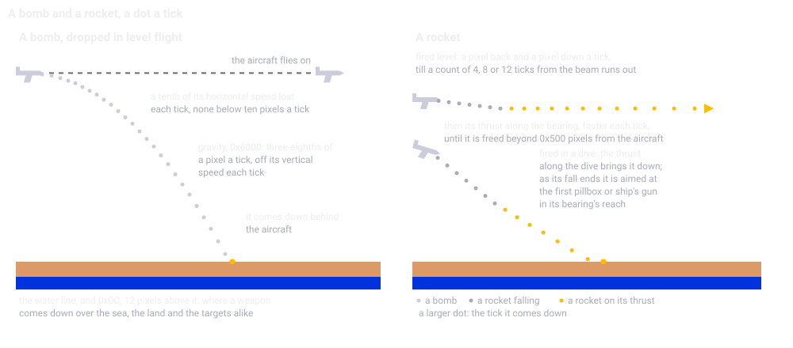
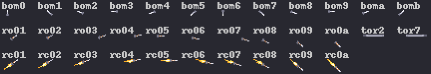
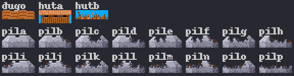
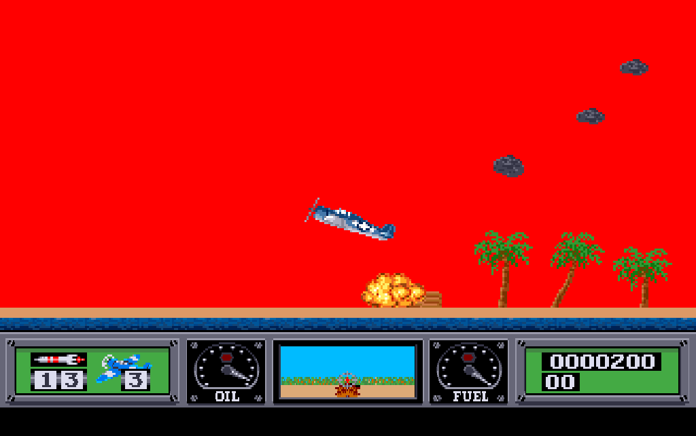
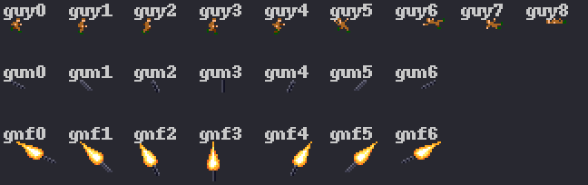

Chapter 15
{ .chapter-kicker }

# Weapons, targets and soldiers

Chapter 14 flew the aircraft; this chapter is about what it fights with and against. By its end you will know where the game keeps a weapon while it flies, and why a shot can vanish; how the weapons move and where they come down; what a hit does to an island's targets; how the soldiers come out, run and die, and why their deaths decide when an island is beaten; the guns and the targets' fire; and the pools of smoke, splashes and balloons. The port and its instruments come at the end.

## What the player fights with

Besides its guns, the Hellcat carries one kind of weapon at a time, chosen in the [hold](../glossary.md#hold)'s weapon menu before take-off: rockets, bombs or the torpedo (manual, pages 4 and 7). The game numbers them in the menu's order, 0, 1 and 2, the weapon's type; a reset in the hold sets bombs, and a load is 15 rockets, 30 bombs or one torpedo, as the manual counts them. The guns fire while the button is held, and a tap drops the other weapon (pages 6 and 7): chapter 7's two fire bits of the [input byte](../glossary.md#input-byte). The [dashboard](../glossary.md#dashboard)'s weapon counter shows the load on two drums.

## Fifteen records and a byte

A weapon in flight needs a place for its position and speeds; the game keeps it in an [**object record**](../glossary.md#object-record): one of fifteen records of 42 bytes in a fixed table, with a sixteenth elsewhere in the data for an enemy torpedo bomber's torpedo (chapter 16). There is no allocator and no list of free records. An object record's byte at `+0x20`, which the notes call its kind, says where the record stands: `0xFF` while it flies, 0 when it is free, and 8 while it goes out, showing six frames of an explosion or a splash, one a pass, before the pass frees it. Its word at `+0x22`, its type, says which weapon it is.

A tap drops the weapon unless the aircraft is in the middle of a turn, its [attitude](../glossary.md#attitude) from 6 to 16, and the drop looks for a free object record the only way the table allows: from the first, one by one. On the left, look at `moveq #$e,d0`, 14, because `dbra` runs once more than its count, and at `tst.b $20(a0)` with `beq.w`, which leaves for the launch at the first kind byte that is zero. The port's C on the right does the same with a `for`.

//// html | div.listing-pair

/// html | div
```wingslst
--8<-- "generated/listings/asm/object_draw_first.lst"
```
///

/// html | div
```c
--8<-- "generated/listings/c/object_draw_first.c"
```
///

////

With all fifteen in use the walk returns: the game silently loses the shot, and since the executable's code takes the weapon off the count only in the launch, the lost shot costs nothing. No script filled all fifteen; the drop's test does, below. The launch takes the aircraft's two speeds, its x and its height as the pass last drew it, one of chapter 7's [couplings](../glossary.md#coupling), plus `0x0B`, which the drawing of an object takes off again: the weapon starts where the aircraft is drawn. `object_spawn` makes the explosions of a crash or of a wreck at rest in the same object records (chapter 14), with kind 8 and type 1. The [tick](../glossary.md#logic-tick) moves the object records and the [pass](../glossary.md#pass) draws them, freeing one that has gone out for the next tick's drop.

## A weapon in flight

Once a tick, `objects_step` hands every object record whose kind byte is not zero to `object_step`, and what the record does is decided by a chain of tests, not by a table of routines or a switch: a kind byte of 8, going out, has nothing left to do; a type of 0 is a rocket; a type of 2 with a frame byte of `0x0A`, the frame the pass draws, here the running torpedo's, drawn as nothing, is a torpedo running in the sea; everything else falls like a bomb.

A record's speeds are longs, the whole pixels in the upper word and the fraction below them, as chapter 5's bounce showed. A bomb loses a tenth of the whole part of its horizontal speed each tick, a division of whole numbers, so below ten pixels a tick it loses nothing more; gravity takes `0x6000`, three-eighths of a pixel, off its vertical speed each tick. The height moves by that speed's whole part, rounded down, and keeps no fraction, so the speed's fraction never carries. As it falls, a bomb tumbles: its frame steps on every other pass, round twelve frames.



/// caption
A bomb dropped in level flight at 14 pixels a tick, starting where the aircraft is drawn at a height of 150, and two rockets that drop for 8 ticks before their thrust starts, fired level and in a dive of 20 degrees: computed from the arithmetic of `object_step`, a dot a tick, the heights drawn 1.6 times as tall as the x.
///

A rocket takes more at the launch. The [**bearing**](../glossary.md#bearing) is the aircraft's [pitch](../glossary.md#pitch-of-the-aircraft) as an angle of `0x800` steps a turn, worked out each tick for whatever the aircraft shoots or drops next, and halved for the sine table's `0x400` steps. The thrust is the bearing's sine and cosine, at most a pixel a tick. The fall is the ticks the rocket drops before its thrust starts: two bits of a draw of the [beam](../glossary.md#beam), 0, 4, 8 or 12, with 0 counting as 8. While it counts, the rocket moves by the aircraft's speeds and its vertical thrust, and a pixel back and a pixel down besides: a fall of 8 gives seven such ticks and the aim on the eighth. From then on the thrust is added to its speeds every tick. Fired level, it drops a few pixels and races on level, never coming down: the sine of 0 is 0, so it gets no downward thrust. Beyond `0x500` pixels from the aircraft, 1,280, four screens' width, its object record is freed.

The aim happens once, as the fall ends, and only for a rocket pointing down: the game takes the ground its bearing reaches and that of two bearings a little either side, and turns the rocket's speeds straight at a ship's gun or a standing pillbox between them; there is no homing after. No [script](../glossary.md#mission-script)'s rocket found one, those fired at map c's pillboxes hitting them straight, so the [oracle](../glossary.md#oracle) alone holds the aim.

Here is the head of the chain, and the rocket's fall and aim. Look at `cmpi.b #$8,$20(a2)`, the kind, and `cmpi.w #$0,$22(a2)`, the type; then at `subq.w #$1,$24(a2)`, the fall's count, and at `bsr.w $1099a`, the aim, when it reaches zero.

```wingslst
--8<-- "generated/listings/asm/object_step_head.lst"
```

The torpedo falls like a bomb, in one of its two frames. If it meets the sea no faster than 5 pixels a tick, it runs in it, 4.3 pixels a tick for 200 ticks, drawn as nothing: the player sees the splash it leaves every tick. It hits the first [map record](../glossary.md#map-record) under it that is not sea, and goes out undrawn, so the pass never counts its frames and its object record stays in use until the hold clears them all. Faster, it goes out where it fell. The manual asks for a low drop with the ship in sight (page 7).



/// caption
The weapons' frames of `torpedo.shp`: a bomb's twelve; a rocket's ten by its bearing while it falls, and the torpedo's two, by its facing, shown while it falls; the rocket's ten once its thrust starts.
///

## Where a weapon comes down

Over an airfield a rocket that comes down to a height of 30 is freed at once, with no explosion, and anything else bounces on the runway (chapter 5); the first three maps have no airfield. Elsewhere the ground is `0x0C`, 12 pixels above the [water line](../glossary.md#water-line), over the sea, the land and the targets alike, and a ship's deck over a ship. The executable's code does compare the map record's low bits with the [slots](../glossary.md#slot) of the dug-out and the barracks, 3 and 4, but on land the low bits are 2, never a slot's number: the test cannot hold, and a weapon comes down at the one height over those targets too, whatever chapter 13 gave as theirs. The port gives them that one height, its comment naming the test that cannot hold.

At the ground the object record keeps the low bits, which choose an explosion over land or a deck and a splash over the sea; makes the impact's sound (chapter 18); calls `weapon_hit`, two sections on; and goes out. The first running soldier within 16 pixels starts dying, as the soldiers' section tells.

## The targets

An island carries three kinds of target, shapes standing in the map's records. A [**dug-out**](../glossary.md#dug-out) holds soldiers and fires at the aircraft while it holds any; a [**barracks**](../glossary.md#barracks) holds soldiers and burns when hit; a [**pillbox**](../glossary.md#pillbox), the notes' name for the large gun the manual gives the rockets for (pages 7 and 10), fires, and only a rocket destroys it.

| Slot | Shape | The target | Hit |
|---|---|---|---|
| 3 | `dugo` | a dug-out, five soldiers inside at the start | 200 points while it holds soldiers, who are let out |
| 4 | `huta` | a barracks, five soldiers inside at the start | 150 points; it burns, slot 5, `hutb`, and its soldiers are let out |
| `0x0F` to `0x1E` | `pila` to `pilp` | a pillbox | by a rocket only: 200 points, destroyed |

A target is four map records wide, the third carrying the [draw flag](../glossary.md#draw-flag), and has an entry in a table the loader built (chapter 13): its place, its island, the soldiers inside and its counters.



/// caption
The targets of `world.shp`: the dug-out, the barracks and the burnt barracks a hit leaves; the pillbox's sixteen pictures, `pila` whole to `pilp`, by the quarters a rocket has hit.
///

Each island keeps two counts: its soldiers alive, five for every dug-out and barracks, and its pillboxes standing. An island whose two counts have both fallen to zero is a [**neutralised island**](../glossary.md#neutralised-island). No count of the island holds its dug-outs and barracks, yet the two counts make the manual's rule hold, that an island falls only when every barracks, soldier and gun on it is gone (page 10), and they do it through the soldiers. A soldier inside a target counts until he is dead. A dug-out's soldiers come out only when it is hit. A barracks gives a soldier to an empty dug-out that calls one over, the refill of the soldiers' section, only while it holds two or more, so its last comes out only when it is hit too.

Neutralised, the island pays a bonus from a table by map and island and puts its message on the [ticker](../glossary.md#ticker); the map's last island, with no enemy ship left, ends the mission, chapter 17's subject.

## What a hit does

`weapon_hit` is what an impact does to the map record under the object. On the left, `beq.w $14986`, twice, sends the sea and a ship to a branch of their own; for a dug-out, `tst.b $8(a0)`, the soldiers inside, decides: `#$c8`, 200, goes to the dug-out's 200-pass timer and to the score, and `target_release` lets the soldiers out. The C on the right begins after the branch to the sea.

//// html | div.listing-pair

/// html | div
```wingslst
--8<-- "generated/listings/asm/weapon_hit_land.lst"
```
///

/// html | div
```c
--8<-- "generated/listings/c/wof_weapon_hit_land.c"
```
///

////

A dug-out hit is not destroyed: its soldiers join those still to come out, and a timer starts. Two rockets in one tick score once: the first empties the dug-out, and the second finds no soldier inside. A barracks burns whatever it holds: its four map records become slot 5, each keeping its draw flag, as chapter 13 told, and the burnt barracks smokes. A rocket at a pillbox adds to the slot of all four of its map records the bit of the one it hit, bit 3 for the first and bit 0 for the fourth: a bit for each quarter hit, the figure's sixteen pictures. The first rocket destroys the pillbox; later ones only mark quarters and score nothing, and a bomb does nothing to it.

On land a rocket flashes the sky, chapter 11's [sky flash](../glossary.md#sky-flash): a count of five passes, white, or red when the rocket hits a target, the colour showing on three of them. A bomb never flashes. Here are two rockets of a dive, down on a dug-out in the same tick:



/// caption
The rockets run, a replay of the script `rockets_a`, about 47 seconds into the mission: two rockets down on a dug-out of map a, the sky red. The run checks the score, 200 for one hit, the flash's colour, 13 rockets left and the aircraft's height, 41.
///

In the sea nothing happens. On a ship, chapter 16's subject, a bomb does nothing, a running torpedo takes one of the ship's hits, and anything else, a rocket or a torpedo that falls onto the deck, destroys the ship's first standing gun within 16 pixels, for 200 points. A crash on land hits as a rocket would, as chapter 14 told, and the first running soldier within 8 pixels of the wreck starts dying.

## The soldiers

A [**soldier**](../glossary.md#soldier) is a record of eight bytes: his x, a direction, a frame, a timer, his island and his state, 0 free, 1 running, 2 dying, 3 dead. The loader sizes the soldiers' table at five for every dug-out and barracks.

A hit lets a target's soldiers out one at a time, by a timer the tick runs: the first after 60 ticks, each next one after up to 31. That number is not chance but the clock, bits 4 to 8 of the count of [VBlanks](../glossary.md#vblank) since the program's start, so a run that spends more VBlanks before the mission, as the music's fades do, lets its soldiers out at other ticks; three scripts set the count back at a fixed point.

He comes out at one end of his target and runs, in the pass, three pixels a pass, turning round at the water. Running into a dug-out he goes in, and a dug-out that was empty shows its gun again only 360 passes later. The refill: an empty dug-out calls a soldier over every 200 passes from the nearest barracks of its island that holds two or more, and he runs across. This refill is where chapter 9's [upper word](../glossary.md#upper-word) came from. Since the soldiers live in the pass, how long a pass takes sets how fast they run (chapter 7).

In the listing, `sub.w d1,d0` and `add.w d1,d1` turn the x and the half width into a span's start and width, so that one compare tests both ends: a soldier west of the span gives a negative difference, which `bhi.w`, reading it unsigned, takes for a huge one. A hit soldier gets state 2, frame 5 and a timer of 2, and screams.

//// html | div.listing-pair

/// html | div
```wingslst
--8<-- "generated/listings/asm/soldiers_hit.lst"
```
///

/// html | div
```c
--8<-- "generated/listings/c/wof_soldiers_hit.c"
```
///

////

The scream's sound routine returns with its own values in D0 and D1, which held the span, and the walk goes on with them: after the first soldier it hits, the span lies near the map's west end, so one impact sets one running soldier dying, unless others stand near [world x](../glossary.md#world-coordinates) 0. The original behaves so, as its code shows and the oracle holds; the port keeps it, and chapter 20 collects such quirks.

Dying, a soldier's frame steps every third pass, and after frame 7 he is dead, frame 8: 25 points, scored in the pass, and one soldier fewer on his island. A dead soldier stays where he fell.



/// caption
A soldier facing east, `guy0` to `guy8`: running, dying, dead; nine more face west. Below, a target's gun by the aircraft's distance and height, `gun0` to `gun6`, and firing, `gnf0` to `gnf6`.
///

The search for a free soldier's record has no end and would run past the table if all were in use. That cannot happen: the soldiers inside, those still to come out and the soldiers' records in use, running, dying or dead, always add up to the table's size. The port marks the case as a [stand-in](../glossary.md#stand-in), and a test holds the balance at more than 20,000 steps of the scripts.

## The guns, and the targets' fire

The guns are no object at all. While the button is held and the aircraft flies straight, the tick works out where the bullets reach the ground ahead: the aircraft's height over the tangent of the bearing. They reach it only while the aircraft is sinking, below a height of `0xA0`, 160, and not stalling, which is why the [autopilot](../glossary.md#autopilot) fires them in a shallow descent. Each tick a splash or a puff of dust is made there, and the first running soldier within 16 pixels starts dying. The rounds are a word set to `0x600` in the hold that nothing counts down: the guns never run out. The muzzle flash is drawn by chapter 12's exclusive-or blit.

The targets fire back. In each pass a dug-out with soldiers and a standing pillbox show one of seven frames of their gun, from a table by the aircraft's height and distance, or the firing frame when a draw of the beam allows; the index can leave the table's 48 bytes, so the port reads it by its address, as chapter 14 told of the wheel table. Then the gun may hit the aircraft on two draws of the beam: the first is held against the distance and the height, so the nearer and lower the aircraft, the likelier the hit, and the second lets about one value in five through. A hit on the aircraft puts smoke at the engine and counts down the hit count, a word of the [player's record](../glossary.md#players-record) drawn from 6 to 9 at a reset; at zero the oil falls by one and the fuel by up to three, chapter 14's oil, and a new draw starts the count again at 6 to 13. The enemy's fighters count it down too (chapter 16).

/// figures
| The targets' fire | |
|---|---|
| A gun shown | within 512 pixels, `0x200` |
| A gun that may hit | within 448 pixels, `0x1C0` |
| The first draw, below 512 | must reach the larger of distance and height plus a quarter of the smaller |
| The second draw, below 2,048 | must be at most 409, `0x199` |
| The hit count | 6 to 9 at a reset, then 6 to 13 |
///

## The pools

Beside the object records the game keeps four [**pools**](../glossary.md#pool), tables of small records allocated once at the start, their counts the allocations' sizes over the records'. Each of a pool's records says in a byte or a word whether it is in use, and a claim takes the first free one or, with none free, nothing; since no list says which are in use, every walker steps through its whole table, every pass or every tick.

| Pool | Records | Each | Free again |
|---|---|---|---|
| Smoke | 40 | a puff from the engine, a burnt barracks, a destroyed pillbox or a wreck, drifting one to two pixels a pass east and up | when it has shrunk through its five frames, six for a hit on the aircraft, one every seventh pass |
| Splashes | 20 | a splash in the sea, of a bullet, a running torpedo, a ship's shell or a wreck, or a bullet's dust on land | after 6 passes, 4 on land |
| Balloons | 20 | a balloon rising from the carrier after a promotion | at a height of 170 |
| Ricochet | 20 | never filled: its one writer is a routine nothing calls | |

The balloons rise only after the promotion at a rank's last mission, for the flight back to the carrier, each free balloon record going up again with a colour and a drift from the beam. The port keeps the Ricochet pool for the layout.

## What the port made of it

The port keeps the same object records, pools and soldiers' records, bytes and chains of tests, in [`src/objects.c`](repo:src/objects.c), [`src/targets.c`](repo:src/targets.c), [`src/pools.c`](repo:src/pools.c) and [`src/tick.c`](repo:src/tick.c), each routine with its `orig` comment and the original's widths. Where a register of these hand-written routines crosses a call, the C passes it as an argument and names it: chapter 9's upper word goes from one walk of the targets to the next, and the scream's two registers come back from the sound routine. The address of the map's records, which a wreck's explosion takes for an x, is an input of the port (chapter 20).

What the scripts reached was ported. What they did not reach was ported from reading the listing of chapter 4 and is held by the oracle, region by region; what belonged to the enemy was a stand-in until its milestone. One marker is left, the full table of soldiers the balance rules out.

The eighteen mission scripts of the weapons fly bombs over the first three maps, rockets over a and c and the torpedo off map a, the targets' fire until the engine seizes, a crash, the island cleared, the balloons, and the pause, the flip, the restart and the cheat while a bomb falls; maps b and c and the balloons are reached by a [poke](../glossary.md#poke). The autopilot of chapter 8 flew them by plans: a rocket from a dive, the guns in a shallow descent, and a bomb where its own copy of `object_step`'s arithmetic, run ahead, says the bomb comes down on a target. The prediction falls 14 pixels short, the tick or so between the tap and the drop, which the plans add. Look at the loop: a tenth off the horizontal speed, gravity off the vertical, the height's whole part, until the height of 12.

```python
--8<-- "generated/listings/py/fall.py"
```

Every script runs in both loops of chapter 8, the [closed loop](../glossary.md#closed-loop) and the [open loop](../glossary.md#open-loop), every tick and pass compared, two also at one and three VBlanks a pass, and the [completeness list](../glossary.md#completeness-list) accounts for every address they write. Under the oracle, twelve tests hold the routines over random settings of the registered state and three over every case there is. The drop's test fills all fifteen object records in every fifth case:

```python
--8<-- "generated/listings/py/test_the_drop_matches_the_original.py"
```

No script of the weapons reached the promotion: an autopilot's eight sorties against map c killed 35 of its 70 soldiers. The campaign's scripts reach it with a poke (chapter 17).

/// dev
The routines: `weapon_drop` `0x01107C`, `object_step` `0x010AA6`, `weapon_hit` `0x0146DC`, `target_fire` `0x014F5C`, `soldier_out` `0x011E82`, `soldiers_draw` `0x013EEE`, `gun_splashes` `0x0119BC`. The scripts are [`tools/m5_scripts.py`](repo:tools/m5%5Fscripts.py), the upper word's test is in [`tests/test_oracle_m7.py`](repo:tests/test%5Foracle%5Fm7.py).
///

## What comes next

The chapter in one sentence: the weapons fly in fifteen object records with a byte that says in use, moved by a chain of tests and brought down at the ground's one height, the low bits saying what the hit does; a hit rewrites the map and lets soldiers out, and their deaths, with the pillboxes, neutralise an island. Chapter 16 takes up the enemy: the aircraft that come when the countdown runs out, the ships and their guns, the torpedo run, the airfields.

## Further reading

- [`re/notes/porting-m5.md`](repo:re/notes/porting-m5.md): ["The targets and the soldiers"](repo:re/notes/porting-m5.md#the-targets-and-the-soldiers), ["The pools"](repo:re/notes/porting-m5.md#the-pools), ["The tick: the drop"](repo:re/notes/porting-m5.md#the-tick-the-drop), ["The tick: a weapon in flight"](repo:re/notes/porting-m5.md#the-tick-a-weapon-in-flight), ["The tick: the hits"](repo:re/notes/porting-m5.md#the-tick-the-hits), ["The scripts"](repo:re/notes/porting-m5.md#the-scripts) and ["How the port is held to the original"](repo:re/notes/porting-m5.md#how-the-port-is-held-to-the-original).
- [`re/notes/objects.md`](repo:re/notes/objects.md): ["The inventory"](repo:re/notes/objects.md#the-inventory), ["Claiming and freeing a record"](repo:re/notes/objects.md#claiming-and-freeing-a-record) and ["What decides a record's behaviour"](repo:re/notes/objects.md#what-decides-a-records-behaviour).
- [`src/targets.c`](repo:src/targets.c), [`src/objects.c`](repo:src/objects.c) and [`src/pools.c`](repo:src/pools.c); [`tests/test_oracle_m5.py`](repo:tests/test%5Foracle%5Fm5.py), [`tests/test_weapons.py`](repo:tests/test%5Fweapons.py) and [`tools/m5_autopilot.py`](repo:tools/m5%5Fautopilot.py).
- [`original/manual.txt`](repo:original/manual.txt), the game's manual: page 4 for the weapon menu, pages 6 and 7 for the guns and the other weapons, page 10 for the islands' targets.
