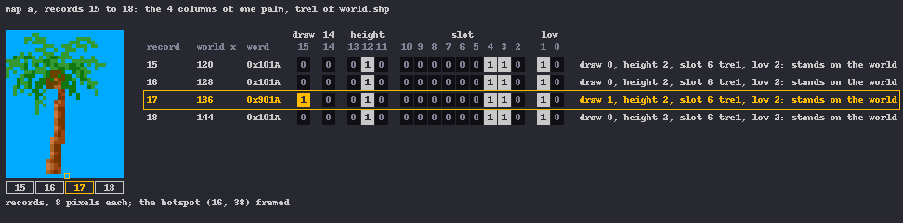
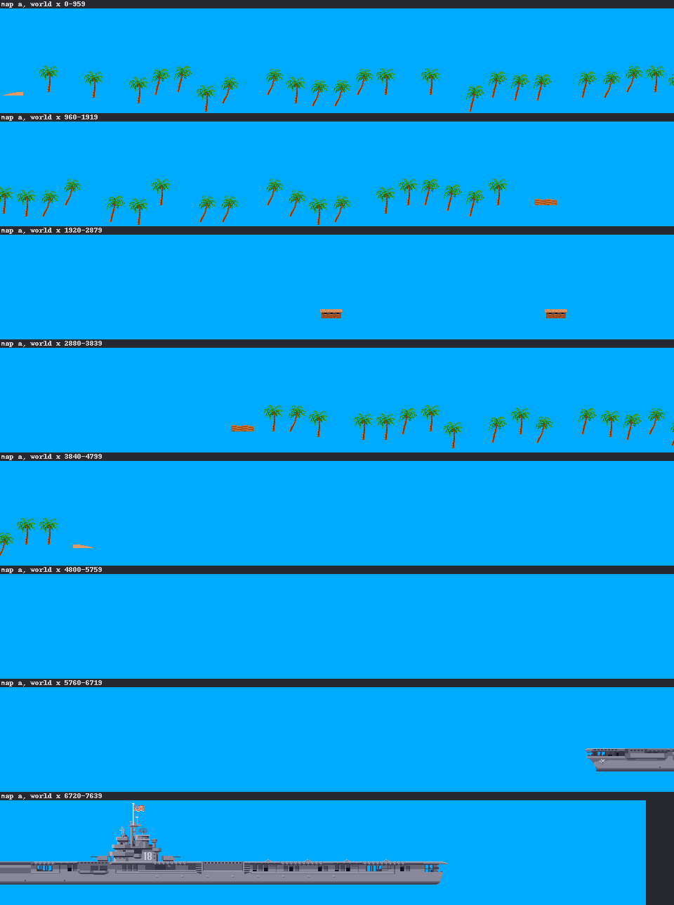
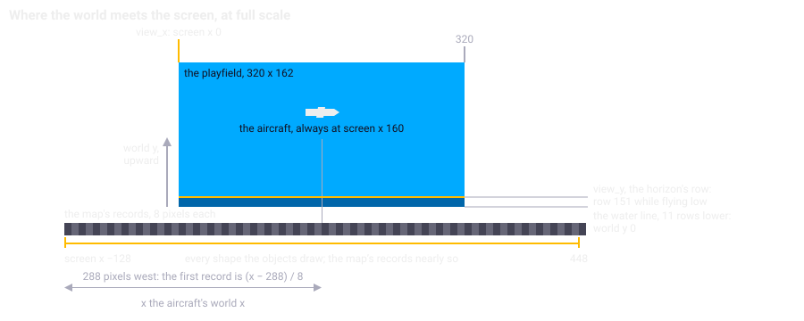
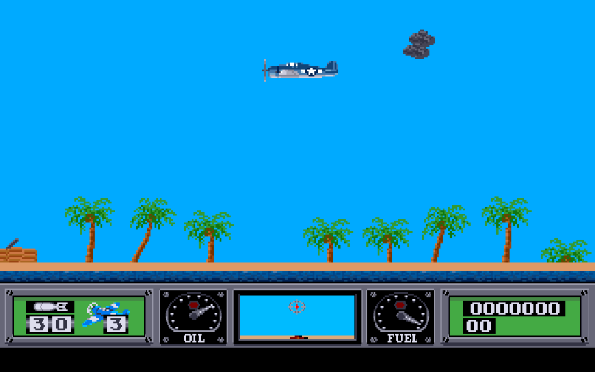

Chapter 13
{ .chapter-kicker }

# The world

Chapter 3 gave the map files a sentence, and chapter 12 left the map's records naming shapes by slot. This chapter opens the files. By its end you will know what a world is to the game, a strip of small records and nothing else; what each of a record's sixteen bits is for; how a position in the world becomes a position on the screen; why the world never scrolls but is painted anew in every pass; the one thing the game's logic takes from the map; and what the loader builds from it for each mission. Each mechanism ends with what the port made of it and the instrument that holds it.

## A world in one file

Each mission's world is one file, `maps/a.map` to `maps/o.map`: two numbers of four bytes, then [**map records**](../glossary.md#map-record) to the end of the file. A map record is a word of two bytes that stands for eight pixels of the world, from west to east: whether a shape stands there, which, and how. The map is the strip of them, and there is nothing else in the file: no list of targets, no position of a ship, no picture of an island. Whatever else a mission needs, the loader builds from the strip.

`map_load` picks the file by the rank and the mission number (which map a mission gets is chapter 17's matter) and reads the two numbers. The first is the file's own length in bytes, and the loader takes it as the length of the record list too. The second is a byte offset into the records that falls on the carrier's deck: four times it, less eight, is the world x where the player's aircraft starts. Four times, because a record is two bytes and covers eight pixels.

Then the loader does something odd. It asks for, and reads, as many bytes of records as the first number says, although after the two numbers the file holds eight bytes fewer. The last four records of every map never come from the file. On the Amiga they are zero, and one instruction says why. Every request for memory the game makes goes through one allocator of its own, which hands it on to exec's `AllocMem`, the system's routine. On the way it sets bit 16 of the flags, `MEMF_CLEAR`, which asks the system for memory cleared to zeros. In the [listing](../glossary.md#listing), look at `bset.b #$10,d0`, bit 16 set in the flags the caller passed:

```wingslst
--8<-- "generated/listings/asm/alloc_clear.lst"
```

A zero record draws nothing and gives no ground, so the four records are harmless. Why the loader asks for the eight bytes is not known, and nothing depends on it. For the port it is a rule all the same: memory the game is given must be zero, because the game relies on it here. Chapter 4 told how this finding corrected a note that had blamed the machine. The port keeps the record list in a fixed table of the [core](../glossary.md#core)'s state and clears it before the file is read into it, and its arena, chapter 22's, hands out zeroed memory too: what the two have in common is the rule. One test parses every map of the disk and finds nothing left over, the first number equal to the file's length and the records running to its end; another finds the map the first mission loads in the [headless original](../glossary.md#headless-original) equal to the file, word for word.

The fifteen maps differ in length and in what they carry. Maps a, b and c are the three missions of the first rank, the ones a player meets first.

| Map | Records | The player's start, world x | Records that draw | Islands | Enemy ships | Airfields |
|---|---|---|---|---|---|---|
| a | 955 | 7,032 | 89 | 1 | none | none |
| b | 1,751 | 6,112 | 172 | 2 | none | none |
| c | 1,951 | 5,880 | 238 | 3 | none | none |
| d | 1,795 | 7,456 | 213 | 2 | none | 1 |
| e | 2,135 | 10,760 | 259 | 3 | none | 1 |
| f | 1,744 | 8,416 | 157 | 2 | cruise ship | none |
| g | 2,359 | 10,488 | 226 | 3 | cruise ship | none |
| h | 2,775 | 12,920 | 281 | 3 | destroyer | 1 |
| i | 2,869 | 10,176 | 263 | 3 | destroyer, cruise ship | 1 |
| j | 997 | 3,960 | 19 | 0 | destroyer, battleship | none |
| k | 2,650 | 14,408 | 215 | 3 | battleship | 1 |
| l | 2,523 | 10,184 | 222 | 3 | destroyer, battleship | 2 |
| m | 3,569 | 13,760 | 282 | 4 | battleship, Japanese carrier | 2 |
| n | 2,932 | 10,904 | 183 | 3 | destroyer, battleship | 1 |
| o | 3,468 | 9,696 | 251 | 3 | destroyer, battleship, Japanese carrier | 1 |

Every map carries the player's carrier. Of the 34,473 records of all fifteen, 3,070 draw a shape.

## The record, bit by bit

A record packs four fields into its sixteen bits. The project's [**map decoder**](../glossary.md#map-decoder), [`tools/map_decode.py`](repo:tools/map%5Fdecode.py), is a reader of the map files written apart from the port; here is how it takes a record apart, a mask and a shift for each field:

```python
--8<-- "generated/listings/py/fields.py"
```

Bit 15 is the [**draw flag**](../glossary.md#draw-flag): only a record that carries it puts its shape on the screen. Bit 14 is set in none of the 34,473 records. Bits 13 to 11 are the record's height, 0 to 7, which moves its shape down the screen from the horizon's row, chapter 11's [split line](../glossary.md#split-line), four rows a step. Bits 10 to 2 are the [slot](../glossary.md#slot) of chapter 12, in `MasterList` at full scale or `AthList` at the eighth scale. Bits 1 and 0 say where the record stands: 2 on the world, 1 on a ship, 0 nowhere in particular.



/// caption
Records 15 to 18 of map a, the four columns of one palm: each carries the palm's slot and height, and the third alone the draw flag.
///

A shape wider than eight pixels covers several records. All of them carry its slot, and one carries the flag, so the shape is drawn once, with its [hotspot](../glossary.md#hotspot) on that record's x. Most often it is the third, as the box shows. The other columns are not wasted: the routine that tells the game's logic how high the ground is reads the slot and ignores the flag, so a palm four records wide stands in the way under all four.

/// figures
| Where the draw flag sits | Drawn records on land |
|---|---|
| Two records of the same slot to its left | 1,756 |
| Three | 664 |
| One | 110 |
| None | 317 |
| All | 2,847 |
///

In all fifteen maps only the palms and a bump of land, slots 6 to 9, carry a height other than 0, so an island's palms stand on different rows. The waves and the island's ground are drawn later, over the rows from the horizon down, so a lowered palm shows less of its trunk and the palms rise from the shore to different heights. At the eighth scale the height is not used, and every record stands on row 151.

The slot reaches into chapter 12's tables, and a slot whose entry is null draws nothing. The tables hold 278 entries, of which the game fills 273: the world's 184 and the four ships' blocks. The five entries past them are always null, and the maps use three of them, `0x113` to `0x115`, as markers that draw nothing themselves. A record of slot `0x113` marks where an island's flag stands; the flag is drawn beside it, as one of the extras of a later section, not through the slot. Pairs of `0x114` and `0x115` mark an airfield for the loader.

The low bits exist because a ship can sink, row by row, while the record list stays as it is. A drawn record whose low bits are 1 is lowered by the ship it stands on. The drawing turns its x back into a world x, finds the ship among the five whose span of the record list holds it, and adds the rows that ship has sunk. Of the fifteen maps' records 2,677 ride this way, and every one belongs to a ship.



/// caption
Map a as the strip of its drawn records, in bands of 960 pixels of world x: the island on the left, the carrier on the right; the island's ground between its beaches is not a record.
///

The figure shows map a, the first mission's world, whose shapes all come from `world.shp`; the later maps' ships come from containers of their own. The map viewer of this book shows every map with its records.

## From the world to the screen

Positions in a mission are [**world coordinates**](../glossary.md#world-coordinates): x in pixels from the map's west end, eight to a record, and y in pixels upward from the water line, where it is zero. The screen counts its rows downward from its top, so a conversion stands between the two.

Once in every [pass](../glossary.md#pass), before anything is drawn, `frame_update` works out where the screen lies in the world. It works from a copy of the player's position that the pass takes for its drawing, so that every routine of the pass draws from one and the same position. At full scale:

- the screen's left edge, `view_x`, lies 160 pixels west of the player, so the aircraft is always at screen x 160;
- a shape's screen x is its world x less `view_x`;
- its screen y is `view_y` plus 11, less its world y; `view_y` is the horizon's row, 151 while the aircraft flies low, and further down the screen as it climbs, by chapter 11's ladder;
- at the [eighth scale](../glossary.md#eighth-scale-view) both are divided by eight and `view_x` lies 1,280 pixels behind, so that the aircraft is at screen x 160 again.

The water line is thus 11 rows below the horizon's row. `draw_world_shape`, chapter 12's helper for every shape the objects draw, makes this conversion and draws a shape only while its screen x lies from −128 to 448: that is the routine's rule.



/// caption
Where the world meets the screen at full scale: the records a pass draws reach past both edges of the playfield, from the one 288 pixels behind the aircraft.
///

The map's own loop, in `draw_world`, does the same arithmetic in its own words. Its first record is the one 288 pixels behind the aircraft, at screen x −128, or up to seven pixels further left by the player's x modulo 8; at the eighth scale it starts eight times as far behind. It steps one record at a time, eight screen pixels apart at full scale and one at the eighth scale, and stops past screen x 448. So the loop covers the same window as the helper.

## A picture painted anew

The world appears to scroll as the aircraft flies, but nothing scrolls. No pass copies the last picture and shifts it; every pass paints the [playfield](../glossary.md#playfield) anew from the map. It first fills the sky in colour 1, from the top down to the horizon's row. Then it walks the strip. A record with the draw flag gets its slot's shape, at the horizon's row plus four rows a step of its height, lowered with its ship if it rides on one; a null slot is skipped. Then, drawn or not, the record gets its extras, and the loop steps on.

On the left, look at `bclr.b #$d,d1`, the draw flag tested in the record shifted right by two; `and.w #$7fc,d1`, the slot made a pointer's offset in the table; `move.w #$97,d1`, row 151 at the eighth scale, or else the height times four added to the horizon's row in D5; and `cmp.w #$1d0,d4`, the screen x plus eight against 464. On the right, the decoder's `draw_list` is the same loop in Python.

//// html | div.listing-pair

/// html | div
```wingslst
--8<-- "generated/listings/asm/draw_world_loop.lst"
```
///

/// html | div
```python
--8<-- "generated/listings/py/draw_list.py"
```
///

////

A record's extras are what belongs to its place. A burnt barracks smokes for a while, at both scales. At full scale only, the carrier's flag flies beside the record of its tower, the carrier's lift is drawn beside its own record, and an island's flag beside the record of slot `0x113`. The loop walks the places in view, so these need no search of their own.

After the strip come the layers, always in this order: the aircraft waiting on the carrier's deck, one for each life left but the one flying; the aircraft on the carrier's lift; the player's aircraft; the enemy aircraft and the wrecks of those shot down; the guns of the dug-outs and the pillboxes; the enemy ships' guns; the aircraft parked on the airfields; those parked on the ships' decks; the sea's waves; and last the islands.

The sea at full scale is five shapes of the wave animation, 96 pixels apart, placed from the player's x modulo 64, so that the waves move as the world moves; at the eighth scale it is a band of colour 10 from row 151. An island is its two beaches, the shapes of slots 1 and 2, drawn at the world x of its two drawn beach records, and a fill of colour 17, the island's ground, between them from the horizon's row down. An airfield in use shows its parked aircraft, as many as its count, and the one rolling to take off; chapter 16 tells what an airfield does.



/// caption
The first mission at VBlank 3500 of the book's island run, a take-off and a turn west flown by the stick's letters: the aircraft at world x 3,381 of map a, 109 pixels up, at full scale.
///

Painting anew suits the game's display. The playfield is double-buffered, as chapter 11 told: the screen a pass draws into last showed the picture of two passes before, and since it is painted from the map, what it held does not matter. The port, which has no blitter and draws per pixel into its [indexed framebuffer](../glossary.md#indexed-framebuffer), paints the same way, routine by routine and in the same order, and has no scrolling to imitate.

The decoder holds no data of the game; it reads the map files from the disk when it runs. Over a flight of 684 passes in the headless original, through the deck, the take-off, level flight and the eighth scale, it predicts every draw the original made from the map, slot, screen x and screen y, in order, pass for pass: over five thousand draws. A [control](../glossary.md#control) of chapter 8's kind changes the map instead of the port. One drawn record of map a gets another slot and another height, and the changed file is laid over the disk:

```python
--8<-- "generated/listings/py/test_a_changed_map_changes_exactly_the_draws_the_decoder_says.py"
```

The prediction holds for every pass of the changed run, the passes whose draws differ are exactly those it predicts to differ, and the aircraft flies the same flight. In both loops of chapter 8, after every pass of the [mission scripts](../glossary.md#mission-script), the map draws the port made are compared with the decoder's prediction from the map as the original then holds it.

## The ground under the aircraft

Inside a [logic tick](../glossary.md#logic-tick) the map gives exactly one thing: the [**ground height**](../glossary.md#ground-height), how high what stands at a record reaches, which the tick asks for under an object. Everything else the map feeds is drawing. Because the ground comes from the records and not from the picture, the game's logic is the same whether anything is drawn or not, as chapter 2 told. A run of the headless original with a hook on every read of the map's memory, over a take-off and 568 ticks of flight, shows it: inside the ticks only the ground-height routine read the map, against tens of thousands of reads by the drawing.

/// figures
| Who read the map | Reads |
|---|---|
| The mission's setup, its walks | 2,865 |
| The tick: the ground height | 547 |
| The pass: the strip | 71,635 |
| The pass: the dashboard's map window | 48,639 |
| The pass: two routines more | 76 |
///

`ground_height` answers in three ways. For six classes of slot it takes the class's height from a table of six words in the executable, less the record's height bits, so a lowered palm is a lower obstacle. For a ship's slot it asks the ship's record: its deck's height, less how far it has sunk and less the swell of the sea, and for the player's carrier less one value more, the lift's, which chapter 14 tells; so a deck's ground goes up and down with its ship. For every other slot it answers zero: the beaches, an island's plain ground and the sea are all at height zero, and the ground the tick sees is the height of what stands there.

| Class | Slots | Height |
|---|---|---|
| A palm | 6 | 36 |
| A palm | 7 | 35 |
| A palm, and `cama` | 8, `0x0B` | 35 |
| A dug-out | 3 | 9 |
| A barracks | 4 | 13 |
| A pillbox, in any state | `0x0F` to `0x1E` | 12 |

On the left, the routine's three answers: `moveq #$0,d0`, zero; at `loc_015866` a ship's deck, its `+$e` less its `+$14` less the swell; at `loc_015878` the class number doubled to index `ground_class_heights` and the record's bits 11 to 13 taken off. On the right the port's switch over the slot does the same.

//// html | div.listing-pair

/// html | div
```wingslst
--8<-- "generated/listings/asm/ground_height_answers.lst"
```
///

/// html | div
```c
--8<-- "generated/listings/c/wof_ground_height_switch.c"
```
///

////

Under the [oracle](../glossary.md#oracle) of chapter 5 the routine is held to a model of what the listing computes over 600 random records, with random ships and swell.

## What the loader builds

`map_scan` walks the record list twice and is the only routine that turns records into the game's objects. The first walk looks at the drawn records only. It counts the targets by slot, the barracks, the dug-outs and the pillboxes, counts the islands by their east beaches, and counts what the briefing will name. It fills the five ship records, the destroyer's, the battleship's, the cruise ship's, the Japanese carrier's and the player's carrier's, each from the record of the slot that introduces it: the span of the record list the ship covers, and fixed values for the rest. For an enemy ship it also builds the block of aircraft parked on its deck, from a table by map number.

The tables are then sized by those counts, the soldiers five to each barracks and dug-out, and the second walk fills them: each target's place in the record list, its world x and its island; each island's two beach records, kept in two short lists from which the drawing places the beaches; each island's span of dug-outs and its points. What the targets and the soldiers do with their tables is chapter 15's. Another routine reads the map once more for the airfields' markers, each pair an airfield whose parked aircraft come from a table by map number; their fighters are chapter 16's.

A hit rewrites the record list, and nothing else does. A bombed barracks' four records turn from slot 4 into slot 5, the burnt barracks, and a pillbox's four records into another of its states, each keeping its draw flag and its low bits. So the map a mission ends with is not the file's, and the burnt barracks is drawn, and smokes, from the records themselves. Chapter 3 told that a saved game carries them.

The port keeps every one of these tables at a fixed place with a fixed capacity, cleared where the original asks for cleared memory, and a test holds the capacities against all fifteen maps. The setup is compared at step S, chapter 6's [dump](../glossary.md#dump) after the setup, on every map loaded under its own number: every registered value and table equal, `map_scan`'s among them.

## What the port made of it

The port keeps the records as the original's sixteen-bit words, read with the same shifts and masks, and holds a byte offset where the original holds a pointer into the map. It paints the playfield in every pass in the original's order, and beside it stands the decoder, which predicts from the file what both must draw.

/// dev
The routines: `map_load` `0x012ADC`, `map_scan` `0x012D5A`, the airfields' scan `0x012C84`, `draw_world` `0x013772`, the record's extras `0x013B1C`, `draw_world_shape` `0x015174`, `ground_height` `0x015714`, `ship_at_offset` `0x014A4E`, `islands_draw` `0x0140E8`, `airfields_draw` `0x013A18`. The variables: `map_records` `0x024628`, `map_records_end` `0x02462C`, the map's width `0x024630`, `player_start_x` `0x025392`.

The second walk of `map_scan` reads one record past the end of the list: its counter starts at the list's length in bytes and loses one twice a record, the second time in `dbmi` at `0x0131BE`. The port's table, 3,576 words, is one record longer than the longest map, m. No map has more than four islands; the drawing reads the beaches' two lists of four words by address and would read on past them for a fifth. The loop over the strip steps over records before the map's start without reading them.

One routine of the original takes a wreck's x from the address where the allocator put the record list; the port carries that address as an input, and chapter 20 tells the story. In the port: [`src/mission.c`](repo:src/mission.c), [`src/world.c`](repo:src/world.c), [`src/tick.c`](repo:src/tick.c), [`src/mission.def`](repo:src/mission.def).
///

## What comes next

The chapter in one sentence: a world is a strip of two-byte records, one for every eight pixels, which the game paints anew in every pass and from which a tick takes only the height of the ground. Chapter 14 turns to the player, who flies over this strip, takes off from the carrier and lands on it.

## Further reading

- [`re/notes/map.md`](repo:re/notes/map.md), the whole note.
- [`re/notes/drawing.md`](repo:re/notes/drawing.md), ["Other drawing"](repo:re/notes/drawing.md#other-drawing) and ["The scene routines"](repo:re/notes/drawing.md#the-scene-routines).
- [`re/notes/porting-m4.md`](repo:re/notes/porting-m4.md), ["The mission setup"](repo:re/notes/porting-m4.md#the-mission-setup) and ["The map loader"](repo:re/notes/porting-m4.md#the-map-loader).
- [`re/notes/enemy.md`](repo:re/notes/enemy.md#the-fifteen-maps), "The fifteen maps"; [`re/notes/objects.md`](repo:re/notes/objects.md#the-order-of-a-pass), "The order of a pass".
- [`SPEC.md`](repo:SPEC.md#35-file-formats), section 3.5, "File formats", its paragraph "Maps".
- [`tools/map_decode.py`](repo:tools/map%5Fdecode.py), its docstring; [`src/world.c`](repo:src/world.c) and [`src/mission.c`](repo:src/mission.c), their opening comments and those of `draw_world`, `map_load` and `map_scan`; [`tests/test_map.py`](repo:tests/test%5Fmap.py).
