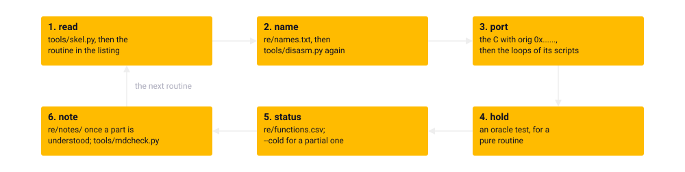

Chapter 25
{ .chapter-kicker }

# Build it yourself

This chapter hands you the tools. By its end you can make a clone ready, place the ROM, build the page, run the suite, run the original headless from a run description of your own and read a routine. You will know what a change must keep, what to run after it, and where the port was left open. Read it at a terminal: each step comes with its command, what it prints and why.

## What a clone needs

A clone, the repository copied with git (chapter 21), needs:

| What | For what |
|---|---|
| a POSIX shell and git: macOS, Linux, or Windows with WSL or Git Bash | the clone and the setup |
| Python 3.11 as `python3` | the environment and every tool |
| the Kickstart 1.3 ROM image | the build and nearly every test |
| Node | the core's tests in WebAssembly, the page tests |
| Google Chrome and Firefox | the page tests |
| macOS, with Apple clang | the native library the tests load |

The project was developed and is tested on macOS; on another system the page builds and the suite does not.

## The setup

```bash
git clone https://github.com/sy2002/wof-wasm.git
cd wof-wasm
cp /path/to/your/kick.rom original/kick.rom
sh tools/setup.sh
```

The third line places the ROM image (below); the fourth runs the [**setup**](../glossary.md#setup): [`tools/setup.sh`](repo:tools/setup.sh), the one script that makes a clone ready to build and test.

It makes `.venv`, the environment, a Python of the project's own apart from the system's, and installs [`requirements.txt`](repo:requirements.txt) into it. It names with `missing:` whichever of Node, Chrome and Firefox is absent, and the tests that will skip. Then it checks the ROM and builds the page, on macOS the native library too: about half a minute once the packages are downloaded. Running it again is harmless, the environment kept and brought to the pinned versions. Look at the comment, which says the whole of what it does, and at the lines that make and fill the environment:

```bash linenums="1"
--8<-- "generated/listings/text/setup-head.txt"
```

The port's seven packages are [**pinned packages**](../glossary.md#pinned-package): each required at one exact version, written `==`, so that every clone installs the same and no newer release changes a result unnoticed; what they pull in is not pinned. Unicorn, Capstone and pytest are among them, and so is the compiler: zig, packaged for Python as `ziglang`, carries the C compiler that makes the WebAssembly core, so the page needs none of the system's. The book's packages are pinned whole, in a file of their own.

The commands here name `.venv/bin/python`, as the project's rules do, so that none reaches the system's Python by mistake.

## The ROM

The [Kickstart](../glossary.md#kickstart) ROM is the one file the repository cannot give you: still sold today, it is not ours to publish ([chapter 2](../part-1/amiga.md#the-little-of-amigaos-the-game-uses)). The project uses one image:

/// figures
| The ROM | |
|---|---|
| The image | Kickstart 1.3, revision 34.5, for the A500 and the A2000 |
| Its size | 262,144 bytes |
| MD5 | `82a21c1890cae844b3df741f2762d48d` |
| SHA-1 | `891e9a547772fe0c6c19b610baf8bc4ea7fcb785` |
///

Cloanto's Amiga Forever sells it, and a real Amiga 500 with Kickstart 1.3 gives it too. It goes as `kick.rom` into [`original/`](repo:original/), and [`.gitignore`](repo:.gitignore) keeps it out of every commit.

The build takes two tables from it: the system font for the dialogs, and the key conversion, the ROM's own routine run for every key the shell can send. The headless original and the oracle run its floating point too (chapters 5 and 6).

```bash
.venv/bin/python tools/rom.py
```

This is the ROM's check, by the size and the SHA-1: for the expected image it prints its name and checksums, for anything else one message saying what is wrong, what is needed and where to get it, with exit status 1.

The build makes the same check first and stops before it writes anything, for a page without the font and the key table would not be the game. The suite skips every test but four with the message as the reason (chapter 24). The book needs no ROM: `sh tools/setup.sh --book` builds the site before it looks for one.

## The build

The [**build**](../glossary.md#build-of-the-page) is [`tools/build.py`](repo:tools/build.py)'s making of the page, `wof.html` in [`dist/`](repo:dist/), from the sources, the disk's files and the ROM. The setup ran it once; run it again after any change:

```bash
.venv/bin/python tools/build.py
.venv/bin/python tools/build.py --native
.venv/bin/python tools/build.py --debug
```

The first builds the page in a second or two; `--native` adds the tests' native library, in a few seconds; `--debug` keeps the core's debug information in the page.

| Step | Reads | Writes | Why |
|---|---|---|---|
| 1. the tables | the [manifest](../glossary.md#manifest), the program, the ROM | the tables as C, under `gen/` in [`src/`](repo:src/) | no number of the game is typed in by hand (chapter 3) |
| 2. the files | 55 of the disk's files | one blob with a directory | a page opened from a file can load nothing beside it |
| 3. the core | the C, the tables among it | `core.wasm` in [`dist/`](repo:dist/) | zig is pinned, so no compiler of the system's |
| 4. the page | the template, the stylesheet, the modules, the core, the blob | `wof.html` in [`dist/`](repo:dist/) | one file that runs from a double click |

Step 1 is [`tools/extract_tables.py`](repo:tools/extract%5Ftables.py); step 3 compiles chapter 22's [freestanding](../glossary.md#freestanding) C for `wasm32-freestanding`. Step 4 joins seven of the shell's eight modules into one script, carries the eighth, the audio worklet, as text, and the core and the blob in base64. It stops if any module syntax is left, a name one module takes from another is defined nowhere, or the page grows past the specification's limit.


/// caption
The build. The ROM's check comes first; four steps make the page, the one result that is committed, and with `--native` the same C becomes the tests' native library.
///

The second target is chapter 5's [native library](../glossary.md#native-library): the same C with [`tests/shim.c`](repo:tests/shim.c), the tests' way into the core, compiled by Apple clang into `libwofcore.dylib` in [`tests/`](repo:tests/), which also records what the core opened, played and drew, for the comparisons. Look at `-g0` at the end of the first list and at `-DWOF_TRACE=1` in the second:

```python linenums="1"
--8<-- "generated/listings/text/compile-flags.txt"
```

`-g0` leaves out the debug information, which would more than triple the core; `--debug` keeps it, for stepping through the C in a browser's developer tools. `-ffile-prefix-map` writes the source paths relative to the repository, so that no page names a directory of the machine that built it.

Two builds from the same sources are the same byte for byte, which lets the repository commit the page and anyone hold it to its sources:

/// figures
| The page | |
|---|---|
| Its size | 1,158,496 bytes |
| The build's limit | 2 MB |
| SHA-1 | `53d5875a3edd33da93ef28277f4dc0fc9baeb856` |
///

```bash
git status --short dist/wof.html
```

After a build, this prints nothing when your page is the committed one. Of all the build makes, only the page is committed, so that a player needs no build (chapter 1).

## Verify

```bash
.venv/bin/python -m pytest tests/ --slow -m "not page" -n 8 --dist loadgroup
.venv/bin/python -m pytest tests/ --slow -m page
```

The first is the emulator [phase](../glossary.md#phase-of-the-suite), about an hour; the second, after it and never beside it, the page phase, about twenty minutes (chapter 24). `-n 8` is the number of physical processor cores: use your machine's, since more [test processes](../glossary.md#test-process) than processor cores only slow it down. `--slow` adds the longest differential runs. The suite builds the port itself first.

```bash
WOF_FIREFOX_VISIBLE=1 .venv/bin/python -m pytest tests/test_firefox.py
```

This opens a real Firefox window, the one check that sees a fault of the graphics processor; keep it uncovered, since a covered window stops the page's clock.

```bash
.venv/bin/python tools/junit_compare.py REF.xml PHASE1.xml PHASE2.xml
```

With `--junitxml FILE` added to each phase, pytest writes its results as XML; this holds the two files together to a reference run's [outcome set](../glossary.md#outcome-set) and exits with 1 on any difference. A fresh clone built the page byte for byte the repository's, and both phases passed (chapter 24).

## The headless original at a terminal

A [run description](../glossary.md#run-description) is a small JSON file, every key optional; an unknown key stops the run with its name, so that a misspelt one is never ignored. This one was written for this chapter: fire twice to the rank selection, the cursor key down to the second rank, fire to choose it, fire past the briefing and once more on the deck. Look at line 13, the key 77, cursor down, in decimal because JSON has no hexadecimal, and at the stop on line 21:

```json linenums="1"
--8<-- "generated/listings/json/second-rank.json"
```

Other keys set the video rate, switch off the sound or the music, or lay files over the disk; a `stop` counts ticks, passes or VBlanks.

```bash
.venv/bin/python tools/headless.py run book/runs/second-rank.json --out A.dump
```

This runs it under the [headless original](../glossary.md#headless-original) and writes its [dump](../glossary.md#dump). It prints that it stopped at the 50th tick of its mission, after 645 VBlanks, in 1.2 seconds, then the count of steps and the routines that read display memory, the copper lists' builders and the text routine, as chapter 6 found.

```bash
.venv/bin/python tools/headless.py show A.dump
.venv/bin/python tools/headless.py show A.dump --step 28
.venv/bin/python tools/headless.py diff A.dump B.dump
```

The first lists the steps, one a line: `S` where a mission's setup is done, `T` after a tick, `P` after a pass, each with its counts, input byte, hash and the ranges of memory it changed. The second opens one step, here the tick that took the press on the deck, checks the rebuilt state against the hash and names every range it changed. The third names the first step at which two dumps differ and every range that differs there; run the description again with another key, and the two part at the key. `--changes`, `--entropy-log` and `--schedule` add the [change report](../glossary.md#change-report), the log of the [entropy stream](../glossary.md#entropy-stream) and the [schedule](../glossary.md#schedule). A thousand ticks of flight take about six seconds (chapter 6).

```bash
.venv/bin/python tools/m4_scripts.py --list
.venv/bin/python tools/m4_scripts.py trace landing
.venv/bin/python tools/m4_autopilot.py landing
```

The first prints the names of M4's [mission scripts](../glossary.md#mission-script), as the like tools of M5 to M7 do theirs; the second flies the landing and prints the player's state tick by tick. The third flies the landing's [autopilot](../glossary.md#autopilot) and prints the script it chose, which the original flies again without it (chapter 8).

/// dev
From Python, `headless.Headless(description)` makes a run and `run(until='tick')` runs it to the next tick, or to `'pass'` or `'step'`, or without an argument to the description's stop. Its `o` is the [oracle](../glossary.md#oracle) to read memory with, `regions()` the state, and `schedule` and `entropy_log` among its records ([`re/notes/headless.md`](repo:re/notes/headless.md#using-it), "Using it").
///

## Reading a routine

```bash
.venv/bin/python tools/skel.py save_game_read
```

This prints the [control-flow skeleton](../glossary.md#control-flow-skeleton) of the routine that reads a saved game; its address, `015e1a`, does the same, and `--all` prints the routine whole. Look at the calls through the [far-call table](../glossary.md#far-call-table) on lines 6, 9, 13 and 14, resolved to the routines they reach, and at the path from line 12, taken when the file does not open, which ends the program:

```wingslst linenums="1"
--8<-- "generated/listings/skel/save_game_read.lst"
```

It keeps the [listing](../glossary.md#listing)'s conventions, which chapter 4 read line by line: a header with the routine's kind, frame, far-call slot, comment and callers; an operand through the [small-data base](../glossary.md#small-data-base) followed by its name; a far call resolved to its routine; and code nothing reaches marked `found by gap sweep`. Never load the listing whole: a skeleton, a search or an address range is the way in.

A name is one line in [`re/names.txt`](repo:re/names.txt): the address in hexadecimal, the name and, after a semicolon, a comment. Then:

```bash
.venv/bin/python tools/disasm.py
git diff --stat re/
```

The first makes the listing and the inventory again, in under two seconds; the second shows which files the name reached. The listing is never edited by hand, since the next run would overwrite the edit. Both files are committed and held to this regeneration byte for byte by [`tests/test_generated.py`](repo:tests/test%5Fgenerated.py), so a diff shows exactly what a name changed.

The [routine inventory](../glossary.md#routine-inventory)'s [**status**](../glossary.md#status-of-a-routine) column is the one kept by hand: where the port stands with a routine, carried over at every regeneration. Its strings hold commas, so count it with a CSV reader, never with `cut`:

```text
.venv/bin/python -c "import csv, collections; print(collections.Counter(r['status'] for r in csv.DictReader(open('re/functions.csv'))))"
```

This prints the count of each status:

| Status | Routines | What it means |
|---|---|---|
| `verified` | 167 | ported and held to the original by a test of its own: under the oracle for a [pure routine](../glossary.md#pure-routine) |
| `ported` | 155 | ported and held by the comparisons of whole runs of the game |
| `partial` | 1 | ported as far as the recorded runs reach it; the rest are [stand-ins](../glossary.md#stand-in), and a run that reaches one fails |
| `replace` | 47 | the port does the job its own way |
| `drop` | 36 | not needed |
| `todo` | 210 | no status set |

The oracle is a class in Python. Its docstring shows a call; look at `o.L(...)`, a long or a pointer pushed onto the stack, and at the calling convention below it:

```text
--8<-- "generated/listings/text/oracle-call.txt"
```

`o.W(...)` pushes a 16-bit int. `Oracle(a4=0x02AFFE)` serves a routine that reaches the game's variables; `call` takes `regs=` for a hand-written routine's registers and `ccr=True` for the [condition codes](../glossary.md#condition-codes) (chapter 5).

```bash
.venv/bin/python tools/oracle.py
.venv/bin/python tools/reach_observe.py --blocks --setups --json REACH.json
.venv/bin/python tools/reach_observe.py --cold REACH.json
```

The first is the oracle's self-test: the game's own unpacker on all ten packed files against the decoder in Python, then `ORACLE SELF-TEST PASSED`. The second makes chapter 8's [reach map](../glossary.md#reach-map), a long run, every script flown with every basic block recorded; `--m5`, `--m6` and `--m7-only` add the later scripts. The third lists every [cold region](../glossary.md#cold-region) of a ported routine with its stand-in's marker, and fails on a region that has none.

| Task | Tools |
|---|---|
| read | [`tools/disasm.py`](repo:tools/disasm.py), [`tools/skel.py`](repo:tools/skel.py), [`tools/m68kdis.py`](repo:tools/m68kdis.py) for an address range |
| run | [`tools/headless.py`](repo:tools/headless.py), [`tools/oracle.py`](repo:tools/oracle.py), each milestone's scripts and autopilot |
| observe | [`tools/reach_observe.py`](repo:tools/reach%5Fobserve.py), [`tools/pass_observe.py`](repo:tools/pass%5Fobserve.py), [`tools/object_observe.py`](repo:tools/object%5Fobserve.py) |
| decode | [`tools/map_decode.py`](repo:tools/map%5Fdecode.py), [`tools/ppkc.py`](repo:tools/ppkc.py), [`tools/rpck.py`](repo:tools/rpck.py), [`tools/song_decode.py`](repo:tools/song%5Fdecode.py), [`tools/savegame.py`](repo:tools/savegame.py) |
| check | [`tools/rom.py`](repo:tools/rom.py), [`tools/mdcheck.py`](repo:tools/mdcheck.py), [`tools/junit_compare.py`](repo:tools/junit%5Fcompare.py) |

## Fixing a bug

Every routine of the port went through the same six steps, the [**working method**](../glossary.md#working-method) the specification sets out; a fix follows them from the step where the fault lies.



/// caption
The working method, each step with its instrument.
///

| Step | What you do | What to run after it |
|---|---|---|
| 1. read | the skeleton, then the routine in the listing | nothing yet |
| 2. name | the routine and its variables in [`re/names.txt`](repo:re/names.txt) | [`tools/disasm.py`](repo:tools/disasm.py), then `git diff` |
| 3. port | the C, with `orig` and the original's address in a comment | the loops of the scripts that reach it |
| 4. hold | for a pure routine, an oracle test on random inputs | its oracle module |
| 5. status | the routine's status | [`tools/reach_observe.py`](repo:tools/reach%5Fobserve.py) with `--cold`, for `partial` |
| 6. note | what was learnt, in [`re/notes/`](repo:re/notes/) | [`tools/mdcheck.py`](repo:tools/mdcheck.py) on the note |

A change keeps the rules chapter 22 gave, each for its reason:

- Port from the listing, never from a guess at the C: the comparison is with the original's code.
- Give every value its width, `int16_t` and the like: the original's int has 16 bits.
- Read every table and tuning value through the manifest: one read from the program is the original's, one typed in could be wrong.
- Leave [`original/`](repo:original/) untouched: every claim is checked against its bytes.
- Mark a region no script reaches as a stand-in, naming the milestone that owes it and its address: a run that reaches it fails loudly (chapter 8).
- Keep the line count when you change only comments in a file with [coroutines](../glossary.md#coroutine): a [resume point](../glossary.md#resume-point) is a line number, so a line added above a wait changes the core's bytes. The shell's comments are in the page too, so a comment changed under [`web/`](repo:web/) changes the page.

A new table is one entry of the manifest; look at the kind, `names4`, a list of four-character shape names, at the address in the [fixed load layout](../glossary.md#fixed-load-layout) and at the count:

```text
--8<-- "generated/listings/text/shape-names-entry.txt"
```

Then run what holds the routine:

```bash
.venv/bin/python -m pytest tests/test_oracle_m5.py -k drop
.venv/bin/python -m pytest tests/test_weapons.py -k bomb_a
```

The first runs the oracle test of the drop, which lets a weapon go; the second the four loop tests of the script `bomb_a`, the closed loop at three pass rates and the open loop; `-k` picks tests by name. Then the cold list if a stand-in moved; the build and the page's status if the change reached [`src/`](repo:src/) or [`web/`](repo:web/); the book's check, below, if it reached the sources, the tools, the tests or the listing, whose excerpts the book shows; and both phases last.

Chapter 9's fault shows what a failure looks like. The port assumed a register's [upper word](../glossary.md#upper-word) to be 0 at a routine's entry, because the scripts so far had found it so, while the original handed a long on. The oracle tests of those routines now draw the upper word at random, so such a port fails on a random state, with the input and both results. The [closed loop](../glossary.md#closed-loop) names the moment: a loop test fails with each failing check, the steps it failed in and its first cases, a difference of state written as the field's name with the port's value and the original's. In chapter 9 it was the engine's smoke a pixel off, well into a run at one VBlank a pass. The [open loop](../glossary.md#open-loop) then tells whether the step goes wrong alone.

## Extending the port

The design left two places open, both outside the game's logic:

- **The display list.** Every shape the core draws in a pass is also listed, with its name, place and layer, for a renderer that could one day draw the game anew; the page's renderer ignores it (chapter 22).
- **The shell's options.** They went with the milestone M10, which the owner dropped when the game was judged done: chosen keys, a gamepad's mapping, scaling, the video standard as a menu, a mute for the title's music, an export of saved games ([chapter 10](../part-1/making.md#the-milestones)).

The rule for both: nothing of the game's logic changes. What is the browser's stays in the [shell](../glossary.md#shell), outside the [core](../glossary.md#core), where a change cannot alter what the game computes. A layer of the port's own, as its keys and the [keyboard assist](../glossary.md#keyboard-assist) are, lives in a file of its own, held by its tests, the page tests and the closed loop with the layer off.

If you work with an AI coding assistant, as we did, [`CLAUDE.md`](repo:CLAUDE.md) holds the rules its [session](../glossary.md#session) reads first. A session starts from the specification and the notes, and ends with its names, its findings in the notes, the statuses set, the tests green and the specification corrected. It stops and reports, rather than try again, when an oracle test still fails after two fixes, a hand-written routine is not understood after a whole reading, or a change would alter a structure's layout, the core's interface or a porting rule. [`CONTROLLER.md`](repo:CONTROLLER.md) holds chapter 10's arrangement and the pitfalls that cost time, a few of which meet anyone at a terminal:

- A computer left alone sleeps, which stops a run; a test that ran across a sleep counts for nothing.
- A covered visible window stops the page's clock, and load beside the page tests fails them.
- A run piped into `tail` ends with `tail`'s exit code, so read the line with the counts.
- A run description takes decimal numbers only.

## The book's own build

```bash
sh tools/setup.sh --book
cd book && ../.venv/bin/mkdocs serve
```

The first installs the book's packages and builds this site, before the ROM's check; the second serves it at `http://127.0.0.1:8000/wof-wasm/`. [`book/tools/build.py`](repo:book/tools/build.py) makes the book's listings, figures, interactive data, web font and table of the suite again, most of them from the built repository and the ROM, and builds the site; with `--check` it holds the committed files to a fresh making byte for byte, the book's [generated files](../glossary.md#generated-file) held as the repository's are.

## Amiga to Web

The chapter in one sentence: the setup, the ROM's check and the build make the same page and the same tests' library on every machine, the tools read and run the original at a terminal, and a change keeps the rules and runs the instruments that hold it. What remains is an idea.

Take Wings of Fury out of this repository and most of it still stands: the instruments that read an Amiga program and run it headless, the runtime that gives one program an Amiga without the Amiga, the shell, the tests, and the method with every mistake made once and what caught it, about two fifths of the work ([chapter 10](../part-1/making.md#what-it-took)). Each game's own is the rest: its names, notes and manifest, every routine of its logic, its scripts, and its owner's decisions.

The method reaches games built as this one is: compiled C or disciplined assembly on top of AmigaOS, files through AmigaDOS, memory through exec, the blitter driven from a few routines; a real class, much of Broderbund's and Cinemaware's catalogue and many conversions from the PC and the ST. It does not reach games of hand-written assembly with a loader of their own, code that rewrites itself, hardware sprites or copper tricks: there the stubs serve nothing, and the oracle would have to become an emulator of the chips.

Hence the owner's idea, not started: a [**template**](../glossary.md#template-repository), a repository made to be cloned for another game, "Amiga to Web". You would name it after the game, place the ROM and the disk image, open the sessions the handbook names and say "start". Start cannot be a button: the owner is needed for the decisions, the look and the listen, and the budget. A controller told "start" could do the first three milestones alone, the build, the first picture and the headless original reaching a mission, and come back with the findings, the plan and the questions. The template's first task would be to part this repository's generic half from the game's, which share directories today; this repository would stay as the worked example, this book as its manual. The owner plans it for after the release and this book, and a template counts as proven only when a second game has gone through it.

## Further reading

The files named here are in the repository, [`github.com/sy2002/wof-wasm`](repo:).

- [`README.md`](repo:README.md#build-and-verify), "Build and verify"; [`tools/setup.sh`](repo:tools/setup.sh), [`tools/build.py`](repo:tools/build.py) and [`tools/rom.py`](repo:tools/rom.py).
- [`SPEC.md`](repo:SPEC.md), sections 4, ["Tools"](repo:SPEC.md#4-tools); 5, ["Build"](repo:SPEC.md#5-build); 7.4, ["Working method"](repo:SPEC.md#74-working-method).
- [`re/notes/headless.md`](repo:re/notes/headless.md#using-it), "Using it"; [`CLAUDE.md`](repo:CLAUDE.md), the working rules.
- [`re/notes/amiga-to-web.md`](repo:re/notes/amiga-to-web.md), the idea of a template.

Outside the repository: pip's ["Repeatable Installs"](https://pip.pypa.io/en/stable/topics/repeatable-installs/), on pinning; [Reproducible Builds](https://reproducible-builds.org/), the practice behind a page built the same everywhere; [MkDocs](https://www.mkdocs.org/), the book's engine.
