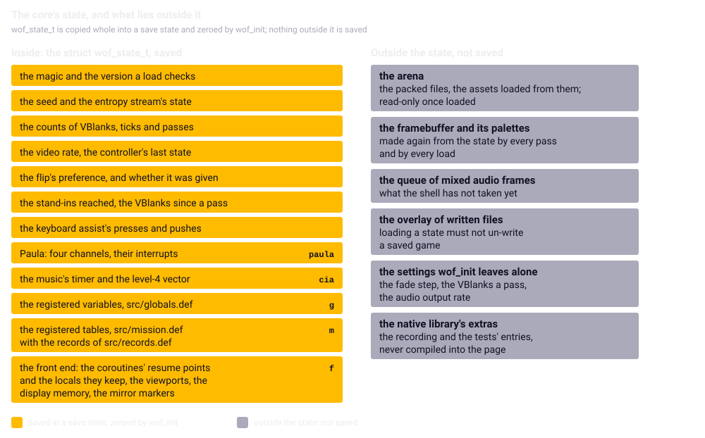

Chapter 22
{ .chapter-kicker }

# The core

Chapter 21 placed the core in [`src/`](repo:src/); this chapter opens it. By its end you will know the rules its C is written by and why, and how every value it took over is tied to its address in the original, the tie that made Part I's comparisons possible. You will see the game's state saved as one block, code that waited on an Amiga waiting in a page, memory and files kept without an operating system, and what the shell can ask of the core.

## One C program, and what it may not do

The [core](../glossary.md#core) is the game ported to C; the [shell](../glossary.md#shell) around it is the page's JavaScript (chapter 1). The core is C11, the C standard of 2011, and [**freestanding**](../glossary.md#freestanding): C with no operating system beneath it and only the part of the standard library that needs none, such as the integer types of fixed width, so it has nowhere to ask for memory, no files and no clock. The specification sets five bans, each with a reason the sources and the tests give:

- **No C library.** Freestanding leaves a few headers of definitions, and the core uses none of the library's code, bringing its own three routines to fill, copy and compare bytes: the page's [WebAssembly](../glossary.md#webassembly) reaches nothing but what the page hands it.
- **No allocation once started.** Everything of the game that the core changes lives in one structure, so that saving it is a copy and nothing is left out.
- **No host floating point in the game's logic.** A browser's rounds differently, and the flight would drift (chapters 5 and 14).
- **No clock.** The game's time is the VBlanks the shell hands in (chapters 6 and 7).
- **No undefined behaviour relied upon.** A compiler may assume it never happens, and the same sources build the page's WebAssembly and the [native library](../glossary.md#native-library) the tests run (chapter 5): if the two differed, the tests would prove something the browser does not run.

Tests hold the last ban: both forms of the core draw the same picture, save the same bytes and replay the same demo, and the floating point runs under a checker that stops at the first undefined operation. Another holds that the WebAssembly imports nothing, no clock, no allocator, no call back into JavaScript.

## The modules, and what was left out

The files that port the game follow the original's modules, stretches of related routines, in address order, and every ported routine carries a comment, `orig` and its address, so that you can lay the [listing](../glossary.md#listing) beside a file and read the two together. The table gives the stretches a file's opening or a note names, from first byte to last as the [routine inventory](../glossary.md#routine-inventory) has them:

| File | What of the original | Where |
|---|---|---|
| [`src/player.c`](repo:src/player.c) | the player's routines | `0x01AA6E` to `0x01CBF1` |
| [`src/enemy.c`](repo:src/enemy.c) | the enemy aircraft's compiled C | `0x01D18C` to `0x01E8B7` |
| [`src/sound.c`](repo:src/sound.c) | the sound slots, then the channels | `0x011F4E` to `0x0123DB`; `0x01E8B8` to `0x01ED79` |
| [`src/draw.c`](repo:src/draw.c) | the blitter library | `0x0209BC` to `0x0215D7` |
| [`src/ffp.c`](repo:src/ffp.c) | the ROM's floating point, reached through the game's glue | `0x021C9C` to `0x021D65`; each line with its ROM address |
| [`src/music.c`](repo:src/music.c) | the music player | by its own offsets, `songplay+0x....` |

The other files follow their routines the same way. Chapter 2 gave an overview of what the original asks of the system; these are the calls this chapter's subjects replace:

| The original | The core |
|---|---|
| dos `Open`, `Read`, `Lock`, `ExNext`, `Write` and the rest | a file system over the packed files |
| exec `AllocMem` | the arena while loading; the state's tables for a mission |
| dos `Delay`, graphics `WaitTOF` | [a coroutine's wait](#coroutines) |
| exec `AddIntServer` | the shell's clock |
| the copper's lists | a palette for every row |

The rest, from the C runtime's start-up to the crack's screen, is marked `replace` or `drop` in the inventory (chapter 1).

## The arithmetic

The original's C has an [int](../glossary.md#int-the-c-type) of 16 bits, and much of the program is assembly written by hand (chapter 3); the port's compilers have an int of 32. The specification sets ten rules, each because a value would otherwise come out different:

| Rule | Why | Told in |
|---|---|---|
| every value has a named width, `int16_t` and the like, never a plain `int` | the two ints differ | 3 |
| every change of width the listing shows is kept: the [sign extension](../glossary.md#sign-extension) `ext.l`, a product cut to a word, a quotient toward zero, `swap` (a register's halves exchanged) | the cut decides the value | 3 |
| a comparison is signed or unsigned as its branch is, `blt` a signed branch, `bcs` an unsigned one | the branch names the comparison the original meant | 3 |
| a branch reads the [condition codes](../glossary.md#condition-codes) of the instruction that set them last | that need not be the compare | 16, 20 |
| a value left in a register's [upper word](../glossary.md#upper-word) is handed to the next routine | the next one reads it | 9 |
| a lookup table read past its end is read by the original address | the original finds whatever lies behind it | 14, 20 |
| wrap-around is written with a cast | a signed overflow is undefined in C | 3 |
| an [arithmetic shift](../glossary.md#arithmetic-shift) is written to stay arithmetic | C leaves a negative number's right shift to the compiler | here |
| a division by zero, which stops a 68000 with a trap, gets a defined result | no recorded run reaches one | here; 5 for the floating point |
| [fast floating point](../glossary.md#fast-floating-point) never goes through `float` or `double` | the rounding differs | 5, 14 |

In both builds the enemy routines' division leaves the dividend's low word, and the test build records the trap so that a test sees it; the floating point counts its own. Two instruments hold the rules: the [oracle](../glossary.md#oracle), whose random inputs, upper words included, reach edges no recorded flight reaches, and the [closed loop](../glossary.md#closed-loop), in which a slip carries on until it shows (chapters 5 and 8).

## The data

The data has rules of its own, for the same reason:

- **Files are read a byte at a time.** Every file is [big-endian](../glossary.md#big-endian), the hosts [little-endian](../glossary.md#little-endian), so a number is built from its bytes, and file bytes are never laid over a C structure.
- **Structures keep the original's order.** Each record is a C structure with the original's fields, order and widths, its offsets written down, because the tests find a field by its offset.
- **No pointer survives.** Where the original keeps an address, the port keeps what means the same on every machine, since a host's address would differ between the page and the tests: a [shape handle](../glossary.md#shape-handle) for a shape, a byte offset into the map; for a block the original allocates, a flag that says whether it exists, the port keeping the block at a fixed place; and for a sound sample a [**sound handle**](../glossary.md#sound-handle), its file's number plus one in the top byte, so that 0 means none, and the offset into the file below it.
- **Every allocation is zeroed.** The game asks the system for cleared memory and relies on it: the last four records of every map come from no file (chapter 13). The port hands out its memory zeroed, as a test and a control hold.
- **What the original allocates has a fixed place and size.** The port keeps it in its state at a size the largest map fits, and a test holds every size against all fifteen maps: the map's record list holds 3,576 words, where map m needs its 3,569 records and the one read past the end.

## The registered state

Chapter 8's comparisons set the port to the original's state and compare the two, so the port must know where the original keeps each value. That is the core's central idea: a [**registry**](../glossary.md#registry), one of three lists in which every variable, table and record layout the port took over is an entry, tied to its address or its offset in the original.

The lists are X-macros: each entry calls a macro the list does not define, and every file that includes the list defines it to make what it needs. [`src/globals.def`](repo:src/globals.def) holds the plain variables, [`src/mission.def`](repo:src/mission.def) the tables, those at fixed addresses and those the original allocates, and [`src/records.def`](repo:src/records.def) the records' layouts. Take the entry `WOF_GLOBAL(input_queue_count, uint16_t, 0x027354)`, the count of chapter 7's queue: included in one place, it becomes the member `uint16_t input_queue_count;`; included in the store below, a test of whether an address falls in the two bytes from that address, which then writes the byte into that member.

Here is chapter 14's [player's record](../glossary.md#players-record). Look at the original's offsets in the fourth column and at the shape at `+0x04`, a pointer in the original and a smaller handle in the port: the port's structure keeps the order and lets the compiler place the fields, and the tests copy each field by the offset written here.

```c
--8<-- "generated/listings/text/player-record.txt"
```

The last column is the field's [**kind**](../glossary.md#kind-of-a-field): how it travels between the original's bytes and the port's structure. There are seven, and most fields are plain:

| Kind | In the original | In the port |
|---|---|---|
| `WOF_K_PLAIN` | an integer, big-endian | the same integer |
| `WOF_K_SHAPE` | a pointer to a shape record | a shape handle |
| `WOF_K_MAP` | a pointer into the map's records | a byte offset |
| `WOF_K_POOL` | a pointer to an allocated block | a flag: is there one |
| `WOF_K_SOUND` | a pointer into a sound effect | a sound handle |
| `WOF_K_SONG` | a pointer into the song data | its offset in the data |
| `WOF_K_VECTOR` | the address at the level-4 vector | the handler it names |

The entries become the members of structures inside the core's state: the [**registered state**](../glossary.md#registered-state), the variables, tables and records the registries list, each tied to its original address. So chapter 8's test harness can copy the original's state into the port field by field, and nothing a registry lists can be forgotten in a save state. The variables are grouped by width, so that their structure has no gap between members, at most two bytes of tail, as a test holds: a gap would be uninitialised memory in a save state, harmless after the zeroing at the start, but none is the cheaper guarantee.

/// figures
| The state | |
|---|---|
| Registered variables | 252 |
| Registered tables at fixed addresses | 30 |
| Allocations kept at fixed places | 21 |
| Record layouts | 26 |
| The whole state | about 360 KB |
| Of it, the display memory | about 330 KB |
///

The lists also let the port read and write by an address the original computes, in whichever registered variable or fixed table covers it; the allocations have a store of their own. That is how a wreck's forty-first word lands in the aircraft records (chapter 16), and how a saved game is written and read back (chapter 17). Look at the two `#include` lines: each pastes a registry's entries into the function, every entry becoming one test of whether the address falls in that variable or table.

```c
--8<-- "generated/listings/c/wof_original_store8.c"
```

## Inside the state, and outside it

Here is the one structure that holds everything of the game the core changes; look at its last three members, and at the magic under them, a fixed number that marks the bytes as a state, with the version beside it:

```c
--8<-- "generated/listings/text/state-struct.txt"
```

Beyond the game's own values the state holds the port's: the counters, the [entropy stream](../glossary.md#entropy-stream)'s place, the joystick's last raw state, the [vertical flip](../glossary.md#vertical-flip)'s preference, the [stand-ins](../glossary.md#stand-in) reached, the [keyboard assist](../glossary.md#keyboard-assist)'s presses, and the state of [Paula](../glossary.md#paula) and of the music's timer with its [level-4 vector](../glossary.md#level-4-vector) (chapter 18). The front end's part holds the coroutines' [resume points](../glossary.md#resume-point) and the locals they keep, the viewports, the display memory and the [mirror markers](../glossary.md#mirror-marker) (chapter 12); none of it is a pointer.



/// caption
What the core keeps outside its state, and why each: the files and assets, the picture made from the state, the queue of mixed sound, the files the game wrote.
///

The display memory is inside, because the game draws into its screens a little at a time, the dashboard only where a value changed, so a loaded state must bring back what was drawn; the framebuffer is the port's output, composed from it at every call of the pass entry. The files never change once loaded, and the assets only as the state's mirror markers say. The mixed sound waits outside, so that the shell's calls never touch what the game computes and a replay renders the same sound however the shell asks for it. The assist's switch and presses are inside, since what an input sample sees depends on them. The fade step, the VBlanks a pass and the sound's output rate are set from outside and survive `wof_init`, as chapter 9's shared core showed.

## Save states

A [**save state**](../glossary.md#save-state) is the bytes of that structure, copied whole, the core's counterpart of an emulator's save state: loaded into a core of the same build, the game goes on where it was. `wof_init` zeroes the structure, so even its tail is zeros and the round trip is exact; a saved state is valid between little-endian hosts, which both forms of the core are. Loading a state checks the magic, `0x574F4653`, the letters `WOFS`, and the version, and leaves the running game alone if either differs. The version, 12 now, is counted up when the layout changes, so that an older state is refused rather than read into the wrong members.

The shapes the game mirrors in place lie outside the state, so a load turns them to match its markers, then makes the picture from the state. Because the resume points are in the state, a state saved inside a wait resumes there. The tests save one in flight with the shapes mirrored, one inside the restart's waits in a tick and one paused, and load each into the same core and into one started on another seed. On both forms of the core the next 400 VBlanks give the same pictures and the same bytes. Here is the plainest such test; look at its two last comparisons, the picture after the load and the bytes 60 VBlanks on:

```python
--8<-- "generated/listings/py/test_state_round_trips.py"
```

A state carried across a reload of the page is not supported, the loaded assets living in the arena, outside it. The page offers no save states; they were made for the comparisons, the replays and the tests, and the player saves the game's own way (chapter 17).

## Coroutines

The original blocks: it waits for the next picture, a time, the fire button or a fade. A page cannot, or nothing is drawn and no key arrives (chapter 19). A thread in the background could block as the Amiga does, but a browser allows that only to a page served from a web server with two security headers, and a page opened from a file has none.

So every routine that can wait is a [**coroutine**](../glossary.md#coroutine): a routine that can stop at a wait, give control back, and go on from there at the next call. The port's coroutines follow protothreads, a technique for C (further reading). The routine's body sits inside a `switch`. The first call runs to the wait, stores the wait's line number and returns; the next call enters the `switch`, jumps to the `case` with that number and goes on from the wait. That number is the routine's [**resume point**](../glossary.md#resume-point), 0 for not started. Look at `CO_WAIT`, which stores `__LINE__`, returns, and leaves a `case` label with that number behind:

```c
--8<-- "generated/listings/text/coro-macros.txt"
```

`CO_CALL` runs one coroutine from inside another, starting it in the same call. Three rules hold that the macros cannot check: no `CO_` macro inside a `switch` of the routine's own, whose labels would mix with the macros'; a local that must survive a wait lives in the front end's part of the state, beside the routine's context, since the jump back skips the line that set it; and every coroutine returns the macros' type, `wof_co_t`. One context a routine is enough, and no stack, because no routine of the front end is ever inside itself: the state holds 22 contexts.

The unit of time is the VBlank. The shell calls the core's pass entry, `wof_pass`, once after every VBlank, and the [headless original](../glossary.md#headless-original) lets VBlanks happen only where the program waits (chapter 6), so one wait is one VBlank on both sides; `wof_init` runs the program to its first wait, so that the Nth call of the pass entry does what the original does after VBlank N. The tick belongs to the coroutine too, because the restart after a lost aircraft waits inside it (chapter 14); the next mission continues the mission's coroutine (chapter 17); the front end's waits are chapter 19's.

One cost is worth knowing before you edit the core: a resume point is a line number, so a line added or removed above a wait, even a line of comment, changes the core's bytes. Two things follow: the committed page is built again, and a saved state, whose resume points are line numbers of the build that made it, is valid only for that build.

## The arena

The [**arena**](../glossary.md#arena) is one block reserved once, from which the core takes what the original asked the system for while loading; a C array without starting values, it costs nothing in the WebAssembly file, only in the page's memory. It has two ends. What outlives a file's load, such as the converted shapes, grows up from the bottom; the buffer a file is read and unpacked into grows down from the top, so that giving it back is one assignment, however much was taken below it meanwhile, which is all the original's freeing of a just-loaded file amounts to here. Every piece is zeroed as it is handed out; nothing below is ever freed, the scratch at the top given back as one piece. Look at `wof_alloc` moving `arena_used` up, `wof_scratch_alloc` moving `arena_top` down, and the zeroing in both:

```c
--8<-- "generated/listings/text/arena-ends.txt"
```

The shell puts the file blob, the packed files of the next section, into the arena before it starts the core, which is why `wof_init` leaves the arena alone. Nothing lasting is taken once the game runs: the shell's own buffers come right after `wof_init`, a saved game is built in the scratch and given back, and thirty-one missions set up in a row leave the use where the first left it. Only the tests empty it.

/// figures
| The arena | |
|---|---|
| Its size | 3 MB |
| The file blob | about 530 KB |
| In use once `wof_init` has run, the blob included | about 1.1 MB |
///

## The file system

The port answers its loaders' calls of the system's dos library from one blob the build packs, the 55 files the page carries with a directory of their names, offsets and lengths (chapter 3's sidebar). The names are paths from the game's directory, so the loaders ask for the original's own names, found whatever their case, as AmigaDOS finds them. A loader is the original's routine, ported, so that a file's size and the map loader's read past its end (chapter 13) are what the original sees; the unpacker's byte written past its buffer the port stops (chapter 20). A lock, AmigaDOS's grip on a file or a directory, and a file handle are both an index into the directory here, so neither needs memory nor can fail for want of it.

What the game writes, the high scores and the saved games, goes into the [**overlay**](../glossary.md#overlay-of-the-file-system): written files kept in front of the read-only disk, a written file shadowing the disk's of the same name and a deleted one hiding it, as the disk would on an Amiga. It has twelve slots, the load dialog's six, the high scores and room, each of up to 12,412 bytes, the largest saved game the port's tables allow (chapter 17). It lies outside the state, so that loading a state does not un-write a file. When `wof_fs_changes`, a count of the writes, moves, the shell stores the written files in the browser, and at the next start hands them back in the order stored, on which the load dialog's list depends (chapters 19 and 20).

## Two inputs, and the video standard

Two inputs besides the player's hands reach the logic. The entropy stream stands in for the beam (chapter 6): a small generator in the core, seeded by `wof_init`, the page with a fixed number at every load, so that two games differ by what the player does; its values are shaped like the beam's register, one for every read of the beam, in the original's order, and the tests can set its state. The second is the address the machine's allocator gave the map's records, which a defect of the original turns into the x of the explosions a crashed aircraft makes as it slides on land: the tests give the headless original's address, the page chapter 20's fixed `0x24F404`. The video standard is a setting the shell gives: it sets the VBlank rate and the sound model's clocks, and nothing in the logic reads it (chapter 7).

## The interface the shell sees

The shell reaches the core through 53 exported functions, declared in [`src/wof.h`](repo:src/wof.h); among them are queries, such as the picture's size, so that the shell hard-codes nothing. By purpose:

| Purpose | Entries | Told in |
|---|---|---|
| the start and the clock | `wof_init`, `wof_set_video_hz`, `wof_vblank`, `wof_pass` | 7, 23 |
| the keys | `wof_key`, `wof_port_key`, `wof_line_editor_active` | 19 |
| the settings | the flip, the assist, the fade step, the VBlanks a pass, each set and read | 1, 7, 19 |
| the picture | `wof_framebuffer`, its size, `wof_palette_rows`, `wof_palettes` and their counts, `wof_display_list` | 11, 23 |
| the sound | `wof_audio_render` | 18, 23 |
| the state | `wof_state_size`, `wof_state_save`, `wof_state_load` | here |
| the arena | `wof_alloc`, `wof_arena_reset`, `wof_arena_size`, `wof_arena_used` | here |
| the files | the packed files' count, `wof_fs_changes`, the written files one by one, `wof_fs_put` | 19, 23 |
| the requests | `wof_request_pause`, `wof_paused`, `wof_request_continue`, `wof_exit_requested` | 1, 19, 20, 23 |
| the counters | VBlanks, ticks, calls of the pass entry, stand-ins reached, assets loaded | 8, 23 |
| development | the diagnostics overlay's lines, the demo's recording, a score, a dialog | 17, 19, 23 |

`wof_vblank` takes the joystick's raw state, five bits, and does a VBlank's work in the original's order, the [input byte](../glossary.md#input-byte) made inside (chapter 7). The pause is a request, not a toggle, so that leaving fullscreen always pauses, as Escape does; the game's own key reader takes it at a mission's next pass, and outside a mission it is dropped.

The picture is an [indexed framebuffer](../glossary.md#indexed-framebuffer) with a palette for every row, palette 0 black for the rows no viewport covers; chapter 11 told how the [bands](../glossary.md#band) fill it, and nothing in the logic reads a pixel back. Beside it the core keeps a [**display list**](../glossary.md#display-list), every shape drawn in the pass with its name, place and layer, for a renderer that could one day draw the game anew; the page's ignores the list. The sound is chapter 18's Paula model: `wof_audio_render` hands out as many [audio frames](../glossary.md#audio-frame) as the emulated time lasts at the rate asked for, and the shell fills the rest of its buffer with silence.

/// dev
The native library carries two things the page never does. `WOF_TRACE` switches on [`src/trace.c`](repo:src/trace.c), which records what the port opened, played and drew, for the comparisons with the headless original's observers; in the page's build its calls vanish. [`tests/shim.c`](repo:tests/shim.c) adds about 130 entries through which the tests reach the core's insides with plain numbers, so that no test copies a C structure's layout, and a test finds none of the test build's entries among the page's names. The trace's recording lies beside the state, and the suite puts it back before every test (chapter 9). The tests call the core through ctypes, Python's way of calling C, each function's types spelt out ([`tests/conftest.py`](repo:tests/conftest.py)), and convert the original's state by the kinds ([`tests/m4state.py`](repo:tests/m4state.py)); chapter 24 tells the suite.
///

## What comes next

The chapter in one sentence: the core is one C program that keeps everything of the game it changes in one block tied to the original's addresses, waits by returning, and asks the page for nothing. Chapter 23 tells the other side of the interface: the shell, which calls the core at the VBlank rate, puts its picture on the screen, plays its sound and hands it the keys.

## Further reading

The files named here are in the repository, [`github.com/sy2002/wof-wasm`](repo:).

- [`SPEC.md`](repo:SPEC.md), sections [6.1, "Core"](repo:SPEC.md#61-core), [6.3, "Blocking code becomes coroutines"](repo:SPEC.md#63-blocking-code-becomes-coroutines), [6.4, "Video model"](repo:SPEC.md#64-video-model), [7.1, "Arithmetic"](repo:SPEC.md#71-arithmetic), [7.2, "Data"](repo:SPEC.md#72-data) and [7.3, "Determinism"](repo:SPEC.md#73-determinism).
- [`src/wof.h`](repo:src/wof.h), [`src/coro.h`](repo:src/coro.h), [`src/core.c`](repo:src/core.c), [`src/mem.c`](repo:src/mem.c) and [`src/fs.c`](repo:src/fs.c); the registries [`src/globals.def`](repo:src/globals.def), [`src/mission.def`](repo:src/mission.def) and [`src/records.def`](repo:src/records.def); [`tests/shim.c`](repo:tests/shim.c).
- [`re/notes/porting-m1.md`](repo:re/notes/porting-m1.md#decisions-the-port-made), "Decisions the port made"; [`re/notes/porting-m3.md`](repo:re/notes/porting-m3.md), ["The front end as coroutines"](repo:re/notes/porting-m3.md#the-front-end-as-coroutines) and ["The file system's write side"](repo:re/notes/porting-m3.md#the-file-systems-write-side); [`re/notes/porting-m4.md`](repo:re/notes/porting-m4.md), ["Where mission memory lives"](repo:re/notes/porting-m4.md#where-mission-memory-lives) and ["Save states and the mirror markers"](repo:re/notes/porting-m4.md#save-states-and-the-mirror-markers); [`re/notes/random.md`](repo:re/notes/random.md).

Outside the repository: Simon Tatham's ["Coroutines in C"](https://www.chiark.greenend.org.uk/~sgtatham/coroutines.html), the switch trick; Wikipedia's ["Protothread"](https://en.wikipedia.org/wiki/Protothread), the technique by Adam Dunkels and Oliver Schmidt after Tatham and Tom Duff, and ["X macro"](https://en.wikipedia.org/wiki/X%5Fmacro), the registries' technique.
