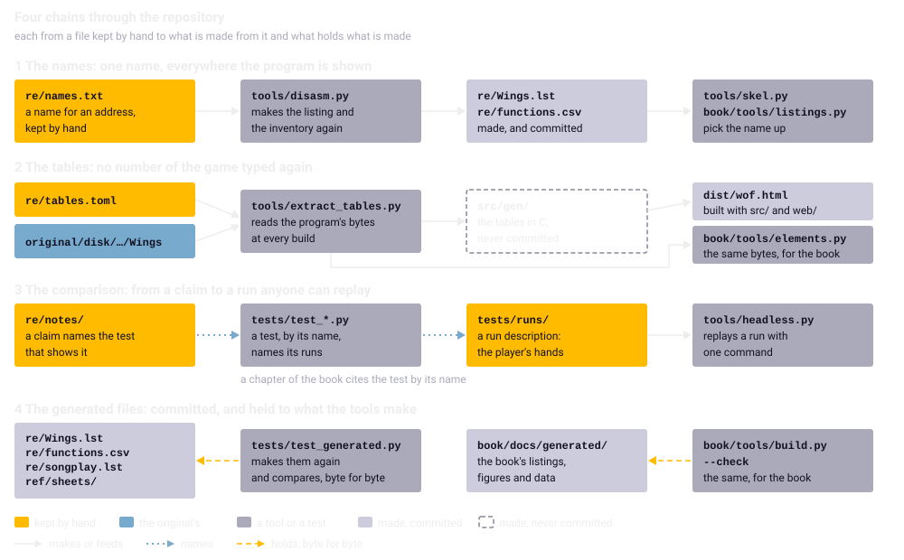

Chapter 21
{ .chapter-kicker }

# A tour of the repository

Everything the port is made of lies in one repository, all but the one file the reader brings: the project's files with the whole history of their changes, which anyone can copy, or clone, with git. By the end of this chapter you will know where each kind of thing lives, from the rules and the original to the port, its instruments and this book, and why it lives there. You will know the four chains that tie the parts together, where to start for what you want, and what the repository leaves out on purpose.

## The top level

A clone opens on nine directories and eight files; the files are the place to start.

[`README.md`](repo:README.md), by convention the file a reader of a repository opens first, is the door: what the port is, how to play, build and verify it, where things are, the idea of a template the method could become, and the licence. Its picture, [`ref/title.png`](repo:ref/title.png), is the title screen rendered by the port's [native library](../glossary.md#native-library) (chapter 5).

[`SPEC.md`](repo:SPEC.md), the specification, is the source of truth for the goals, the architecture, the porting rules and the milestones. Written for an engineer, human or AI, it is corrected wherever it turned out wrong, so that it says what is, not what was planned. Its first section holds the three-part definition of faithful that chapter 1 told: the same game state after every tick, the same pixels and palette, the same sound samples started at the same moments.

| Section | What it holds |
|---|---|
| [1, Goal](repo:SPEC.md#1-goal) | one HTML file, faithful defined, what is out of scope |
| [2, Repository](repo:SPEC.md#2-repository) | this layout, the pinned packages |
| [3, The original program](repo:SPEC.md#3-the-original-program) | the disk, the executable, how it runs, the formats |
| [4, Tools](repo:SPEC.md#4-tools) | the tools, the listing's conventions, the naming |
| [5, Build](repo:SPEC.md#5-build) | from the manifest to the page |
| [6, Architecture](repo:SPEC.md#6-architecture) | core, shell, picture and sound, what is not ported |
| [7, Porting rules](repo:SPEC.md#7-porting-rules) | arithmetic, data, determinism, working method |
| [8, Verification](repo:SPEC.md#8-verification) | each level of comparison and its method |
| [9, Milestones](repo:SPEC.md#9-milestones) | M0 to M10, deliverables and acceptance |
| [10, Points to establish](repo:SPEC.md#10-points-to-establish) | thirteen questions, each answered in a note |

[`CLAUDE.md`](repo:CLAUDE.md) holds the working rules every [session](../glossary.md#session) reads when it starts: the commands, the session protocol and the rules. It is short, under a thousand words, because every session pays to read it. Its protocol rests on the rule the whole layout serves: the repository is the [handover](../glossary.md#handover), and nothing may live only in a conversation (chapter 10). Here are the commands; look at how many of them make something again or check it, rather than build it:

```bash
--8<-- "generated/listings/text/claude-commands.txt"
```

The Python is always the project's own, from the environment `.venv` that the setup makes from the pins, so that every machine runs the same packages.

[`CONTROLLER.md`](repo:CONTROLLER.md) is the handbook of the [controller](../glossary.md#controller), the session that leads, published as it was used. Chapter 10 told it, from [what a task contains](repo:CONTROLLER.md#what-a-task-contains) to how [a report is reviewed](repo:CONTROLLER.md#reviewing-a-report); its last section lists [the pitfalls that cost time](repo:CONTROLLER.md#pitfalls-that-cost-time), each a lesson paid for once.

Two licences divide the rest. [`LICENSE`](repo:LICENSE), the GNU General Public License, version 3 or later, covers the code and the tools; [`LICENSE-CC-BY-SA-4.0`](repo:LICENSE-CC-BY-SA-4.0), Creative Commons Attribution-ShareAlike 4.0, covers the prose: the specification, the notes and this book. Both let anyone use and change what they cover, as long as a changed version is passed on under the same terms. The seven library lists under [`tools/fd/`](repo:tools/fd/) come from amitools under its own licence, as their origin file says. The game is under neither: the disk, its files, the manual's text, the two listings that reproduce the program's and the music player's code, the contact sheets and the game inside the page are its authors' and publisher's, kept for preservation, no right granted, and so are this book's figures of the game and its excerpts of the game's code. The [Kickstart](../glossary.md#kickstart) ROM image is in no file of the repository; the two small tables the build reads from it, the font and the key conversion, travel inside the page (chapter 3).

[`requirements.txt`](repo:requirements.txt) pins the port's seven Python packages to exact versions, the emulator Unicorn, the disassembly library Capstone and pytest among them. Even the compiler arrives so: zig, as a Python package, carries the C compiler that makes the WebAssembly core, so that nothing else need be installed for the page (chapter 25). [`.gitignore`](repo:.gitignore) names what never enters, from the ROM to the book's built site.

## The directories at a glance

| Directory | Files | What it holds | Size |
|---|---|---|---|
| [`original/`](repo:original/) | 78 | the disk image, its files, the manual | the image about 880 KB |
| [`re/`](repo:re/) | 37 | the listing, the names, the inventory, the manifest, the notes | the listing about 1.6 MB; the notes about 197,000 words |
| [`ref/`](repo:ref/) | 8 | contact sheets, the title picture | 8 pictures |
| [`src/`](repo:src/) | 41 | the core | about 19,400 lines of C |
| [`web/`](repo:web/) | 10 | the shell | about 2,400 lines of JavaScript, HTML and CSS |
| [`tools/`](repo:tools/) | 52 | the instruments | about 12,400 lines of Python and the setup script |
| [`tests/`](repo:tests/) | 101 | the suite | about 23,000 lines of Python, JavaScript and C |
| [`dist/`](repo:dist/) | 1 | the page | about 1.2 MB |
| [`book/`](repo:book/) | about 380 | this book | grows with each chapter |

The files are what `git ls-files` lists.

## original/: the ground truth

[`original/`](repo:original/) holds what the port is held to, and the rules forbid changing anything in it, so that every claim is checked against the same bytes: the disk image [`original/wof.adf`](repo:original/wof.adf), the disk's files extracted byte for byte under [`original/disk/`](repo:original/disk/), and the manual as text, [`original/manual.txt`](repo:original/manual.txt). The tools read the extracted files; the image is read only for the order in which the disk lists a directory (chapter 3). The build packs 55 of the game's files into the page. It leaves out ten: the program, whose tables it reads instead, and nine files not the game's. The manual, which says what the game is meant to do, is cited by its page numbers and never copied.

One file belongs here and is not in the repository: the ROM image, which whoever clones places as `kick.rom` in [`original/`](repo:original/), beside the disk image, where the build and the tools look for it. It is the Amiga's own system, sold under licence, and the project takes three things from it: the system font, the keyboard's conversion of a key into a character, and the floating point the flight model is held to. [`tools/rom.py`](repo:tools/rom.py) checks the ROM image by its checksum; without it the build stops and the suite skips, each saying where to get it.

## re/: the reading

[`re/`](repo:re/) holds what the project learnt by reading the program: files a tool makes, beside the files kept by hand they are made from.

The [listing](../glossary.md#listing), [`re/Wings.lst`](repo:re/Wings.lst), the program as annotated assembly, has 32,434 lines (chapter 4). The [disassembler](../glossary.md#disassembler), [`tools/disasm.py`](repo:tools/disasm.py), makes it, and nobody edits it: it is made again whenever a name changes, and a name typed into it would be gone the next time. So the names live apart, in [`re/names.txt`](repo:re/names.txt), one a line: an address in hexadecimal, a name and, after a semicolon, a comment. Here are its first lines:

```text
--8<-- "generated/listings/text/names-start.txt"
```

[`re/libbases.txt`](repo:re/libbases.txt), also kept by hand, names the five variables that hold a library's address, by which the tool names the system's calls.

The same pass of the tool writes the [routine inventory](../glossary.md#routine-inventory), [`re/functions.csv`](repo:re/functions.csv), a row for each of the program's 616 routines. Here are its column names and eight rows from `record_at` on:

```text
--8<-- "generated/listings/text/functions-rows.txt"
```

A row gives a routine's address, name and kind, its size, its frame, where its arguments lie above A5, its far-call slot, the count of its callers, the routines it calls, the system calls it makes, the count of its variables, its strings and its status. The status is the one column kept by hand; the tool carries it over every time and works out the rest again. A routine starts as `todo`; `replace` and `drop` record a decision about what the specification leaves out, such as the memory and the crack's screen, while most of what still says `todo` is the C library, the system's glue or code nothing calls, which needed no decision. Chapter 4 tells what each status means, chapter 10 counts them.

Beside them lies the [**manifest**](../glossary.md#manifest), [`re/tables.toml`](repo:re/tables.toml), the list of what the build reads out of the program, the music player and the ROM: 122 entries, each with a name, a kind and where to read (chapter 3). The music player has its own listing too, [`re/songplay.lst`](repo:re/songplay.lst), made by [`tools/disasm_player.py`](repo:tools/disasm%5Fplayer.py) with the names of [`re/songplay_names.txt`](repo:re/songplay%5Fnames.txt).

[`re/notes/`](repo:re/notes/) holds 29 notes, one Markdown file a subject. A later session starts from them instead of reading the listing again. Eighteen describe a part of the game, from its data to what is still open. Seven are [**porting notes**](../glossary.md#porting-note), each written for a [milestone](../glossary.md#milestone): what was ported, how it is held to the original, what stands in, each statement marked as observed, with the test or tool that shows it, or as read from the listing alone. They are the long ones, since those of M4 to M8 carry their completeness lists and, as appendices, their [reach maps](../glossary.md#reach-map) (chapter 8). One note describes the shell's picture, M9's, one an instrument, one the suite and one an idea. The last column names the chapter that tells the subject:

| Note | Subject | Words, about | Chapter |
|---|---|---|---|
| [`campaign.md`](repo:re/notes/campaign.md) | the campaign | 3,700 | 17 |
| [`demo.md`](repo:re/notes/demo.md) | the demo | 1,600 | 17 |
| [`display.md`](repo:re/notes/display.md) | the display | 3,500 | 11 |
| [`drawing.md`](repo:re/notes/drawing.md) | the drawing routines | 3,700 | 12 |
| [`enemy.md`](repo:re/notes/enemy.md) | the enemy | 4,500 | 16 |
| [`ffp.md`](repo:re/notes/ffp.md) | the floating point | 3,000 | 14 |
| [`frontend.md`](repo:re/notes/frontend.md) | the front end | 4,000 | 19 |
| [`highscore.md`](repo:re/notes/highscore.md) | the high-score file | 700 | 17 |
| [`input.md`](repo:re/notes/input.md) | input | 1,100 | 7 |
| [`keys.md`](repo:re/notes/keys.md) | the key commands | 3,200 | 19 |
| [`map.md`](repo:re/notes/map.md) | the maps | 2,400 | 13 |
| [`music.md`](repo:re/notes/music.md) | the music | 2,700 | 18 |
| [`objects.md`](repo:re/notes/objects.md) | the object system | 4,200 | 15 |
| [`passes.md`](repo:re/notes/passes.md) | passes and ticks | 2,500 | 7 |
| [`random.md`](repo:re/notes/random.md) | chance, the video rate | 600 | 6, 7 |
| [`shapes.md`](repo:re/notes/shapes.md) | shapes | 2,900 | 12 |
| [`sound.md`](repo:re/notes/sound.md) | the sound effects | 2,200 | 18 |
| [`system-font.md`](repo:re/notes/system-font.md) | the system font | 400 | 19 |
| [`porting-m1.md`](repo:re/notes/porting-m1.md) | M1, the loaders | 2,100 | 3, 12 |
| [`porting-m3.md`](repo:re/notes/porting-m3.md) | M3, the front end | 3,500 | 19 |
| [`porting-m4.md`](repo:re/notes/porting-m4.md) | M4, the world and the player | 27,500 | 8 |
| [`porting-m5.md`](repo:re/notes/porting-m5.md) | M5, the weapons | 22,800 | 15 |
| [`porting-m6.md`](repo:re/notes/porting-m6.md) | M6, the enemy | 34,200 | 16 |
| [`porting-m7.md`](repo:re/notes/porting-m7.md) | M7, the campaign | 33,500 | 17 |
| [`porting-m8.md`](repo:re/notes/porting-m8.md) | M8, the sound | 10,900 | 18 |
| [`page-video.md`](repo:re/notes/page-video.md) | M9, the picture on the GPU | 4,200 | 23 |
| [`headless.md`](repo:re/notes/headless.md) | the headless original | 7,600 | 6 |
| [`testing.md`](repo:re/notes/testing.md) | running the suite | 2,500 | 24 |
| [`amiga-to-web.md`](repo:re/notes/amiga-to-web.md) | a template | 1,300 | 10 |

## ref/: the artwork to look at

[`ref/sheets/`](repo:ref/sheets/) holds seven [contact sheets](../glossary.md#contact-sheet) of five containers, every shape with its name, made by [`tools/ppkc.py`](repo:tools/ppkc.py); two containers are laid out twice, on a grid and packed densely, the tallest first. They are committed so that a reader can look at the artwork without running anything, and the look of the front end's screens was checked partly against them by eye, since the headless original draws nothing.

## src/: the core

[`src/`](repo:src/) is the [core](../glossary.md#core), the game ported to C, compiled to [WebAssembly](../glossary.md#webassembly) for the page and to the native library for the tests: 35 C files, three headers and three registries. The files that port the game follow the stretches of related routines the specification calls the original's modules, their routines in the original's address order, so that a reader can move between the listing and the source; every ported routine carries a comment, `orig` and its address, the bridge between the two. The C files fall into four groups:

| Group | Files |
|---|---|
| the port's own scaffolding, a port of nothing | [`core.c`](repo:src/core.c) (the entry points, the saved states), [`rand.c`](repo:src/rand.c) (the stream of chance), [`trace.c`](repo:src/trace.c) (what the port did, for the tests) |
| the machine and its system, stood in for | [`mem.c`](repo:src/mem.c), [`fs.c`](repo:src/fs.c), [`gfx.c`](repo:src/gfx.c), [`screen.c`](repo:src/screen.c), [`video.c`](repo:src/video.c), [`audio.c`](repo:src/audio.c), [`ffp.c`](repo:src/ffp.c) |
| the game, ported | 23 files, from [`load.c`](repo:src/load.c) to [`music.c`](repo:src/music.c), among them [`input.c`](repo:src/input.c) (the sampling, a [VBlank](../glossary.md#vblank)'s controller state into a tick's input byte), [`front.c`](repo:src/front.c), [`world.c`](repo:src/world.c) (a pass), [`tick.c`](repo:src/tick.c) and [`player.c`](repo:src/player.c) |
| the port's own layers, decided with the owner | [`portkeys.c`](repo:src/portkeys.c) (the port's keys), [`assist.c`](repo:src/assist.c) (the keyboard assist) |

The registries, [`src/globals.def`](repo:src/globals.def), [`src/mission.def`](repo:src/mission.def) and [`src/records.def`](repo:src/records.def), list every variable, table and record layout the port took over, tied to the original's addresses and offsets, by which the tests copy state between the two games and compare it. [`src/wof.h`](repo:src/wof.h) is the core's interface. The game's numbers are not here, since hand-written sources hold code only (the game's tables, below). Chapter 22 opens the core.

## web/: the shell

[`web/`](repo:web/) is the [shell](../glossary.md#shell), plain JavaScript with no framework: the page's template [`web/index.html`](repo:web/index.html), its stylesheet, and eight modules, the clock, the core's wrapper, the input, the video, the audio in two, the diagnostics overlay and the entry point that joins them. A page opened from a file cannot load modules one by one, so the build joins them into the page with the core and the game's files. Chapter 23 tells the shell.

## tools/: the instruments

[`tools/`](repo:tools/) holds 43 Python tools, the setup script [`tools/setup.sh`](repo:tools/setup.sh), and in [`tools/fd/`](repo:tools/fd/) the system libraries' lists of routines by which the disassembler names the system's calls. By group, with a few of each:

| Group | Tools |
|---|---|
| the build | [`build.py`](repo:tools/build.py), [`extract_tables.py`](repo:tools/extract%5Ftables.py) |
| reading the program | [`disasm.py`](repo:tools/disasm.py), [`skel.py`](repo:tools/skel.py) and three more |
| the [oracle](../glossary.md#oracle) (chapter 5) | [`oracle.py`](repo:tools/oracle.py), [`m68k_fix.py`](repo:tools/m68k%5Ffix.py) |
| the headless original (chapter 6) | [`headless.py`](repo:tools/headless.py) and four more |
| observing and measuring | [`reach_observe.py`](repo:tools/reach%5Fobserve.py) and eight more |
| the missions' scripts (chapter 8) | an [autopilot](../glossary.md#autopilot) and its scripts for each of M4 to M7, such as [`m4_autopilot.py`](repo:tools/m4%5Fautopilot.py), and four more |
| the decoders | [`ppkc.py`](repo:tools/ppkc.py), [`map_decode.py`](repo:tools/map%5Fdecode.py) and three more |
| the checks | [`rom.py`](repo:tools/rom.py), [`mdcheck.py`](repo:tools/mdcheck.py), [`junit_compare.py`](repo:tools/junit%5Fcompare.py) |

The decoders serve the tools, the tests and this book; the core uses the game's own loaders, ported (chapter 3). Chapter 25 tells how to run the tools.

## tests/: the suite

[`tests/`](repo:tests/) is the suite, about 930 tests run by pytest, with the helpers they share and fourteen scripts in Node, which runs JavaScript outside a browser: the drivers of the core and of the two browsers, and their instruments. The modules by [layer](../glossary.md#layer-of-the-suite), as chapter 24 arranges them:

| Layer | Modules |
|---|---|
| one routine | [`test_oracle_m1.py`](repo:tests/test%5Foracle%5Fm1.py) and seven more |
| the original observed | [`test_headless.py`](repo:tests/test%5Fheadless.py), [`test_frontend.py`](repo:tests/test%5Ffrontend.py) and five more |
| the front end | [`test_front_port.py`](repo:tests/test%5Ffront%5Fport.py) |
| the missions | [`test_world.py`](repo:tests/test%5Fworld.py), [`test_enemy.py`](repo:tests/test%5Fenemy.py) and five more |
| the whole game replayed | [`test_replays.py`](repo:tests/test%5Freplays.py) |
| the core itself | [`test_core_native.py`](repo:tests/test%5Fcore%5Fnative.py), [`test_state_m4.py`](repo:tests/test%5Fstate%5Fm4.py) and six more |
| the page | [`test_page.py`](repo:tests/test%5Fpage.py), [`test_firefox.py`](repo:tests/test%5Ffirefox.py) |

[`tests/runs/`](repo:tests/runs/) holds 34 [run descriptions](../glossary.md#run-description), the player's hands VBlank by VBlank, with no game data in them, as no file written by hand has, so that they stand under the code's licence. [`tests/replays/demo_a.json`](repo:tests/replays/demo%5Fa.json) is a demo the port recorded, replayed in both forms of the core, native and WebAssembly. The native library is built from the same C and never committed, and [`tests/shim.c`](repo:tests/shim.c), the tests' way into the core's insides, is compiled into it and nothing else, so the page never carries it. Chapter 24 tells the suite.

## dist/: the page

[`dist/wof.html`](repo:dist/wof.html), the game, is the one committed page, so that a reader can play without building anything. A [worker](../glossary.md#worker) never commits it: the controller builds it again at every merge and commits that, so the committed page is always made from the committed sources. Built twice from the same sources, it is the same byte for byte and names no directory of the machine that made it, so anyone can build it again and compare.

## book/: this book

[`book/`](repo:book/) holds everything of this book and is the site's source, but for the page it embeds. Its handbook is [`book/BOOK.md`](repo:book/BOOK.md): the reader model, the outline, the style guide, the way of working. [`book/docs/`](repo:book/docs/) holds the chapters, the glossary, the hand-drawn diagrams and two interactive pages, the [shape browser](../browser.md) and the [map viewer](../maps.md); [`book/facts/`](repo:book/facts/) holds a fact sheet for each chapter written, every claim with its source. Beside them lie the site's configuration, the generators with their manifests, and the book's pins, [`book/requirements.txt`](repo:book/requirements.txt), pinned whole, the packages they pull in as well, so that every clone and every automatic build installs the same set.

The book's listings, figures and interactive data are generated from the real sources and committed, about 280 files under [`book/docs/generated/`](repo:book/docs/generated/), and the web font of its headings beside them in [`book/docs/fonts/`](repo:book/docs/fonts/), so that building the site needs only the book's packages: no ROM, no compiler, no browser.

## How the parts hang together

Four chains tie the parts together.



/// caption
The four chains, from what is kept by hand to what is made from it and what holds what is made; the comparison is a chain of references instead. Solid arrows make or feed, dotted arrows name, dashed arrows hold, byte for byte.
///

### The names

A name added to [`re/names.txt`](repo:re/names.txt) reaches every place the program is shown. The disassembler, started once, writes it in about two seconds into the listing and the inventory; from there it reaches every [control-flow skeleton](../glossary.md#control-flow-skeleton), and the headless original's reports read the names file and the inventory themselves. The code excerpts this book shows, its listings, pick it up at the next build, since they name a routine by its name in the inventory and fail on a name that no longer exists (chapter 4).

Follow `record_at` along the chain. Its line in the names file gives `01c982 record_at` and a comment; its row in the inventory stands in the excerpt above; its port in [`src/player.c`](repo:src/player.c) opens with `orig 0x01C982`; `test_the_map_helpers_match_the_original` in [`tests/test_oracle_m4.py`](repo:tests/test%5Foracle%5Fm4.py) holds it under the oracle on five maps; and chapter 3 shows its listing beside its C. The address is what keeps the hand-written places in step: it never changes, the `orig` comment carries it, and the notes name a routine by its name and its address, so that a renamed routine is still found. Only the generated places follow a rename by themselves.

### The game's tables

An entry of the manifest becomes a table, written as C at every build: [`tools/extract_tables.py`](repo:tools/extract%5Ftables.py) reads it from the bytes of the program, the music player or the ROM and turns the byte order around, so that no number of the game is typed again, and an address outside the program stops the build (chapter 3). The tables are a build product, made again every time and kept out so that the port's sources hold code only; the listing, by contrast, is the reading itself, committed so that a reader can browse it without the tools. The book reads the same bytes: its interactive pages take the [name lists](../glossary.md#name-list) and file names through the same manifest.

### The comparison

A claim in a note names the test that shows it; the test names the run descriptions it replays or the oracle's cases it runs; a run description replays with one command. Take the manual's Control-D, which chapter 20 told. [`re/notes/keys.md`](repo:re/notes/keys.md#in-flight-and-paused-ingame%5Fkeys-0x01ccf6) says it is not in the code and names `test_control_d_does_nothing_anywhere` in [`tests/test_frontend.py`](repo:tests/test%5Ffrontend.py). The test runs four pairs, in flight, paused, at the rank selection and in the briefing, each a run with the key and one without. Here is the run at the rank selection; look at the key on line 11, 34 with Control, D's code in decimal:

```json linenums="1"
--8<-- "generated/listings/json/rank-control-d.json"
```

`.venv/bin/python tools/headless.py run tests/runs/rank-control-d.json --out A.dump` runs it under the [headless original](../glossary.md#headless-original); the test compares the pair's final state, files log and schedule. A test's name says what it holds, so that a chapter can cite it by name, as this one does.

### The generated files

A [**generated file**](../glossary.md#generated-file) is one a tool makes from other files of the repository. The repository commits it, so that a reader sees it without running the tool, and holds it byte for byte to what the tool makes again, so that the reader need not trust it. [`tests/test_generated.py`](repo:tests/test%5Fgenerated.py) holds the listing, the inventory, the music player's listing and the contact sheets, none of which needs the ROM. Here is its first test; look at where it makes the files, a temporary directory, and at the byte comparison with the committed ones:

```python
--8<-- "generated/listings/py/test_the_listings_are_their_regeneration.py"
```

[`book/tools/build.py --check`](repo:book/tools/build.py) holds the book's generated files the same way. It also compares every colour of the site's stylesheet and hand-drawn diagrams, each commented with the palette entry of the game it was taken from, with that entry, and checks every link into the repository. No test holds the page byte for byte, since building it needs the ROM and a compiler, which a test of the repository cannot assume; its rebuilding at every merge holds it (above).

## Where to start

- **To play**, open [`dist/wof.html`](repo:dist/wof.html) in Chrome, Firefox or Safari, straight from the file; the keys are on its help screen.
- **To read the code**, open a file of [`src/`](repo:src/) with the listing beside it. `grep -rn "orig 0x01C982" src/` finds the port of the routine at that address, and [`tools/skel.py`](repo:tools/skel.py) shows a routine's shape before its detail.
- **To learn how a part of the game works**, find its chapter in the notes' table, then read the note.
- **To check a claim**, go from the note to the test it names, and from the test to the run it replays.
- **To change something**, read chapter 25, and the README's [Build and verify](repo:README.md#build-and-verify).
- **To read the history**, read the [commits](../glossary.md#commit-version-control), a few hundred, each opening with a line that says what changed, many going on to say how, and every one naming the model of the session that made it.

## What the repository leaves out

The rule of the handover shapes the layout: the names live in a file rather than in a session's memory, the tool carries the status column over, the notes are where the next session starts, and the generated files are committed and checked, each so that nothing lives only in a conversation. The same rule lets the sessions' transcripts stay out, since what the next reader needs is in the repository. The project's chronicle, its decisions, findings and mistakes with their dates, lives in the owner's archive beside those transcripts: too detailed for a release, it is this book's source for the order of events. What a build makes, from the tables and the native library to the book's built site, is made again from what is committed, and the local environment by the setup from the pins.

/// dev
Read [`re/functions.csv`](repo:re/functions.csv) with a CSV reader, since its strings hold commas, and the listing by an address range or a search, never whole.
///

## What comes next

The chapter in one sentence: the repository keeps the original, what was read from it, the port and its instruments side by side, and four chains hold them to each other. Chapter 22 opens [`src/`](repo:src/): the porting rules, the registered state, the arena, the file system and the interface the shell sees.

## Further reading

The files named here are in the repository, [`github.com/sy2002/wof-wasm`](repo:).

- [`README.md`](repo:README.md): ["Play"](repo:README.md#play), ["Build and verify"](repo:README.md#build-and-verify), ["Where things are"](repo:README.md#where-things-are) and ["Licence"](repo:README.md#licence).
- [`SPEC.md`](repo:SPEC.md), sections 2, ["Repository"](repo:SPEC.md#2-repository), and 4, ["Tools"](repo:SPEC.md#4-tools).
- [`CLAUDE.md`](repo:CLAUDE.md): ["Commands"](repo:CLAUDE.md#commands), ["Session protocol"](repo:CLAUDE.md#session-protocol) and ["Rules"](repo:CLAUDE.md#rules); [`CONTROLLER.md`](repo:CONTROLLER.md).
- [`book/BOOK.md`](repo:book/BOOK.md), sections 5, ["The site"](repo:book/BOOK.md#5-the-site), and 6, ["The way of working"](repo:book/BOOK.md#6-the-way-of-working).
- [`re/notes/`](repo:re/notes/), [`tests/runs/`](repo:tests/runs/) and [`tools/`](repo:tools/).

Outside the repository: Wikipedia's ["Git"](https://en.wikipedia.org/wiki/Git), for what a repository and a clone are; [MkDocs](https://www.mkdocs.org/), the site's engine.
