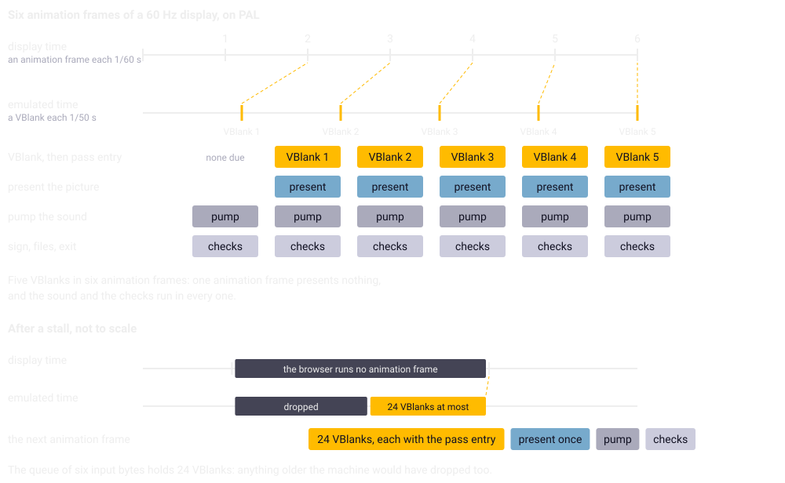
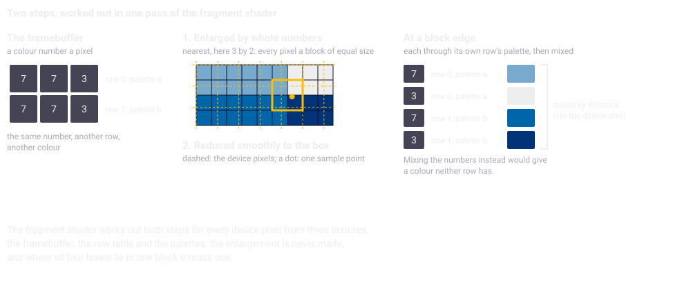

Chapter 23
{ .chapter-kicker }

# The shell

This chapter is the program on the other side of chapter 22's interface. By its end you will know what the [shell](../glossary.md#shell) is and why it knows nearly nothing of the game; how its clock makes VBlanks of a display's refreshes; how the picture reaches the screen in the machine's proportions; how the sound keeps flowing; which keys the shell keeps and what it stores; how the [help screen](../glossary.md#help-screen), the [pause sign](../glossary.md#pause-sign) and [fullscreen](../glossary.md#fullscreen-of-the-page) ([chapter 1](../part-1/faithful.md#what-the-shell-adds)) and a hidden page behave; and what the tests hold of it.

## A small program that knows no game

Chapter 1 called the shell a thin layer around the [core](../glossary.md#core): a clock, a screen, a loudspeaker, a keyboard and a place for saved games. It is plain JavaScript with no framework, eight modules, a template and a stylesheet in [`web/`](repo:web/).

The page opens with a double click and asks the network for nothing. A page opened from a file may not load a second file beside it, the browser giving it no origin to share, so the build joins seven modules into one script and removes the lines by which they would load each other; the eighth, which plays the sound, goes in as text (below). The core's [WebAssembly](../glossary.md#webassembly) and the game's files travel in the page as text the browser does not run, and the shell reads them back as bytes. The core gets everything through chapter 22's interface; a page may never wait, so its waits are [coroutines](../glossary.md#coroutine) that return.

Nearly nothing in the shell knows the game, along the line chapter 1 drew: the comparison with the original ends at the core's interface, so what is the browser's stays outside, where no test compares it and a change cannot alter what the game computes ([chapter 22](core.md#inside-the-state-and-outside-it)). Only its texts that name the game and the diagnostics lines that read the game's figures are this game's.

## The clock

The game counts its time in [VBlanks](../glossary.md#vblank); a browser offers [**animation frames**](../glossary.md#animation-frame): calls of a page's drawing routine just before the browser repaints, at the display's refresh rate, and in most browsers none while the page is hidden, when the shell stops its clock anyway. Chapter 7 gave the rule, 50 VBlanks a second on [PAL](../glossary.md#pal) whatever the display.

The clock keeps an [**accumulator**](../glossary.md#accumulator): a store of real time not yet turned into VBlanks. Every animation frame adds the time since the last; for every fiftieth of a second in the store the clock calls the core's VBlank entry, `wof_vblank`, with the joystick's state, then its pass entry, `wof_pass`, and takes the fiftieth off. If a VBlank ran, the shell then presents the picture, drawing it once onto the canvas, the page element that shows it. The game sees only [**emulated time**](../glossary.md#emulated-time), its own time in VBlanks.



/// caption
Six animation frames of a 60 Hz display on PAL: five VBlanks fall in them, so one animation frame in six presents nothing. After a stall, one animation frame makes up at most 24 VBlanks.
///

Here is one animation frame; look at the cap before the loop, `MAX_CATCHUP` VBlanks' worth, and at `video.present()`, called only if a VBlank was issued, while `pump` runs every time:

```js
--8<-- "generated/listings/js/frame.js"
```

The cap is for a stall, a while in which the page is on view but the browser does not run it. The game then jumps ahead by at most 24 VBlanks, what the [input queue](../glossary.md#input-queue)'s six [input bytes](../glossary.md#input-byte) of four VBlanks each cover on the machine (chapter 7); the rest of that time never happens for it, and the stall is counted.

After the VBlanks the picture is presented and the sound pumped; then, in a fixed order, the pause sign is shown or hidden, the [diagnostics overlay](../glossary.md#diagnostics-overlay) painted, the sound's start checked, the vertical flip remembered, the written files stored and, after them, the request to end the program read, so that what the game wrote is stored before a reload. A change of the video standard empties the accumulator and restarts the measured rates, which would otherwise straddle two standards.

/// figures
| The clock's figures, derived | |
|---|---|
| A refresh at 60 Hz | 16.7 ms |
| A VBlank on PAL | 20 ms |
///

## The picture

### The box

The video standard is one setting, PAL or NTSC, which sets the VBlank rate and the [**pixel aspect**](../glossary.md#pixel-aspect), how wide a pixel is shown against its height, together, as a machine has one or the other; PAL is the default (chapter 1). The core's picture, an [indexed framebuffer](../glossary.md#indexed-framebuffer) of 640 by 214, is made of [high-resolution](../glossary.md#high-resolution) pixels, half as wide as [low-resolution](../glossary.md#low-resolution) ones. A low-resolution pixel's proportion is the machine's as the specification states it on PAL, and on NTSC follows from 320 by 200 filling a screen of 4 : 3; square framebuffer pixels would give a strip three times as wide as high:

| Standard | A low-resolution pixel, width to height | The box |
|---|---|---|
| PAL | 16/15 | 1024 : 642 |
| NTSC | 5/6 | 800 : 642 |

The box is the largest of its ratio that fits the window, centred on black, worked out anew whenever the window or its screen changes. It is laid out in whole [**device pixels**](../glossary.md#device-pixel), the screen's own, not CSS pixels, the page's unit, which a Retina screen draws two device pixels wide; so the canvas holds exactly the device pixels it covers, and the browser resamples nothing a third time. Look at the canvas's size in device pixels against its style in CSS pixels, and at `kx` and `ky`, the smallest whole numbers whose enlargement covers the box:

```js
--8<-- "generated/listings/js/fit.js"
```

### Two steps

No pair of whole-number factors keeps the aspect at the size of any window, so the shell uses [**two-step scaling**](../glossary.md#two-step-scaling): an enlargement by whole numbers with nearest neighbour, which gives every framebuffer pixel exactly `kx` by `ky` pixels of the enlargement, a block of equal size, then a smooth reduction to the box, the one step that may fall between framebuffer pixels, and falls between large blocks. One smooth step would blur every framebuffer pixel; one nearest step would make some columns a device pixel wider than others.

/// figures
| The owner's screen in fullscreen, derived | |
|---|---|
| The box | 3,573 by 2,240 device pixels |
| `kx` and `ky` | 6 and 11 |
| The enlargement | 3,840 by 2,354 pixels, about nine million |
///

Before the WebGL renderer the shell did both steps in 2D canvases. Firefox draws those on the main processor, and the reduction writes every device pixel of the box on the main thread, which also runs the clock: at the owner's fullscreen the picture missed every other refresh. Chrome draws them on the graphics processor and was never slow.

### The WebGL renderer

So the main [**renderer**](../glossary.md#renderer), the shell's code that puts the picture on the canvas, is WebGL 1, the browsers' way to the graphics processor, with the 2D renderer as its fallback. It hands the graphics processor three textures, images it reads from: the framebuffer, at every present, straight from the core's memory; the palettes; and the row table, which names each row's [palette](../glossary.md#palette) (chapter 11), the last two only when they change.

A [**fragment shader**](../glossary.md#fragment-shader), the small program the graphics processor runs for every device pixel it draws, then does both steps at once. For each device pixel it finds where the reduction would sample the enlargement and the four texels, pixels of the enlargement, round that point. A texel belongs to the framebuffer pixel whose block it lies in, so the enlargement, up to nine megapixels, is never made. Where the four lie in one block, nearly everywhere, it reads one; at a block's edge it mixes two or four by the reduction's weights: the two-step picture, texel for texel.



/// caption
The two steps on blocks of two by three texels, an example smaller than the owner's six by eleven: the same colour number gives another colour in another row, so each texel takes its own row's palette before anything is mixed.
///

Colours are mixed, never colour numbers: each texel goes through its own row's palette first, so where two rows meet each keeps its palette; mixing the numbers would put a colour between them that neither row has. Look at `colour`, which turns a position into its row's palette entry, and at the `mix` calls, made only where the texels belong to different framebuffer pixels:

```c
--8<-- "generated/listings/js/fragment-shader.js"
```

The positions must be exact to the texel, so the shader demands high precision, and a browser without it gets the 2D renderer; and as a graphics processor's division of two whole numbers can come out just below the whole number, which rounding down would make one less, half a unit is added first. A WebGL imitated on the main processor, where there is no graphics processor to use, is refused, being four times slower there than the 2D renderer. A present costs one upload of 137 KB, two comparisons of the palettes and the row table with what was last sent, and one draw.

The porting note on the picture (further reading) measured each case for ten seconds in a visible window at 60 Hz on the shipped build, the 2D rows its fallback, which the previous build measured the same. Late is from 1.5 refreshes, 25 ms; `present()` is the main thread's time for one picture, so 17.62 ms is a whole refresh. Compare Firefox's rows at the fullscreen size; 420 by 320 is the smallest window the owner asked for.

| Browser | Renderer | Window, CSS pixels | Box, device pixels | Mean animation frame, ms | Late | `present()`, ms |
|---|---|---|---|---|---|---|
| Firefox | 2D | 1400 x 800 | 2552 x 1600 | 16.92 | 9 of 592 | 17.62 |
| Firefox | 2D | 1792 x 1120 | 3573 x 2240 | 33.39 | 235 of 300 | 32.96 |
| Firefox | WebGL | 1792 x 1120 | 3573 x 2240 | 16.67 | 0 of 601 | 0.32 |
| Firefox | WebGL | 420 x 320 | 840 x 527 | 16.67 | 0 of 600 | 0.33 |
| Chrome | 2D | 1792 x 1120 | 3573 x 2240 | 16.67 | 0 of 600 | 0.59 |
| Chrome | WebGL | 1792 x 1120 | 3573 x 2240 | 16.66 | 0 of 601 | 0.05 |

### When WebGL is not there

The 2D renderer takes over where WebGL is refused, where the shader fails or high precision is missing, where the context, a browser's handle on the graphics processor for one canvas, is lost and not given back within two seconds (a browser gives one back within an animation frame or two when it can), and on `?video=2d`, for the tests. A canvas that has given a WebGL context never gives a 2D one, so the shell puts a new canvas in its place. The 2D renderer's first canvas is drawn by the main processor, because in Firefox composited on the graphics processor an accelerated one can show a black picture. The page and the notes call the renderer in use the path; the diagnostics overlay names it, and the tests get it with the exact picture, which after scaling exists nowhere else (chapter 24).

## The sound

The core mixes [Paula](../glossary.md#paula)'s channels by emulated time (chapter 18); every animation frame the shell takes what its VBlanks mixed, as [**audio frames**](../glossary.md#audio-frame), instants of a value for the left and one for the right, and queues them behind what plays. The emulation's clock and the audio hardware's drift apart a little, so the queue is kept between two bounds: below the lower the hardware would run dry and the sound break off, so silence tops it up; above the upper the sound would trail the picture, so audio frames are dropped. Both are counted, and neither touches what the game computes, the mixed sound waiting outside the core's state ([chapter 22](core.md#inside-the-state-and-outside-it)).

/// figures
| The sound's queue | |
|---|---|
| Below this much queued, silence tops it up to 100 ms | 40 ms |
| Above this much queued, the core's audio frames are dropped | 300 ms |
///

The sound plays through an [**audio worklet**](../glossary.md#audio-worklet), a small program the browser runs on its audio thread, a second line of work beside the page's; it plays the blocks the page posts and reports how much it has played, by which the page paces itself. Being a second file the page may not load either, it goes to the browser as an address that holds its text. Where that fails, scheduled buffers carry the sound, as `?audio=buffers` asks for the tests. Look at the two bounds, `HIGH_SECONDS` and `LOW_SECONDS`:

```js
--8<-- "generated/listings/js/pumpWorklet.js"
```

A browser starts a page's sound only on a key or a click the person really made, and a modifier key alone does not count; so the shell waits for one that does, the help screen up until the sound runs. Safari keeps the keyboard in its address bar for a page opened from a file; there a click starts the sound.

The stereo width blends each side into the other: the Amiga's full width, each pair of channels hard to its side (chapter 18), or three narrower settings, stepped by key 7 while the diagnostics overlay is up, the full width first, and remembered.

## The keys

Chapter 19 told how the shell turns `KeyboardEvent.code`, the name of a key's place, into the Amiga's [raw key codes](../glossary.md#raw-key-code): by place, so that a German keyboard gives the same codes as an American one. The joystick goes another way, from the arrow keys or W, A, S and D and Space, by place too. Space is the one fire key, a decision of the owner: whichever hand steers, the other has Space. The fire key it had beside Space, `KeyZ`, left of X, was Z on an American keyboard and Y on a German one; without it no key in the help screen's list depends on the layout. A gamepad's mapping is fixed; options went with the dropped milestone M10 ([chapter 10](../part-1/making.md#the-milestones)).

A key of the stick or the button pressed and released between two VBlanks is held until the next, the shell's own latch, since the game samples a level and would never see it. It is not the game's [latch](../glossary.md#latch), which keeps a tap of the fire button until the next [input sample](../glossary.md#input-sample), nor the [keyboard assist](../glossary.md#keyboard-assist), which in the core lets a tap shorter than an input sample reach the [logic tick](../glossary.md#logic-tick) once (chapter 19).

A listener in the capture phase, which sees a key before any other, takes H, F, the Escape that leaves fullscreen and any key while the help screen is up, and the game never sees them; but where a name is typed, the shell asks the core whether the [line editor](../glossary.md#line-editor) is open and lets H and F through as letters. A key held with Control, Alt or Command is the browser's.

The key left of 1 opens the [**diagnostics overlay**](../glossary.md#diagnostics-overlay), the shell's panel of figures over the picture; the key arrives with one of two codes, by browser and keyboard, so both open it and neither reaches the game. Behind it lie the development keys, none of them the game's. The commands are chapter 1's table; these are the shell's:

| Key | What it does | Why so |
|---|---|---|
| arrows, or W, A, S, D; Space | the stick; fire, and choose | one hand steers, the other fires |
| H, F | the help screen, fullscreen | no reader of the game takes them outside the line editor |
| Escape | the game's pause; leaves fullscreen | the browser keeps the second role |
| left of 1, or right of the left Shift | the diagnostics overlay | the key arrives with two codes |
| 1; 2, 3; 4; 5, 6, 7 | a score of 5,000; the save or the load dialog; a demo's recording; PAL, NTSC, the stereo width | behind the diagnostics overlay, so that a digit typed into a name never goes to the shell |

## What the shell stores

What the game writes, the [high-score file](../glossary.md#high-score-file) and the saved games, goes into the core's [overlay](../glossary.md#overlay-of-the-file-system) of written files, and the shell keeps them in the browser's `localStorage`, text under storage keys from one visit to the next, which for a page opened from a file the standard leaves to the browser; Chrome and Firefox keep it, as the tests hold through a reload (chapter 24). The files are stored as one list whenever the core's count of writes moves, because their order is part of the order the [load and save dialog](../glossary.md#load-and-save-dialog) lists them in (chapters 19 and 20), and put back in that order before the next start's first VBlank. The shell puts back a file of up to 12,412 bytes, the largest the core's overlay takes (chapter 22), so every saved game comes back. The demo recorded for the [attract demo](../glossary.md#attract-demo) and its [seed file](../glossary.md#seed-file) are written files too.

| Storage key | What it holds |
|---|---|
| `wof:files` | the written files, each a name and its bytes in base64 |
| `wof:invertVertical` | the [vertical flip](../glossary.md#vertical-flip) |
| `wof:stereoWidth` | the stereo width, 1, 0.75, 0.5 or 0.25 of the Amiga's |

The video standard is not stored: the page always starts on PAL.

The dialog's Exit Game ends the program on the machine. A page has nothing to end into, so here it reloads the page, a decision of the owner, and the game starts again at the [story scroller](../glossary.md#story-scroller). The high scores and the saved games stay in the browser's storage, and the saved games come back; a game not saved is lost, as on the Amiga.

## Over the picture

Nothing covers the picture for good. Four layers can lie over it, bottom to top:

| Layer | When it shows | The keys it takes |
|---|---|---|
| the picture | always | the game's |
| the pause sign | while a mission is paused, the help screen down | none; P continues through the game |
| the help screen | at the start, and on H | every key while it is up |
| the diagnostics overlay | on the key left of 1 | the development keys |
| the key hint, a line at the foot | with the diagnostics overlay | none |

The help screen is up when the page opens, in place of a prompt for sound; its last line says that any key starts the sound and the game. That key does nothing else: the owner decided so after a first press of F had both started the sound and entered fullscreen. The screen goes only when the sound really runs, its last line being a promise about the sound; then H brings it back and any key takes it away. Here is its list; look at the conditions, marked and shown in a lighter grey, and at the two closing lines, the first shown at the start, the second later:

```text
--8<-- "generated/listings/text/help-keys.txt"
```

Its sheet is sized from the picture's height and shrunk until it fits even the smallest window the owner asked for, 420 by 320 CSS pixels. Over a running mission it asks for the pause and, closing, continues the mission, a decision of the owner; a pause it did not ask for stays. Outside a mission the game runs on beneath it.

The pause sign, `PAUSED` and, smaller, `Press P to continue`, is centred on the picture, its big line 6 percent of the picture's height, so it covers the same small part at any size. It shows the core's own pause, read once an animation frame, so it comes up whatever asked for the pause: P, Escape, fullscreen left, or an [absence](../glossary.md#absence-of-the-page) (below). Outside a mission it never shows; under the help screen it hides, so the sheet does not stand on it.

The diagnostics overlay lets the page's workings be read rather than guessed:

| Lines | What they show |
|---|---|
| the clock | VBlanks, ticks and calls of the pass entry a second; the stalls |
| the picture | the box, the factors, the renderer, a present's cost |
| the sound | the queue, the audio frames padded and dropped, the width |
| the page and the game | fullscreen, how often hidden; the arena, the written files; the player, the pause, the flip |

## Fullscreen and the hidden page

F asks for the page's own fullscreen, on the whole page so that every layer stays in it, while the key is handled, because a browser grants fullscreen only to a gesture; F in it leaves. In it no mouse cursor shows, a wish of the owner, since there is nothing to click.

Escape is both the game's pause and the browser's way out of fullscreen, which the user always keeps. So the shell keeps a [**leave rule**](../glossary.md#leave-rule): whenever fullscreen is left, it asks the core for the pause, a request and not a toggle, so that Escape always pauses. The browser's own fullscreen, from the window's button, the shell sees only through a query the browser answers, `display-mode: fullscreen`. Lest the Escape that leaves fullscreen also reach the game and continue what the rule paused, the shell drops it, and one arriving within half a second after, for a browser that hands the key over late.

A hidden page gets no animation frames, so its clock stops, and the shell suspends the sound. An [**absence**](../glossary.md#absence-of-the-page), the page hidden for a second or more, brings a mission back paused, with its sign, and P continues; a page hidden for a few milliseconds, as a window's change of state hides it, is none. The owner found why that matters, in Firefox put into fullscreen during a mission: the picture stood still and the sound was gone for good. The shell had asked for the pause on the way out, so a page hidden for milliseconds came back paused for an absence the player never made; and it resumed the sound only once the browser reported it suspended, so when the suspend landed after the page was back, the resume never came. Now the pause is asked for on the way back, after an absence of a second or more, which reaches the same [pass](../glossary.md#pass), as no VBlank runs meanwhile; and the sound resumes on the shell's own record of having suspended it, which the browser carries out in order, so it always ends running. Look at the way out and the way back:

```js
--8<-- "generated/listings/js/visibility.js"
```

## What the tests hold, and what only eyes can

The page tests drive the page in Chrome and Firefox and hold its picture to the pixel against a screenshot, on both renderers, in a visible window and under a true scale factor, two device pixels to a CSS pixel as on a Retina screen; the rate of its animation frames at a screen's size; its clock, pause and sound through a moment hidden, an absence and fullscreen. They run apart from the rest of the suite, whose load would disturb what they measure. They cannot hold the real fullscreen, which macOS gives a window only on an unlocked screen, the smoothness of scrolling as a person sees it, or another display: the owner's look in real fullscreen does.

/// dev
[`web/video.js`](repo:web/video.js) gives the tests `window.__wofVideo`: the path, the exact picture (`picture()`) and the canvas read back (`readDisplay()`). Firefox draws 2D canvases with the Skia library. The worklet goes as a `data:` address from a page opened from a file, where Chrome refuses a Blob URL, and as a Blob URL elsewhere ([`web/audio.js`](repo:web/audio.js)). The sound starts in the gesture's own task, before the activation lapses; the shell asks `navigator.userActivation` where it exists, and otherwise ignores modifiers, dead keys and keys held with a modifier. Chrome and Safari on a Mac with an ISO keyboard report the key left of 1 as `IntlBackslash` and the key right of the left Shift as `Backquote`, a swap Firefox undoes. The help screen's text is 3.6 percent of the picture's height, at least 13 CSS pixels, its sheet at most 92 percent of the picture each way. The shader's positions reach 3,840 texels at the owner's fullscreen.
///

## What comes next

The chapter in one sentence: the shell is a small program that knows nothing of the game, keeps the game's time in VBlanks whatever the display does, puts its picture on the graphics processor in the machine's proportions, keeps its sound between two bounds, and takes a few keys of its own and the moments a browser imposes. Chapter 24 tells the tests: their layers, their two phases and the page under a true scale factor.

## Further reading

The files named here are in the repository, [`github.com/sy2002/wof-wasm`](repo:).

- [`SPEC.md`](repo:SPEC.md#62-shell), section 6.2, "Shell"; [6.5, "Audio model"](repo:SPEC.md#65-audio-model), its second paragraph; [5, "Build"](repo:SPEC.md#5-build), step 4.
- [`re/notes/page-video.md`](repo:re/notes/page-video.md), the porting note on the picture: ["Before: the two-step 2D path"](repo:re/notes/page-video.md#before-the-two-step-2d-path), ["The WebGL path"](repo:re/notes/page-video.md#the-webgl-path), ["The fallback, and the query"](repo:re/notes/page-video.md#the-fallback-and-the-query) and ["After"](repo:re/notes/page-video.md#after).
- [`re/notes/porting-m8.md`](repo:re/notes/porting-m8.md): ["The page and the fullscreen finding"](repo:re/notes/porting-m8.md#the-page-and-the-fullscreen-finding), ["The pause sign"](repo:re/notes/porting-m8.md#the-pause-sign) and ["The help screen"](repo:re/notes/porting-m8.md#the-help-screen); [`re/notes/porting-m3.md`](repo:re/notes/porting-m3.md#the-shells-key-map), "The shell's key map".
- [`web/clock.js`](repo:web/clock.js), [`web/video.js`](repo:web/video.js), [`web/audio.js`](repo:web/audio.js), [`web/input.js`](repo:web/input.js), [`web/main.js`](repo:web/main.js) and [`web/index.html`](repo:web/index.html).

Outside the repository: MDN's ["Window: requestAnimationFrame() method"](https://developer.mozilla.org/en-US/docs/Web/API/Window/requestAnimationFrame), ["AudioWorklet"](https://developer.mozilla.org/en-US/docs/Web/API/AudioWorklet) and ["Fullscreen API"](https://developer.mozilla.org/en-US/docs/Web/API/Fullscreen%5FAPI); Glenn Fiedler's ["Fix Your Timestep!"](https://gafferongames.com/post/fix%5Fyour%5Ftimestep/), the accumulator's technique.
