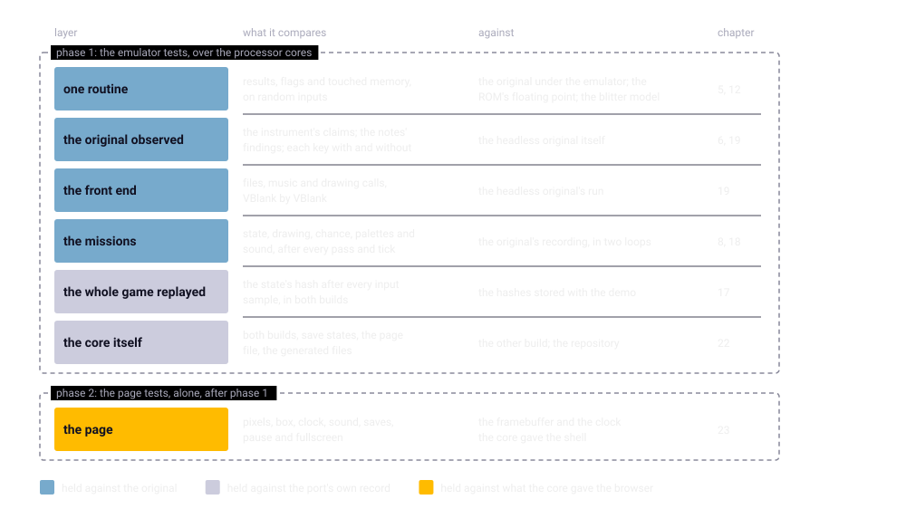
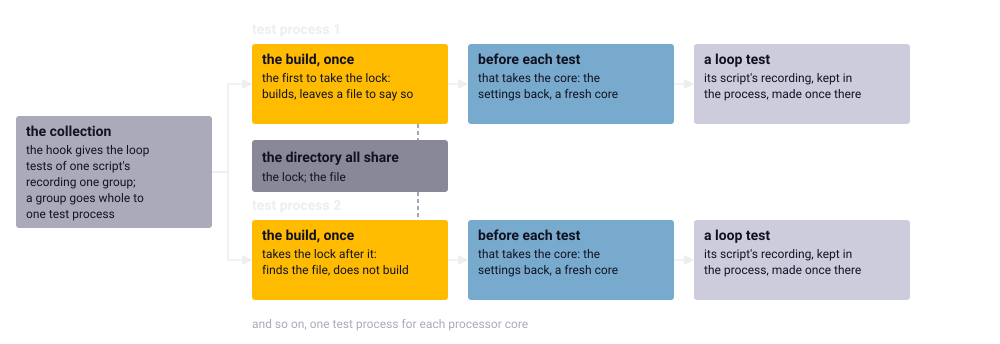

Chapter 24
{ .chapter-kicker }

# The tests

Since chapter 1 this book has cited tests, many by name; this chapter shows their suite whole. By its end you will know its seven layers, from one routine of the game to the finished page in two browsers, each with what it compares and against what; the machinery that lets a run of the suite give the same answers however its tests are spread over a machine; why the suite runs in two phases, and how one run of it is held to another; and what a green run proves, and what it leaves to the eye and the ear.

## Seven layers

The suite is about 930 tests under [`tests/`](repo:tests/), run by pytest, Python's framework for tests. We arrange them here in seven [**layers**](../glossary.md#layer-of-the-suite), groups of tests that each hold the port at one scale against one reference, because a fault is best caught at the smallest scale that can see it, where its failure says the most: a routine and an input under the [oracle](../glossary.md#oracle), a pass in the [open loop](../glossary.md#open-loop), a fault of the picture only in a browser.

| Layer | What it compares | Against | Told in |
|---|---|---|---|
| one routine | results, flags and touched memory, on random inputs | the original under the emulator; the ROM's floating point; the blitter model | 5, 12 |
| the original observed | the instrument's claims; the notes' findings; a key's effect | the headless original itself | 6, 19 |
| the front end | files, music and drawing calls, VBlank by VBlank | the headless original's run | 19 |
| the missions | state, drawing, chance, palettes and sound, every pass and tick | a recording of the original | 8, 18 |
| the whole game replayed | the state's hash after every input sample | hashes stored with a demo | 17 |
| the core itself | its two builds, save states, the page file, the generated files | itself and the repository | 22 |
| the page | requests, pixels, box, clock, sound, saves, pause, fullscreen | what the core gave it | 23 |

The layers follow the specification's [levels of verification](repo:SPEC.md#8-verification) where tests exist, the drawing within the routine's layer and the sound within the missions' and the front end's; the picture's level is not made as such, the [replay](../glossary.md#replay)'s hashes covering the display memory (chapter 22), and the core itself is added. Chapter 21 grouped the same modules by what each is about; here they stand by what each compares.



/// caption
The seven layers and the two [phases](../glossary.md#phase-of-the-suite) they run in. A phase is a way of running the suite, not a layer: the first six layers run together over the processor cores, the page alone after them.
///

## One routine

Eight modules, one for each milestone that ported [pure routines](../glossary.md#pure-routine) and one for the floating point, hold the routines one at a time by chapter 5's [differential tests](../glossary.md#differential-test): the original's code under the emulator and the port's C in the [native library](../glossary.md#native-library) on the same random inputs, compared in their results, from M3 on in the memory either side touched, from M4 on in the flags. The later modules also assert that their cases ran the code no mission script reaches. The floating point is held to the ROM's library in three builds, native, as WebAssembly and under a checker of undefined behaviour; the blit through its [register programme](../glossary.md#register-programme), replayed by chapter 12's model of the [blitter](../glossary.md#blitter).

## The original observed

Seven modules hold the [headless original](../glossary.md#headless-original) to what it claims and observe the notes' findings under it, two of them holding the port's sound as well. Two runs of one [run description](../glossary.md#run-description) give the same [dump](../glossary.md#dump); an [observer](../glossary.md#observer) changes no step; the model of [Paula](../glossary.md#paula) changes no step of a run in which nothing sounds. A run description of [`tests/runs/`](repo:tests/runs/) that presses a key is compared with one that does not, the pair's baseline, so that whatever differs belongs to the key.

## The front end and the missions

One module replays the [front end](../glossary.md#front-end): the headless original's [schedule](../glossary.md#schedule) of the title sequence and the menus goes through the port VBlank by VBlank, the fades taking no time, since the [harness](../glossary.md#harness)'s contain no wait and the port's are a setting (chapter 7), and every file opened, call of the music and drawing call must come at the same VBlank. The music is held the same way through the outer loop, on and switched off, by a module counted with the original's own tests.

Seven modules fly the missions. Each [mission script](../glossary.md#mission-script) is first made into a [**recording**](../glossary.md#recording-of-a-script): the script run once under the headless original with a dump after every pass and tick, observers on the drawing routines, the reads of the [entropy stream](../glossary.md#entropy-stream) and the addresses each tick wrote. The port replays it in chapter 8's two loops, the open and the [closed](../glossary.md#closed-loop), comparing after every pass and tick what chapter 8 listed, with the [completeness lists](../glossary.md#completeness-list), every map's setup and the tables' capacities beside them. A recording is the costliest thing the suite makes, one mission's 38 seconds in chapter 6, and all the tests of its script share it.

## The whole game, replayed

One module plays back a demo the port recorded, chapter 17's, kept in [`tests/replays/`](repo:tests/replays/) with its [seed file](../glossary.md#seed-file), the schedule of its playback and a hash of the whole [save state](../glossary.md#save-state) after every [input sample](../glossary.md#input-sample): from the program's start, through the front end and the idle rank selection, into the [attract demo](../glossary.md#attract-demo)'s playback of a short recorded flight. Played in the native library and in Node's [WebAssembly](../glossary.md#webassembly), it must give the stored hashes in both: the whole program from its start into a mission, and the page's own build held where the loops and the oracles run natively. The state holds the display memory (chapter 22), so a change in what is drawn changes the hashes; but they are the port's own record, never compared with the original.

## The core itself

Eight modules test the port as a program, held to its own rules, since the original has nothing to compare them with. Two hold the [core](../glossary.md#core)'s two builds to each other: four VBlanks a tick, as many audio frames as the emulated time lasts, the same picture, a WebAssembly that imports nothing; a state saved in one core loads into a second, and a foreign one is refused. A third continues states saved inside a mission in a new core on another seed (chapter 22). The rest hold the page file, which asks the network for nothing, the [generated files](../glossary.md#generated-file), the ROM check's messages, the [keyboard assist](../glossary.md#keyboard-assist)'s rules and the tests' own isolation.

## The page

Two modules open the finished page from a `file://` address, as a double click opens it, in Chrome and Firefox without a window, headless. A program in Node drives each browser through its remote control, Chrome's DevTools protocol and Firefox's WebDriver BiDi, a W3C specification still in draft, over the WebSocket Node has built in, so that nothing need be installed. Keys are pressed through the driver, never dispatched from a script in the page, since a scripted event activates nothing and a page not activated may not start its sound (chapter 23). The browsers are muted from outside, because the owner works at the same computer (chapter 10), and from outside so that the page's sound still flows to be measured.

A driver drives its browser once and prints what it measured; the tests in Python judge it, reading the geometry off the page's layout, never from the [shell](../glossary.md#shell)'s word, so that the shell cannot vouch for its own mistakes. The exact picture the shell hands them is the framebuffer through each row's palette, unscaled (chapter 23), where the canvas holds it enlarged and reduced. What the drivers hold:

| Area | What is held |
|---|---|
| the file | it loads only itself; the console shows no error |
| the picture | the box in the machine's proportions, in both standards and after resizes; the canvas and a screenshot against the exact picture, on both [renderers](../glossary.md#renderer) |
| the clock | 50 VBlanks a second within 2 on PAL, 60 on NTSC |
| the sound | nothing built before an activating key; music and effects arriving as [audio frames](../glossary.md#audio-frame) that are not silent |
| the game | the stick's keys; a mission flown from the keyboard; the enemy's fighter found in the sky by its frames' pixels, since no colour alone told it apart |
| the storage | a game saved and loaded after a reload; the demo recorded, reloaded and played as recorded |
| the shell's own | the help screen, the pause sign, a moment hidden, an [absence](../glossary.md#absence-of-the-page), fullscreen |

### Under a true scale factor

Only a screenshot shows what the browser did after the shell was finished. Chrome can pretend a screen's density through its protocol. It then places the canvas on whole CSS pixels, and where the box's edge falls on half a CSS pixel the picture is shifted by a [device pixel](../glossary.md#device-pixel) or resampled once more, an artefact that would hide a real fault. So the scale factor, two device pixels to a CSS pixel as on a Retina screen, is given on Chrome's command line, where Chrome behaves as on a real display, and the window puts the box's edge on half a CSS pixel, the case the pretence gets wrong.

Three questions are asked of a screenshot that no few sample points could answer. Every pixel: at the centre of the block each framebuffer pixel is shown as, the screenshot must carry its colour. Where the picture lies: its position, fitted from its own colour edges to a fraction of a device pixel, must be the box the page reports. Whether the edges are hard: between two neighbouring blocks' centres, at most one device pixel may be of neither colour, where one smooth step would smear the edge over most of a block. Here is the first; look at lines 6 and 7, which find the screenshot's pixel at the centre of every block, and at the last line, which keeps the worst colour channel, allowed 2 in 255 and found at 0:

```python linenums="1"
--8<-- "generated/listings/py/whole_picture_differences.py"
```

The three hold only where a framebuffer pixel is at least three device pixels each way, and refuse below that rather than pass, for there a block's centre carries its neighbours. At a scale factor of 2 a window of 1280 by 900 CSS pixels gives four across and seven and a half down; at ordinary density the window must be large, as the headless Firefox runs make it.

### The frame time and the visible window

The frame-time test walks the page into a mission at a screen's size and times every [animation frame](../glossary.md#animation-frame) for five seconds. It demands a mean interval of at most 1.05 refreshes, at most five late frames, `present()` at most a millisecond on average, and the WebGL renderer. It measures the refresh first, on a blank page, since a page missing every other refresh would otherwise judge itself by twice the refresh. What it reads, the overlay's player line, the canvas and `present()`, every build of the shell offered, so it can measure the previous build too, which lacks the WebGL renderer and so must fail: a test that has never failed may be unable to (chapter 8). In a visible Firefox it fails on the frames, the present and the renderer alike ([chapter 23's table](shell.md#the-webgl-renderer)).

The visible window is a mode of the Firefox module switched on by hand, nineteen tests that open a real window, run alone. It is the one check that can see a canvas fault of the graphics processor: headless Firefox composites, puts the page's layers together into the screen's picture, in software, and the fault that once gave Firefox a black picture happens only on the graphics processor. The window must stay in front and uncovered, because a covered window stops the page's clock, so it runs while the owner is away; and on a locked screen macOS moves no window into fullscreen, so its fullscreen check skips, and the small-window check behind it with it.

## What makes a run hold

Each module, one Python file of tests, shares what [`tests/conftest.py`](repo:tests/conftest.py) holds: the options, the build, the core reached through ctypes, Python's way of calling C, and the [fixtures](../glossary.md#fixture) that keep the tests apart. pytest first collects the tests, listing all of them before any runs, and calls functions of the suite at fixed points, its hooks; the collection hook runs once the list is made, no kin of chapter 5's hook in the emulator.

### Built once

The suite builds the port itself, from the sources as they stand. pytest-xdist, a plugin, spreads the tests over [**test processes**](../glossary.md#test-process): processes of their own, each running a share of the tests with its own copy of the core. Each would build, and the build writes the native library in place, where a process that has it loaded while another rewrites it can crash or read a torn file. So the first test process to take a lock in the directory they share builds and leaves a file to say so, and the others find it and build nothing. The code calls a test process a worker, pytest-xdist's word; look at the lock on line 14 and at `needed()`, asked while it is held, which asks whether that file is still missing:

```python linenums="1"
--8<-- "generated/listings/py/once_per_run.py"
```

A [control](../glossary.md#control) of chapter 8, built from a changed copy of the sources into a library of its own, points the suite at that library, which it loads beside the build there is, building nothing.

### A fresh core for every test

A process holds one copy of the core, and chapter 9 told how a test that left it changed broke the next. So every test that takes the core starts from a [**fresh core**](../glossary.md#fresh-core): the core reset to its start and what lives beside its state put back, for about two thirds of the suite, at under five thousandths of a second each. The initialisation resets the state and two things beside it; the rest a test sets from outside:

| Beside the core's state | Put back by |
|---|---|
| the VBlanks of a fade step and of a pass | the values read at the process's first test that takes the core |
| the [callbacks](../glossary.md#callback) into the test at a tick, a pass and the setup's end | clearing them, and every replay as it ends |
| the [pokes](../glossary.md#poke), the map list's addresses | clearing them, and every replay as it ends |
| the [stand-ins](../glossary.md#stand-in) reached, the trace, the tests' copies of the state | clearing them |
| the sound event log, the files written | the core's own initialisation |
| the audio output rate | nothing: every test that renders names its rate |

This is the settings' half of chapter 9's `fresh_core`, which calls it; look at line 29, which reads the two settings at the process's first such test, and at lines 30 to 38, which run before every one:

```python linenums="1"
--8<-- "generated/listings/py/fresh_settings.py"
```

So the start is rebuilt before every test, and a replay also clears what it set when it ends, even by an exception. [`tests/test_isolation.py`](repo:tests/test%5Fisolation.py) sets every item of the instrumentation, resets, and looks for each, every assertion naming what would have outlived its test:

```python linenums="1"
--8<-- "generated/listings/py/isolation_after_reset.py"
```

The rest the test processes share, the files, the caches, the core and the browsers, was audited by hand, item by item ([`re/notes/testing.md`](repo:re/notes/testing.md#shared-state-audited)).

### Recordings made once

A recording is kept in the test process that made it, under its script, the VBlanks of a pass and its pokes, for every later test that needs it. Spread over test processes, each process that ran one of a script's tests would record it again; so the collection hook gives the loop tests one group per script and pass rate, and pytest-xdist sends a group whole to one test process. The group is a [**marker**](../glossary.md#marker-of-a-test): a label pytest attaches to a test, by which a run selects, skips or groups it. Look at lines 4 to 7; the rest of the hook comes back in the next section:

```python linenums="1"
--8<-- "generated/listings/py/pytest_collection_modifyitems.py"
```

Measured with eight test processes:

| Tests sent | Recordings made in more than one process | Processor time spent on the repeats |
|---|---|---|
| any test to any free process | 60 | 4,225 s |
| a script's tests as one group | 35 | 1,165 s |

What is still made twice belongs mostly to the completeness tests, which use every script of a milestone and so belong to no one group. The headless original's limits on the wall clock, which only ever end a recording (chapter 6), were set from times measured with the suite in parallel.



/// caption
A test process's life: the build once for all, a fresh core before every test that takes one, and a recording made once and kept for its group.
///

## Two phases

The page tests measure time and pictures, the clock, the start of the sound and what a browser really shows, and load from outside the browser disturbs all three: seven page tests once failed while another program used more than a processor core, and passed on a quiet machine. The emulator tests, so named because most run the headless original under its emulator, keep every processor core busy. So the suite runs in two [**phases**](../glossary.md#phase-of-the-suite), one after the other and never side by side, which are not chapter 7's phases of a write: the emulator phase over the processor cores, then the page phase alone.

The suite registers three markers. `page` marks the two browser modules, and `-m 'not page'` and `-m page` split the suite between the phases. `slow` marks about fifty of the longest differential runs, run only with `--slow`. `without_rom` marks the four tests that need no ROM; without it, the hook above skips every other test with the ROM check's one message as its reason, and nothing is built.

The emulator phase runs eight test processes, one for each of the machine's processor cores, with `--dist loadgroup` to keep the groups. The times below, all with `--slow`, were measured on an earlier suite of 827 tests, the serial row with its page tests:

| Run | Test processes | Wall time, h:mm | Processor time, hours | Result |
|---|---|---|---|---|
| the whole suite, serially | 1 | 3:00 | 3.0, one process | 812 passed, 15 skipped |
| the emulator phase, machine idle | 8 | 0:51 | 5.7 | 736 passed, 2 skipped |
| the emulator phase, the owner at work | 12 | 1:11 | 10.7 | 734 passed, 2 failed |
| the emulator phase, the owner at work | 6 | 1:36 | 7.6 | 736 passed, 2 skipped |

Eight take about twice what the same tests take serially: a processor core runs slower when all are busy, and the recordings made twice add the rest. Twelve share processor cores, and their two failures were a recording past the limit of a whole recording as it then stood, ten minutes, since raised to half an hour; six leave processor cores idle. Both ran with the owner at work, so their times are upper bounds.

The serial run, every test in one process, was the first [**reference run**](../glossary.md#reference-run), the run another is held to by its [**outcome set**](../glossary.md#outcome-set): every test by its id, its module, name and parameters, with its outcome, passed, failed, an error, a test that could not run, or skipped with its reason. Held to it, a parallel run shows that splitting the suite lost no test and ran none twice, and that no outcome depends on the order or the process a test ran in, which is how chapter 9's shared core came to light. pytest writes the outcome set into a junit file, an XML report; [`tools/junit_compare.py`](repo:tools/junit%5Fcompare.py) reads the first file as one set and the others together as the other, prints every test only one side has and every outcome that differs, and fails on any. Look at line 8, which drops what pytest-xdist appends to a grouped test's id, the group, which says where the test ran, not what it is:

```python linenums="1"
--8<-- "generated/listings/py/outcomes.py"
```

## One run, counted

The release's run, and a fresh clone's, the ROM copied in and the setup script run, its emulator phase on half the machine's processor cores, since the owner was at work:

| Run | Test processes | Emulator phase | Page phase |
|---|---|---|---|
| the release, with `--slow` | 8 | 804 passed, 3 skipped, in 1:01 | 103 passed, 20 skipped, in 0:23 |
| a fresh clone, without `--slow` | 4 | 752 passed, 55 skipped, in 0:56 | 103 passed, 20 skipped, in 0:22 |

The slow tests, the fuel script, the runs at other pass rates and the campaign's chains among them, ran only in the release's run, which so held the loops over every script. Its three skips are two long runs of the headless original and the stored replay's recorder, run only when asked for; the twenty are the visible window's nineteen tests and a lost WebGL context tried on the 2D renderer, which has none to lose. The visible window, run alone, skipped only its fullscreen check and the small-window check behind it. The clone built the page byte for byte the same. Held to the older serial reference, no test's outcome differed; the tests on one side only were those added since, the key layer's cases renumbered and a few page tests split by renderer, so the two-phase run became the reference.

The last table is counted at the book's build from pytest's collection, so that it is never stale; the oracle's and the missions' layers are the largest:

--8<-- "generated/tables/suite-layers.md"

## What a green run proves

A green run here is both phases with `--slow`, as the release's was, the visible window run by hand beside them; the clone's run without `--slow` proves less. It says that after every logic tick and every pass of every mission script, in both loops, on every map the scripts reach, through the campaign's chain, the saved games and the demo, the port's state, drawing calls, draws of chance, palettes and sound events are the original's, and every address the original writes in a mission is compared or listed with its reason. The front end agrees VBlank by VBlank; every pure routine agrees with the original's on the inputs tried, the floating point with the ROM's; both builds of the core are one program. The page shows the framebuffer exactly, keeps the clock and the sound, and keeps the saved games and the demo through a reload, in two browsers. That is chapter 1's definition, logic, picture and sound, wherever an instrument reaches.

What it does not say belongs to the proof. No pixel of a mission scene is compared with the original: the headless original draws nothing, and the drawing calls, the rows' palettes and the blitter model stand for the picture. That model is the chip's documented behaviour, not derived from the original, and no emulator exact to the cycle has checked it; its line mode holds the original's line routine to the port's, so the game's one line, the cable, rests on the documentation too (chapter 20). Code no script runs is held by the oracle's cases where a test can hold it, or is a stand-in that would fail loudly. A fade's step and a pass's VBlanks are settings, one set by eye, the other filmed in a quiet scene; the music's tempo rests on a timer's assumed starting value, and a directory's order on the documentation ([chapter 1](../part-1/faithful.md#how-we-know-in-brief)). No test drives Safari, where the page also runs. Fullscreen on a real screen and the smoothness of scrolling as a person sees it were the owner's eyes, the sound as heard the owner's ears (chapter 10).

Every test is named for what it holds, and a run of the suite holds what each of the book's claims from the instruments rests on: that is why this book could cite a test by name for each.

/// dev
The switches are environment variables: `WOF_SLOW_HEADLESS=1`, the two long determinism runs; `WOF_REPLAY_WRITE=1`, the stored replay recorded anew; `WOF_CORE_LIBRARY`, a control's library; `WOF_FRAMES_PAGE`, the frame-time test on another build; `WOF_FIREFOX_VISIBLE=1`, the visible window. The table of modules comes from [`book/tools/suite.py`](repo:book/tools/suite.py) and [`book/suite.toml`](repo:book/suite.toml).
///

## What comes next

The chapter in one sentence: the suite holds the port at seven layers, from one routine to the page in two browsers, keeps every test free of what ran before it, and a green run proves chapter 1's definition wherever an instrument reaches, leaving a mission's pixels to the blitter model and the eye and the ear to the owner. Chapter 25 hands it to you: the setup, the ROM, the build and both phases on your own machine, the tools, and how to change the port without breaking the proof.

## Further reading

The files named here are in the repository, [`github.com/sy2002/wof-wasm`](repo:).

- [`SPEC.md`](repo:SPEC.md#8-verification), section 8, "Verification".
- [`re/notes/testing.md`](repo:re/notes/testing.md): ["A fresh core for every test"](repo:re/notes/testing.md#a-fresh-core-for-every-test), ["Duplicate recordings"](repo:re/notes/testing.md#duplicate-recordings) and ["Comparing runs"](repo:re/notes/testing.md#comparing-runs); [`re/notes/page-video.md`](repo:re/notes/page-video.md#what-the-page-tests-see), "What the page tests see".
- [`tests/conftest.py`](repo:tests/conftest.py), [`tests/m4compare.py`](repo:tests/m4compare.py), [`tests/picture.py`](repo:tests/picture.py), [`tests/runs/`](repo:tests/runs/) and [`tools/junit_compare.py`](repo:tools/junit%5Fcompare.py).

Outside the repository: [pytest](https://docs.pytest.org/en/stable/) and [pytest-xdist](https://pytest-xdist.readthedocs.io/en/stable/distribution.html); the [Chrome DevTools Protocol](https://chromedevtools.github.io/devtools-protocol/) and [WebDriver BiDi](https://w3c.github.io/webdriver-bidi/); Martin Fowler's ["Eradicating Non-Determinism in Tests"](https://martinfowler.com/articles/nonDeterminism.html), on tests that leave state behind.
