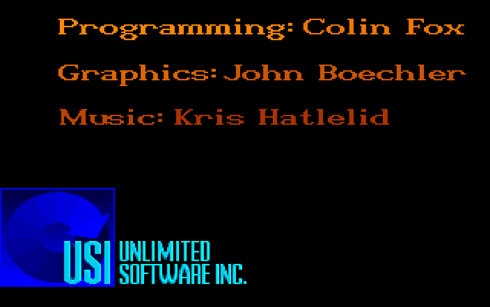
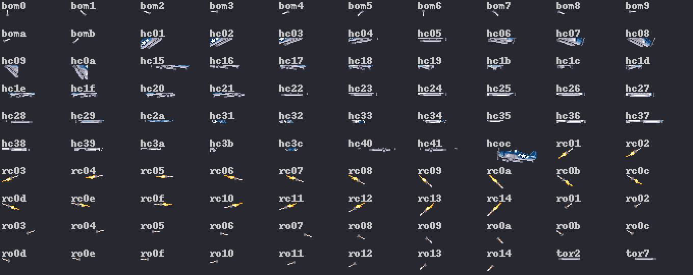

# Specimen

Every element the chapters are built from, each with real content from the generators, so that the design can be judged before the first chapter is written. This page goes once the chapters show all of it.

## A heading of the second level

Body text is set in a serif of the reader's system at a book's measure, while listings, figures and the game take the whole column. A term is introduced once, in bold with its definition: the **copper** is the Amiga's display coprocessor, which changes colours part of the way down the picture ([glossary](glossary.md#copper)). An address is written in code font, `0x016FF6`.

### A heading of the third level

The two sizes of the game's font are its only sizes: 48 pixels for a page's title, 24 for a section, each font pixel one device pixel wide and two high at the smaller size.

## A ported routine beside its original

The fade's arithmetic: the listing's assembly on the left, the port's C on the right, the same `orig 0x016FF6` on both. Look at the three masked additions into the whole word.

//// html | div.listing-pair

/// html | div
```wingslst
--8<-- "generated/listings/asm/colour_lerp.lst"
```
///

/// html | div
```c
--8<-- "generated/listings/c/wof_colour_lerp.c"
```
///

////

A part of a long routine, with line numbers asked for: `draw_world` takes one map record, tests the draw flag and looks the slot up in its table, skipping a null.

```wingslst linenums="1"
--8<-- "generated/listings/asm/draw_world_record.lst"
```

The shell and the tools, as JavaScript and Python:

```js
--8<-- "generated/listings/js/convert.js"
```

```python
--8<-- "generated/listings/py/fields.py"
```

## The three sidebars

/// know
The instrument behind a claim: here, `tests/test_oracle_m1.py` runs `colour_lerp` under the 68000 oracle and compares it with the port's C on every step against black and white and on 20,000 random triples.
///

/// wrong
A mistake and what caught it, told as part of the subject: what was believed, what the instrument showed, and what changed.
///

/// dev
The deeper detail with the place in the source: `src/iff.c`, `wof_colour_lerp`, and the note `re/notes/display.md`, section "Fades".
///

## Figures


/// caption
The first mission, 100 VBlanks after it began, as the port draws it.
///


/// caption
The same picture's palettes, row by row: the sky's, the sea's below the split, the dashboard's and the ticker's ramp.
///


/// caption
The first picture of the title sequence.
///



/// caption
The credit picture.
///



/// caption
The shapes of one container, `torpedo.shp`, with their names.
///


/// caption
Map a, every record that draws, at its place in the world.
///


/// caption
The game's own font, every character it has.
///
